# Power BI panolarını ve raporları iş arkadaşlarıyla ve diğer kullanıcılarla paylaşma
*Paylaşım*, kullanıcıların, panolarınıza ve raporlarınıza erişmesini sağlamanın iyi bir yoludur. Power BI ayrıca [işbirliği yapmak ve pano ile raporları dağıtmak için çeşitli yollar sunar](service-how-to-collaborate-distribute-dashboards-reports.md).

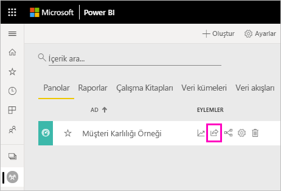

Paylaşım ile kuruluşunuz içindeki veya dışındaki içeriği paylaşırken [Power BI Pro lisansı](service-features-license-type.md) gerekir. İçerik [Premium kapasitede](service-premium-what-is.md) değilse, alıcılarınızın da Power BI Pro lisansı olması gerekir. 

Panoları ve raporları Power BI hizmetinde birçok yerden paylaşabilirsiniz: Sık Kullanılanlar, En Son, Çalışma Alanım ve Benimle Paylaşılanlar (sahibi izin veriyorsa). Çalışma alanında [Yönetici, Üye veya Katkıda Bulunan rolüne](service-new-workspaces.md#roles-in-the-new-workspaces) sahipseniz, diğer çalışma alanlarından da paylaşabilirsiniz. 

Bir pano veya raporu paylaştığınızda, paylaştığınız kişiler panoyu görüntüleyebilir ve panoyla etkileşim kurabilir ancak panoyu düzenleyemez. [Satır düzeyi güvenlik (RLS)](service-admin-rls.md) uygulanmadığı sürece bu kişiler, panoda veya raporlarda sizinle aynı verileri görür. Paylaşımda bulunduğunuz iş arkadaşlarınız, izin vermeniz durumunda panoyu veya raporu kendi iş arkadaşlarıyla da paylaşabilir. Kuruluşunuz dışındaki kişiler panoyu ya da raporu görüntüleyebilir ve bunlarla etkileşim kurabilir ancak paylaşamaz. 

Doğrudan Power BI Desktop’tan pano *paylaşamazsınız*. [Power BI Desktop’taki raporları](desktop-upload-desktop-files.md) Power BI hizmetinde yayımlarsınız. Bununla birlikte [Power BI mobil uygulamalarından pano paylaşabilirsiniz](consumer/mobile/mobile-share-dashboard-from-the-mobile-apps.md).  

## Video: Bir panoyu paylaşma
Amanda'nın, panosunu şirket içindeki ve dışındaki kişilerle paylaşma videosunu izleyin. Ardından, videonun altında yer alan adım adım yönergeleri izleyerek bu işlemi kendiniz deneyin.

<iframe width="560" height="315" src="https://www.youtube.com/embed/0tUwn8DHo3s?list=PL1N57mwBHtN0JFoKSR0n-tBkUJHeMP2cP" frameborder="0" allowfullscreen></iframe>

## Pano veya raporu paylaşma

1. Pano veya rapor listesinde ya da açık bir pano veya raporda **Paylaş**  öğesini seçin.

2. Üstteki kutuya kişilerin, dağıtım gruplarının veya güvenlik gruplarının tam e-posta adreslerini girin. Dinamik dağıtım listeleri ile paylaşım yapamazsınız. 
   
   Adresleri kuruluşunuz dışında olan kişilerle paylaşım yapabilirsiniz ancak bu durumda bir uyarıyla karşılaşırsınız. Bu makaledeki [kuruluşunuz dışında paylaşma](#share-a-dashboard-or-report-outside-your-organization) hakkında daha fazla bilgi edinin.
   
   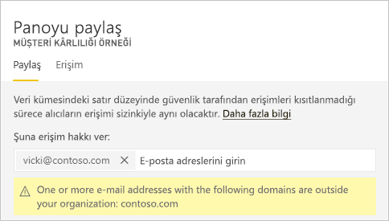 
 
   >[!NOTE]
   >Giriş kutusu en çok 100 ayrı kullanıcı veya grubu destekler. Daha fazla kişiyle paylaşma yolları için bu makaledeki [100’den fazla kullanıcıyla paylaşma](#share-with-more-than-100-separate-users) bölümüne bakın.

3. İsterseniz ileti ekleyebilirsiniz. İsteğe bağlıdır.
4. İş arkadaşlarınızın içeriğinizi diğer kullanıcılarla paylaşmasına izin vermek için **Alıcıların panonuzu (veya raporunuzu) paylaşmasına izin verin** onay kutusunu işaretleyin.
   
   Başkalarının da paylaşmasına izin verme, *yeniden paylaşım* olarak adlandırılır. İzin vermeniz halinde alıcılar, Power BI hizmetinden ve mobil uygulamalardan yeniden paylaşım yapabilir veya e-posta davetini kuruluşunuzdaki diğer çalışanlara iletebilir. Davetin süresi bir ay sonra dolar. Kuruluşunuz dışındaki kişiler yeniden paylaşım yapamaz. İçeriğin sahibi olarak yeniden paylaşmayı devre dışı bırakabilir veya yeniden paylaşımı tek bir durum için geri alabilirsiniz. Bu makaledeki [Paylaşımı durdurma veya değiştirme](#stop-or-change-sharing) bölümüne bakın.

5. **Kullanıcıların temel veri kümelerini kullanarak yeni içerik oluşturmasına izin ver**'i seçerseniz, bu panonun veri kümesi temelinde diğer çalışma alanlarında kendi raporlarını oluşturabilirler. [Farklı çalışma alanlarından veri kümelerini temel alarak raporlar oluşturma](service-datasets-discover-across-workspaces.md) hakkında daha fazla bilgi edinin.

1. **Paylaş**'ı seçin.
   
   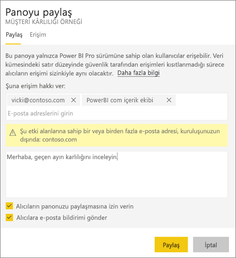  
   
   Power BI, kişilere (gruplara değil) paylaşılan içeriğin bağlantısını içeren bir e-posta daveti gönderir. Ekranda **Başarılı** bildirimi görüntülenir. 
   
   Kuruluşunuzdaki alıcılar bu bağlantıya tıkladığında Power BI, panoyu veya raporu bu kişilerin **Benimle paylaşılan** listesi sayfasına ekler. Söz konusu kişiler, adınızı seçerek kendileriyle paylaştığınız tüm içerikleri görebilir. 
   
   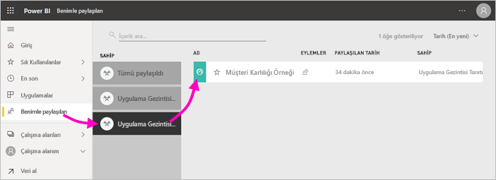
   
   Kuruluşunuz dışındaki alıcılar bağlantıya tıkladığında panoyu veya raporu görür, ancak bunlar normal Power BI portalında görüntülenmez. Bu makaledeki [kuruluşunuz dışındaki kişilerle paylaşma](#share-a-dashboard-or-report-outside-your-organization) hakkında daha fazla bilgi edinin.

## Paylaştığınız panoya veya rapora kimlerin erişimi olduğunu görme
Bazen kimlerle paylaşımda bulunduğunuzu ve bu kişilerin kimlerle paylaşım yaptığını görmeniz gerekir.

1. Pano ve rapor listesinde veya panoda ya da raporda bulunan **Paylaş**  seçeneğini belirleyin. 
2. **Panoyu paylaş** veya **Raporu paylaş** iletişim kutusunda **Erişim**’i seçin.
   
    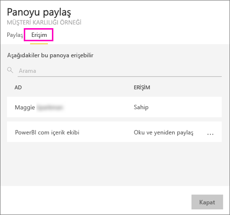

    Kuruluşunuz dışındaki kişiler **Konuk** olarak listelenir.

    Bu görünümde, bu makalede [paylaşım izinlerini durdurabilir veya değiştirebilirsiniz](#stop-or-change-sharing). 

## Panoyu veya raporu kuruluşunuzun dışında paylaşma
Kuruluşunuz dışındaki kişilerle bir paylaşımda bulunduğunuzda bu kişiler, paylaşılan panonun veya raporun bağlantısını içeren bir e-posta alır. Paylaştığınız öğeleri görmek için Power BI’da oturum açmaları gerekir. Power BI Pro lisansları yoksa bağlantıya tıkladıktan sonra bir lisans almak için kaydolabilirler.

Oturum açtıktan sonra, paylaşılan panoyu veya raporu normal Power BI portallarında değil, kendi tarayıcı penceresinde görürler. Bu panoya veya rapora daha sonra erişmek için, bağlantıya yer işareti eklemeleri gerekir.

Bu panoda veya raporda herhangi bir içerik düzenlemesi yapamazlar. Grafiklerle etkileşimde bulunabilir ve filtreleri ya da dilimleyicileri değiştirebilirler, ancak değişikliklerini kaydedemezler. 

Paylaşılan panoyu veya raporu yalnızca doğrudan alıcılarınız görebilir. Örneğin, e-postayı Vicki@contoso.com adresine gönderdiyseniz panoyu yalnızca Vicki görebilir. Vicki bağlantıyı başka kişilere iletse bile, panoyu başka hiç kimse göremez. Vicki’nin buna erişmek için aynı e-posta adresini kullanması gerekir; Vicki başka herhangi bir e-posta adresiyle oturum açarsa panoya erişemez.

Şirket içi Analysis Services tablolu modellerde rol veya satır düzeyi güvenlik uygulanması durumunda kuruluşunuz dışındaki kişiler hiçbir veri görmez.

Dış e-posta adreslerine sahip kişilerin bulunduğu bir grupla paylaşmak için dağıtım grubu değil güvenlik grubu kullanın. Dağıtım grubundaki dış e-posta adresine sahip kullanıcılar, Azure Active Directory (Azure AD) B2B konuk kullanıcılar değilse paylaştığınız içeriği göremezler. [Azure AD B2B konuk kullanıcıları](service-admin-azure-ad-b2b.md) hakkında daha fazla bilgi edinin.

Kuruluşunuz dışındaki kişilere bir Power BI mobil uygulamasından bağlantı gönderirseniz ilgili kişiler bu bağlantıya tıkladığında pano, Power BI mobil uygulaması yerine bir tarayıcıda açılır.

### Dış kullanıcıların içeriği düzenlemesine izin verme

Power BI yöneticiniz dış konuk kullanıcıların kuruluş içeriklerini düzenlemelerine ve yönetmelerine izin verebilir. Bu durumda, dış kullanıcılarınız yalnızca tüketim deneyimine sahip olmayacaktır. Kuruluşunuzdaki içerikleri düzenleyebilir ve yönetebilirler. [Azure AD B2B ile Power BI içeriklerini dış konuk kullanıcılara dağıtma](service-admin-azure-ad-b2b.md) hakkında daha fazla bilgi edinin.

## Paylaşımı durdurma veya değiştirme
Yalnızca pano veya rapor sahibi, yeniden paylaşımı etkinleştirebilir veya devre dışı bırakabilir.

### Henüz paylaşım daveti göndermediyseniz
* Göndermeden önce davetin alt bölümünde bulunan **Alıcıların panonuzu (veya raporunuzu) paylaşmasına izin verin** onay kutusunun işaretini kaldırın.

### Panoyu veya raporu zaten paylaştıysanız
1. Pano ve rapor listesinde veya panoda ya da raporda bulunan **Paylaş**  seçeneğini belirleyin. 
2. **Panoyu paylaş** veya **Raporu paylaş** iletişim kutusunda **Erişim**’i seçin.
   
    
3. **Oku ve yeniden paylaş**'ın yanındaki üç nokta simgesini ( **...** ) seçin ve şu seçeneği belirleyin:
   
   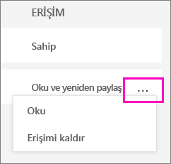
   
   * **Oku**, söz konusu kişinin yeniden paylaşım yapmasını engeller.
   * **Erişimi kaldır**, söz konusu kişinin paylaşılan içeriği hiç görmemesini sağlar.

4. **Erişimi kaldır** iletişim kutusunda, ilgili içeriğe (raporlar ve veri kümeleri gibi) erişimi kaldırmak isteyip istemediğinize karar verin. Uyarı simgesine  sahip bir öğeyi kaldırmanız durumunda ilgili içeriği de silmenizde yarar vardır. Aksi takdirde, düzgün bir şekilde görüntülenmez.

    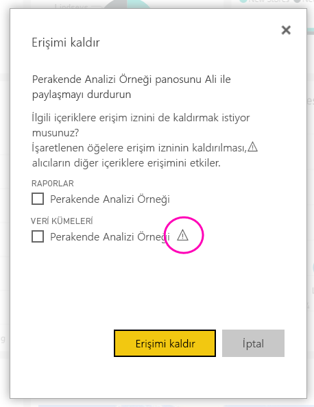

## Sınırlamalar ve önemli noktalar
Pano ve rapor paylaşma ile ilgili olarak dikkat edilmesi gerekenler:

* Genel olarak iş arkadaşlarınızla panoda veya raporlarda aynı verileri görürsünüz. Bu nedenle, iş arkadaşlarınıza kıyasla daha fazla veri görme iznine sahipseniz iş arkadaşlarınız, panonuzda veya raporunuzda sizin gördüğünüz tüm verileri görebilir. Ancak, bir panonun veya raporun bağlantılı veri kümesinde [satır düzeyi güvenlik (RLS)](service-admin-rls.md) uygulanırsa kullanıcıların hangi verilere erişebileceği kimlik bilgilerine göre belirlenir.
* Paylaştığınız herkes panonuzu görebilir ve [Okuma görünümünde](consumer/end-user-reading-view.md#reading-view) ilgili raporlarla etkileşimde bulunabilir. Genel olarak, bu kişiler rapor oluşturamaz veya mevcut raporlarda yapılan değişiklikleri kaydedemez. Ancak, **Kullanıcıların temel veri kümelerini kullanarak yeni içerik oluşturmasına izin ver**'i seçerseniz, bu panonun veya raporun veri kümesi temelinde diğer çalışma alanlarında kendi raporlarını oluşturabilirler.
* Veri kümesini kimse göremez veya indiremez, ama Excel'de Çözümle özelliğini kullanarak veri kümesine doğrudan erişilebilir. Bir yönetici bir gruptaki herkes için Excel'de Çözümle özelliğini kısıtlayabilir. Öte yandan, bu kısıtlama söz konusu gruptaki herkes için ve grubun ait olduğu tüm çalışma alanlarında geçerli olur.
* Herkes el ile [verileri yenileyebilir](refresh-data.md).
* E-posta için Office 365 hizmetini kullanıyorsanız bir dağıtım grubu ile ilişkili e-posta adresini girerek dağıtım grubu üyeleri ile paylaşımda bulunabilirsiniz.
* Sizinle aynı e-posta etki alanını paylaşan iş arkadaşlarınız ve e-posta etki alanı sizinkinden farklı olan ancak aynı kiracıda kayıtlı iş arkadaşlarınız, panoyu başka kullanıcılarla paylaşabilir. Örneğin, contoso.com ve contoso2.com etki alanlarının aynı kiracıda kayıtlı olduğunu ve e-posta adresinizin konrads@contoso.com olduğunu varsayalım. Paylaşmak için izin verdiğiniz sürece hem ravali@contoso.com hem de gustav@contoso2.com panonuzu paylaşabilir.
* İş arkadaşlarınızın belirli bir pano veya rapora zaten erişimi varsa panodayken veya rapordayken URL'yi kopyalayarak doğrudan bir bağlantı gönderebilirsiniz. Örneğin: `https://powerbi.com/dashboards/g12466b5-a452-4e55-8634-xxxxxxxxxxxx`.
* Aynı şekilde, iş arkadaşlarınızın belirli bir panoya zaten erişimi varsa [bağlantılı rapora yönelik doğrudan bir bağlantı gönderebilirsiniz](service-share-reports.md). 

### 100’den fazla kullanıcı ile paylaşma

Tek bir paylaşım eyleminde en çok 100 kullanıcı veya grupla paylaşabilirsiniz. Öte yandan, bir öğe için 500'den fazla kullanıcıya erişim verebilirsiniz. Aşağıda bazı öneriler verilmiştir:

- Kullanıcıları tek tek belirterek birden çok kez paylaşma.
- Tüm kullanıcıları içeren bir kullanıcı grubuyla paylaşma. 
- Bir çalışma alanında rapor veya pano oluşturma, daha sonra çalışma alanından bir uygulama oluşturma. Uygulamayı birçok kişiyle paylaşabilirsiniz. [Power BI’da uygulama yayımlama](service-create-distribute-apps.md) hakkında daha fazla bilgi edinin.

## Paylaşım sorunlarını giderme

### Panomun alıcıları bir kutucukta kilit simgesiyle veya "İzin gerekiyor" iletisiyle karşılaşıyor

Pano paylaşımında bulunduğunuz kişiler burada kilitli bir kutucuk veya bir raporu görüntülemeye çalıştıklarında "İzin gerekiyor" iletisi görebilir.

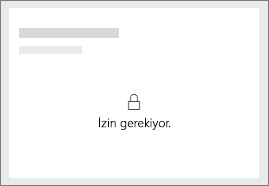

Bu durumda bu kişilere, temel alınan veri kümesine yönelik erişim izni vermeniz gerekir.

1. İçerik listenizdeki **Veri kümeleri** sekmesine gidin.

1. Veri kümesinin yanındaki üç nokta ( **...** ) simgesini seçin ve ardından **İzinleri yönet** seçeneğini belirleyin.

    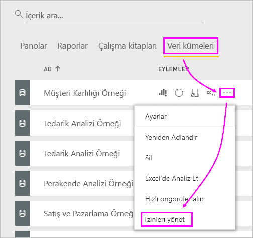

1. **Kullanıcı ekle**'yi seçin.

    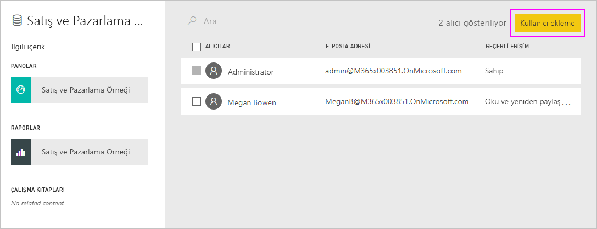

1. Kişilerin, dağıtım gruplarının veya güvenlik gruplarının tam e-posta adreslerini girin. Dinamik dağıtım listeleri ile paylaşım yapamazsınız.

    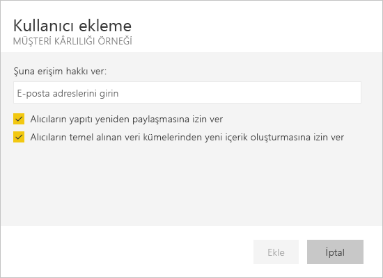

1. **Ekle**'yi seçin.

### Bir pano veya raporu paylaşamıyorum

Bir panoyu veya raporu paylaşmak için, temel alınan içeriği (ilgili tüm raporlar ve veri kümeleri) yeniden paylaşma iznine sahip olmanız gerekir. Paylaşım yapamayacağınızı belirten bir iletiyle karşılaşırsanız raporun yazarından size söz konusu raporlar ve veri kümeleri için yeniden paylaşma izni vermesini isteyin.

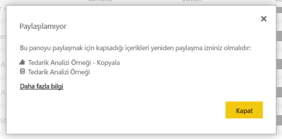

## Sonraki adımlar

* [Panolar ve raporlar üzerinde nasıl işbirliği yapabilir ve bunları nasıl paylaşabilirim?](service-how-to-collaborate-distribute-dashboards-reports.md)
* [Filtre uygulanmış bir Power BI raporunu paylaşma](service-share-reports.md)
* Sorularınız mı var? [Power BI Topluluğu'na başvurun](https://community.powerbi.com/)

