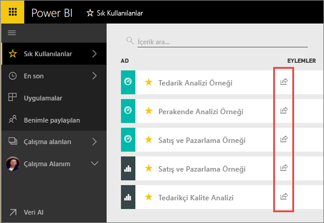
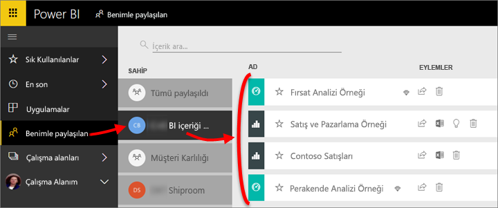

# Power BI panolarını ve raporları iş arkadaşlarıyla ve diğer kullanıcılarla paylaşma
*Paylaşım*, kullanıcıların, panolarınıza ve raporlarınıza erişmesini sağlamanın iyi bir yoludur. Power BI ayrıca [işbirliği yapmak ve pano ile raporları dağıtmak için çeşitli yollar sunar](service-how-to-collaborate-distribute-dashboards-reports.md).

Paylaşım ile kuruluşunuz içindeki veya dışındaki içeriği paylaşırken [Power BI Pro lisansı](service-features-license-type.md) gerekir. İçinde içeriğini olmadığı sürece alıcılarınızın da Power BI Pro lisansları gerekir bir [Premium kapasite](service-premium-what-is.md). 

Panoları ve raporları Power BI hizmetinin birçok yerinden paylaşabilirsiniz: Sık Kullanılanlar, son, benimle paylaşılanlar (sahip izin verirse), çalışma Alanım veya diğer çalışma alanları. Bir pano veya raporu paylaştığınızda, paylaştığınız kişiler panoyu görüntüleyebilir ve panoyla etkileşim kurabilir ancak panoyu düzenleyemez. [Satır düzeyi güvenlik (RLS)](service-admin-rls.md) uygulanmadığı sürece bu kişiler, panoda veya raporlarda sizinle aynı verileri görür. Paylaşımda bulunduğunuz iş arkadaşlarınız, izin vermeniz durumunda panoyu veya raporu kendi iş arkadaşlarıyla da paylaşabilir. Kuruluşunuz dışındaki kişiler de görüntüleyebilir ve panonun veya raporun ile etkileşim kurabilir ancak paylaşamaz. 

Ayrıca, [Power BI mobil uygulamalarından da pano paylaşabilirsiniz](consumer/mobile/mobile-share-dashboard-from-the-mobile-apps.md). Ancak, panoları Power BI Desktop'tan paylaşamazsınız.

## Video: Bir panoyu paylaşma
Amanda'nın, panosunu şirket içindeki ve dışındaki kişilerle paylaşma videosunu izleyin. Ardından, videonun altında yer alan adım adım yönergeleri izleyerek bu işlemi kendiniz deneyin.

<iframe width="560" height="315" src="https://www.youtube.com/embed/0tUwn8DHo3s?list=PL1N57mwBHtN0JFoKSR0n-tBkUJHeMP2cP" frameborder="0" allowfullscreen></iframe>

## Pano veya raporu paylaşma

1. Pano veya rapor listesinde ya da açık bir pano veya raporda **Paylaş**  öğesini seçin.

2. Üstteki kutuya kişilerin, dağıtım gruplarının veya güvenlik gruplarının tam e-posta adreslerini girin. Dinamik dağıtım listeleri ile paylaşım yapamazsınız. 
   
   Adresleri kuruluşunuz dışında olan kişilerle paylaşım yapabilirsiniz ancak bu durumda bir uyarıyla karşılaşırsınız.
   
    
 
   >[!NOTE]
   >Giriş kutusuna, en fazla 100 kullanıcı veya grup destekler. Çok sayıda kullanıcıyı paylaşmanız gerekiyorsa, bir çalışma alanında Pano oluşturmayı göz önünde bulundurun ve [uygulama dağıtma](service-create-distribute-apps.md).
   > 
   > 

3. İsterseniz ileti ekleyebilirsiniz. İsteğe bağlıdır.
4. İş arkadaşlarınızın içeriğinizi diğer kullanıcılarla paylaşmasına izin vermek için işaretleyin **alıcıların panonuzun (veya rapor) paylaşmasına izin verin**.
   
   Başkalarının da paylaşmasına izin verme, *yeniden paylaşım* olarak adlandırılır. İzin vermeniz halinde alıcılar, Power BI hizmetinden ve mobil uygulamalardan yeniden paylaşım yapabilir veya e-posta davetini kuruluşunuzdaki diğer çalışanlara iletebilir. Davetin süresi bir ay sonra dolar. Kuruluşunuz dışındaki kişiler yeniden paylaşım yapamaz. İçeriğin sahibi olarak yeniden paylaşmayı devre dışı bırakabilir veya yeniden paylaşımı tek bir durum için geri alabilirsiniz. Bkz: [paylaşımı durdurma veya başkalarının paylaşmasını durdurma](#stop-sharing-or-stop-others-from-sharing).

5. **Paylaş**'ı seçin.
   
     
   
   Power BI kişilere, ancak grupları, paylaşılan içeriğin bağlantısını içeren bir e-posta daveti gönderir. Ekranda **Başarılı** bildirimi görüntülenir. 
   
   Kuruluşunuzdaki alıcılar bu bağlantıya tıkladığında Power BI, panoyu veya raporu bu kişilerin **Benimle paylaşılan** listesi sayfasına ekler. Söz konusu kişiler, adınızı seçerek kendileriyle paylaştığınız tüm içerikleri görebilir. 
   
   
   
   Kuruluşunuz dışındaki alıcılar bağlantıya tıkladığında panoyu veya raporu görür, ancak bunlar normal Power BI portalında görüntülenmez. Daha fazla bilgi için [bir panoyu veya raporu kuruluşunuz dışındaki kişilerle paylaşma](#share-a-dashboard-or-report-with-people-outside-your-organization).

## Paylaştığınız bir panoya veya rapora kimler erişebilir?
Bazı durumlarda bu kişilerin bulunduğunuzu ve sonra paylaştığınız kişiler kimlerin görebileceğini gerekir:

1. Pano ve rapor listesinde veya panoda ya da raporda bulunan **Paylaş**  seçeneğini belirleyin. 
2. İçinde **Panoyu Paylaş** veya **rapor paylaşma** iletişim kutusunda **erişim**.
   
    

    Kuruluşunuz dışındaki kişiler **Konuk** olarak listelenir.

## Paylaşımı durdurma veya başkalarının paylaşmasını durdurma
Yalnızca pano veya rapor sahibi, yeniden paylaşımı etkinleştirebilir veya devre dışı bırakabilir.

### Henüz paylaşım daveti göndermediyseniz
* NET **alıcıların panonuzun (veya rapor) paylaşmasına izin verin** göndermeden önce davetin alt kısmındaki onay kutusu.

### Panoyu veya raporu zaten paylaştıysanız
1. Pano ve rapor listesinde veya panoda ya da raporda bulunan **Paylaş**  seçeneğini belirleyin. 
2. İçinde **Panoyu Paylaş** veya **rapor paylaşma** iletişim kutusunda **erişim**.
   
    
3. **Oku ve yeniden paylaş**'ın yanındaki üç nokta simgesini ( **...** ) seçin ve şu seçeneği belirleyin:
   
   
   
   * **Oku**, söz konusu kişinin yeniden paylaşım yapmasını engeller.
   * **Erişimi kaldır**, söz konusu kişinin paylaşılan içeriği hiç görmemesini sağlar.

4. İçinde **erişimi kaldırmak** iletişim kutusunda, ayrıca, raporlar ve veri kümeleri gibi ilgili içeriğe erişimi kaldırmak isteyip istemediğinize karar verin. Bir uyarı simgesi olan öğeleri kaldırırsanız , ilgili içerik düzgün bir şekilde görüntülenmeyeceğinden da kaldırmak idealdir.

    

## Bir panoyu veya raporu kuruluşunuz dışındaki kişilerle paylaşma
Kuruluşunuz dışındaki kişilerle paylaştığınızda, paylaşılan panoyu veya raporu, bunlar Power BI'da görmek için oturum açmanız gerekir bağlantısını içeren bir e-posta alırlar. Power BI Pro lisansları yoksa bağlantıya tıkladıktan sonra bir lisansa kaydolabilirler.

Oturum açtıktan sonra paylaşılan panoyu veya raporu kendi Tarayıcı pencerelerinde, normal Power BI portallarında değil, görürler. Bu panoyu veya raporu daha sonra erişmek için bağlantıya yer işareti gerekir.

Bu panoda veya raporda herhangi bir içerik düzenlemesi yapamazlar. Grafiklerle etkileşimde ve filtreleri ya da dilimleyicileri değiştirme olsa da, bunlar değişiklikleri kaydedemezler. 

Paylaşılan panoyu veya raporu yalnızca doğrudan alıcılarınız görebilir. Örneğin, e-postayı Vicki@contoso.com adresine gönderdiyseniz panoyu yalnızca Vicki görebilir. Bağlantı olsa bile başka hiç kimse Pano görebilirsiniz. Vicki erişmek için aynı e-posta adresini kullanmanız gerekir; kendisi başka bir e-posta adresiyle kaydolursa, Filiz panoya erişimi olmaz.

Şirket içi Analysis Services tablolu modellerde rol veya satır düzeyi güvenlik uygulanması durumunda kuruluşunuz dışındaki kişiler hiçbir veri göremez.

Bir Power BI mobil uygulamasından bağlantı kuruluşunuz dışındaki kişilere gönderirseniz bağlantı tıklatıldığında Pano açılır bir tarayıcıda, Power BI mobil uygulaması içinde değil.

Varsa, [düzenlemek ve yönetmek dış konuk kullanıcılara kuruluştaki içerik izin](service-admin-portal.md#export-and-sharing-settings), varsayılan yalnızca tüketim deneyimi için geçerli değildir. [Daha fazla bilgi edinin](service-admin-azure-ad-b2b.md).

## Sınırlamalar ve önemli noktalar
Pano ve rapor paylaşma ile ilgili olarak dikkat edilmesi gerekenler:

* Genel olarak iş arkadaşlarınızla panoda veya raporlarda aynı verileri görürsünüz. Bu nedenle, iş arkadaşlarınıza kıyasla daha fazla veri görme iznine sahipseniz iş arkadaşlarınız, panonuzda veya raporunuzda sizin gördüğünüz tüm verileri görebilir. Ancak, bir panonun veya raporun bağlantılı veri kümesinde [satır düzeyi güvenlik (RLS)](service-admin-rls.md) uygulanırsa kullanıcıların hangi verilere erişebileceği kimlik bilgilerine göre belirlenir.
* Panonuzu paylaştığınız herkes görebilir ve ilgili raporlarla etkileşimde [Okuma Görünümü'nde](consumer/end-user-reading-view.md#reading-view). Bu kişiler rapor oluşturamaz veya mevcut raporlarda yapılan değişiklikleri kaydedemez.
* Hiç kimse göremez veya veri kümesini indirin rağmen Çözümle doğrudan Excel özelliğini kullanarak veri kümesine erişebilirsiniz. Bir yönetici, bir gruptaki herkes için Excel'de Çözümle kullanma olanağı kısıtlayabilirsiniz. Öte yandan, bu kısıtlama söz konusu gruptaki herkes için grubun ait olduğu tüm çalışma alanlarında geçerli olur.
* Herkes el ile [verileri yenileyebilir](refresh-data.md).
* E-posta için Office 365 hizmetini kullanıyorsanız bir dağıtım grubu ile ilişkili e-posta adresini girerek dağıtım grubu üyeleri ile paylaşımda bulunabilirsiniz.
* E-posta etki alanınıza paylaşan iş arkadaşlarınızla ve etki alanı farklı ancak aynı kiracıda kayıtlı iş arkadaşlarınızla panoyu başkalarıyla paylaşabilirsiniz. Örneğin, etki alanı contoso.com ve contoso2.com aynı kiracıda ve e-posta adresinizi kayıtlı ise konrads@contoso.com, hem ravali@contoso.com ve gustav@contoso2.com paylaşım izni verdiğiniz sürece, paylaşabilirsiniz.
* İş arkadaşlarınızın belirli bir Pano veya rapora erişimi varsa, panoda veya raporda işiniz URL'yi kopyalayarak doğrudan bağlantı gönderebilirsiniz. Örnek: `https://powerbi.com/dashboards/g12466b5-a452-4e55-8634-xxxxxxxxxxxx`
* Benzer şekilde, iş arkadaşlarınızın belirli bir panoya erişim sahibi yapabiliyorsanız [temel alınan raporun doğrudan bağlantısını gönderebilir](service-share-reports.md). 
* En çok 100 kullanıcılar veya gruplar, bir çoklu bir paylaşma eylemi, paylaşabilirsiniz. Öte yandan, bir öğe için 500'den fazla kullanıcıya erişim verebilirsiniz. Bunu yapmak için tek tek kullanıcılar belirterek, birden çok kez paylaşın veya tüm kullanıcıları içeren bir kullanıcı grubuyla paylaşın.

## Paylaşım sorunlarını giderme

### Panomun alıcıları bir kutucukta kilit simgesiyle veya "İzin gerekiyor" iletisiyle karşılaşıyor

Pano paylaşımında bulunduğunuz kişiler burada kilitli bir kutucuk veya bir raporu görüntülemeye çalıştıklarında "İzin gerekiyor" iletisi görebilir.

Bu durumda bağlantılı veri kümesine izin vermeniz gerekir:

1. İçerik listenizdeki **Veri kümeleri** sekmesine gidin.

1. Öğesinin üç noktasını ( **...** ) seçip veri kümesinin yanındaki **izinleri Yönet**.

    

1. **Kullanıcı ekle**'yi seçin.

    

1. Kişilerin, dağıtım gruplarının veya güvenlik gruplarının tam e-posta adreslerini girin. Dinamik dağıtım listeleri ile paylaşım yapamazsınız.

    

1. **Ekle**'yi seçin.

### Bir pano veya raporu paylaşamıyorum

Bir panoyu veya raporu paylaşmak için temel içeriğini yeniden paylaşma izni gerekir; diğer bir deyişle, ilgili tüm raporlar ve veri kümeleri. Vermek için rapor yazarına isteyin paylaşım yapamayacağınızı belirten bir ileti görürseniz, bu raporlar ve veri kümeleri için izni yeniden paylaşabilir.

## Sonraki adımlar
* Geri bildirimde bulunmak ister misiniz? [Power BI Topluluğu sitesine](https://community.powerbi.com/) giderek önerilerinizi belirtin.
* [Panolar ve raporlar üzerinde nasıl işbirliği yapabilir ve bunları nasıl paylaşabilirim?](service-how-to-collaborate-distribute-dashboards-reports.md)
* [Filtre uygulanmış bir Power BI raporunu paylaşma](service-share-reports.md).
* Sorularınız mı var? [Power BI Topluluğu'na başvurun](http://community.powerbi.com/).

