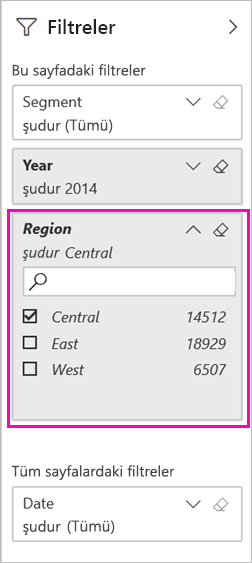
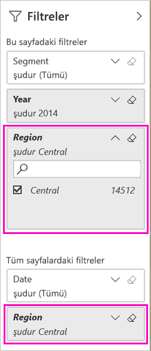

# Filtre uygulanmış bir Power BI raporunu paylaşmanın iki yolu
*Paylaşım*, kullanıcıların, panolarınıza ve raporlarınıza erişmesini sağlamanın iyi bir yoludur. Bir raporun filtrelenmiş bir sürümünü paylaşmak istediğinizde ne olur? Bu, yalnızca belirli bir şehre veya satış temsilcisine ya da yıla ait verileri gösteren bir rapor olabilir. Bir raporu filtrelemeyi ve paylaşmayı deneyin ya da özel bir URL oluşturun. Alıcılar URL’yi ilk kez açtığında rapor filtrelenir. URL'yi değiştirerek filtreyi kaldırabilirler. 

Power BI ayrıca [işbirliği yapmak ve raporlarınızı dağıtmak için başka yollar sunar](service-how-to-collaborate-distribute-dashboards-reports.md). Paylaşımda siz ve alıcılarınız için bir [Power BI Pro lisansı](service-features-license-type.md) gereklidir veya içerik [Premium kapasitede](service-premium-what-is.md) olmalıdır. 

## Bir raporu filtrelemenin iki yolu

Her iki filtreleme tekniği için de Pazarlama ve Satış örneği şablon uygulamasını kullanıyoruz. Denemek ister misiniz? [Pazarlama ve Satış örneği şablon uygulamasını](https://appsource.microsoft.com/product/power-bi/microsoft-retail-analysis-sample.salesandmarketingsample?tab=Overview) da yükleyebilirsiniz.

### Filtre ayarlama

[Düzenleme görünümünde](consumer/end-user-reading-view.md) bir rapor açın ve filtre uygulayın.

Bu örnekte, Pazarlama ve Satış örneği şablon uygulamasının Yılbaşından Bugüne Kadar Kategori sayfasını, yalnızca **Region** değerinin **Central** değerine eşit olduğu değerleri gösterecek şekilde filtreliyoruz. 
 

Raporu kaydedin.

### URL'de filtre oluşturma

Rapor sayfası URL’sinin sonuna filtre eklediğiniz davranış biraz farklıdır. Filtrelenmiş sayfa aynı şekilde görünür. Ancak, Power BI raporun tamamına filtre ekler ve diğer değerleri filtre bölmesinden kaldırır.  

Aşağıdakini rapor sayfası URL'sinin sonuna ekleyin:
   
    ?filter=*tablename*/*fieldname* eq *value*
   
Alan; tür, tarih saat veya dize türünde olmalıdır. *tabloadı* veya *alanadı* değerleri boşluk içeremez.
   
Bizim örneğimizde, tablonun adı **Geo**, alanın adı **Region** ve filtrelemek istediğimiz değer **Central**'dır:
   
    ?filter=Geo/Region eq 'Central'

Tarayıcınız eğik çizgileri, boşlukları ve kesme işaretlerini göstermek için özel karakterler ekler; böylece, aşağıdaki gibi bir URL elde edersiniz:
   
    app.powerbi.com/groups/xxxx/reports/xxxx/ReportSection4d00c3887644123e310e?filter=Geo~2FRegion%20eq%20'Central'

Raporu kaydedin.

Daha ayrıntılı bilgi için [URL'de sorgu dizesi parametreleri kullanarak bir raporu filtreleme](service-url-filters.md) makalesine bakın.

## Filtrelenmiş raporu paylaşma

1. [Raporu paylaştığınızda](service-share-dashboards.md) **Alıcılara e-posta bildirimi gönder** onay kutusunun işaretini kaldırın.

    

4. Daha önce oluşturduğunuz filtreyi içeren bağlantıyı gönderin.

## Sonraki adımlar
* [Power BI'da çalışmanızı paylaşmanın yolları](service-how-to-collaborate-distribute-dashboards-reports.md)
* [Bir panoyu paylaşma](service-share-dashboards.md)
* Başka bir sorunuz mu var? [Power BI Topluluğu'na başvurun](https://community.powerbi.com/).
* Geri bildirimde bulunmak ister misiniz? [Power BI Topluluğu sitesine](https://community.powerbi.com/) giderek önerilerinizi belirtin.

