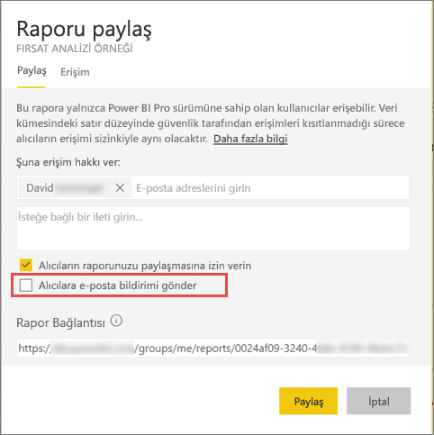

# Filtre uygulanmış bir Power BI raporunu iş arkadaşlarınızla paylaşın
*Paylaşım*, kullanıcıların, panolarınıza ve raporlarınıza erişmesini sağlamanın iyi bir yoludur. Power BI ayrıca [işbirliği yapmak ve raporlarınızı dağıtmak için çeşitli yollar sunar](service-how-to-collaborate-distribute-dashboards-reports.md).

Paylaşımda siz ve alıcılarınız için bir [Power BI Pro lisansı](service-free-vs-pro.md) gereklidir veya içerik [Premium kapasitede](service-premium.md) olmalıdır. Önerileriniz mi var? Power BI ekibi geri bildirimlerinize her zaman önem verir. [Power BI Topluluğu sitesine](https://community.powerbi.com/) gitmeye ne dersiniz?

Sizinle aynı e-posta etki alanında bulunan iş arkadaşlarınızla, Power BI hizmetinin birçok yerinden bir raporu paylaşabilirsiniz: Sık Kullanılanlar, En Son, Benimle Paylaşılanlar (sahip izin verirse), Çalışma Alanım veya diğer çalışma alanları. Bir raporu paylaştığınızda, paylaştığınız kişiler raporu görüntüleyebilir ve raporla etkileşim kurabilir ancak raporu düzenleyemez. [Satır düzeyi güvenlik (RLS)](service-admin-rls.md) uygulanmadığı sürece raporda sizin gördüğünüz verilerin aynılarını görürler. 

## Rapor filtreleme ve paylaşma
Bir raporun filtrelenmiş bir sürümünü paylaşmak istediğinizde ne olur? Bu, yalnızca belirli bir şehre veya satış temsilcisine ya da yıla ait verileri gösteren bir rapor olabilir. Bunun için bir özel URL oluşturmanız gerekir.

1. Raporu [Düzenleme görünümü](service-reading-view-and-editing-view.md)'nde açın, filtreyi uygulayın ve raporu kaydedin.
   
   Bu örnekte yalnızca **Territory**'nin **NC**'ye eşit olduğu değerleri göstermek için [Perakende Analizi örneği](sample-tutorial-connect-to-the-samples.md)'ni filtreliyoruz.
   
   
2. Aşağıdakini rapor sayfası URL'sinin sonuna ekleyin:
   
   ?filter=*tabloadı*/*alanadı* eq *değer*
   
    Alan **dize** türünde olmalıdır ve *tabloadı* veya *alanadı* boşluk içeremez.
   
   Bizim örneğimizde, tablonun adı **Store**, alanın adı **Territory** ve filtrelemek istediğimiz değer **NC**'dir:
   
    ?filter=Store/Territory eq 'NC'
   
   
   
   Tarayıcınız eğik çizgileri, boşlukları ve kesme işaretlerini göstermek için özel karakterler ekler; böylece, aşağıdaki gibi bir URL elde edersiniz:
   
   app.powerbi.com/groups/me/reports/010ae9ad-a9ab-4904-a7a1-xxxxxxxxxxxx/ReportSection2?filter=Store%252FTerritory%20eq%20%27NC%27

3. [Raporu paylaşın](service-share-dashboards.md), ancak **Alıcılara e-posta bildirimi gönder** onay kutusunun işaretini kaldırın. 

    

4. Daha önce oluşturduğunuz filtreyi içeren bağlantıyı gönderin.

## Sonraki adımlar
* Geri bildirimde bulunmak ister misiniz? [Power BI Topluluğu sitesine](https://community.powerbi.com/) giderek önerilerinizi belirtin.
* [Panolar ve raporlar üzerinde nasıl işbirliği yapabilir ve bunları nasıl paylaşabilirim?](service-how-to-collaborate-distribute-dashboards-reports.md)
* [Bir panoyu paylaşma](service-share-dashboards.md)
* Başka bir sorunuz mu var? [Power BI Topluluğu'na başvurun](http://community.powerbi.com/).

