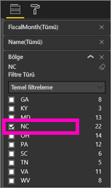
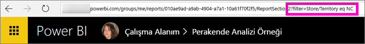

# İş arkadaşlarınızla Power BI raporlarını paylaşma
*Paylaşım*, kullanıcıların, panolarınıza ve raporlarınıza erişmesini sağlamanın iyi bir yoludur. Power BI [işbirliği yapmak ve raporlarınızı dağıtmak](service-how-to-collaborate-distribute-dashboards-reports.md) için çeşitli yollar sunar ve paylaşım bu yollardan yalnızca biridir.

Paylaşımda siz ve alıcılarınız için bir [Power BI Pro lisansı](service-free-vs-pro.md) gereklidir veya içerik [Premium kapasitede](service-premium.md) olmalıdır. Önerileriniz mi var? Power BI ekibi her zaman görüşlerinizle ilgilenir, bu nedenle [Power BI Topluluğu sitesine](https://community.powerbi.com/) gidin.

Bir raporu sizinle aynı e-posta etki alanında bulunan iş arkadaşlarınızla Çalışma Alanım bölümünüzden veya bir uygulama çalışma alanından paylaşabilirsiniz. Bir raporu paylaştığınızda, paylaştığınız kişiler raporu görüntüleyebilir ve raporla etkileşim kurabilir ancak raporu düzenleyemez. [Satır düzeyi güvenlik (RLS)](service-admin-rls.md) uygulanmadığı sürece raporda sizin gördüğünüz verilerin aynılarını görürler. 

## Power BI raporu paylaşma
1. Power BI hizmetinde, paylaşmak istediğiniz raporla bağlantılı en az bir kutucuğun bulunduğu [bir pano oluşturun](service-dashboard-create.md). 
   
    Yalnızca raporu paylaşmak isteseniz bile öncelikle raporla bağlantılı bir pano oluşturmanız ve bunu paylaşmanız gerekir. 

1. Panonun sağ üst köşesindeki **Paylaş** seçeneğini belirleyin.

     
  
2. Hedeflenen alıcılarınızı belirtin. Alıcılarınıza pano hakkında posta göndermek istemiyorsanız **Alıcılara e-posta bildirimi gönder** onay kutusunun işaretini kaldırın.

     

4. **Paylaş**'ı seçin.

      Panoyu paylaştığınız kişiler artık bağlantılı raporu görme iznine sahiptir. 

1. Raporu Power BI hizmetinde açın, rapor sayfası URL'sini kopyalayın ve raporu iş arkadaşlarınıza gönderin. 
   
    İş arkadaşlarınız bağlantıyı seçtikleri zaman Power BI, raporun salt okunur bir sürümünü açar.

## Bir raporun filtrelenmiş sürümünü paylaşma
Bir raporun filtrelenmiş bir sürümünü paylaşmak istediğinizde ne olur? Bu, yalnızca belirli bir şehre veya satış temsilcisine ya da yıla ait verileri gösteren bir rapor olabilir. Bunun için bir özel URL oluşturmanız gerekir.

1. Raporu [Düzenleme görünümü](service-reading-view-and-editing-view.md)'nde açın, filtreyi uygulayın ve raporu kaydedin.
   
   Bu örnekte yalnızca **Territory**'nin **NC**'ye eşit olduğu değerleri göstermek için [Perakende Analizi örneği](sample-tutorial-connect-to-the-samples.md)'ni filtreliyoruz.
   
   
2. Aşağıdakini rapor sayfası URL'sinin sonuna ekleyin:
   
   ?filter=*tabloadı*/*alanadı* eq *değer*
   
    Alan **dize** türünde olmalıdır ve *tabloadı* veya *alanadı* boşluk içeremez.
   
   Bizim örneğimizde, tablonun adı **Store**, alanın adı **Territory** ve filtrelemek istediğimiz değer **NC**'dir:
   
    ?filter=Store/Territory eq 'NC'
   
   
   
   Tarayıcınız eğik çizgileri, boşlukları ve kesme işaretlerini göstermek için özel karakterler ekler; böylece, aşağıdaki gibi bir URL elde edersiniz:
   
   app.powerbi.com/groups/me/reports/010ae9ad-a9ab-4904-a7a1-10a61f70f2f5/ReportSection2?filter=Store%252FTerritory%20eq%20%27NC%27

3. Bu URL'yi iş arkadaşlarınıza gönderin. 
   
   İş arkadaşlarınız bağlantıyı seçtikleri zaman Power BI, filtrelenmiş raporun salt okunur bir sürümünü açar.

## Sonraki adımlar
* Geri bildirimde bulunmak ister misiniz? [Power BI Topluluğu sitesine](https://community.powerbi.com/) giderek önerilerinizi belirtin.
* [Panolar ve raporlar üzerinde nasıl işbirliği yapabilir ve bunları nasıl paylaşabilirim?](service-how-to-collaborate-distribute-dashboards-reports.md)
* [Bir panoyu paylaşma](service-share-dashboards.md)
* Başka bir sorunuz mu var? [Power BI Topluluğu'na başvurun](http://community.powerbi.com/).

