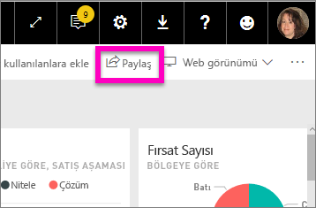
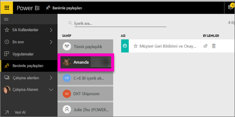

# Sizinle paylaşılan Power BI panolarını görüntüleme
## Benimle paylaşılan

İş arkadaşlarınızdan birinin sizinle paylaştığı panonun başlığı **Benimle paylaşılan** listenize eklenir. Bu panoya yalnızca **Benimle paylaşılan** listesinden ulaşabilirsiniz, çalışma alanlarından veya **Uygulamalar** listesinden ulaşamazsınız.

**Benimle paylaşılan** içerik listesini açıklamanın yanı sıra listede gezinmeyi ve listeyi filtrelemeyi gösterirken Amanda'ya eşlik edin. Ardından kendiniz denemek için videonun altındaki adım adım yönergeleri uygulayın. Sizinle paylaşılan panoları görüntülemek için Power BI Pro lisansına sahip olmanız gerekir. Ayrıntılar için [Power BI Premium nedir?](service-premium.md) makalesini okuyun.

<iframe width="560" height="315" src="https://www.youtube.com/embed/G26dr2PsEpk" frameborder="0" allowfullscreen></iframe>

Pano sahibinin size verdiği izinlere bağlı olarak panoyla ve kullandığı raporla etkileşim kurmak için birçok seçeneğe sahip olursunuz. Bu seçenekler arasında panonun kopyalarını oluşturmak, raporu [Okuma görünümünde](service-reading-view-and-editing-view.md) açmak ve diğer iş arkadaşlarınızla paylaşmak olabilir.

## **Benimle paylaşılan** ekranından gerçekleştirilebilecek eylemler
* Yıldız simgesini seçerek [Panoyu sık kullanılanlara ekleyebilirsiniz](service-dashboard-favorite.md).
* [Bir panoyu kaldırma](service-delete.md)  
* Bazı panolar yeniden paylaşılabilir  
* Ayrıca pano listeniz uzarsa [arama alanını ve sıralama özelliğini kullanarak, aradığınızı bulabilirsiniz](service-navigation-search-filter-sort.md).
  
  > [!NOTE]
  > EGRC sınıflandırmaları hakkında bilgi için sınıflandırma düğmesini seçin veya [Pano veri sınıflandırması sayfasını ziyaret edin](service-data-classification.md).
  > 
  > 
* Açmak ve araştırmak için bir panonun adını seçin. Paylaşılan panoyu açtıktan sonra Soru-Cevap kutusunu kullanarak, temel alınan veriler hakkında soru sorabilir veya kutucuklardan birini seçip açarak raporla Okuma görünümünde etkileşim kurabilirsiniz.

## Panoları sahibine göre filtreleme
**Benimle paylaşılan** ekranındaki içerik, sahibine göre filtrelenebilir. Örneğin **Amanda**'yı seçersem yalnızca Amanda'nın benimle paylaştığı raporlar görüntülenir.

## Sonraki adımlar
[Power BI - Temel Kavramlar](service-basic-concepts.md)  
[Power BI Premium nedir?](service-premium.md)  

Başka bir sorunuz mu var? [Power BI Topluluğu'na sorun](http://community.powerbi.com/)

