# Power BI’da şablon uygulaması oluşturma

Yeni Power BI *şablon uygulamaları* Power BI iş ortaklarının çok az kodlamayla veya hiç kodlama kullanmadan Power BI uygulamaları oluşturmasını ve bunları Power BI müşterilerine dağıtmasını sağlar.  Bu makale, Power BI şablon uygulaması oluşturmak için adım adım yönergeler içerir.

Power BI raporları ve panoları oluşturabiliyorsanız, *şablon uygulaması oluşturucusu* olabilir ve analitik içerik oluşturup bu içeriği *uygulama* içinde paketleyebilirsiniz. Uygulamanızı, AppSource gibi herhangi bir kullanılabilir platform aracılığıyla veya kendi web hizmetinizde kullanarak diğer Power BI kiracılarına dağıtabilirsiniz. Bir oluşturucu olarak dağıtım için korumalı bir analiz paketi oluşturma olanağınız olur.

Kuruluşlarında kimlerin şablon uygulamaları oluşturabileceğini ve kimlerin bu uygulamaları yükleyebileceğini Power BI kiracı yöneticileri yönetir ve denetler. Yetkili kullanıcılar şablon uygulamanızı yükleyebilir, sonra uygulamada değişiklik yapabilir ve bunu kendi kuruluşlarındaki Power BI müşterilerine dağıtabilir.

## Önkoşullar

Şablon uygulaması oluşturmak için şunları gerekir:  

- [Power BI Pro lisansı](service-self-service-signup-for-power-bi.md)
- [Power BI Desktop yüklemesi](desktop-get-the-desktop.md) (isteğe bağlı)
- [Temel Power BI kavramlarını](service-basic-concepts.md) tanıma
- Bir şablon uygulamasını herkese açık şekilde paylaşma izinleri. Ayrıntılar için bkz. Power BI [yönetim portalı, Şablon uygulaması ayarları](service-admin-portal.md#template-apps-settings).

## Şablon çalışma alanını oluşturma

Diğer Power BI kiracılarına dağıtabileceğiniz bir şablon uygulaması oluşturmak için, bu uygulamayı yeni çalışma alanlarından birinde oluşturmalısınız.

1. Power BI hizmetinde **Çalışma alanları** > **Çalışma alanı oluştur**’u seçin.

    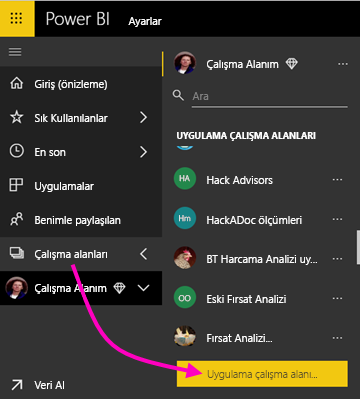

2. **Çalışma alanı oluştur**’da **Yenisine yükselt** seçeneğini belirleyin.

    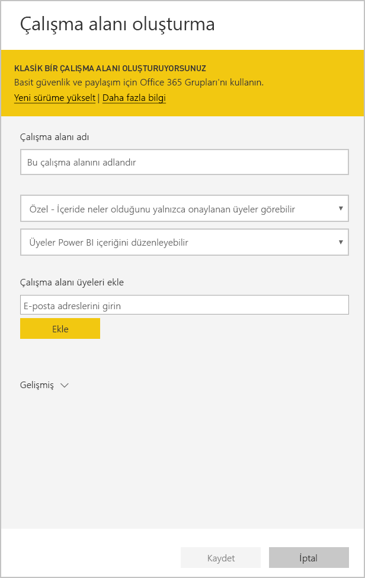

3. Çalışma alanınız için ad, açıklama (isteğe bağlı) ve logo resmi (isteğe bağlı) girin.

4. **Gelişmiş** bölümünü genişletin ve **Şablon uygulaması geliştirin**’i seçin.

    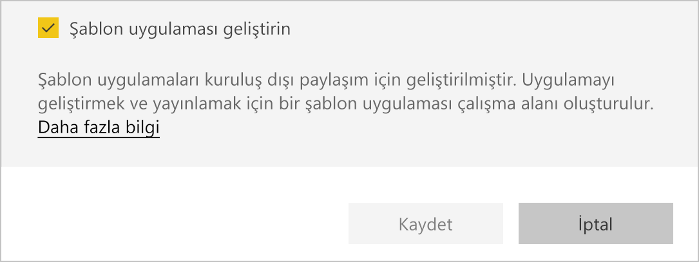

5. **Kaydet**'i seçin.
>[!NOTE]
>Şablon uygulamalarını tanıtmak için Power BI yöneticinizin izinleri gerekir.

## Şablon uygulamanızdaki içeriği oluşturma

Normal Power BI çalışma alanlarında olduğu gibi, sonraki adımınız çalışma alanında içeriği oluşturmaktır.  

- Çalışma alanınızda [Power BI içeriğinizi oluşturun](power-bi-creator-landing.md).

Power Query’de parametreleri kullanıyorsanız, bunların iyi tanımlanmış türde (örneğin, Text) olmasına dikkat edin. Any ve Binary türleri desteklenmez.

[Power BI’da şablon uygulaması yazmaya yönelik ipuçları](service-template-apps-tips.md) makalesinde şablon uygulamanız için rapor ve pano oluştururken göz önüne alınacak öneriler bulunur.

## Test şablon uygulaması oluşturma

Artık çalışma alanınızda içeriğiniz olduğuna göre, bu içeriği bir şablon uygulamasında paketlemeye hazırsınız. İlk adım yalnızca kiracınızda kuruluşunuzun içinden erişilebilen bir test şablon uygulaması oluşturmaktır.

1. Şablon çalışma alanında **Uygulama oluştur**’u seçin.

    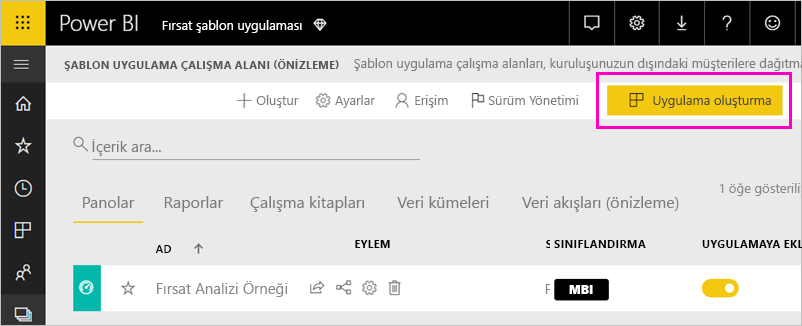

    Burada, şablon uygulamanız için beş kategoride ek derleme seçeneklerini doldurursunuz:

    **Markalama**

    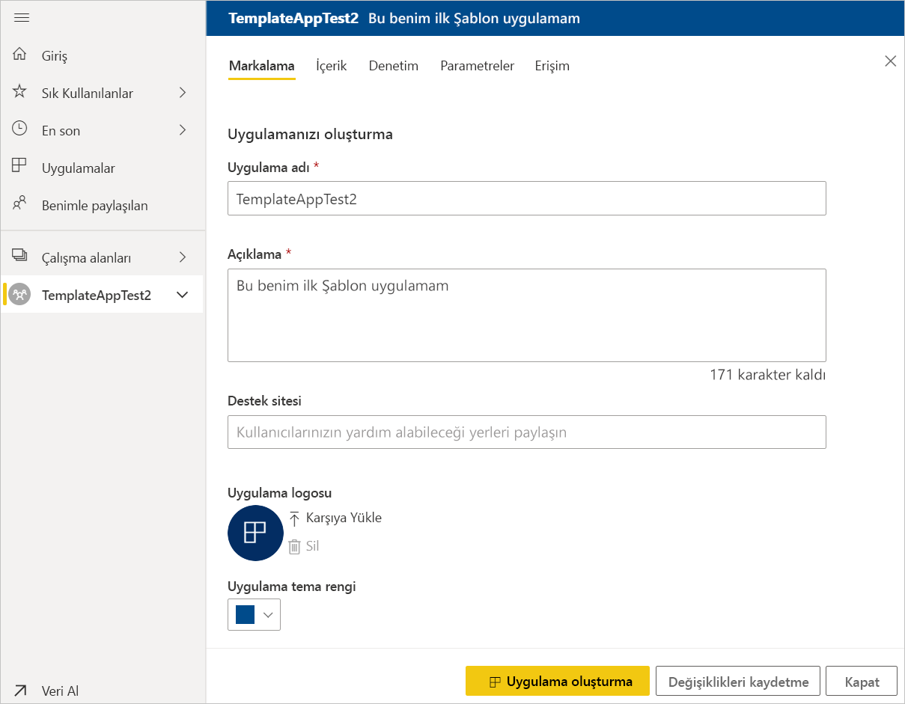
    - Uygulama adı
    - Açıklama
    - Destek sitesi (şablon uygulaması kuruluş uygulaması olarak yeniden dağıtıldıktan sonra bu bağlantı uygulama bilgilerinin altında gösterilir)
    - Uygulama logosu (45K dosya boyutu sınırı, 1:1 en boy oranı, .png .jpg .jpeg biçimleri)
    - Uygulama tema rengi

    **Gezinti**

    Uygulamanın sol gezinti bölmesini tanımlayabileceğiniz **Yeni gezinti oluşturucu**’yu etkinleştirin (Ayrıntılar için bu makaledeki [Gezinti deneyimini tasarlama](service-create-distribute-apps.md#design-the-navigation-experience) bölümüne bakın).

   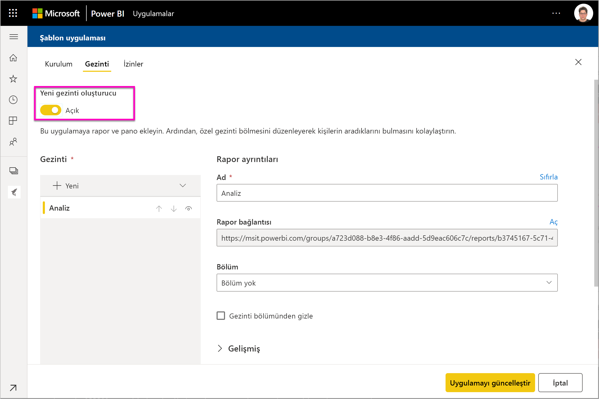
    
    **Uygulama giriş sayfası:** Gezinti oluşturucuyu kullanmamaya karar verirseniz uygulama giriş sayfasını seçebilirsiniz. Uygulamanızın giriş sayfası olarak bir rapor veya pano tanımlayın. Doğru etkiyi bırakan bir giriş sayfası kullanın.

    **Denetim**

    Uygulamanızdaki içerikle ilgili olarak, uygulama kullanıcıları için geçerli olacak sınırları ve kısıtlamaları ayarlayın. Bu denetimi kullanarak uygulamanızda fikri mülkiyeti koruyabilirsiniz.

    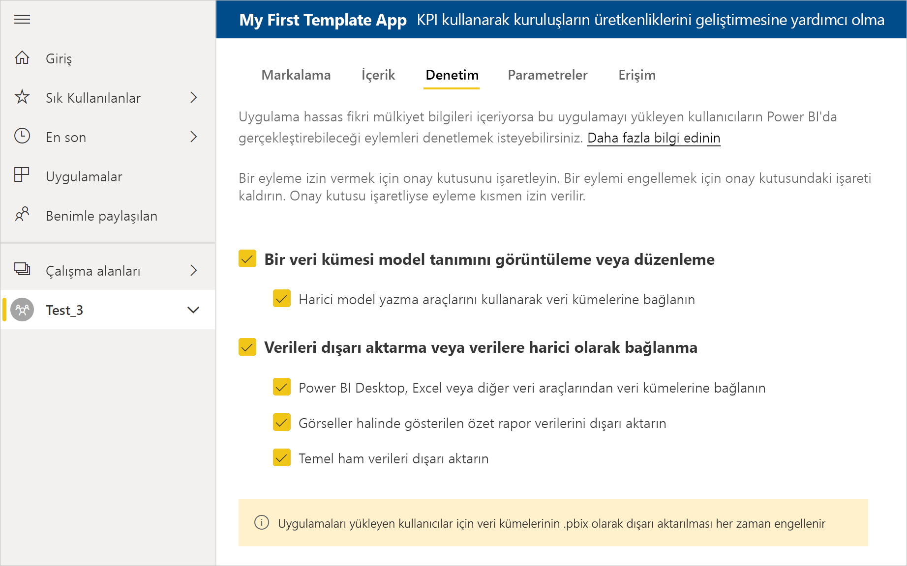

    >[!NOTE]
    >Uygulamayı yükleyen kullanıcılar için .pbix biçimine dışarı aktarmak her zaman engellenir.

    **Parametreler**

    Veri kaynaklarına bağlanırken parametre davranışını yönetmek için bu kategoriyi kullanın. [Sorgu parametreleri oluşturma](https://powerbi.microsoft.com/blog/deep-dive-into-query-parameters-and-power-bi-templates/) hakkında daha fazla bilgi edinin.

    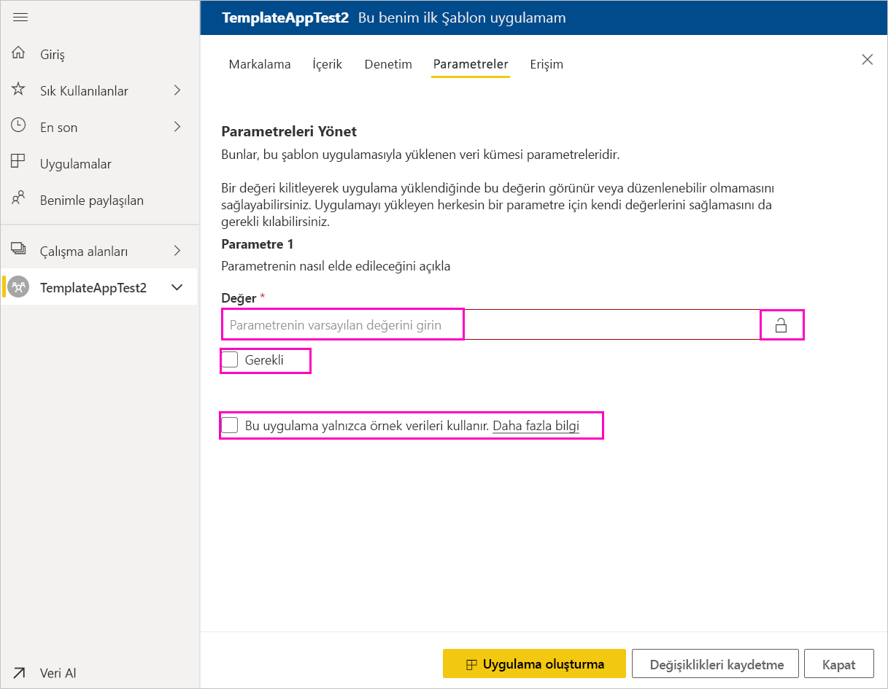
    - **Değer**: varsayılan parametre değeri.
    - **Gerekli**: yükleyicinin kullanıcıya özel bir parametre girmesini gerektirmek için bunu kullanın.
    - **Kilit**: Kilitleme, yükleyicinin parametreyi güncelleştirmesini engeller.

    **Erişim**: Test aşamasında, kuruluşunuzda başka kimlerin uygulamanızı yükleyebileceğine ve test edebileceğine karar verin. Endişelenmeyin; daha sonra istediğiniz zaman geri dönüp bu ayarları değiştirebilirsiniz (Ayar, dağıtılmış Şablon uygulamasının erişimini etkilemez).

2. **Uygulama oluştur**'u seçin.

    Test uygulamasının hazır olduğunu belirten ve kopyalayıp uygulamanızı test edenlerle paylaşabileceğiniz bir bağlantı içeren bir ileti görürsünüz.

    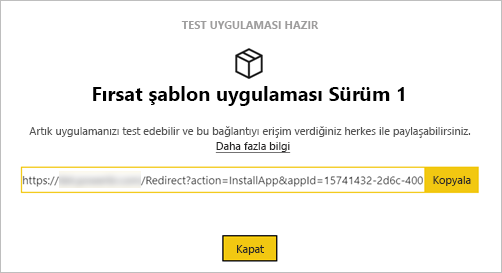

    Aşağıdaki sürüm yönetim işleminin de ilk adımını tamamlamış oldunuz.

## Şablon uygulaması sürümünü yönetme

Bu şablon uygulamasını genel kullanıma sunmadan önce, kullanıma hazır olduğundan emin olmak istersiniz. Power BI, tüm uygulama sürüm yolunu izleyip inceleyebileceğiniz sürüm yönetim bölmesini oluşturmuştur. Bir aşamadan diğerine geçişi de tetikleyebilirsiniz. Yaygın aşamalar şunlardır:

- Test uygulaması oluşturma: yalnızca kuruluşunuzda test etmek için.
- Test paketini üretim öncesi aşamaya yükseltme: kuruluşunuzun dışında test etme.
- Üretim öncesi paketini Üretime yükseltme: üretim sürümü.
- Tüm paketleri silme veya önceki aşamadan yeniden başlama.

Sürüm aşamaları arasında hareket ettiğinizde URL değişmez. Yükseltme URL'nin kendisini etkilemez.

Şimdi aşamaları gözden geçirelim:

1. Şablon çalışma alanında **Release Management**’ı seçin.

    

2. **Uygulama oluştur**'u seçin.

    Yukarıdaki **Test şablon uygulaması oluştur** seçeneğiyle test uygulaması oluşturduysanız, **Test**’in yanındaki sarı nokta zaten doldurulmuş görünür ve burada **Uygulama oluştur**’u seçmeniz gerekmez. Seçerseniz, şablon uygulaması oluşturma işlemine geri dönersiniz.

3. **Bağlantı al**’ı seçin.

    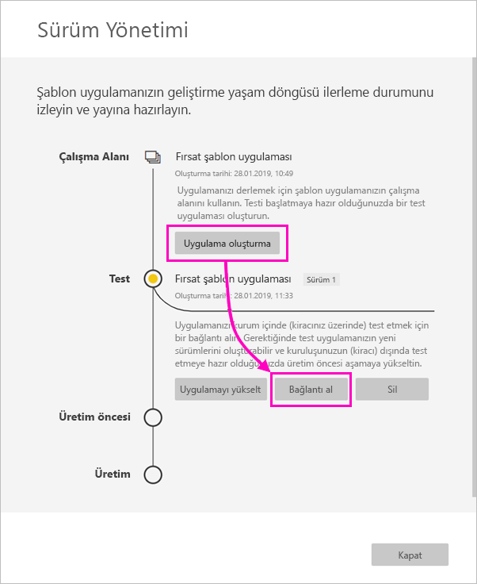

4. Uygulama yükleme deneyimini test etmek için, bildirim penceresindeki bağlantıyı kopyalayın ve yeni bir tarayıcı penceresine yapıştırın.

    Burada, müşterilerinizin izleyeceği yordamın aynısını izlersiniz. Sürümleri için bkz. [Kuruluşunuzda şablon uygulamalarını yükleme ve dağıtma](service-template-apps-install-distribute.md).

5. İletişim kutusunda **Yükle**'yi seçin.

    Yükleme başarılı olduğunda yeni uygulamanın hazır olduğuna ilişkin bir bildirim görürsünüz.

6. **Uygulamaya git**’i seçin.
7. **Yeni uygulamanızı kullanmaya başlayın** penceresinde uygulamanızı aynı müşterilerinizin göreceği gibi görürsünüz.

    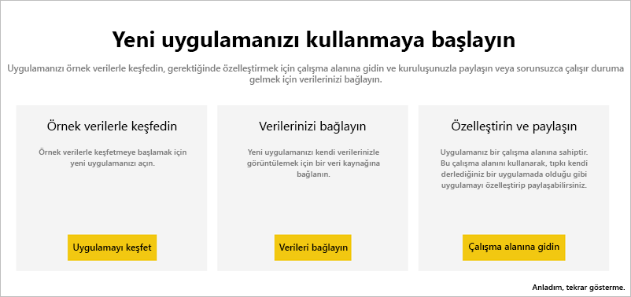
8. Test uygulamasını örnek verilerle doğrulamak için **Uygulamayı Keşfet**’i seçin.
9. Değişiklik yapmak için özgün çalışma alanındaki uygulamaya geri dönün. Sonuçtan memnun kalana kadar test uygulamasını güncelleştirin.
10. Uygulamanızı kiracınızın dışında test edilmek üzere üretim öncesi aşamaya yükseltmek için, **Sürüm Yönetimi** bölmesine dönün ve **Uygulamayı yükselt**’i seçin. 

    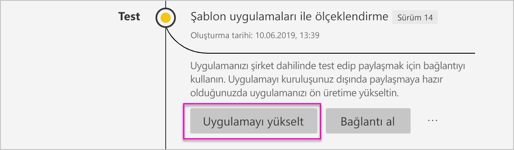
    >[!NOTE]
    > Uygulama yükseltildiğinde kuruluşunuzun dışında herkese açık duruma gelir.

    Bu seçeneği görmüyorsanız, Power BI yöneticinize başvurun ve size yönetim portalında [şablon uygulaması geliştirme izinleri](service-admin-portal.md#template-apps-settings) vermesini isteyin.
11. Seçiminizi onaylamak için **Yükselt**’i seçin.
12. Bu yeni URL’yi kopyalayın ve kiracınızın dışında test edilmesi için paylaşın. Bu aynı zamanda, [yeni bir Bulut İş Ortağı Portalı teklifi](https://docs.microsoft.com/azure/marketplace/cloud-partner-portal/power-bi/cpp-publish-offer) oluşturarak uygulamanızı AppSource’ta dağıtma sürecini başlatmak için göndereceğiniz bağlantıdır. Bulut İş Ortağı Portalı'na yalnızca üretim öncesi bağlantılarını gönderin. Ancak uygulama onaylandıktan ve AppSource'ta yayımlandığına ilişkin bildirimi aldıktan sonra bu paketi Power BI'da üretime yükseltebilirsiniz.
13. Uygulamanız üretime veya AppSource yoluyla paylaşıma hazır olduğunda, **Sürüm Yönetimi** bölmesine dönün ve **Ön üretim**’in yanındaki **Uygulamayı yükselt**’i seçin.
14. Seçiminizi onaylamak için **Yükselt**’i seçin.

    Artık uygulamanız üretim aşamasındadır ve dağıtıma hazırdır.

    

Uygulamanızın dünya genelinde binlerce Power BI kullanıcısına sunulabilmesi için, uygulamayı AppSource’a göndermenizi öneririz. Ayrıntılar için bkz. [Power BI Uygulama teklifi](https://docs.microsoft.com/azure/marketplace/cloud-partner-portal/power-bi/cpp-power-bi-offer).

## Sonraki adımlar

Müşterilerinizin şablon uygulamanızla nasıl etkileşim kurduğunu görmek için bkz. [Kuruluşunuzda şablon uygulamalarını yükleme, özelleştirme ve dağıtma](service-template-apps-install-distribute.md).

Uygulamanızı dağıtma işleminin ayrıntıları için bkz. [Power BI Uygulama teklifi](https://docs.microsoft.com/azure/marketplace/cloud-partner-portal/power-bi/cpp-power-bi-offer).
