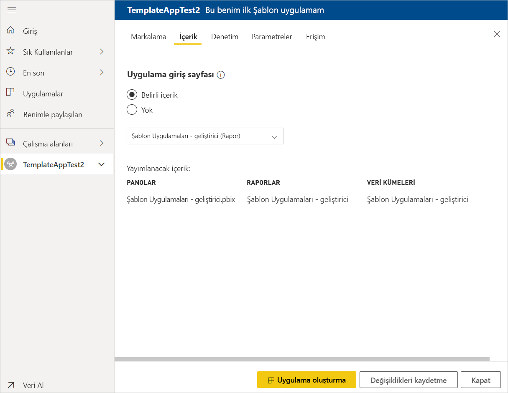

# Power BI’da şablon uygulaması oluşturma (önizleme)

Yeni Power BI *şablon uygulamaları* Power BI iş ortaklarının çok az kodlamayla veya hiç kodlama kullanmadan Power BI uygulamaları oluşturmasını ve bunları Power BI müşterilerine dağıtmasını sağlar.  Bu makale, Power BI şablon uygulaması oluşturmak için adım adım yönergeler içerir.

Power BI raporları ve panoları oluşturabilirsiniz, olabilir bir *şablon uygulama Oluşturucu* oluşturur ve içine analitik içerik paketleri bir *uygulama*. Diğer Power BI kiracılara gibi AppSource ya da kendi web hizmetinde kullanarak tüm kullanılabilir platformu aracılığıyla uygulamanızı dağıtabilir. Bir oluşturucu olarak dağıtım için bir korumalı analytics paketi oluşturma olanağına sahip olursunuz.

Kuruluşlarında kimlerin şablon uygulamaları oluşturabileceğini ve kimlerin bu uygulamaları yükleyebileceğini Power BI kiracı yöneticileri yönetir ve denetler. Yetkili kullanıcılar şablon uygulamanızı yükleyin sonra değiştirmek ve Power BI tüketicilere kuruluşlarındaki dağıtın.

## Önkoşullar

Şablon uygulaması oluşturmak için şunları gerekir:  

- [Power BI Pro lisansı](service-self-service-signup-for-power-bi.md)
- [Power BI Desktop yüklemesi](desktop-get-the-desktop.md) (isteğe bağlı)
- Konusunda [Power BI'ın temel kavramlar](service-basic-concepts.md)
- Şablon uygulaması oluşturma izinleri. Ayrıntılar için bkz. Power BI [yönetim portalı, Şablon uygulaması ayarları](service-admin-portal.md#template-apps-settings-preview).

## Uygulama geliştirici modunu etkinleştirme

Diğer Power BI kiracılarına dağıtabileceğiniz bir şablon uygulaması oluşturmak için Uygulama Geliştirici modunda olmalısınız. Aksi takdirde, yalnızca kendi kuruluşunuzdaki Power BI kullanıcıları için uygulama oluşturursunuz.

1. Tarayıcıda Power BI hizmetini açın.
2. **Ayarlar** > **Genel** > **Geliştirici** > **Şablon uygulaması geliştirme modunu etkinleştir**’e gidin.

    

    Bu seçeneği görmüyorsanız, Power BI yöneticinize başvurun ve size yönetim portalında [şablon uygulaması geliştirme izinleri](service-admin-portal.md#template-apps-settings-preview) vermesini isteyin.

3. **Apply** (Uygula) seçeneğini belirleyin.

## Şablon uygulaması çalışma alanını oluşturma

Diğer Power BI kiracılarına dağıtabileceğiniz bir şablon uygulaması oluşturmak için, bu uygulamayı yeni uygulama çalışma alanlarından birinde oluşturmalısınız.

1. Power BI hizmetinde **Çalışma alanları** > **Uygulama çalışma alanı oluştur**’u seçin.

    

2. **Uygulama çalışma alanı oluştur** penceresinin **Geliştirilmiş çalışma alanlarını önizle** alanında **Şimdi dene**'yi seçin.

    

3. Uygulama çalışma alanınız için ad, açıklama (isteğe bağlı) ve logo resmi (isteğe bağlı) girin.

4. Select **Bir şablon uygulaması geliştirin** öğesini seçin.

    

5. **Kaydet**'i seçin.
>[!NOTE]
>Şablon uygulamaları yükseltmek için Power BI yöneticinizden izinlerinin olması gerekir.

## Şablon uygulamanızdaki içeriği oluşturma

Normal Power BI uygulama çalışma alanlarında olduğu gibi, sonraki adımınız çalışma alanında içeriği oluşturmaktır.  Şablon uygulamalarının bu önizleme sürümünde, her türden birer tane oluşturmayı destekliyoruz: bir veri kümesi, bir rapor ve bir pano.

- Uygulama çalışma alanınızda [Power BI içeriğinizi oluşturun](power-bi-creator-landing.md).

Power Query’de parametreleri kullanıyorsanız, bunların iyi tanımlanmış türde (örneğin, Text) olmasına dikkat edin. Any ve Binary türleri desteklenmez.

[Power BI’da şablon uygulaması yazmaya yönelik ipuçları (önizleme)](service-template-apps-tips.md) makalesinde şablon uygulamanız için rapor ve pano oluştururken göz önüne alınacak öneriler bulunur.

## Test şablon uygulaması oluşturma

Artık çalışma alanınızda içeriğiniz olduğuna göre, bu içeriği bir şablon uygulamasında paketlemeye hazırsınız. İlk adım yalnızca kiracınızda kuruluşunuzun içinden erişilebilen bir test şablon uygulaması oluşturmaktır.

1. Şablon uygulaması çalışma alanında **Uygulama oluştur**’u seçin.

    

    Burada, beş kategoriye şablon uygulamanız için ek yapı seçenekleri doldurun:

    **Markalama**

    
    - Uygulama adı
    - Açıklama
    - Destek sitesine (bağlantı sunulur uygulama bilgileri altında şablon uygulaması olarak kuruluş uygulaması dağıtma sonra)
    - Uygulama logosu (45K dosya boyutu sınırını 1:1 en boy oranı, .png, .jpg .jpeg biçimleri)
    - Uygulama Tema rengi

    **İçerik**

    **Uygulama giriş sayfası:** Bir rapora veya panoya uygulama giriş sayfası, doğru izlenimi sunacak bir giriş sayfasını tanımlayın:

    

    **Denetim**

    Limitler ve uygulama kullanıcılarınızın uygulamanızın içeriğini sahip olacağı kısıtlamaları ayarlayın. Bu denetim, fikri mülkiyet uygulamanızda korumak için kullanabilirsiniz.

    

    >[!NOTE]
    >.Pbix biçimine vermeden, uygulamayı yükleyen kullanıcılar için her zaman engellenir.

    **Parametreler**

    Bu kategori, veri kaynaklarına bağlanırken görüntülenen parametre davranışını yönetmek için kullanın. Daha fazla bilgi edinin [sorgu parametreleri oluşturma](https://powerbi.microsoft.com/blog/deep-dive-into-query-parameters-and-power-bi-templates/).

    
    - **Değer**: varsayılan parametre değeri.
    - **Gerekli**: bir kullanıcıya özel parametre girmek yükleyici gerektirmek için bunu kullanın.
    - **Kilit**: Kilitleme, bir parametre güncelleştirmesini yükleyici engeller.
    - **Statik**: Uygulamayı içeren durumunda etkinleştirme *yalnızca* örnek veriler. Seçtiğinizde, **statik**, Yükleme Sihirbazı, bir veri kaynağına bağlanmak için kullanıcılara sor değil.

    **Erişim** hangi kuruluşunuzdaki diğer yükleyin ve uygulamanızı test edin test aşamasında karar verin. Endişelenmeyin, her zaman geri dönün ve daha sonra bu ayarları değiştirmek (dağıtılmış uygulama şablonu erişim ayarı etkilemez).

2. **Uygulama oluştur**'u seçin.

    Test uygulamasının hazır olduğunu belirten ve kopyalayıp uygulamanızı test edenlerle paylaşabileceğiniz bir bağlantı içeren bir ileti görürsünüz.

    

    Aşağıdaki sürüm yönetim işleminin de ilk adımını tamamlamış oldunuz.

## Şablon uygulaması sürümünü yönetme

Bu şablon uygulamasını genel kullanıma sunmadan önce, kullanıma hazır olduğundan emin olmak istersiniz. Power BI, tüm uygulama sürüm yolunu izleyip inceleyebileceğiniz sürüm yönetim bölmesini oluşturmuştur. Bir aşamadan diğerine geçişi de tetikleyebilirsiniz. Yaygın aşamalar şunlardır:

- Test uygulaması oluşturma: yalnızca kuruluşunuzda test etmek için.
- Test paketini üretim öncesi aşamaya yükseltme: kuruluşunuzun dışında test etme.
- Üretim öncesi paketini Üretime yükseltme: üretim sürümü.
- Tüm paketleri silme veya önceki aşamadan yeniden başlama.

URL, yayın aşamalarını arasında hareket ettikçe değiştirmez. Yükseltme URL etkilemez.

Sorunlarını giderme aşamalarının Bahsedelim:

1. Şablon uygulaması çalışma alanında **Sürüm Yönetimi**’ni seçin.

    

2. **Uygulama oluştur**'u seçin.

    Yukarıdaki **Test şablon uygulaması oluştur** seçeneğiyle test uygulaması oluşturduysanız, **Test**’in yanındaki sarı nokta zaten doldurulmuş görünür ve burada **Uygulama oluştur**’u seçmeniz gerekmez. Seçerseniz, şablon uygulaması oluşturma işlemine geri dönersiniz.

3. **Bağlantı al**’ı seçin.

    

4. Uygulama yükleme deneyimini test etmek için, bildirim penceresindeki bağlantıyı kopyalayın ve yeni bir tarayıcı penceresine yapıştırın.

    Burada, müşterilerinizin izleyeceği yordamın aynısını izlersiniz. Sürümleri için bkz. [Kuruluşunuzda şablon uygulamalarını yükleme ve dağıtma](service-template-apps-install-distribute.md).

5. İletişim kutusunda **Yükle**'yi seçin.

    Yükleme başarılı olduğunda yeni uygulamanın hazır olduğuna ilişkin bir bildirim görürsünüz.

6. **Uygulamaya git**’i seçin.
7. **Yeni uygulamanızı kullanmaya başlayın** penceresinde uygulamanızı aynı müşterilerinizin göreceği gibi görürsünüz.

    
8. Test uygulamasını örnek verilerle doğrulamak için **Uygulamayı Keşfet**’i seçin.
9. Değişiklik yapmak için özgün çalışma alanındaki uygulamaya geri dönün. Sonuçtan memnun kalana kadar test uygulamasını güncelleştirin.
10. Uygulamanıza, kiracınızın dışında başka testler yapmak için üretim öncesi yükseltme hazır olduğunuzda, geri dönüp **Release Management** bölmesi ve select **Yükselt uygulama**. 

    

    >[!NOTE]
    > Uygulama yükseltildiğinde, kuruluşunuzun dışından genel olarak kullanılabilir.

11. Seçiminizi onaylamak için **Yükselt**’i seçin.
12. Bu yeni URL’yi kopyalayın ve kiracınızın dışında test edilmesi için paylaşın. Bu aynı zamanda gönderdiğiniz oluşturarak uygulamanızı appsource'ta dağıtma işlemine başlamak için bir bağlantıdır bir [yeni bulut iş ortağı portalı teklif](https://docs.microsoft.com/azure/marketplace/cloud-partner-portal/power-bi/cpp-publish-offer). Bulut iş ortağı portalı yalnızca üretim öncesi bağlantıları gönderin. Sonra yalnızca uygulama onaylanır ve Appsource'ta yayımlandıktan sonra Power BI üretimde bu paketin yükseltebilirsiniz bildirim alın.
13. Uygulamanız üretime veya AppSource yoluyla paylaşıma hazır olduğunda, **Sürüm Yönetimi** bölmesine dönün ve **Ön üretim**’in yanındaki **Uygulamayı yükselt**’i seçin.
14. Seçiminizi onaylamak için **Yükselt**’i seçin.

    Artık uygulamanız üretim aşamasındadır ve dağıtıma hazırdır.

    

Uygulamanızın dünya genelinde binlerce Power BI kullanıcısına sunulabilmesi için, uygulamayı AppSource’a göndermenizi öneririz. Ayrıntılar için bkz. [Power BI Uygulama teklifi](https://docs.microsoft.com/azure/marketplace/cloud-partner-portal/power-bi/cpp-power-bi-offer).

## Uygulamanızı güncelleştirme

Uygulamanız artık üretim ortamında olduğundan, üretimdeki uygulamaya müdahale etmeden test aşamasının üzerinden geçebilirsiniz.

1. **Sürüm yönetimi** bölmesinde **Uygulama oluştur**’u seçin.
2. Uygulama oluşturma sürecine en baştan yeniden başlayın.
3. **Markalama**, **İçerik**, **Denetim** ve **Erişim**’i ayarladıktan sonra yeniden **Uygulama oluştur**’u seçin.
4. **Kapat**’ı seçin ve **Sürüm yönetimi**’ne dönün.

   Şimdi iki sürümünüz olduğunu görürsünüz: üretimdeki sürüm ve test aşamasındaki yeni sürüm.

    

5. Uygulamanıza, kiracınızın dışında başka testler yapmak için üretim öncesi yükseltme hazır olduğunuzda, Release Management bölmesine dönün ve seçin **Yükselt uygulama** yanındaki **test**.
6. Bağlantınız canlı, konusundaki adımlar izlenilerek yeniden bulut iş ortağı portalını göndermek [Power BI uygulaması teklif güncelleştirme](https://docs.microsoft.com/azure/marketplace/cloud-partner-portal/power-bi/cpp-update-existing-offer).

>[!NOTE]
>Uygulamanızı üretim aşamasına uygulamanızı bulut iş ortağı portalı tarafından onaylanır yalnızca sonra yayımladığınız tanıtın.

## Sonraki adımlar

Müşterilerinizin şablon uygulamanızla nasıl etkileşim kurduğunu görmek için bkz. [Kuruluşunuzda şablon uygulamalarını yükleme, özelleştirme ve dağıtma](service-template-apps-install-distribute.md).

Uygulamanızı dağıtma işleminin ayrıntıları için bkz. [Power BI Uygulama teklifi](https://docs.microsoft.com/azure/marketplace/cloud-partner-portal/power-bi/cpp-power-bi-offer).
