# Kuruluşunuzda şablon uygulamalarını yükleme ve dağıtma

Power BI analisti misiniz? Öyleyse, bu makalede işlerinizi yürütürken kullandığınız Salesforce, Microsoft Dynamics ve Google Analytics gibi birçok hizmete bağlanmak için [şablon uygulamalarını](service-template-apps-overview.md) nasıl yükleyebileceğiniz açıklanmaktadır. Şablon uygulamasının önceden oluşturulmuş panosun ve raporlarını, kuruluşunuzun ihtiyaçlarına uygun şekilde değiştirebilir ve bunları [uygulama](consumer/end-user-apps.md) olarak iş arkadaşlarınıza dağıtabilirsiniz. 

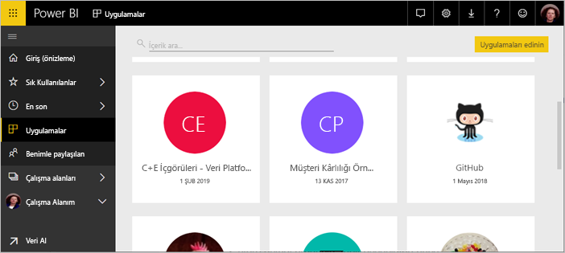

Şablon uygulamalarını kuruluşunuz dışında dağıtım için kendiniz oluşturmak istiyorsanız bkz. [Power BI’da şablon uygulaması oluşturma](service-template-apps-create.md). Power BI iş ortakları çok az kodlamayla veya hiç kodlama kullanmadan Power BI uygulamaları oluşturabilir ve bunları Power BI müşterilerinin kullanımına sunabilir. 

## Önkoşullar  

Bir şablon uygulamasını yüklemek, özelleştirmek ve dağıtmak için şunlar gerekir: 

* [Power BI Pro lisansı](service-self-service-signup-for-power-bi.md).
* Kiracınızda şablon uygulamalarını yükleme izinleri.
* AppSource’tan veya uygulama oluşturucusundan alacağınız geçerli bir uygulama yükleme bağlantısı.
* [Temel Power BI kavramlarını](service-basic-concepts.md) iyice tanıma.

## Şablon uygulamasını yükleme

1. Power BI hizmetinin gezinti bölmesinde **Uygulamalar** > **Uygulama edinin**’i seçin.

    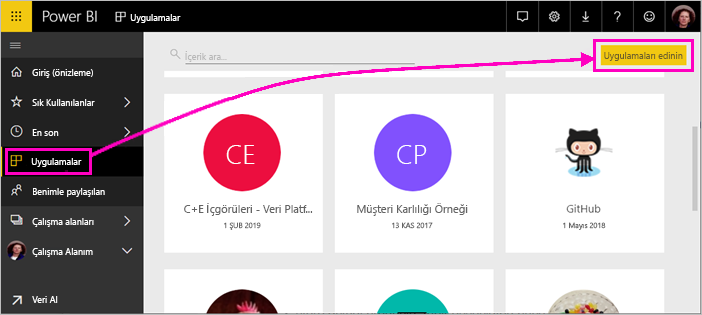

1. Görüntülenen AppSource penceresinde **Uygulamalar**’ı seçin. İstediğiniz uygulamaya göz atın veya uygulamayı arayın, ardından **Şimdi edinin**’i seçin.

    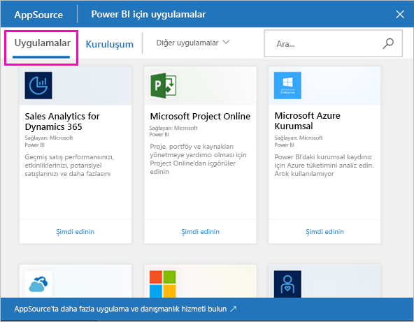

1. Görüntülenen iletişim kutusunda **Yükle**’yi seçin.

    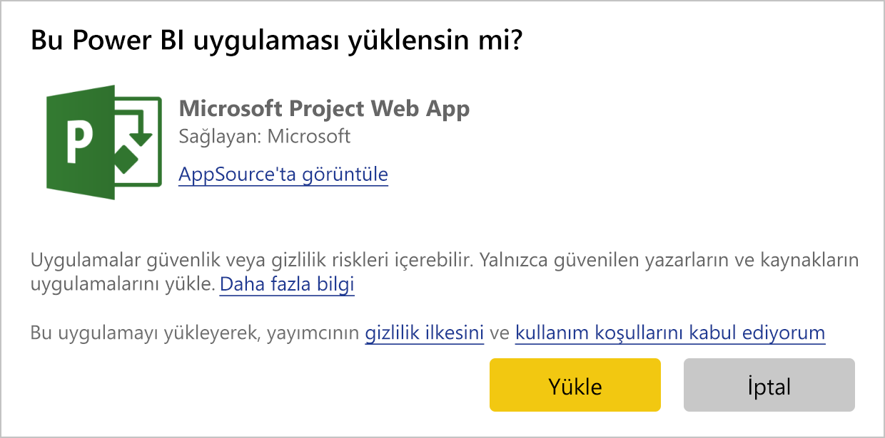
    
    Uygulama ilişkili bir çalışma alanıyla yüklenir. **Uygulamayı özelleştirmeye karar verirseniz, bu ilişkili çalışma alanında bunu yapabilirsiniz**.

    > [!NOTE]
    > AppSource’ta listelenmeyen bir uygulamanın yükleme bağlantısını kullanıyorsanız bir doğrulama iletişim kutusu, bu tercihinizi doğrulamanızı ister.
    >
    >AppSource’ta listelenmeyen bir şablon uygulaması yükleyebilmek için, yöneticinizden ilgili izinleri istemeniz gerekir. Ayrıntılar için Power BI yönetici portalında [Şablon uygulaması ayarları](service-admin-portal.md#template-apps-settings)’na bakın.

    Yükleme başarıyla tamamlandığında, yeni uygulamanızın hazır olduğunu bildiren bir bildirim alırsınız.

    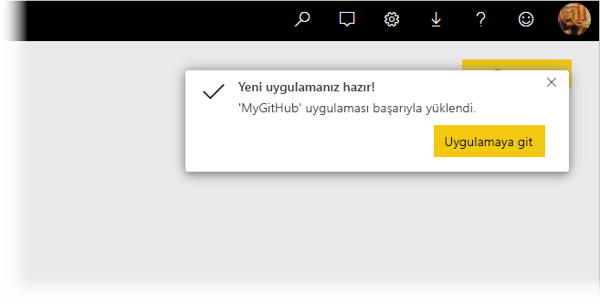

## Verilere bağlanma

1. **Uygulamaya git**’i seçin. **Yeni uygulamanızı kullanmaya başlayın** penceresi görüntülenir.

   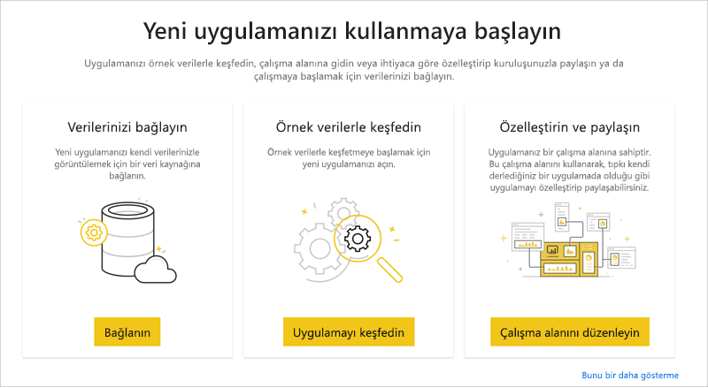

1. **Bağlan**’a tıklayın.
    
    Böylece veri kaynağını, örnek verilerden kendi veri kaynağınıza değiştireceğiniz bir veya bir dizi iletişim kutusu açılır. Bu genellikle veri kümesi parametrelerinin ve veri kaynağı kimlik bilgilerinin yeniden tanımlanması anlamına gelir. Bkz. [Bilinen sınırlamalar](service-template-apps-tips.md#known-limitations).
    
    Aşağıdaki örnekte verilere bağlanma işlemi, iki iletişim kutusunu kapsar.

   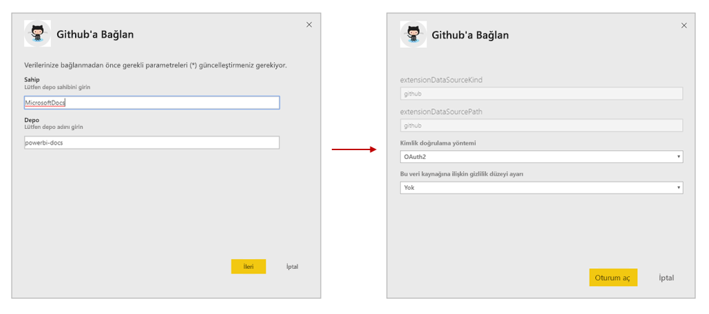

    Bağlantı iletişim kutularını doldurma işlemini tamamlamanızın ardından bağlantı işlemi başlar. Bir başlık size örnek verileri görüntülemekte olduğunuzu bildirir.

    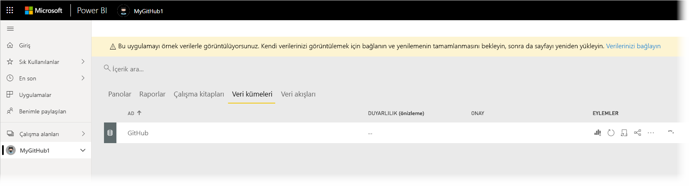

    Verilerin bağlanma ve güncelleştirme işleminin tamamlanmasını bekleyin. Bu işlemin tamamlandığından haberdar olmak için veri kümesi satırında (yeni görünüm) veya sekmede (eski görünüm) yer alan ilerleme durumu göstergesini izleyin.

   Bağlantı ve veri yenileme işlemi tamamlandığında tarayıcınızı yenileyin; başlık şimdi uygulama üzerinde yaptığınız değişiklikleri uygulamak için uygulamayı güncelleştirmeniz ve paylaşmanız gerektiğini size bildirir.

    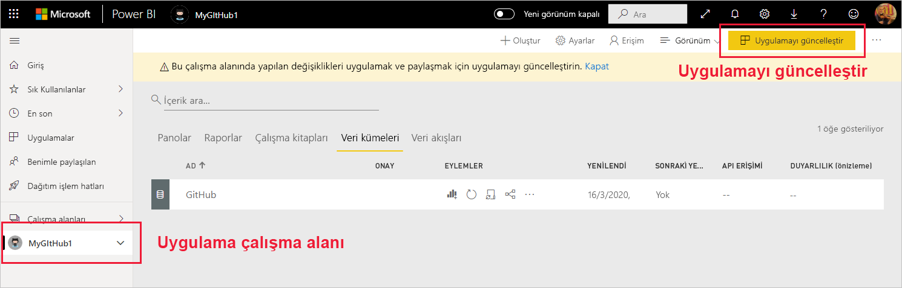

## Uygulamayı özelleştirme ve paylaşma

Verilere bağlantı ve veri yenile işleminden sonra tarayıcıyı yenilemenizin ardından uygulamayla ilişkili çalışma alanını görürsünüz. Bu noktada, herhangi bir çalışma alanında olduğu gibi burada da yapıtları düzenleyebilirsiniz. Öte yandan, değiştirdiğiniz öğeleri farklı adlarla kaydetmediğiniz sürece, uygulamayı yeni bir sürümle güncelleştirdiğinizde yaptığınız değişikliklerin üzerine yazılacağını unutmayın. [Üzerine yazma ile ilgili ayrıntılara bakın](#overwrite-behavior).

Çalışma alanındaki yapıtları düzenlemeyle ilgili bilgi için bkz.
* [Power BI’da rapor düzenleyicisi turu](service-the-report-editor-take-a-tour.md)
* [Power BI hizmetinde tasarımcılara yönelik temel kavramlar](service-basic-concepts.md)

Çalışma alanındaki yapıtlara istediğiniz değişiklikleri yapmanızın ardından uygulamayı yayımlamaya ve paylaşmaya hazır olursunuz. Bunun nasıl yapılacağını öğrenmek için bkz. [Uygulamanızı yayımlama](service-create-distribute-apps.md#publish-your-app).

## Şablon uygulamasını güncelleştirme

Zaman zaman şablon uygulaması oluşturucuları, şablon uygulamalarının yeni gelişmiş sürümlerini, AppSource, doğrudan bağlantı veya her ikisi aracılığıyla yayınlar.

Uygulamayı ilk olarak AppSource’tan indirdiyseniz, şablon uygulamasının yeni bir sürümü kullanılabilir hale geldiğinde, Power BI hizmetinde bir güncelleştirme başlığı görüntülenerek yeni bir uygulama sürümünün kullanılabilir olduğunu size bildirir.

  

>[!NOTE]
>Uygulamayı ilk olarak AppSource yerine doğrudan bağlantı aracılığıyla aldıysanız, yeni bir sürüm kullanılabilir olduğunda bunu bilmeniz için tek yol, şablon uygulaması oluşturucusuyla iletişim kurmaktır.

  Güncelleştirmeyi yüklemek için bildirim başlığında **Edinin** seçeneğine tıklayın veya AppSource’ta uygulamayı tekrar bulup **Hemen edinin** seçeneğini belirleyin. Şablon uygulaması oluşturucusundan güncelleştirme için bir doğrudan bağlantı aldıysanız bu bağlantıya tıklamanız yeterlidir.
  
  Sizden geçerli sürümün üzerine mi yazmak yoksa yeni sürümü yeni bir çalışma alanına mı yüklemek istediğiniz sorulur. Varsayılan olarak "üzerine yaz" seçilidir.

  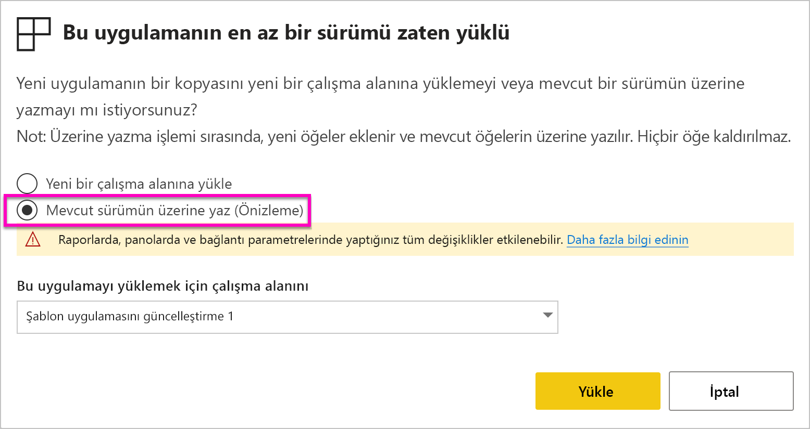

- **Mevcut sürümün üzerine yaz:** Şablon uygulamasının güncelleştirilmiş sürümünü mevcut çalışma alanının üzerine yazar. [Üzerine yazma ile ilgili ayrıntılara bakın](#overwrite-behavior).

- **Yeni bir çalışma alanına yükle:** Yeniden yapılandırmanız (başka bir deyişle, verilere bağlanmanız, gezintiyi ve izinleri tanımlamanız) gereken çalışma alanı ve uygulamanın yeni bir sürümünü yükler.

### Üzerine yazma davranışı

* Üzerine yazmak, uygulamadaki değil çalışma alanı içindeki raporları, panoları ve veri kümesini güncelleştirir. Üzerine yazmak uygulamada gezinme, ayarlama ve izinleri değiştirmez.
* Çalışma alanını güncelleştirdikten sonra **uygulamayı güncelleştirerek çalışma alanında yapılan değişiklikleri uygulamaya uygulamanız gerekir**.
* Üzerine yazmak, yapılandırılmış parametreleri ve kimlik doğrulamasını saklar. Güncelleştirmeden sonra otomatik bir veri kümesi yenilemesi başlar. **Bu yenileme sırasında uygulama, raporlar ve panolar örnek veriler sunar**.

  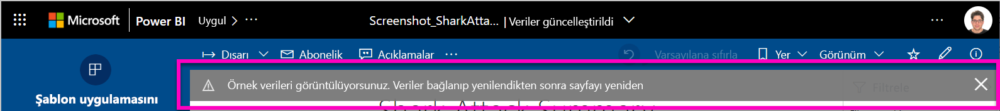

* Üzerine yazma işlemi, yenileme tamamlanana kadar her zaman örnek verileri gösterir. Şablon uygulaması yazarı, veri kümesinde veya parametrelerde değişiklik yaptıysa, çalışma alanı ve uygulama kullanıcıları, yenileme tamamlanıncaya kadar yeni verileri görmez. Bunun yerine, bu süre boyunca örnek verileri görmeye devam eder.
* Üzerine yazma işlemi hiçbir zaman çalışma alanına eklediğiniz yeni raporları veya panoları silmez. Yalnızca özgün yazarın değişikliklerini özgün raporların ve panoların üzerine yazar.

>[!IMPORTANT]
>Kuruluş uygulaması kullanıcılarınız için raporlara ve panolara yapılan değişiklikleri uygulamak için üzerine yazdıktan sonra [uygulamayı güncelleştirmeyi](#customize-and-share-the-app) unutmayın.

## Sonraki adımlar

[Power BI'da çalışma arkadaşlarınızla çalışma alanları oluşturma](service-create-workspaces.md)
