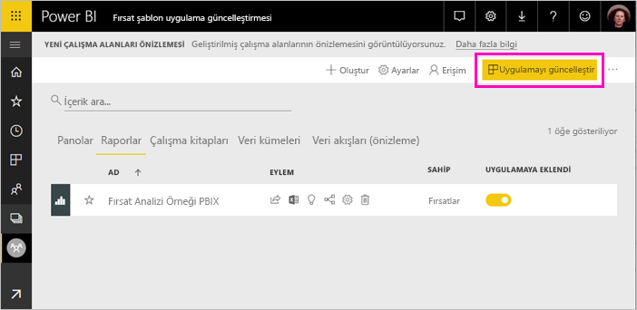
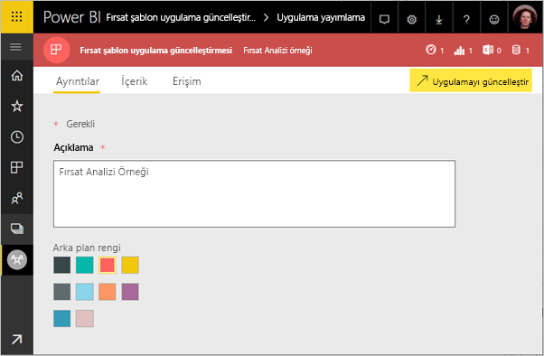
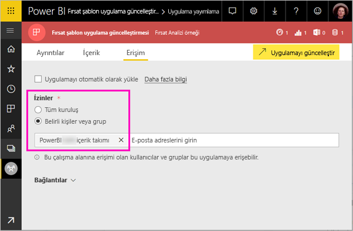

# Kuruluşunuzda şablon uygulamalarını yükleme ve dağıtma - Power BI

Power BI analisti misiniz? Öyleyse, bu makalede işlerinizi yürütürken kullandığınız Salesforce, Microsoft Dynamics ve Google Analytics gibi birçok hizmete bağlanmak için *şablon uygulamalarını* nasıl yükleyebileceğiniz açıklanır. Kuruluşunuzun gereksinimlerine uygun olarak panoyu ve raporları değiştirebilir, sonra da bunları *uygulama* olarak iş arkadaşlarınıza dağıtabilirsiniz. 

Kendiniz dağıtmak üzere şablon uygulamaları oluşturmak ilginizi çekiyorsa, bkz. [Power BI’da şablon uygulaması oluşturma](service-template-apps-create.md). Power BI iş ortakları çok az kodlamayla veya hiç kodlama kullanmadan Power BI uygulamaları oluşturabilir ve bunları Power BI müşterilerine dağıtabilir. 

## Önkoşullar  

Şablon uygulamalarını yüklemek, özelleştirmek ve dağıtmak için şunlar gerekir: 

- [Power BI Pro lisansı](service-self-service-signup-for-power-bi.md)
- [Temel Power BI kavramlarını](service-basic-concepts.md) tanıma
- Şablon uygulaması oluşturucusundan veya AppSource’tan geçerli bir yükleme bağlantısı. 
- Şablon uygulamalarını yükleme izinleri. 

## Şablon uygulamasını yükleme

Şablon uygulamasının bağlantısını alabilirsiniz. Almadıysanız, ilginizi çeken uygulamayı bulmak için AppSource’ta arama yapabilirsiniz. Her iki durumda da, uygulamayı yükledikten sonra değiştirebilir ve kendi kuruluşunuzda dağıtabilirsiniz.

### Tarayıcıdan AppSource araması yapma

Tarayıcıda, Power BI uygulamalarını gösterecek şekilde filtrelenmiş AppSource’u açmak için bu bağlantıyı seçin:

- https://appsource.microsoft.com/marketplace/apps?product=power-bi

### Power BI hizmetinde AppSource’u arama

1. Power BI hizmetinin gezinti bölmesinde **Uygulamalar** > **Uygulama edinin**’i seçin.

    

2. AppSource’ta **Uygulamalar**’ı seçin.

    

3. Uygulamaya göz atın veya uygulama için arama yapın, ardından **Şimdi edinin**’i seçin.

4. İletişim kutusunda **Yükle**'yi seçin.

     Power BI Pro lisansınız varsa, uygulama kendisiyle ilişkilendirilmiş çalışma alanına yüklenir. Uygulamayı, ilişkilendirilmiş çalışma alanında özelleştirirsiniz.

    Yükleme başarılı olduğunda yeni uygulamanızın hazır olduğuna ilişkin bir bildirim görürsünüz.
4. **Uygulamaya git**’i seçin.
5. **Yeni uygulamanızı kullanmaya başlayın** alanında üç seçenekten birini belirtin:

    

    - **Uygulamayı keşfet**: Örnek verilerle temel keşif. Uygulamanın genel görünümünü elde etmek için buradan başlayın. 
    - **Verilere bağlan**: Veri kaynağını örnek verilerden kendi veri kaynağınıza geçirin. Veri kümesi parametrelerini ve veri kaynağı kimlik bilgilerini yeniden tanımlayabilirsiniz. Şablon uygulaması ipuçları makalesinde [Bilinen sınırlamalar](service-template-apps-tips.md#known-limitations) bölümüne bakın. 
    - **Çalışma alanına git** (en gelişmiş seçenek): uygulama oluşturucusunun izin verdiği tüm değişiklikleri yapabilirsiniz.

    İsterseniz bu iletişim kutusunu atlayın ve gezinti bölmesindeki **Çalışma Alanları** yoluyla doğrudan ilişkili çalışma alanına erişin.
    >[!NOTE]
    >Hem bir *kurumsal uygulama* hem de bir *çalışma alanı* üzerinde yüklü bir şablon uygulaması yükleme. [Power BI’da uygulama dağıtma](service-create-distribute-apps.md) hakkında daha fazla bilgi edinin.
 
6. İş arkadaşlarınızla paylaşmadan önce, kendi verilerinize bağlanmak istersiniz. Ayrıca kuruluşunuza uygun olması için raporu veya panoyu değiştirmek de isteyebilirsiniz. Bu noktada başka raporlar ve panolar eklemeniz de mümkündür.

   AppSource’ta listelenmeyen bir uygulamanın yükleme bağlantısını seçerseniz bu tercihinizi doğrulamanızı isteyen bir iletişim kutusu ile karşılaşırsınız.

   

   >[!NOTE]
   >AppSource’ta listelenmeyen şablon uygulamalarını yüklemek için yöneticinizden izin istemeniz gerekir. Ayrıntılar için bkz. Power BI [yönetim portalı, Şablon uygulaması ayarları](service-admin-portal.md#template-apps-settings).

## Uygulamayı özelleştirme ve yayımlama

Uygulamayı kuruluşunuz için güncelleştirdikten sonra, yayımlamaya hazır olursunuz. Adımlar, diğer herhangi bir uygulamayı yayımlamakla aynıdır.

1. Özelleştirmeyi tamamladığınızda, çalışma alanı liste görünümünde sağ üst köşedeki **Uygulamayı güncelleştir**’i seçin.  

    

2. **Ayrıntılar** bölümünde, açıklamayı ve arka plan rengini değiştirebilirsiniz.

   

3. **Gezinti** menüsünde uygulamanız için yeni gezinti oluşturucuyu kullanabilir veya giriş sayfası için panoyu ya da raporu seçebilirsiniz. Ayrıntılar için bkz. [Gezinti deneyimini tasarlama](service-create-distribute-apps.md#design-the-navigation-experience).

   

4. **Erişim** bölümünde, seçilen kullanıcılara veya kuruluşun tamamına izin verirsiniz.  

   

5. **Uygulamayı güncelleştir**’i seçin. 

6. Uygulama başarıyla yayımlandıktan sonra bağlantıyı kopyalayabilir ve erişim verdiğiniz herkesle paylaşabilirsiniz. Bağlantıyı paylaşırsanız, bunu AppSource’taki **Kuruluşum** sekmesinde de görürler.

## Şablon uygulamasını güncelleştirme

Şablon uygulaması oluşturucular, şablon uygulamalarının yeni sürümlerini AppSource veya doğrudan bir bağlantı aracılığıyla yayınlayabilirler. Bunu yaptıklarında, uygulamayı aynı veya daha yeni bir sürümle yeniden yüklerken şablon uygulamasını güncelleştirebilirsiniz.

  >[!NOTE]
  >Yeni bir sürüm yüklendiğinde, rapor ve panolarda yaptığınız değişikliklerin üzerine yazılır. Güncelleştirilmiş rapor ve panolarınızı tutmak için, yüklemeden önce farklı bir ad veya konumla kaydedebilirsiniz.

- **Mevcut sürümün üzerine yaz:** Şablon uygulamasının güncelleştirilmiş sürümünü mevcut çalışma alanının üzerine yazar.

   

- **Yeni bir çalışma alanına yükle:** Yeniden yapılandırmanız gereken çalışma alanı ve uygulamanın yeni bir sürümünü yükler

### Üzerine yazma davranışı

* Üzerine yazmak, uygulamadaki değil *çalışma alanı* içindeki raporları, panoları ve veri kümesini güncelleştirir. Üzerine yazmak uygulamada gezinme, ayarlama ve izinleri değiştirmez.
* Çalışma alanını güncelleştirdikten sonra *uygulamayı güncelleştirerek* çalışma alanında yapılan değişiklikleri kuruluş uygulamasına uygulamanız gerekir.
* Üzerine yazmak, yapılandırılmış parametreleri ve kimlik doğrulamasını saklar. Güncelleştirmeden sonra otomatik bir veri kümesi yenilemesi başlar. Bu süre zarfında kuruluş uygulaması, raporları ve panoları *örnek veri* deneyimini sunar.
  
* Üzerine yazma işlemi, yenileme tamamlanana kadar her zaman örnek verileri gösterir. Şablon uygulama yazarı veri kümesinde veya parametrelerde değişiklik yaptıysa, çalışma alanı ve uygulamanın kullanıcıları *örnek veri* deneyimini görmeye devam ederler.
* Üzerine yazma işlemi hiçbir zaman çalışma alanına eklediğiniz *yeni* raporları veya panoları silmez. Özgün yazarın değişikliklerini özgün raporların ve panoların üzerine yazar.

>[!IMPORTANT]
>Kuruluş uygulaması kullanıcılarınız için raporlara ve panolara yapılan değişiklikleri uygulamak için üzerine yazdıktan sonra [uygulamayı güncelleştirmeyi](#customize-and-publish-the-app) unutmayın.

## Sonraki adımlar

[Power BI'da çalışma arkadaşlarınızla çalışma alanları oluşturma](service-create-workspaces.md)
