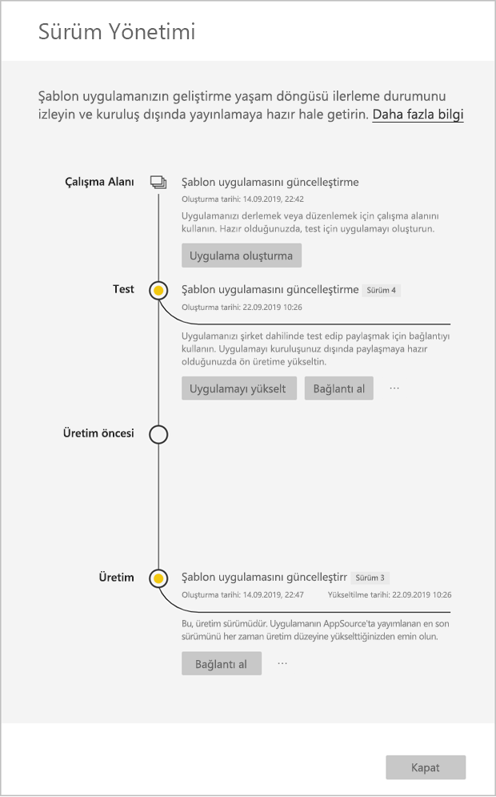

# Şablon uygulamasını güncelleştirme, silme ve ayıklama

Uygulamanız artık üretim ortamında olduğundan, üretimdeki uygulamaya müdahale etmeden test aşamasının üzerinden geçebilirsiniz.
## Uygulamanızı güncelleştirme

1. **Sürüm yönetimi** bölmesinde **Uygulama oluştur**’u seçin.
2. Uygulama oluşturma sürecine en baştan yeniden başlayın.
3. **Markalama**, **İçerik**, **Denetim** ve **Erişim**’i ayarladıktan sonra yeniden **Uygulama oluştur**’u seçin.
4. **Kapat**’ı seçin ve **Sürüm yönetimi**’ne dönün.

   Şimdi iki sürümünüz olduğunu görürsünüz: üretimdeki sürüm ve test aşamasındaki yeni sürüm.

    

5. Uygulamanızı kiracınızın dışında test etmek amacıyla üretim öncesi aşamaya yükseltmek için, Sürüm Yönetimi bölmesine dönün ve **Test**’in yanındaki **Uygulamayı yükselt**’i seçin.
6. Bağlantınız artık canlıdır. [Power BI Uygulama teklifi güncelleştirmesi](https://docs.microsoft.com/azure/marketplace/cloud-partner-portal/power-bi/cpp-update-existing-offer) altındaki adımları izleyerek bağlantıyı yeniden Bulut İş Ortağı Portalı'na (CPP) gönderin.
7. CPP’de teklifinizi hem yeniden **yayımlamanız** hem de yeniden doğrulamanız gerekir.

>[!NOTE]
>Uygulamanızı üretim aşamasına yükseltmek için uygulamanın Bulut İş Ortağı Portalı tarafından onaylanmasını ve uygulamayı yayımlamayı bekleyin.

## Çalışma alanını ayıklama
Ayıklama özelliği sayesinde artık bir şablon uygulamasını önceki sürümüne geri almak hiç olmadığı kadar kolaylaştı. Aşağıdaki adımlar, çeşitli yayın aşamalarındaki belirli bir uygulama sürümünü yeni çalışma alanına ayıklayacaktır:

1. Yayın yönetimi bölmesinde diğer simgesine **(...)** ve ardından **Ayıkla**’ya basın.

     
2. İletişim kutusunda, ayıklanan çalışma alanının adını girin. yeni bir çalışma alanı eklenir.

Yeni çalışma alanı sürümünüz sıfırlanır ve şablon uygulamasını yeni ayıklanan çalışma alanından geliştirmeye ve dağıtmaya devam edebilirsiniz.

## Şablon uygulaması sürümünü silme
Şablon uygulaması çalışma alanı, etkin bir dağıtılmış şablon uygulamasının kaynağıdır. Şablon uygulaması kullanıcılarını korumak için, bir çalışma alanını, çalışma alanında oluşturulan tüm uygulama sürümlerini kaldırmadan silmek mümkün değildir.
Bir uygulama sürümü silindiğinde, artık çalışmayan uygulama url’si de silinir.

1. Yayın yönetimi bölmesinde üç noktaya **(...)** ve ardından **Sil**’e basın.
 
 

>[!NOTE]
>Müşteriler veya **AppSource** tarafından kullanılan uygulama sürümünü silmemeye özen gösterin. Aksi takdirde uygulama çalışmayacaktır.

## Sonraki adımlar

Müşterilerinizin şablon uygulamanızla nasıl etkileşim kurduğunu görmek için bkz. [Kuruluşunuzda şablon uygulamalarını yükleme, özelleştirme ve dağıtma](service-template-apps-install-distribute.md).

Uygulamanızı dağıtma işleminin ayrıntıları için bkz. [Power BI Uygulama teklifi](https://docs.microsoft.com/azure/marketplace/cloud-partner-portal/power-bi/cpp-power-bi-offer).
