# Hızlı Başlangıç - Power BI hizmetinde dolaşma

Power BI ile ilgili temel bilgileri öğrendiğinize göre şimdi de **Power BI hizmetine** göz atalım. Daha önce belirtildiği gibi, ekibinizdeki bir kişi verileri birleştirip başkaları için raporlar oluşturarak tüm zamanını **Power BI Desktop**’ta geçirebilir. Öte yandan siz de başkaları tarafından oluşturulan içerikleri görüntüleyip bu içeriklerle etkileşim kurarak (**kullanma** deneyimi) veya verileri alıp kendi rapor ve panolarınızı oluşturarak (**oluşturma** deneyimi) zamanınızı geçirebilirsiniz. Bu hızlı başlangıçta, örnek verileri içeri aktaracak ve Power BI hizmetinden nasıl yararlanacağınızı öğrenmek için bu verileri kullanacaksınız. 
 
## Önkoşullar

- PowerApps’e kaydolmadıysanız başlamadan önce [ücretsiz deneme için kaydolun](https://app.powerbi.com/signupredirect?pbi_source=web).

- [Power BI hizmeti temel kavramlar](service-basic-concepts.md) bölümünü okuyun

## Power BI hizmetini açın ve bazı verileri alın
Power BI hizmeti turumuzda kullanılacak bazı örnek verileri elde edeceğiz. Keşfetmeniz için tüm örnek veri türlerini sağlarız ve bu defa perakende mağazalarla ilgili verileri kullanacağız.    
1. app.powerbi.com adresini açın ve **Örnekler** bağlantısını seçin. 

    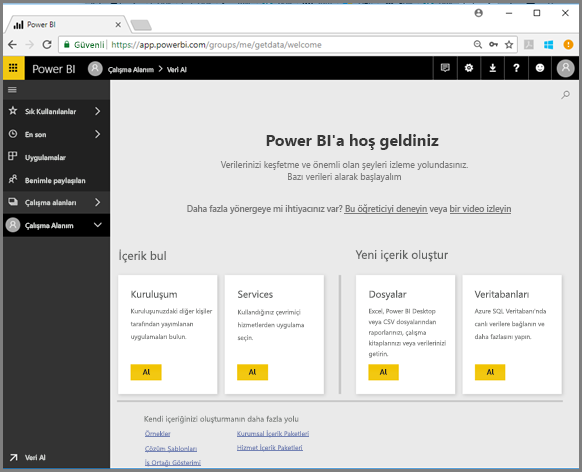

2. **Perakende Analizi Örneği > Bağlan** seçeneğini belirleyin.

    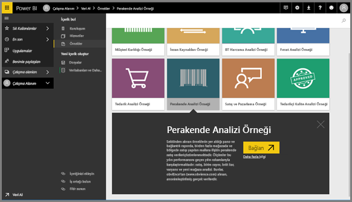

    Power BI hizmeti, örneği içeri aktarır ve panoyu görüntüler. Power BI hizmetini Power BI Desktop’tan ayıran şey panolardır. Örnekte, daha sonra ziyaret edeceğimiz bir rapor ve veri kümesi de yer alır.

    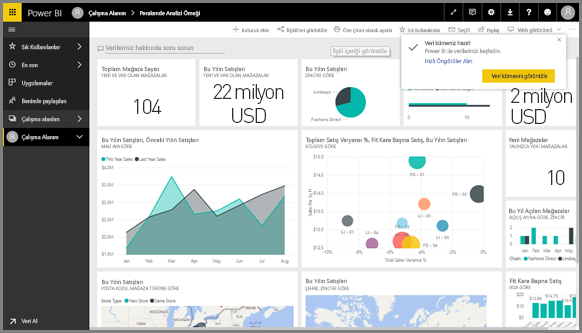

Amanda’nın Power BI hizmeti gezinme deneyimindeki turunu izleyin.  Ardından kendi başınıza keşfetmek için videonun altında bulunan adım adım yönergeleri uygulayın.

<iframe width="560" height="315" src="https://www.youtube.com/embed/G26dr2PsEpk" frameborder="0" allowfullscreen></iframe>

## İçerik (panolar, raporlar, çalışma kitapları, veri kümeleri, çalışma alanları, uygulamalar) görüntüleme
Temel içeriğin (panolar, raporlar, veri kümeleri ve çalışma kitapları) nasıl düzenlendiğine göz atarak başlayalım. İçerik bir çalışma alanı bağlamında görüntülenir. Bu noktada, **Çalışma Alanım** adında yalnızca bir çalışma alanınız vardır. Çalışma Alanım, size ait tüm içeriği depolar. Bunu kişisel koruma alanınız veya kendi içeriğinize yönelik bir çalışma alanı gibi düşünün. İş arkadaşlarınızla Çalışma Alanım'dan içerik paylaşabilirsiniz. Çalışma Alanım'da içeriğiniz 4 sekmede düzenlenmiştir: Panolar, Raporlar, Çalışma Kitapları ve Veri Kümeleri.

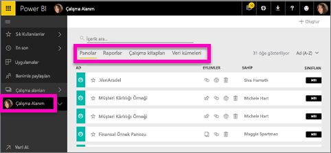

Sol gezinti bölmesinden bir çalışma alanı seçtiğinizde, ilişkili içerik (panolar, raporlar, çalışma kitapları ve veri kümeleri) için sekmeler Power BI tuvalinin sağ tarafını doldurur.

Yeni bir kullanıcıysanız yalnızca bir çalışma alanı görürsünüz: **Çalışma Alanım**.

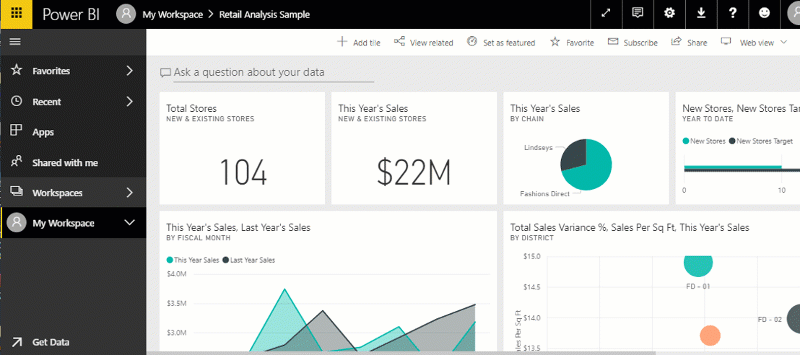

Bu sekmelerde (diğer adıyla *içerik görünümleri*), içerikle ilgili bilgileri ve söz konusu içerikle uygulayabileceğiniz işlemleri görürsünüz.  Örneğin, Panolar sekmesinden bir pano açabilir, paylaşabilir, silebilir, arama yapabilir, yeni içerik oluşturabilir, sıralama yapabilir ve daha fazlasını yapabilirsiniz.

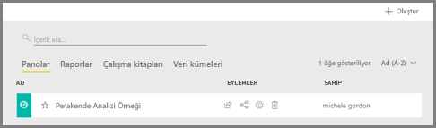

Pano adını seçerek panoyu açın.

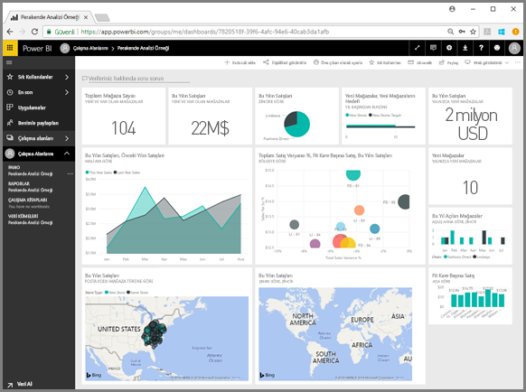

## Bir panoyu ve raporu sık kullanılanlara ekleme
**Sık Kullanılanlar** sizin için en önemli içeriklere hızlıca erişmenizi sağlar.  

1. Pano açıkken sağ üst köşeden **Sık kullanılanlara ekle** seçeneğini belirleyin.
   
   
   
   **Sık kullanılanlara ekle** seçeneği **Sık kullanılanlardan çıkar** olarak değişir ve yıldız simgesi sarı olur.
   
   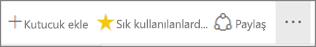

2. Sık kullanılanlara eklediğiniz tüm içeriklerin listesini görüntülemek için sol gezinti bölmesinde **Sık Kullanılanlar**'ın sağ tarafındaki oku seçin. Sol gezinti bölmesi Power BI hizmetinin kalıcı bir özelliği olduğundan, bu listeye Power BI hizmetindeki herhangi bir konumdan erişebilirsiniz.
   
    
   
    Şu ana kadar yalnızca bir sık kullanılan öğemiz var. Sık kullanılanlar; panolar, raporlar ve uygulamalar olabilir.  

1. Bir pano veya raporu sık kullanılanlara eklemenin başka bir yolu ise **Panolar** veya **Raporlar** çalışma sekmesini kullanmaktır.  **Raporlar** sekmesini açın ve rapor adının sol tarafındaki yıldız simgesini seçin.
   
   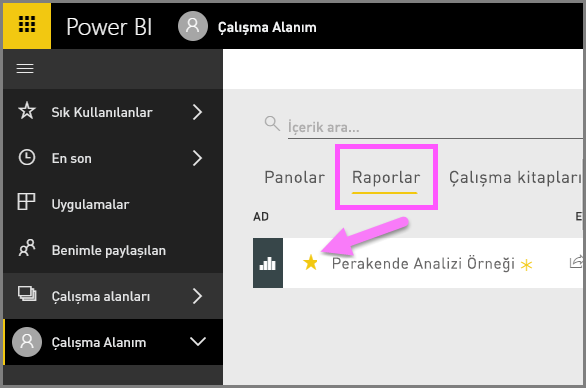

3. Sol gezinti bölmesinden **Sık Kullanılanlar**’ı seçerek veya yıldız simgesini  seçerek **Sık Kullanılanlar** *bölmesini* açın.
   
   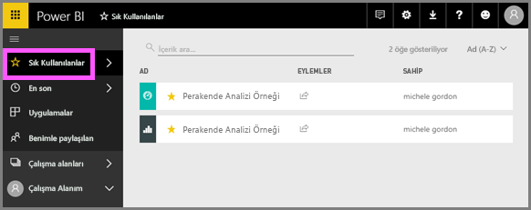
   
   Artık iki sık kullanılan öğeniz var: bir pano ve bir rapor. Buradan içerikleri açabilir, arayabilir, sık kullanılanlardan kaldırabilir veya iş arkadaşlarınızla paylaşabilirsiniz.

4. Rapor adını seçerek raporu rapor düzenleyicisinde açın.

    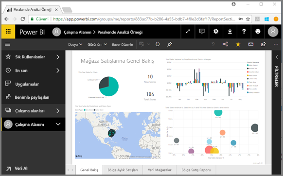

Daha fazla bilgi edinmek için bkz. [Sık Kullanılanlar](service-dashboard-favorite.md)

## En son içeriğinizi bulma

1. Sık Kullanılanlar bölmesine benzer şekilde, sol gezinti bölmesinde bulunan **En son** sekmesinin yanındaki oku seçerek Power BI hizmetinde en son eriştiğiniz içeriği hızlıca görebilirsiniz.

   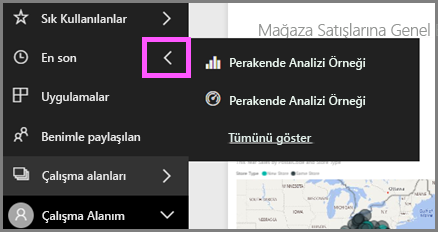

    Açılan menüden içeriği seçip açın.

2. Bazen son içeriği açmak istemezsiniz, ancak bilgileri görüntülemek veya paylaşma, Insights’ı çalıştırma veya Excel’e dışarı aktarma gibi başka bir işlem uygulamak istersiniz. Bu tür durumlarda **En son** seçeneğini belirleyerek veya sol gezinti bölmesinden simgesini seçerek **En son** bölmesini açın. Birden fazla çalışma alanınız varsa, tüm alanlarınızdaki içerikler bu listede yer alır.

   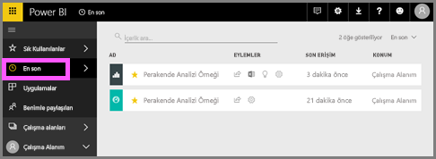

Daha fazla bilgi için bkz. [Power BI'da son görüntülenenler](service-recent.md)

### İçerikleri arama ve sıralama
İçerik görünümü, içeriğinizi aramayı, filtrelemeyi ve sıralamayı kolaylaştırır. Bir panoyu, raporu veya çalışma kitabını aramak için arama alanına yazın. Power BI, yalnızca adında arama dizenizi barındıran içeriği filtreler.

Yalnızca bir örneğiniz olduğundan, arama ve sıralama gerekli değildir.  Ancak panolar, raporlar, çalışma kitapları ve veri kümelerinden oluşan uzun listeleriniz olduğunda, arama ve sıralamayı son derece faydalı bulursunuz.

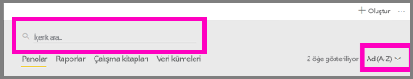

Ayrıca içeriği adına veya sahibine göre de sıralayabilirsiniz.  

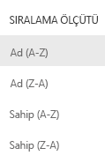

Daha fazla bilgi edinmek için bkz. [Power BI'da gezinti: arama, sıralama, filtreleme](service-navigation-search-filter-sort.md)

## Sonraki adımlar

> [!div class="nextstepaction"]
> [Power BI hizmetinde Okuma görünümü ve Düzenleme görünümü](./service-reading-view-and-editing-view.md)