# Power BI hizmetinde dolaşma

Power BI hizmetini bir süredir kullanıyorsanız kullanıcı arabiriminde önemli değişiklikler yaptığımızı fark etmişsinizdir.  Bu değişikliklerin birçoğu içeriğinizin (panolar, raporlar, veri kümeleri) düzenlenme biçimini ve söz konusu içerikle görev gerçekleştirmek için izlediğiniz yolları (tıklamalar) etkilemektedir. 

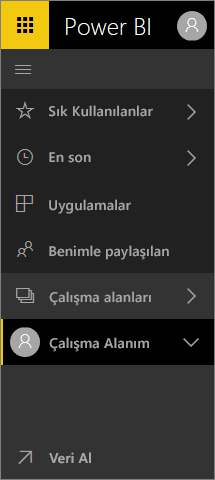

## Nasıl yaparım?
Bu başvuru kılavuzu, bir önceki Power BI hizmeti arabirimine aşina olan bir kullanıcı olarak yeni arabirimde işlemlerinizi gerçekleştirmeyi öğrenmenize yardımcı olur. Bunun başlangıçta kafa karıştırıcı olabileceğini anlıyoruz ancak kullandıkça yeni düzende zamandan tasarruf etmenizi sağlayacak çok sayıda avantaj keşfedeceğinizi düşünüyoruz. 

**Hızlı başvuru kılavuzu**

| Eylem | Yeni (geçerli) yol |
| --- | --- | --- |
| Bir panoyu sık kullanılanlara ekleme |Çalışma Alanı > Panolar bölümüne gidin ve yıldız simgesini seçerek sarıya dönüştürün |
| Sık kullanılan panolarınızın listesini görüntüleme |Sol gezinti bölmesinden **Sık Kullanılanlar**'ı seçin |
| En son ziyaret edilen panoların ve raporların listesini görüntüleme |Sol gezinti bölmesinden **Son görüntülenen** seçeneğini belirleyin |
| Sizinle paylaşılan panoların listesini görüntüleme |Sol gezinti bölmesinden **Benimle paylaşılan** seçeneğini belirleyin |
| Bir panoyu paylaşma |Panoyu açın ve **Paylaş** seçeneğini belirleyin veya bir uygulama oluşturup bu uygulamayı yayımlayın |
| Bir panoyu silme |Çalışma Alanım > Panolar > çöp kutusu simgesi |
| Bir raporu silme |Çalışma Alanım > Raporlar > çöp kutusu simgesi |
| Bir veri kümesini silme |Çalışma Alanım > Veri Kümeleri >... > Sil |
| Bir panoyu açma |Çalışma Alanım > Panolar bölümüne gidin ve panonun adını seçin |
| Bir raporu açma |Çalışma Alanım > Raporlar bölümüne gidin ve raporun adını seçin |
| Bir veri kümesini açma |Çalışma Alanım > Veri kümeleri bölümüne gidin ve veri kümesinin adını seçin |
| Pano oluşturma |Üst gezinti çubuğunda, Oluştur > Pano seçeneğini belirleyin |
| Rapor oluşturma |Üst gezinti çubuğunda, Oluştur > Rapor seçeneğini belirleyin |
| Veri kümesi oluşturma |Üst gezinti çubuğunda, Oluştur > Veri kümesi seçeneğini belirleyin |
| Uygulama oluşturma |Çalışma Alanı > Uygulama çalışma alanı oluşturma |
| Sahip olduğunuz tüm panoların, raporların ve veri kümelerinin listesini görüntüleme |Çalışma Alanı > Çalışma Alanım |

## Power BI hizmeti için gezinti deneyimini neden değiştirdik?
* Panolar, raporlar, çalışma kitapları ve veri kümeleri için listeler basitleştirildi    
* Sık kullanılanlar, son görüntülenenler ve çalışma alanı seçimi için hızlı erişim açılır menüleri eklendi    
* Panolar, raporlar ve veri kümeleri için ilgili içeriklerin tanımlanabileceği bir yöntem eklendi    
* Çalışma kitapları için ayrı bir içerik alanı eklendi    
* Sık kullanılan panolarınız için ayrı bir alan oluşturuldu    
* Sizinle paylaşılan içerik için ayrı bir alan oluşturuldu 
* Son görüntülenen içeriğiniz için ayrı bir alan oluşturuldu  
* Görevlerin gerçekleştirilmesi için gereken tıklama sayısı azaltıldı, içerik listeleri ve söz konusu içerikler üzerinde yapacağınız işlemler aynı ekranda birleştirildi. Örneğin, panolar ve raporlar arasında geçiş.</td></tr></table>

Amanda'nın iyileştirmeleri açıkladığı ve gösterdiği yeni gezinti deneyimi turunu izleyin.  Ardından kendi başınıza keşfetmek için videonun altında bulunan adım adım yönergeleri uygulayın.

<iframe width="560" height="315" src="https://www.youtube.com/embed/G26dr2PsEpk" frameborder="0" allowfullscreen></iframe>

## Yepyeni bazı özellikler ekledik
Kendi başınıza keşfetmek için adım adım yönergeleri uygulayın.

### İçerik (panolar, raporlar, çalışma kitapları, veri kümeleri, çalışma alanları, uygulamalar) görüntüleme
Temel içeriğin (panolar, raporlar, veri kümeleri ve çalışma kitapları) nasıl düzenlendiğine göz atarak başlayalım. Daha önce tüm içeriğiniz sol gezinti bölmesinde listeleniyordu. Bu seçeneğe hâlâ sahip olsanız da artık varsayılan ayar, çalışma alanı bağlamında içerik türüne göre görüntülemedir. Sol gezinti bölmesinden bir çalışma alanı seçtiğinizde, ilişkili içerik (panolar, raporlar, çalışma kitapları ve veri kümeleri) için sekmeler Power BI tuvalinin sağ tarafını doldurur.

Ücretsiz Power BI sürümünü kullanıyorsanız yalnızca bir çalışma alanı görürsünüz: **Çalışma Alanım**.

### Sık kullanılan panolar
**Sık Kullanılanlar** sizin için en önemli panolara hızlıca erişmenizi sağlar.  

1. Pano açıkken sağ üst köşeden **Sık kullanılanlara ekle** seçeneğini belirleyin.
   
   
   
   **Sık kullanılanlara ekle** seçeneği **Sık kullanılanlardan çıkar** olarak değişir ve yıldız simgesi sarı olur.
   
   
2. Sık kullanılan olarak eklediğiniz tüm panoların listesini görüntülemek için sol gezinti bölmesinde **Sık Kullanılanlar**'ın sağ tarafındaki oku seçin. Sol gezinti bölmesi Power BI hizmetinin kalıcı bir özelliği olduğundan, bu listeye Power BI hizmetindeki herhangi bir konumdan erişebilirsiniz.
   
    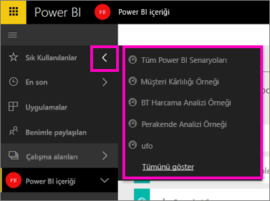
   
    Buradan bir panoyu seçerek açabilirsiniz.
3. Sol gezinti bölmesindeki **Sık Kullanılanlar** bölmesini açmak için **Sık Kullanılanlar** seçeneğini belirleyin veya Sık Kullanılanlar simgesini  seçin.
   
   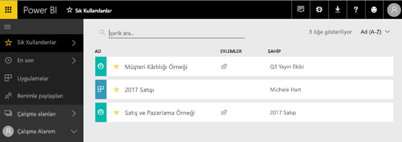
   
   Buradan açmak istediğiniz panoyu seçebilir, bir panonun sahibinin kim olduğunu görebilir, bir panoyu sık kullanılanlardan çıkarabilir veya panoyu iş arkadaşlarınızla paylaşabilirsiniz.
4. Bir panoyu sık kullanılan olarak kaydetmenin diğer bir yolu da **Panolar** sekmesini kullanmaktır.  Panoyu içeren çalışma alanını açıp pano adının sol tarafındaki yıldız simgesini seçmeniz yeterlidir.
   
   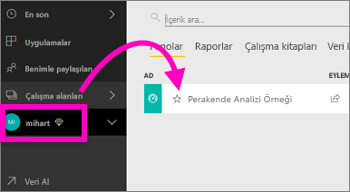

Daha fazla bilgi edinmek için bkz. [Bir panoyu sık kullanılanlara ekleme](service-dashboard-favorite.md)

### Son görüntülenen
**Son görüntülenen** bölmesine giderek, en son eriştiğiniz raporlara ve panolara hızlıca ulaşabilirsiniz. Buna tüm çalışma alanlarınızdaki içerikler de dahildir.

  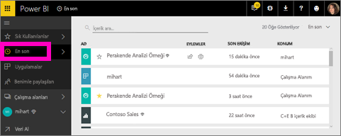

Sık Kullanılanlar bölmesine benzer şekilde son görüntülenenlerinize de Power BI hizmetindeki sol gezinti bölmesinde bulunan **Son görüntülenen** sekmesinin yanındaki oku seçerek hızlıca erişebilirsiniz.

  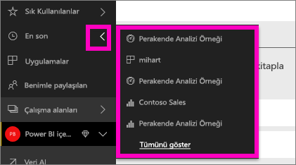

Daha fazla bilgi için bkz. [Power BI'da son görüntülenenler](service-recent.md)

### Uygulamalar
Uygulama, tüm ana ölçümler tek bir yerde sunulacak şekilde tasarlanmış, panolardan ve raporlardan oluşan bir koleksiyonudur. Kuruluşunuz dahilinde uygulamalarınız ve Google Analytics, Microsoft Dynamics CRM gibi [dış hizmetler için uygulamalarınız](service-connect-to-services.md) olabilir. 

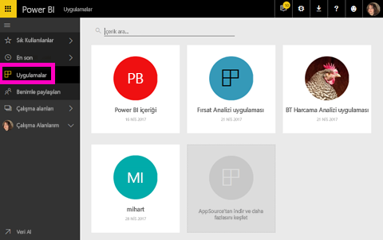

Daha fazla bilgi edinmek için bkz. **Uygulama çalışma alanları** (aşağıda) ve [Power BI'da uygulamalar ne anlama gelir?](service-install-use-apps.md).

### Benimle paylaşılan
**Benimle paylaşılan**, iş arkadaşlarınızın sizinle paylaştığı tüm panoların bulunduğu konumdur.  Pano sahibine göre filtreleyin, ilgili içeriği bulmak için arama alanını kullanın ve öğeleri tarihe göre sıralayın.  Sıklıkla ziyaret ettiğiniz paylaşılan bir içeriği doğrudan **Benimle paylaşılan** görünümünde sık kullanılanlara eklemek daha da kolaydır.

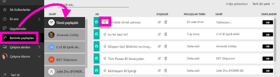

Daha fazla bilgi edinmek için bkz. [Benimle paylaşılan](service-shared-with-me.md)

### Çalışma alanlarını kullanma
Sol gezinti bölmesinde bir sonraki bölüm *çalışma alanlarıdır*. Çalışma alanları, Power BI içeriğine ilişkin *kapsayıcılar* olarak düşünülebilir. İki adet çalışma alanı türü vardır: **Çalışma Alanım** ve Uygulama çalışma alanları.

Bir uygulama çalışma alanının üyesi veya yönetici değilseniz sol gezinti bölmesinde uygulama çalışma alanı göremeyebilirsiniz. Ayrıca Ücretsiz Power BI sürümünü kullanıyorsanız herhangi bir uygulama çalışma alanı görmezsiniz.

#### Çalışma Alanım
**Çalışma Alanım** size ait tüm içeriği depolar. Bunu kişisel koruma alanınız veya kendi içeriğinize yönelik bir çalışma alanı gibi düşünün. İş arkadaşlarınızla Çalışma Alanım'dan içerik paylaşabilirsiniz. Çalışma Alanım'da içeriğiniz 4 sekmede düzenlenmiştir: Panolar, Raporlar, Çalışma Kitapları ve Veri Kümeleri.

#### Uygulama çalışma alanları
Uygulamalar ve uygulama çalışma alanları Power BI Pro özelliğidir. Diğerleri için pano ve rapor oluşturacaksanız bunu yapmak için uygulama çalışma alanlarını kullanırsınız. Uygulama çalışma alanı, uygulama oluşturduğunuz yerdir; uygulama oluşturmak için önce uygulama çalışma alanını oluşturmanız gerekir. Grup çalışma alanlarında gelişim sağlanan noktalar uygulamadaki içeriğe yönelik hazırlama alanları ve kapsayıcılardır.  İş arkadaşlarınızla panolar, raporlar ve daha geniş bir kitleye, hatta tüm kuruluşunuza dağıtmayı planladığınız diğer içerikler üzerinde işbirliği yapabilirsiniz.

Daha fazla bilgi edinmek için bkz. [Power BI'da uygulama oluşturma ve dağıtma](service-create-distribute-apps.md#app-workspaces).

**Çalışma Alanım**'da olduğu gibi içeriğiniz burada da 4 sekmede düzenlenmiştir: Panolar, Raporlar, Çalışma Kitapları ve Veri Kümeleri.

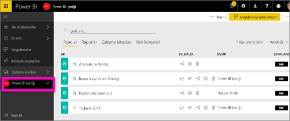

Sol gezinti bölmesinden **Çalışma Alanı** seçeneğini belirleyerek çalışma alanları arasında geçiş yapabilirsiniz.

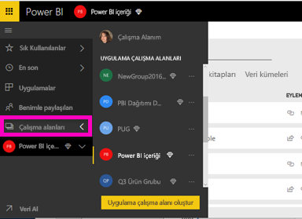

### İçerikleri arama ve sıralama
Yeni içerik görünümü, içeriğinizi aramayı, filtrelemeyi ve sıralamayı kolaylaştırır. Bir panoyu, raporu veya çalışma kitabını aramak için arama alanına yazın. Power BI, yalnızca adında arama dizenizi barındıran içeriği filtreler.

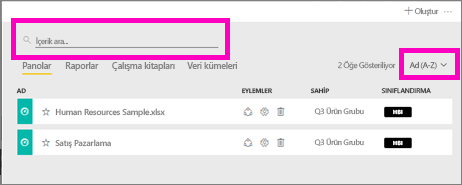

Ayrıca içeriği adına veya sahibine göre de sıralayabilirsiniz.  

Daha fazla bilgi edinmek için bkz. [Power BI'da gezinti: arama, sıralama, filtreleme](service-navigation-search-filter-sort.md)

## Sonraki adımlar
Sorularınız veya geri bildiriminiz mi var? [Power BI topluluk forumunu ziyaret edin](http://community.powerbi.com/t5/Navigation-Preview-Forum/bd-p/NavigationPreview)

