# Power BI'da rapor düzenleyicisi turu

Power BI hizmetindeki *rapor düzenleyicisi* ile Power BI Desktop uygulamasındaki rapor düzenleyicisi benzer özelliklere sahiptir. Genellikle başlangıç olarak Power BI Desktop'ta raporları oluşturursunuz. Ardından bunları Power BI hizmetine yayımlarsınız ve burada raporlarda değişiklik yapmaya devam edebilirsiniz. Raporlarınızı temel alan panoları da Power BI hizmetinde oluşturursunuz.

Panolarınızla raporlarınızı oluşturduktan sonra, bunları rapor tüketicilerinize dağıtırsınız. Nasıl paylaştığınıza bağlı olarak son kullanıcılarınız bunlarla Power BI hizmetinde Okuma görünümünde etkileşimli çalışabilir ama bunları düzenleyemez. [Power BI hizmetinde rapor kullanıcılarının yapabilecekleri](consumer/end-user-reading-view.md) hakkında daha fazla bilgi edinin. 

Bu videoda, Power BI Desktop'taki rapor düzenleyicisi gösterilir. Bu makalede Power BI hizmetindeki rapor düzenleyicisi gösterilir. 

<iframe width="560" height="315" src="https://www.youtube.com/embed/IkJda4O7oGs" frameborder="0" allowfullscreen></iframe>

Power BI hizmetinde rapor düzenleyicisi yalnızca Düzenleme Görünümünde kullanılabilir. Raporu Düzenleme görünümünde açmak için raporun sahibi, raporu oluşturan kişi veya raporun barındırıldığı uygulama çalışma alanına katkıda bulunan bir kullanıcı olmalısınız.

Power BI rapor düzenleyicisinin üç bölümü vardır:  

1. **Alanlar**, **Görsel Öğeler** ve **Filtreler** bölmeleri
2. üst gezinti çubukları    
3. rapor tuvali     

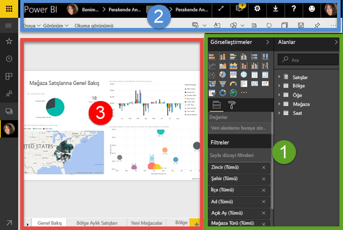

## 1. Rapor düzenleyicisi bölmeleri
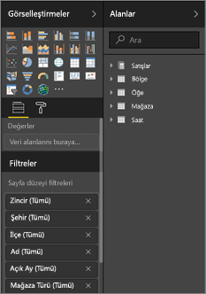

Raporu ilk kez açtığınızda üç bölme görünür: Görsel Öğeler, Filtreler ve Alanlar. Sol taraftaki Görsel Öğeler ve Filtreler bölmeleri görselleştirmeler üzerinde tür, renk, filtreleme ve biçimlendirme gibi denetimler gerçekleştirmenizi sağlar.  Sağ taraftaki Alanlar bölmesi ise görselleştirmelerde kullanılan bağlantılı verileri yönetir. 

Rapor düzenleyicisinde görüntülenen içerik, rapor tuvalinde yaptığınız seçimlere göre değişiklik gösterir.  Örneğin, tek bir görsel seçtiğinizde:

|  |  |
| --- | --- |
| 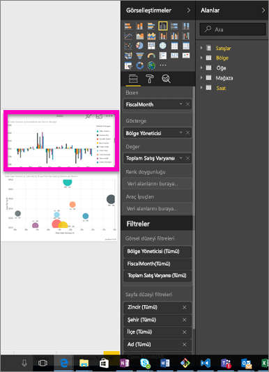 |<ul><li>Görsel Öğeler bölmesinin en üst kısmında, kullanılan görselin türü görüntülenir. Bu örnekte, Kümelenmiş sütun grafik kullanılmaktadır.  </li> <li>Görsel Öğeler bölmesinin en altında (sayfayı kaydırmanız gerekebilir), görselde kullanılan alanlar görüntülenir. Bu grafikte FiscalMonth, DistrictManager ve Total Sales Variance alanları kullanılmaktadır.   </li><li>Filtreler bölmesinde (sayfayı kaydırmanız gerekebilir), uygulanmış olan filtreler görüntülenir.   </li><li>Alanlar bölmesinde, kullanılabilir tablolar listelenir ve bir tablonun adını genişlettiğinizde tablonun içerdiği alanlar görüntülenir. Sarı renkli yazı tipi, tablodaki alanlardan en az birinin görselleştirmede kullanıldığını belirtir.  </li><li>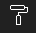 Seçilen görselleştirmeye ilişkin biçimlendirme bölmesini görüntülemek için boya rulosu simgesini seçin.  </li><li> Analiz bölmesini görüntülemek için büyüteç simgesini seçin.</ul> |

## Görsel Öğeler bölmesi

Görselleştirme türünü buradan seçebilirsiniz. Küçük resimlere *şablon* adı verilir. Yukarıdaki görüntüde, Kümelenmiş çubuk grafik seçilmiştir. Görselleştirme türü seçmeden alan seçerek bir görselleştirme oluşturmaya başlarsanız Power BI, görselleştirme türünü sizin yerinize belirler. Power BI tarafından yapılan seçimi tutabilir veya farklı bir şablonu seçerek türü değiştirebilirsiniz. Verilerinize en uygun görselleştirme türünü bulmak için istediğiniz kadar değişiklik yapabilirsiniz.

### Görselinizdeki alanları yönetme
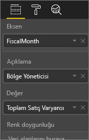

Bu bölmede gösterilen demetler (bazen *kutu* olarak da adlandırılır) seçtiğiniz görselleştirme türüne göre değişiklik gösterir.  Örneğin, bir çubuk grafik seçerseniz şu demetleri görürsünüz: Değerler, Eksen ve Gösterge. Bir alanı seçtiğinizde veya tuvale sürüklediğinizde Power BI, ilgili alanı demetlerden birine ekler.  Dilerseniz Alanlar listesindeki alanları doğrudan demetlerin içine sürükleyebilirsiniz.  Bazı demetler yalnızca belirli veri türlerinde kullanılabilir.  Örneğin, **Değerler** demeti, sayısal olmayan alanlarla kullanılamaz. **employeename** alanını **Değerler** demetine sürüklerseniz Power BI bunu **count of employeename** olarak değiştirir.

### Alanları kaldırma
Görselleştirmedeki bir alanı kaldırmak için alan adının sağ tarafında bulunan **X** simgesini seçin.

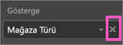

Daha fazla bilgi için bkz. [Bir Power BI raporuna görselleştirme ekleme](visuals/power-bi-report-add-visualizations-i.md)

### Görsellerinizi biçimlendirme
Biçimlendirme bölmesini açmak için boya rulosu simgesini seçin. Kullanılabilir seçenekler, seçtiğiniz görselleştirme türüne göre değişiklik gösterir.

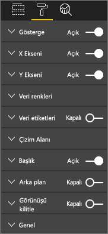

Biçimlendirme seçenekleri neredeyse sonsuzdur.  Daha fazla bilgi edinmek için kendiniz keşfedin veya şu makaleleri ziyaret edin:

* [Görselleştirme başlığını, arka planını ve göstergesini özelleştirme](visuals/power-bi-visualization-customize-title-background-and-legend.md)
* [Renk biçimlendirme](visuals/service-getting-started-with-color-formatting-and-axis-properties.md)
* [X ve Y ekseni özelliklerini özelleştirme](visuals/power-bi-visualization-customize-x-axis-and-y-axis.md)

### Görselleştirmelerinize analiz ekleme
Analiz bölmesini görüntülemek için büyüteç simgesini seçin. Kullanılabilir seçenekler, seçtiğiniz görselleştirme türüne göre değişiklik gösterir.

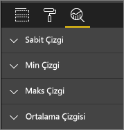    
Power BI hizmetindeki Analiz bölmesini kullanarak görselleştirmelere dinamik başvuru çizgileri ekleyebilir ve önemli eğilimlere veya içgörülere odaklanılmasını sağlayabilirsiniz. Daha fazla bilgi için bkz. [Power BI hizmetindeki Analiz bölmesi](service-analytics-pane.md) veya [Power BI Desktop'taki Analiz bölmesi](desktop-analytics-pane.md).

- - -
## Filtreler bölmesi
Raporunuzda sayfa, rapor, detaylandırma ve görsel öğe düzeyinde kalıcı filtreler görüntülemek, ayarlamak ve değiştirmek için Filtreler bölmesini kullanın. Evet, görsellerin öğelerini seçerek ya da dilimleyici gibi araçlar kullanarak rapor sayfalarında ve görsel öğelerde geçici filtreleme yapabilirsiniz, ancak Filtreler bölmesi kullanıldığında filtrelerin durumu raporla birlikte kaydedilir. 

Filtreler bölmesinin bir diğer güçlü özelliği: ***Şu anda raporunuzda görsel öğelerden biri tarafından kullanılmayan*** bir alan kullanarak filtreleme olanağı. Biraz açıklayayım. Bir rapor sayfası oluşturduğunuzda Power BI, görsel öğelerinizde kullandığınız tüm alanları, Filtreler bölmesinin Görsel düzey filtreleri alanına otomatik olarak ekler.  Ancak, o anda bir görsel öğede kullanılmayan bir alanı kullanarak görsel öğe, sayfa, detaylandırma veya rapor filtresi ayarlamak istiyorsanız, ilgili öğeyi Filtreler demetlerinden birine sürüklemeniz yeterlidir.   

Daha fazla bilgi için bkz. [Bir rapora filtre ekleme](power-bi-report-add-filter.md).

Yeni bir filtre deneyimi şu an önizleme aşamasında kullanıma sunulmuştur. Yeni filtrelerde bunları raporun kendisine benzeyecek şekilde biçimlendirebilirsiniz. Ayrıca filtreleri kilitleyebilir veya rapor tüketicilerinden gizleyebilirsiniz. 

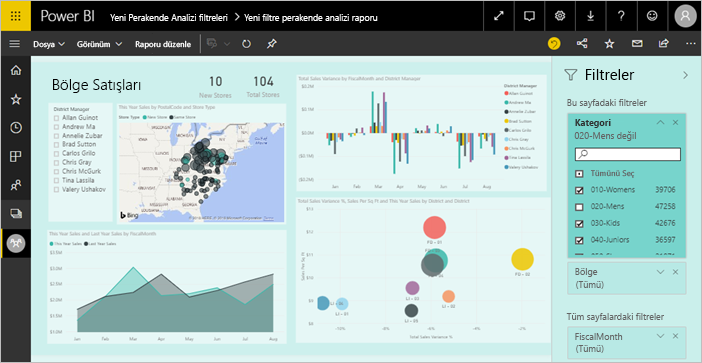

[Yeni filtre deneyimi](power-bi-report-filter-preview.md) hakkında daha fazla bilgi edinin.

- - -
## Alanlar bölmesi
Alanlar bölmesinde, verilerinizde bulunan ve görselleştirme oluşturmak için kullanabileceğiniz tablolar ve alanlar görüntülenir.

|  |  |
| --- | --- |
| 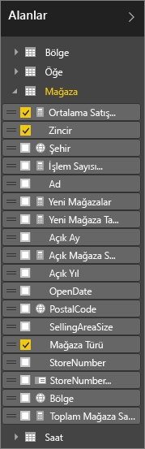 |<ul><li>Yeni bir görselleştirme başlatmak için alanlardan birini sayfaya sürükleyin.  Dilerseniz bir alanı, var olan bir görselleştirmenin üzerine sürükleyerek görselleştirmeye ekleyebilirsiniz.  </li> <li>Bir alanın yanındaki onay kutusunu işaretlediğinizde Power BI, ilgili alanı etkin (veya yeni) görselleştirmeye ekler. Ayrıca söz konusu alanın yerleştirileceği demeti de belirler.  Örneğin, eklediğiniz alan bir açıklama, eksen veya değer olabilir. Power BI en iyi tahmini yapar ve gerekirse söz konusu alanı, belirlenen demetten bir başkasına taşıyabilirsiniz.   </li><li>Her iki durumda da seçili alanlar, rapor düzenleyicisindeki Görsel Öğeler bölmesine eklenir.</li></ul> |

**NOT**: Power BI Desktop uygulamasını kullanıyorsanız alanları gösterme/gizleme ve hesaplama ekleme gibi seçeneklere de sahip olursunuz.

### Alan simgeleri ne anlama gelir?
**∑ Toplamlar** Toplam, toplaması yapılacak veya ortalaması alınacak bir sayısal değerdir. Toplamlar, verilerle (raporunuzun temel aldığı veri modelinde tanımlanan) birlikte içeri aktarılır.
Daha fazla bilgi için bkz. [Power BI raporlarındaki toplamlar](service-aggregates.md).

 **Hesaplanan ölçüler (hesaplanan alanlar olarak da adlandırılır)**  
Her hesaplanan alanın kendi sabit kodlanmış formülü vardır. Hesaplama türünü değiştiremezsiniz. Örneğin, tür toplam olarak ayarlanmışsa bu şekilde olarak kalır. Daha fazla bilgi için bkz. [Ölçüleri anlama](desktop-measures.md)

 **Benzersiz alanlar**  
Bu simgeye sahip alanlar Excel'den aktarılmıştır ve yinelenen değerlere sahip olsalar bile tüm değerleri gösterecek şekilde ayarlanmıştır. Örneğin, verilerinizde "Can Kaya" adlı iki kişinin kaydı olabilir ve bu değerler benzersiz kabul edilir, toplama yapılmaz.  

** Coğrafya alanları**  
Konum alanları kullanılarak harita görselleştirmeleri oluşturulabilir. 

**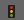 Hiyerarşi**  
Hiyerarşiyi oluşturan alanları göstermek için oku seçin. 

## 2. Üst gezinti çubuğu
Üst gezinti çubuğundan birçok farklı eylem gerçekleştirilebilir ve sürekli olarak bu eylemlere yenileri eklenmektedir. Belirli bir eylem hakkında bilgi almak için Power BI Belgeleri İçindekiler Tablosunu veya Arama kutusunu kullanın.

## 3. Rapor tuvali
Rapor tuvali, çalışmanızın görüntülendiği yerdir. Alanlar, Filtreler ve Görsel Öğeler bölmelerini kullanarak oluşturduğunuz görseller rapor tuvalinizde oluşturulur ve görüntülenir. Tuvalin en alt bölümündeki her sekme raporun bir sayfasına karşılık gelir. Açmak istediğiniz sayfaya ait sekmeyi seçebilirsiniz. 

## Sonraki adımlar
[Rapor oluşturma](service-report-create-new.md)

[Power BI hizmeti](service-report-create-new.md), [Power BI Desktop](desktop-report-view.md) ve [Power BI mobil uygulamalarında](consumer/mobile/mobile-apps-view-phone-report.md) raporlar hakkında daha fazla bilgi.

[Power BI tasarımcıları için temel kavramlar](service-basic-concepts.md)

Başka bir sorunuz mu var? [Power BI Topluluğu'na başvurun](http://community.powerbi.com/)

