# Öğretici: Power BI’da Makine Öğrenmesi modeli oluşturma

Bu öğretici makalesinde **Otomatik Makine Öğrenmesi** kullanarak Power BI’da bir ikili tahmin modeli oluşturacak ve uygulayacaksınız. Öğretici, bir Power BI veri akışı oluşturmaya ve veri akışında tanımlanan varlıkları kullanarak doğrudan Power BI’da bir makine öğrenmesi modelini eğitme ve doğrulamaya yönelik kılavuz bilgilerini içerir. Daha sonra tahminler oluşturmak üzere bu modeli yeni verileri puanlamak için kullanırız.

İlk olarak, İnternette alışveriş yapan tüketicilerin satın alma amacını bir dizi çevrimiçi oturum özniteliğine göre tahmin etmek üzere bir İkili Tahmin makine öğrenmesi modeli oluşturacaksınız. Bu alıştırma için bir referans makine öğrenmesi veri kümesi kullanılmaktadır. Model eğitildikten sonra Power BI, model sonuçlarını açıklayan bir doğrulama raporunu otomatik olarak oluşturur. Daha sonra doğrulama raporunu gözden geçirip puanlama için modeli verilerinize uygulayabilirsiniz.

Bu öğretici aşağıdaki adımlardan oluşur:
> [!div class="checklist"]

> * Giriş verileriyle veri akışı oluşturma
> * Makine öğrenmesi modeli oluşturma ve eğitme
> * Model doğrulama raporunu gözden geçirme
> * Modeli bir veri akışı varlığına uygulama
> * Modeldeki puanlanmış çıkışı bir Power BI raporunda kullanma

## Giriş verileriyle veri akışı oluşturma

Bu öğreticinin ilk kısmında giriş verileriyle bir veri akışı oluşturulacaktır. Bu işlem için, veri almayla başlayarak aşağıdaki bölümlerde gösterildiği gibi birkaç adım gerekir.

### Veri al

Veri akışı oluşturmanın ilk adımı, veri kaynaklarınızı hazır hale getirmektir. Bu örnekte, bazıları satın almayla sonuçlanmış birkaç çevrimiçi oturumdaki makine öğrenmesi veri kümesini kullanacağız. Veri kümesi, bu oturumlarla ilgili olarak modelimizi eğitmek için kullanacağımız bir dizi öznitelik içerir.

Veri kümesini UC Irvine web sitesinden indirebilirsiniz. Bu öğretici için aşağıdaki bağlantıdan şu dosyaya da ulaşabilirsiniz: [online_shoppers_intention.csv](https://raw.githubusercontent.com/santoshc1/PowerBI-AI-samples/master/Tutorial_AutomatedML/online_shoppers_intention.csv).

### Varlıkları oluşturma

Veri akışınızda varlıkları oluşturmak için, Power BI hizmetinde oturum açın ve yapay zekanın etkinleştirildiği ayrılmış kapasitenizdeki çalışma alanına gidin.

Henüz çalışma alanınız yoksa, Power BI hizmetinin sol gezinti menüsünde **Çalışma Alanları**'nı ve sonra görüntülenen panelin altındaki **Çalışma alanı oluştur**'u seçerek bir çalışma alanı oluşturabilirsiniz. Sağ tarafta, çalışma alanı ayrıntılarını girebileceğiniz bir panel açılır. Bir çalışma alanı adı girin ve **Gelişmiş**'i seçin. Radyo düğmesini kullanarak çalışma alanının Ayrılmış Kapasite kullandığını ve yapay zeka önizlemesi açık olan bir ayrılmış kapasite örneğine atandığını doğrulayın. Sonra **Kaydet**'i seçin.

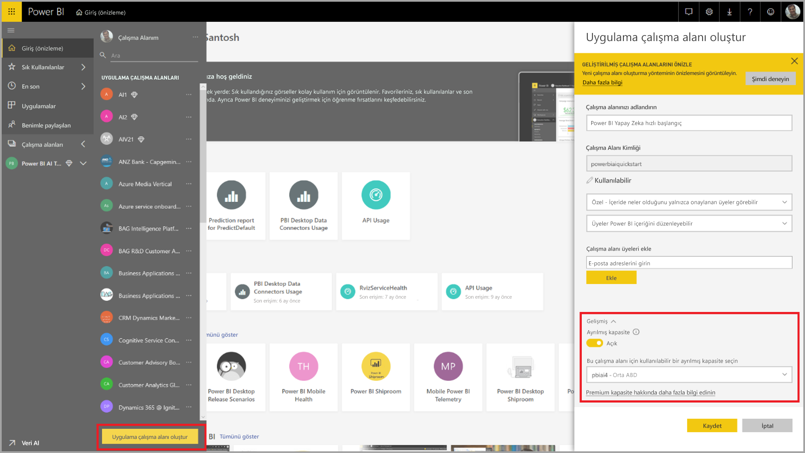

Çalışma alanı oluşturulduktan sonra, aşağıdaki görüntüde gösterildiği gibi Hoş Geldiniz ekranının sağ alt kısmındaki **Atla**'yı seçebilirsiniz.

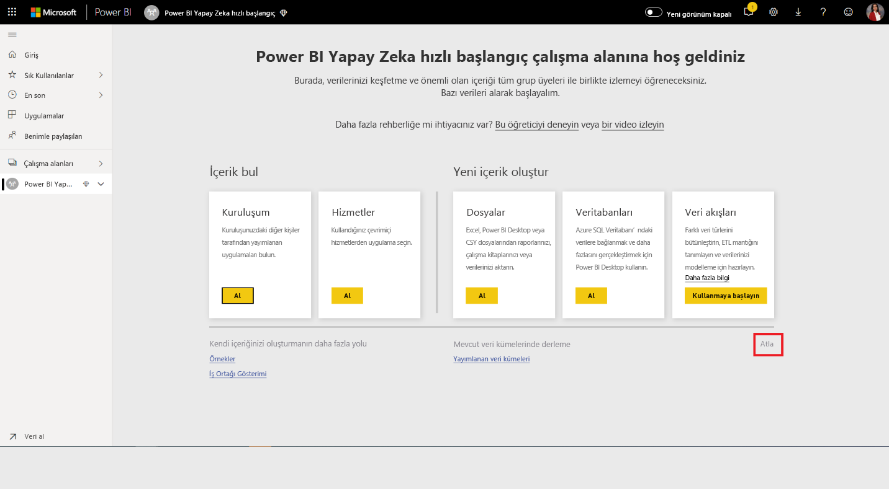

 Çalışma alanının sağ üst kısmındaki **Oluştur** düğmesini ve sonra **Veri akışı**'nı seçin.

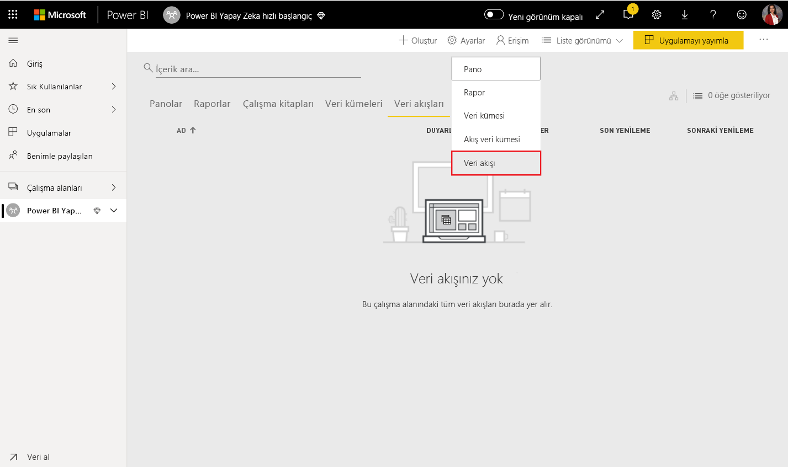

**Yeni varlıklar ekle**'yi seçin. Bu işlem tarayıcıda **Power Query** düzenleyicisini başlatır.

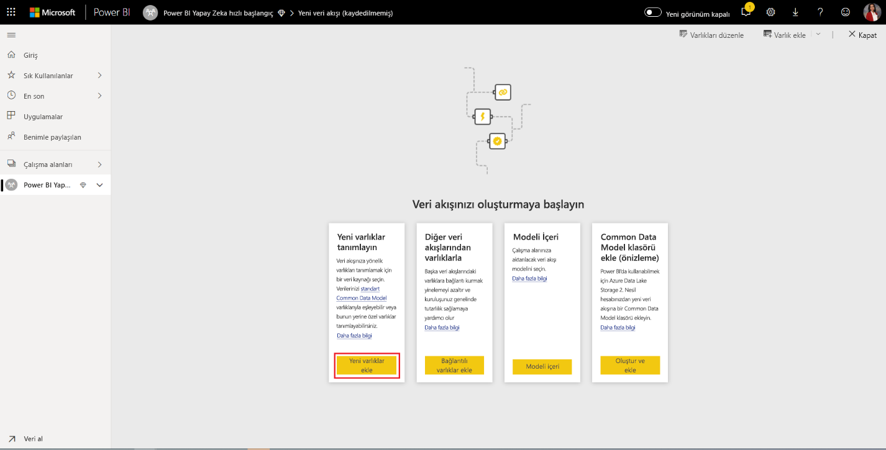

Aşağıdaki görüntüde gösterilen **Metin/CSV Dosyası**’nı veri kaynağı olarak seçin.

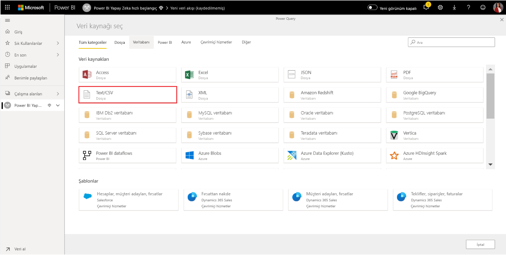

Daha sonra görüntülenen **Veri kaynağı sayfasına bağlan** menüsünde, aşağıdaki _online_shoppers_intention.csv_ bağlantısını **Dosya yolu veya URL** kutusuna yapıştırın ve sonra **İleri**’yi seçin.

`https://raw.githubusercontent.com/santoshc1/PowerBI-AI-samples/master/Tutorial_AutomatedML/online_shoppers_intention.csv`

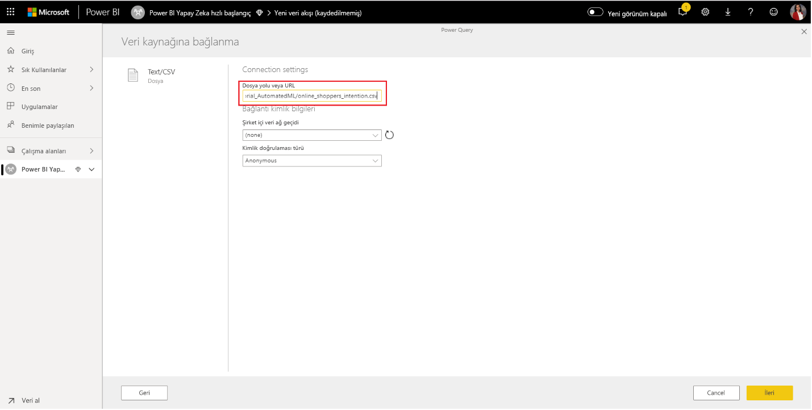

Power Query Düzenleyicisi CSV dosyasındaki verilerin önizlemesini gösterir. Sağ bölmedeki Ad kutusunun değerini değiştirerek sorguya daha kolay bir ad verebilirsiniz. Örneğin, Sorgu adını _Çevrimiçi Ziyaretçiler_ olarak değiştirebilirsiniz.

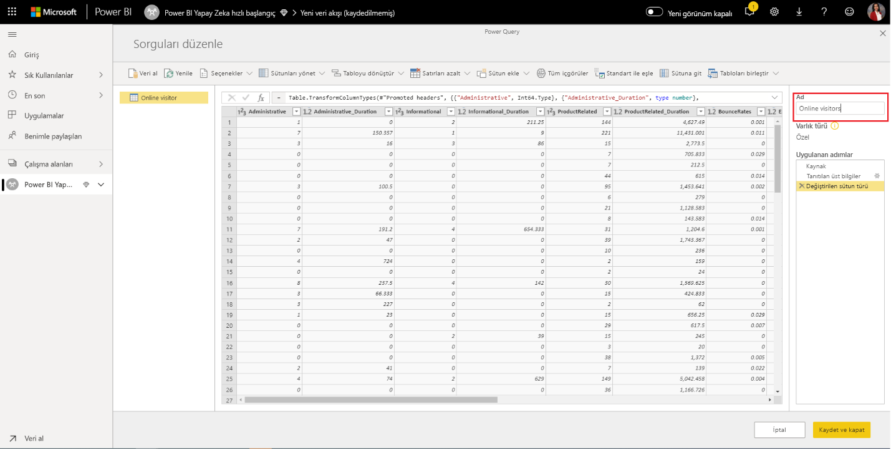

Power Query sütun türlerini otomatik olarak anlar. Sütun üst bilgisinin üstündeki öznitelik türü simgesine tıklayarak sütun türünü değiştirebilirsiniz. Bu örnekte Revenue sütununun türünü True/False olarak değiştireceğiz.

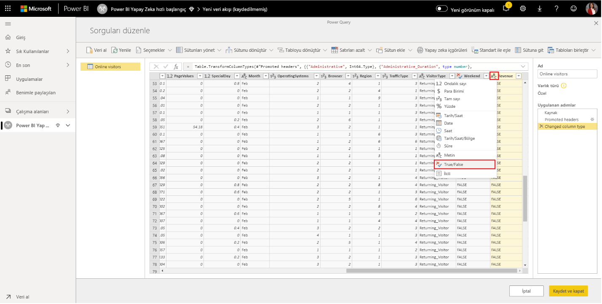

**Kaydet ve Kapat** düğmesini seçerek Power Query Düzenleyicisi'ni kapatın. Aşağıdaki görüntüde gösterildiği gibi, veri akışı için bir ad sağlayın ve sonra iletişim kutusunda **Kaydet**’i seçin.

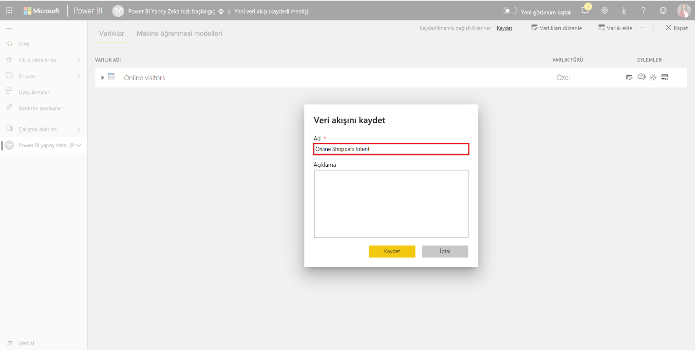

## Makine öğrenmesi modeli oluşturma ve eğitme

Bir makine öğrenmesi modeli eklemek için, eğitim verilerinizi ve etiket bilgilerini içeren temel varlığın **Eylemler** listesindeki **ML modeli uygula** düğmesini seçin ve sonra **Makine öğrenmesi modeli ekle**’yi seçin.

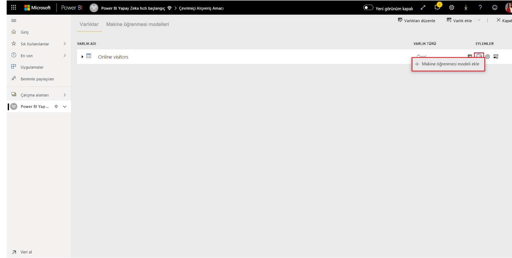

Makine öğrenmesi modelimizi oluşturmanın ilk adımı, tahmin etmek istediğiniz sonuç alanını içeren geçmiş verileri tanımlamaktır. Model, bu verilerden öğrenilerek oluşturulacaktır.

Kullandığımız veri kümesi söz konusu olduğunda burası **Revenue** alanıdır. 'Sonuç alanı' için **Revenue** değerini ve sonra **İleri**’yi seçin.

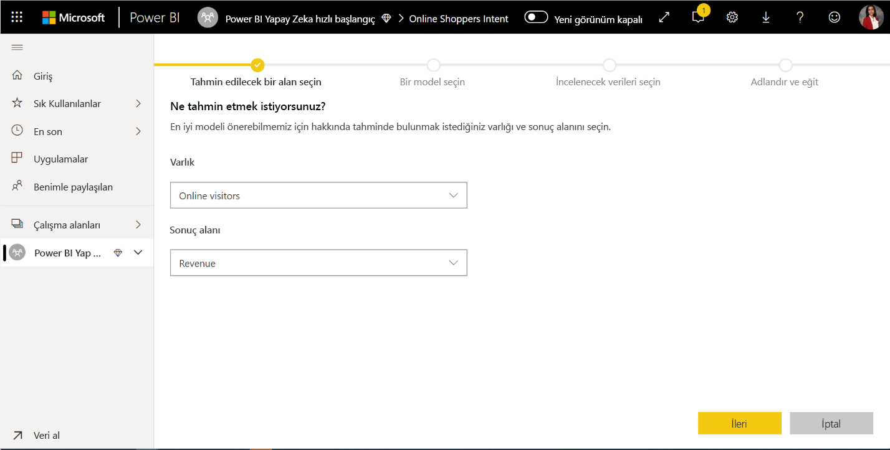

Bundan sonra, oluşturulacak makine öğrenmesi modelinin türünü seçmemiz gerekir. Power BI, belirlediğiniz sonuç alanındaki değerleri analiz eder ve bu alanı tahmin etmek için oluşturulabilecek makine öğrenmesi modellerinin türlerini önerir.

Bu örnekte bir kullanıcının satın alıp almayacağına ilişkin ikili sonucu tahmin edeceğimiz için İkili Tahmin önerilir. Satın alacak kullanıcıları tahmin etmek istediğimiz için en çok ilgilendiğiniz Gelir sonucu olarak True değerini seçin. Ayrıca, model doğrulama sonuçlarını özetleyecek otomatik olarak oluşturulan raporda kullanılacak sonuçlar için kolay etiketler sağlayabilirsiniz. Ardından İleri’yi seçin.

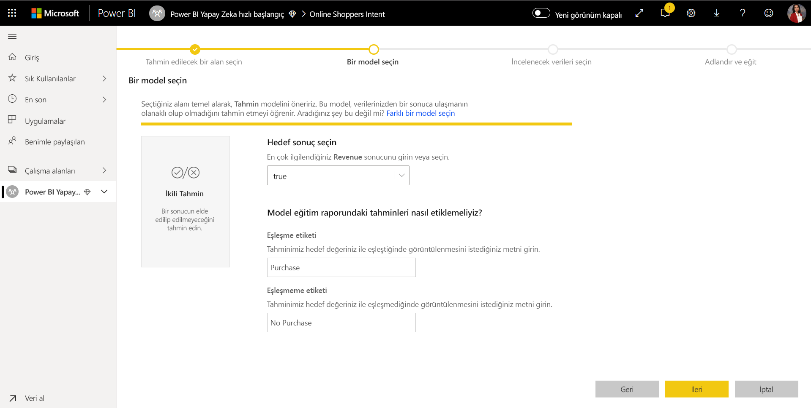

Power BI, verilerinizin bir örneğinin ön taramasını yapar ve daha doğru tahminler üretebilecek girişleri önerir. Power BI bir alan önermezse yanında bir açıklama verilir. Seçimleri yalnızca modelin üzerinde olmasını istediğiniz alanları içerecek şekilde değiştirme seçeneğiniz vardır veya varlık adının yanındaki onay kutusunu seçerek tüm alanları seçebilirsiniz. Girişleri kabul etmek için **İleri**’yi seçin.

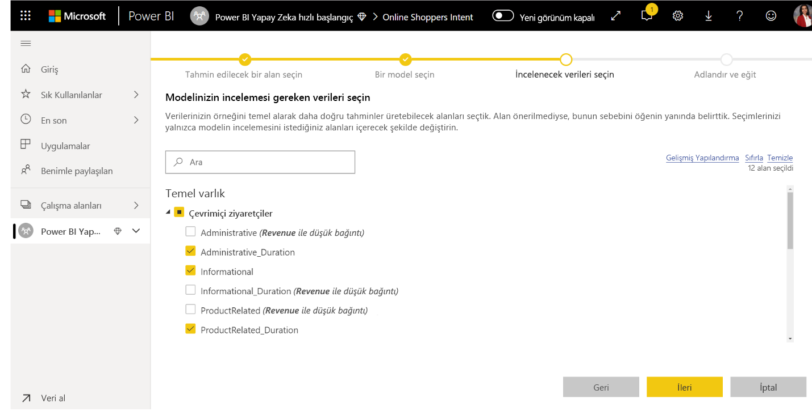

Son adımda, modelimiz için bir ad sağlamamız gerekir. Modeli _Satın Alma Amacı Tahmini_ olarak adlandırın. Hızlı sonuçlar görmek için eğitim süresini azaltmayı veya en iyi modeli elde etmek için eğitim süresini artırmayı seçebilirsiniz. Ardından **Kaydet ve eğit**'i seçerek modeli eğitmeye başlatın.

Eğitim işlemi, geçmiş verilerinizi örnekleyip normalleştirme ve veri kümenizi _Satın Alma Amacı Tahmini Eğitim Verileri_ ve _Satın Alma Amacı Tahmini Test Verileri_ şeklinde iki varlığa bölme ile başlar.

Veri kümesinin boyutuna bağlı olarak eğitim işlemi birkaç dakika ile bir önceki ekranda seçilen eğitim süresi arasında sürebilir. Bu noktada, modeli veri akışının **Makine öğrenmesi modelleri** sekmesinde görebilirsiniz. Hazır durumu, modelin eğitim için kuyruğa alındığını veya eğitim aşamasında olduğunu gösterir.

Model eğitilmekte ve doğrulanmakta olduğunu veri akışının durumu üzerinden onaylayabilirsiniz. Bu seçenek, çalışma alanının **Veri Akışları** sekmesinde bir veri yenileme sürüyor olarak görünür.

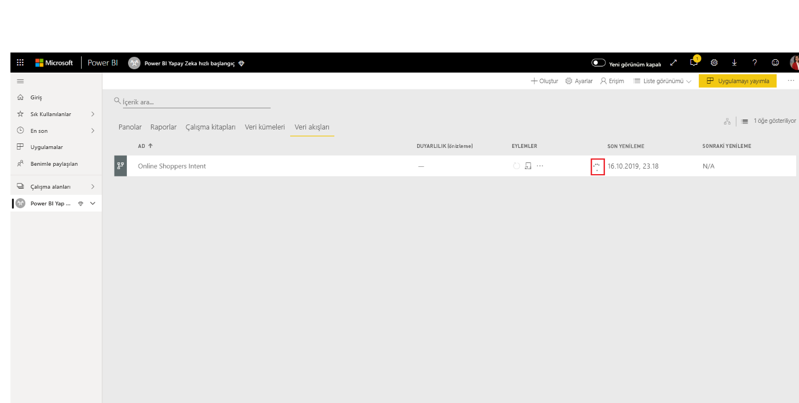

Model eğitimi tamamlandıktan sonra veri akışı güncel bir yenileme saati gösterir. Veri akışındaki **Makine öğrenmesi modelleri** sekmesine giderek modelin eğitildiğini onaylayabilirsiniz. Oluşturduğunuz model, **Eğitildi** durumunu göstermelidir ve **Son Eğitim zamanı** güncellenmiş olmalıdır.

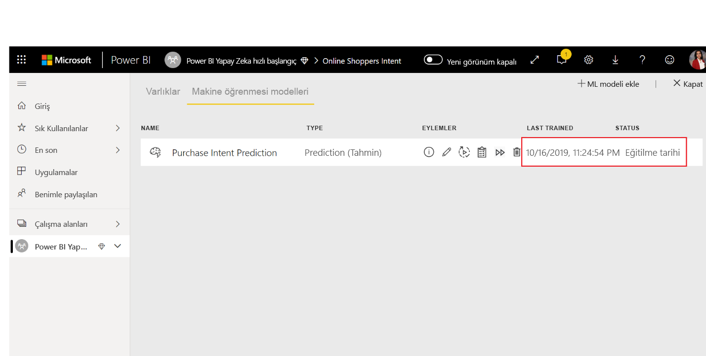

## Model doğrulama raporunu gözden geçirme
Model doğrulama raporunu incelemek için, Makine öğrenmesi modelleri sekmesinde modelin Eylem sütunundan Eğitim raporunu görüntüle düğmesini seçin. Bu rapor, makine öğrenmesi modelinizin olası performansını açıklar.

Raporun **Model Performansı** sayfasında, modelinize yönelik en iyi tahmin unsurlarını görüntülemek için **En iyi tahminleri gör**’ü seçin. Çıkış dağılımının bir tahmin unsuruyla ilişkisini görmek için ilgili tahmin unsurunu seçebilirsiniz.

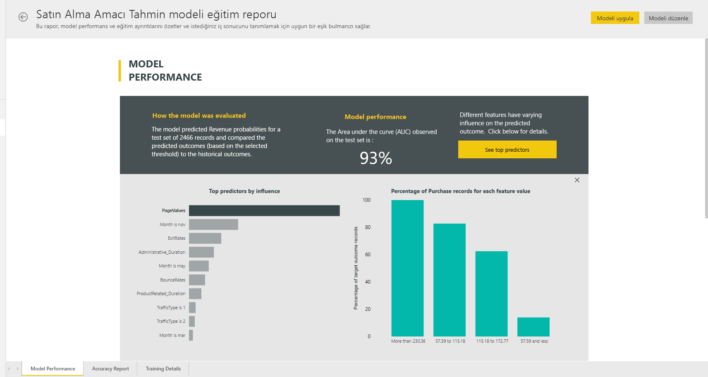

Modelin Duyarlık ve Yakalama değerine etkisini incelemek için Model Performansı sayfasındaki **Olasılık Eşiği** dilimleyicisini kullanabilirsiniz.

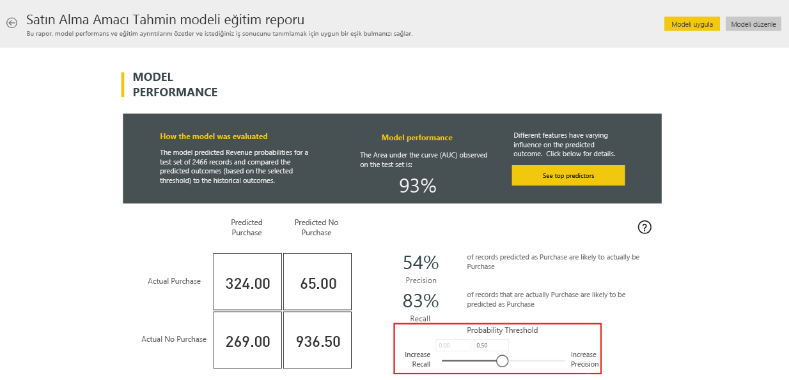

Raporun diğer sayfaları, modelin istatistiksel performans ölçümlerini açıklar.

Bu rapor ayrıca, çalıştırılan farklı yinelemeleri, özelliklerin girişlerden nasıl ayıklandığını ve kullanılan son model için hiper parametreleri açıklayan bir Eğitim Ayrıntıları sayfasını içerir.

## Modeli bir veri akışı varlığına uygulama

Bu modeli çağırmak için raporun üst kısmındaki **Modeli uygula** düğmesini seçin. **Uygula** iletişim kutusunda, modelin uygulanması gereken kaynak verilere sahip hedef varlığı belirtebilirsiniz.

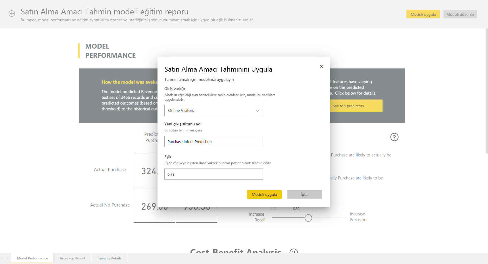

Sorulduğunda, modelinizin sonuçlarının önizlemesini görmek için veri akışını **Yenilemeniz** gerekir.

Model uygulandığında **zenginleştirilmiş <model_name>** ve **zenginleştirilmiş <model_name> açıklamaları** son ekiyle iki yeni varlık oluşturulur. Bu durumda, model **Çevrimiçi Ziyaretçiler** varlığına uygulandığında modelin tahmin edilen çıkışını içeren **Çevrimiçi Ziyaretçiler zenginleştirilmiş Satın Alma Amacı tahmini** ve tahmin için rapora özgü başlıca etkileyicileri içeren **Çevrimiçi Ziyaretçiler zenginleştirilmiş Satın Alma Amacı Tahmini açıklamaları** oluşturulur. 

İkili Tahmin modeli uygulamak, tahmin edilen sonuç, olasılık puanı, tahmin için kayda özel en önemli etkileyicileri ve her biri belirtilen sütun adını ön ek olarak alan bir açıklama dizini olmak üzere dört sütun ekler.  

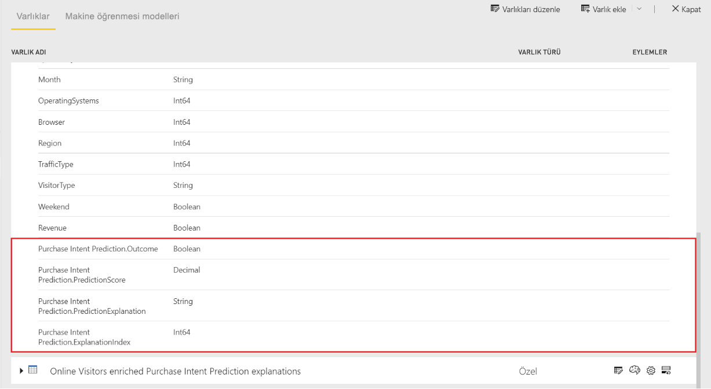

Veri akışı yenilemesi tamamlandıktan sonra sonuçları görüntülemek için **Çevrimiçi Ziyaretçiler zenginleştirilmiş Satın Alma Amacı Tahmini** varlığını seçebilirsiniz.

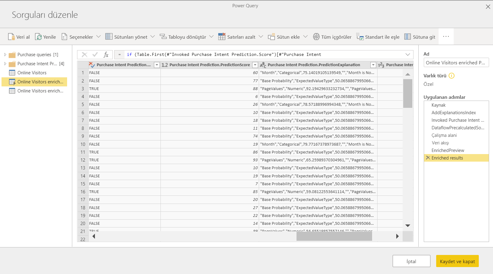

## Modeldeki puanlanmış çıkışı bir Power BI raporunda kullanma

Makine öğrenmesi modelinizdeki puanlanmış çıktıyı kullanmak için, Veri Akışı bağlayıcısını kullanarak Power BI Desktop’tan veri akışınıza bağlanabilirsiniz. **Çevrimiçi Ziyaretçiler zenginleştirilmiş Satın Alma Amacı Tahmini** varlığı artık modelinizdeki tahminleri Power BI raporlarına eklemek için kullanılabilir.

## Sonraki adımlar

Bu öğreticide, aşağıdaki adımları kullanarak Power BI’da bir ikili tahmin modeli oluşturup uyguladınız:

* Giriş verileriyle veri akışı oluşturma
* Makine öğrenmesi modeli oluşturma ve eğitme
* Model doğrulama raporunu gözden geçirme
* Modeli bir veri akışı varlığına uygulama
* Modeldeki puanlanmış çıkışı bir Power BI raporunda kullanma

Power BI'da Machine Learning tümleştirmesi hakkında daha fazla bilgi için bkz. [Power BI'da Otomatik Makine Öğrenmesi](service-machine-learning-automated.md).
