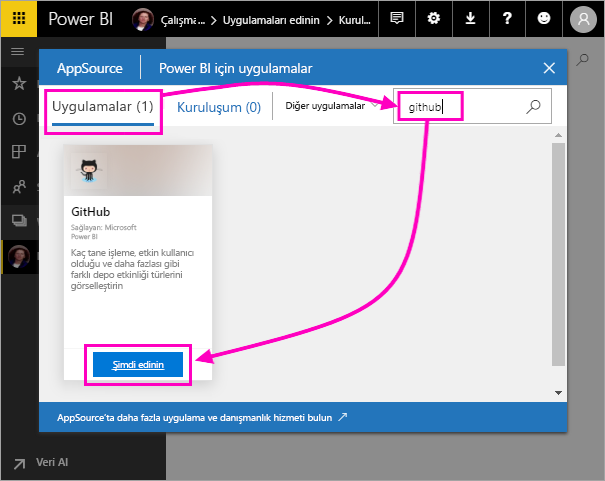
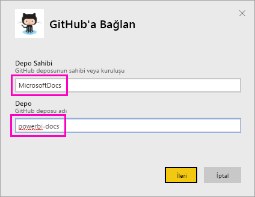
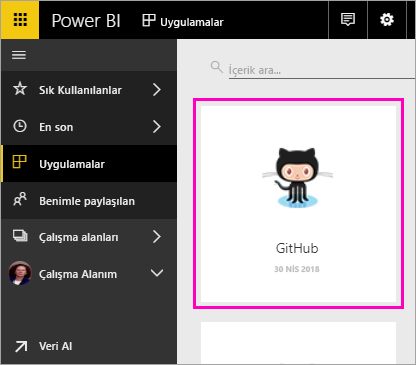
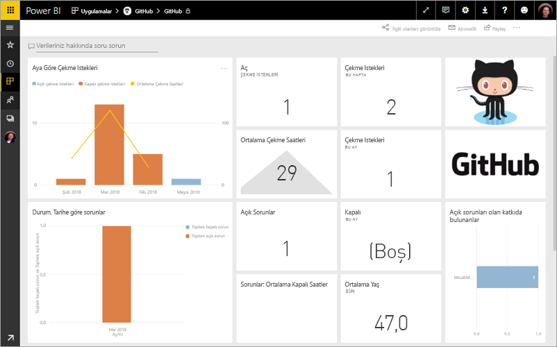
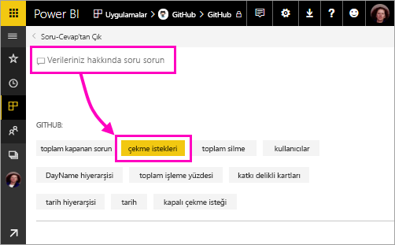
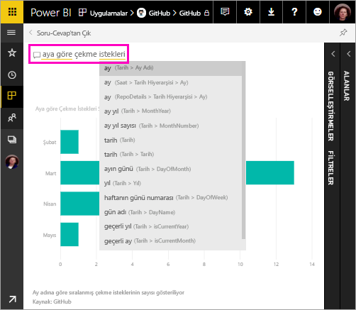
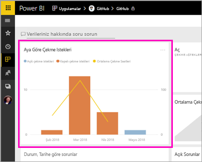
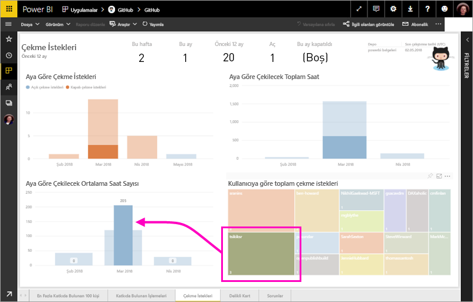

# Öğretici: Power BI ile bir GitHub örneğine bağlanma
Bu öğreticide, Power BI ile GitHub hizmetindeki gerçek verilere bağlanırsınız ve Power BI otomatik olarak panolar ve raporlar oluşturur. Power BI içerik genel deposuna (*depo* olarak da bilinir) bağlanır ve şu bilgileri görürsünüz: Power BI genel içeriğine kaç kişi katkıda bulunuyor? En çok kim katkıda bulunuyor? En çok haftanın hangi gününde katkıda bulunuluyor? Ve diğer soruların yanıtları. 

Bu öğreticide aşağıdaki adımları tamamlarsınız:

> [!div class="checklist"]
> * Bir GitHub hesabınız yoksa, GitHub hesabına kaydolma 
> * Power BI hesabınızda oturum açma veya Power BI hesabınız yoksa, Power BI hesabına kaydolma
> * Power BI hizmetini açma
> * GitHub uygulamasını bulma
> * Power BI genel GitHub deposu için bilgileri girme
> * GitHub verileriyle panoyu ve raporu görüntüleme
> * Uygulamayı silerek kaynakları temizleme

Power BI’ya kaydolmadıysanız başlamadan önce [ücretsiz deneme için kaydolun](https://app.powerbi.com/signupredirect?pbi_source=web).

## Önkoşullar

Bu öğreticiyi tamamlamak için, bir GitHub hesabınız yoksa GitHub hesabınız olması gerekir. 

- [GitHub hesabına](https://docs.microsoft.com/contribute/get-started-setup-github) kaydolun

## Bağlanma
1. Power BI hizmetinde (http://powerbi.com)) oturum açın. 
2. Sol gezinti bölmesinde **Uygulamalar**’ı ve sonra **Uygulamaları al**’ı seçin.
   
    

3. **Uygulamalar**’ı seçin, arama kutusuna **github** yazın > **Hemen edinin**’e tıklayın.
   
    

4. Depo adını ve sahibini girin. Bu depodaki URL https://github.com/MicrosoftDocs/powerbi-docs olduğundan, **Depo Sahibi** **MicrosoftDocs** ve **Depo** da **powerbi-docs**’tur. 
   
    

5. Oluşturduğunuz GitHub kimlik bilgilerini girin. Önceden tarayıcınızda GitHub’da oturum açtıysanız Power BI bu adımı atlayabilir. 

6. **Kimlik doğrulama yöntemi** için **OAuth2** \> **Oturum aç** seçeneklerini belirleyin.

7. GitHub kimlik doğrulaması ekranlarındaki yönergeleri uygulayın. Power BI’a GitHub verileri için izin verin.
   
   Şimdi Power BI, GitHub ile bağlantı kurup verilere bağlanabilir.  Veriler, günde bir kez yenilenir.

8. Power BI, verileri içeri aktardıktan sonra yeni GitHub kutucuğunu görürsünüz. 
 
    

8. Daha fazla alan kazanmak için genel gezinti simgesini seçerek sol gezinti bölmesini simge durumuna küçültün.

    

10. 8. adımdan GitHub kutucuğunu seçin. 
    
    GitHub panosu açılır. Bunlar canlı verilerdir; bu nedenle gördüğünüz değerler farklı olabilir.

    

    

## Soru sorun

11. İmlecinizi **Verileriniz hakkında soru sorun** bölümüne yerleştirip **çekme istekleri** seçeneğini belirleyin. 

    

12. **Aya göre** yazın.
 
    

     Power BI, aylık çekme isteği sayısını gösteren bir çubuk grafik oluşturur.

13. **Soru-Cevaptan Çık** seçeneğini belirleyin.

## GitHub raporunu görüntüleme 

1. GitHub panosunda, **Aya Göre Çekme İstekleri** adlı birleşik sütun ve çizgi grafiğini seçerek ilgili raporu açın.

    

2. **Kullanıcı tarafından toplam çekme istekleri** grafiğinde bir kullanıcı adı seçin ve bu örnekte olduğu gibi ortalama saatin, Mart ayına ait toplam ortalamanın üzerinde olduğunu görün.

    

3. **Delikli Kart** sekmesini seçerek raporda sonraki sayfayı görüntüleyin. 
 
    

    Görünüşe göre Salı günleri saat 15:00, insanların işlerine giriş yaptığı haftanın en yoğun *yürütme* günü ve saatidir.

## Kaynakları temizleme

Öğreticiyi bitirdiğinize göre şimdi GitHub uygulamasını silebilirsiniz. 

1. Sol gezinti çubuğundan **Uygulamalar**’ı seçin.
2. İmleci GitHub kutucuğunun üzerine getirin ve **Sil** çöp kutusunu seçin.

    

## Sonraki adımlar

Bu öğreticide, bir GitHub genel deposuna bağlandınız ve Power BI’ın biçimlendirdiği verileri bir panoda ve raporda aldınız. Pano ve raporu keşfederek veriler hakkında bazı soruları yanıtladınız. Şimdi Salesforce, Microsoft Dynamics ve Google Analytics gibi diğer hizmetlere bağlanma hakkında daha fazla bilgi edinebilirsiniz. 
 
> [!div class="nextstepaction"]
> [Kullandığınız çevrimiçi hizmetlere bağlanma](service-connect-to-services.md)

