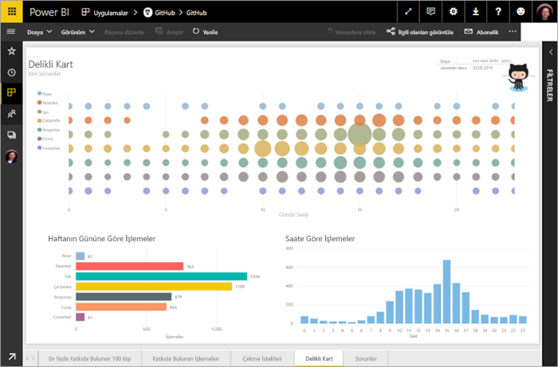
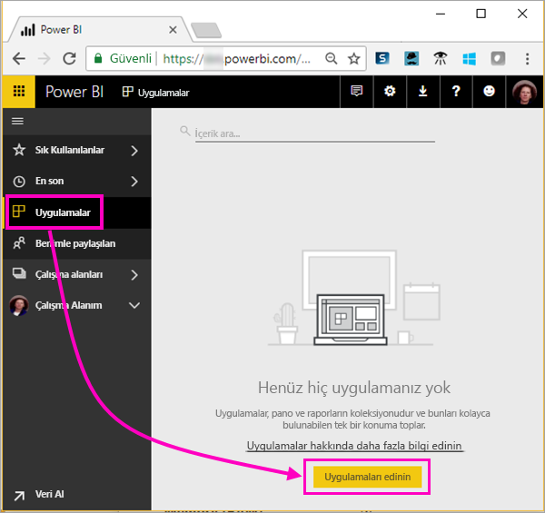
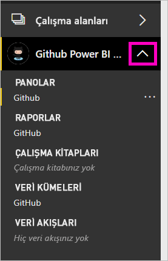
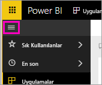
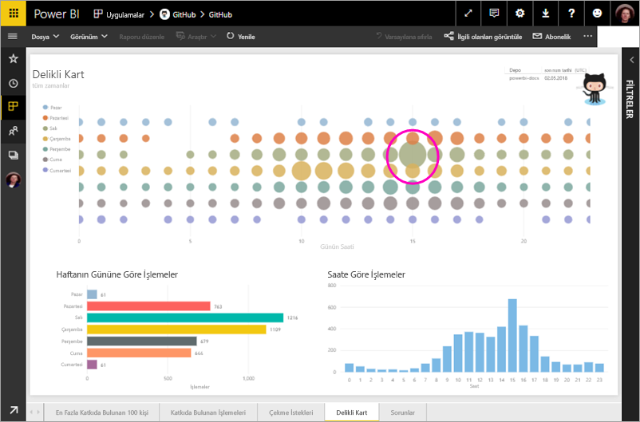
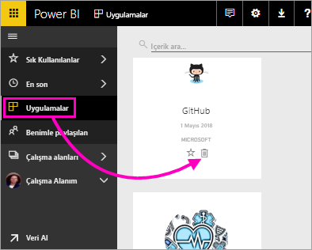

# Öğretici: Power BI ile GitHub deposuna bağlanın
Bu öğreticide, Power BI ile GitHub hizmetindeki gerçek verilere bağlanırsınız ve Power BI otomatik olarak panolar ve raporlar oluşturur. Power BI içerik ortak depoya bağlanmak (olarak da bilinen bir *depo*) ve gibi sorulara bakın: Power BI genel içeriğine kaç kişi katkıda bulunuyor? En çok kim katkıda bulunuyor? En çok haftanın hangi gününde katkıda bulunuluyor? Ve diğer sorular. 

Bu öğreticide aşağıdaki adımları tamamlarsınız:

> [!div class="checklist"]
> * Bir GitHub hesabınız yoksa, GitHub hesabına kaydolma 
> * Power BI hesabınızda oturum açma veya Power BI hesabınız yoksa, Power BI hesabına kaydolma
> * Power BI hizmetini açma
> * GitHub uygulamasını bulma
> * Power BI genel GitHub deposu için bilgileri girme
> * GitHub verileriyle panoyu ve raporu görüntüleme
> * Uygulamayı silerek kaynakları temizleme

Power BI’ya kaydolmadıysanız başlamadan önce [ücretsiz deneme için kaydolun](https://app.powerbi.com/signupredirect?pbi_source=web).

## Önkoşullar

Bu öğreticiyi tamamlamak için, bir GitHub hesabınız yoksa GitHub hesabınız olması gerekir. 

- Kaydolun bir [GitHub hesabı](https://docs.microsoft.com/contribute/get-started-setup-github).

## Bağlanma
1. Power BI hizmetinde (https://app.powerbi.com)) oturum açın. 
2. Sol gezinti bölmesinde **Uygulamalar**’ı ve sonra **Uygulamaları al**’ı seçin.
   
    

3. Seçin **uygulamaları**, türü **GitHub** arama kutusuna > **şimdi edinin**.
   
    

4. İçinde **bu Power BI uygulaması yükleme?** seçin **yükleme**.
5. İçinde **yeni uygulamanızı hazırladınız,** seçin **uygulamasına gidin**.
6. İçinde **yeni uygulamanızı ile çalışmaya başlama**seçin **verilere**.

    

7. Depo adını ve sahibini girin. Bu depodaki URL https://github.com/MicrosoftDocs/powerbi-docs olduğundan, **Depo Sahibi** **MicrosoftDocs** ve **Depo** da **powerbi-docs**’tur. 
   
    

5. Oluşturduğunuz GitHub kimlik bilgilerini girin. Önceden tarayıcınızda GitHub’da oturum açtıysanız Power BI bu adımı atlayabilir. 

6. İçin **kimlik doğrulama yöntemi**, tutmak **oAuth2** seçili \> **oturum**.

7. GitHub kimlik doğrulaması ekranlarındaki yönergeleri uygulayın. Power BI’a GitHub verileri için izin verin.
   
   Şimdi Power BI, GitHub ile bağlantı kurup verilere bağlanabilir.  Veriler, günde bir kez yenilenir.

8. Verileri Power BI tarafından içeri aktarıldıktan sonra yeni bir GitHub çalışma alanınızı içeriğini görürsünüz. 
9. Sol gezinti çubuğunda bulunan çalışma alanı adı yanındaki oku seçin. Bir Pano ve rapor içeren görürsünüz. 

    

10. Pano adının yanındaki üç nokta (...) seçin > **Yeniden Adlandır** > türü **GitHub Panosu**.
 
     

8. Daha fazla alan kazanmak için genel gezinti simgesini seçerek sol gezinti bölmesini simge durumuna küçültün.

    

10. GitHub panonuzu seçin.
    
    GitHub Panosu, canlı veriler içeriyor, bu nedenle gördüğünüz değerlerden farklı olabilir.

    

    

## Soru sorun

1. İmlecinizi koymak **verileriniz hakkında soru sorun**. Power BI teklifleri **başlamanız için soruları**. 

1. Seçin **kaç kullanıcının vardır**.
 
    

13. Arasında **kaç** ve **kullanıcılar bulunduğundan**, türü **çekme istekleri başına**. 

     Power BI, kişi başına çekme isteklerinin sayısını gösteren bir çubuk grafik oluşturur.

    

13. Sabitlemek için bunu panonuza, ardından Raptiye **soru- cevap'tan Çık**.

## GitHub raporunu görüntüleme 

1. GitHub Panoda sütun grafiğini seçin **aya göre çekme istekleri** seçerek ilgili raporu açın.

    

2. Bir kullanıcı adı seçin **toplam çekme isteği kullanıcı tarafından** grafiği. Bu örnekte saatlerini çoğunu Şubat ayında yapılan görüyoruz.

    

3. **Delikli Kart** sekmesini seçerek raporda sonraki sayfayı görüntüleyin. 
 
    

    Görünüşe göre en yaygın zaman ve haftanın günü Salı öğleden sonra 3 *işlemeler*, kişiler, çalışmalarını kontrol edin.

## Kaynakları temizleme

Öğreticiyi bitirdiğinize göre şimdi GitHub uygulamasını silebilirsiniz. 

1. Sol gezinti çubuğundan **Uygulamalar**’ı seçin.
2. İmleci GitHub kutucuğunun üzerine getirin ve **Sil** çöp kutusunu seçin.

    

## Sonraki adımlar

Bu öğreticide, bir GitHub genel deposuna bağlandınız ve Power BI’ın biçimlendirdiği verileri bir panoda ve raporda aldınız. Pano ve raporu keşfederek veriler hakkında bazı soruları yanıtladınız. Şimdi Salesforce, Microsoft Dynamics ve Google Analytics gibi diğer hizmetlere bağlanma hakkında daha fazla bilgi edinebilirsiniz. 
 
> [!div class="nextstepaction"]
> [Kullandığınız çevrimiçi hizmetlere bağlanma](service-connect-to-services.md)

