# Öğretici: Power BI'da Machine Learning Studio (klasik) modelini çağırma (Önizleme)

Bu öğreticide, **Azure Machine Learning Studio (klasik)** modelinden gelen içgörüleri Power BI ile birleştirme deneyiminde size yol göstereceğiz. Bu öğretici Power BI kullanıcısına Azure ML modeli için erişim verme, veri akışı oluşturma ve Azure ML modelinden gelen içgörüleri veri akışınıza ekleme işlemlerinde rehberlik sağlar. Ayrıca henüz bir Azure ML modeliniz yoksa model oluşturmak için hızlı başlangıç kılavuzuna başvuru içerir.

Öğretici sizi şu adımlardan geçirir:

> [!div class="checklist"]
> * Azure Machine Learning modelini oluşturma ve yayımlama
> * Power BI kullanıcısına modeli kullanması için erişim verme
> * Veri akışı oluşturma
> * Azure ML modelinden veri akışına içgörüleri uygulama

## Azure ML modeli oluşturma ve yayımlama

[İzlenecek Yol 1. Adım: Machine Learning Studio (klasik) çalışma alanı oluşturma](https://docs.microsoft.com/azure/machine-learning/studio/walkthrough-1-create-ml-workspace) yönergelerini izleyerek **Machine Learning** çalışma alanını oluşturun.

Mevcut Azure ML modelinizle veya veri kümenizle bu adımları kullanabilirsiniz. Yayımlanmış bir modeliniz yoksa, Otomobil Fiyat Tahminine yönelik bir Azure ML modelinin ayarlandığı [Azure Machine Learning Studio'da (klasik) ilk veri bilimi denemenizi oluşturma](https://docs.microsoft.com/azure/machine-learning/studio/create-experiment) makalesinden yararlanarak birkaç dakika içinde bir model oluşturabilirsiniz.

Azure ML modelini bir web hizmeti olarak yayımlamak için [Azure Machine Learning Studio (klasik) web hizmetini dağıtma](https://docs.microsoft.com/azure/machine-learning/studio/tutorial-part3-credit-risk-deploy) başlığı altında verilen adımları izleyin.

## Power BI kullanıcısına erişim verme

Power BI'dan Azure ML modeline erişmek için Azure aboneliğiyle kaynak grubu üzerinde **Okuma** erişiminizin ve Machine Learning Studio (klasik) modelleri için Azure Machine Learning Studio (klasik) web hizmeti üzerinde **Okuma** erişiminizin olması gerekir.  Azure Machine Learning modeli için Machine Learning çalışma alanı üzerinde **Okuma** erişiminiz olmalıdır.

Aşağıdaki adımlarda, modelin yayımlandığı Azure aboneliğinin ve kaynak grubunun yöneticisi olduğunuz varsayılır.

[Azure portalında](https://portal.azure.com) oturum açın ve gezinti bölmesi menüsündeki **Tüm Hizmetler** listesini kullanarak bulabileceğiniz **Abonelikler** sayfasına gidin.

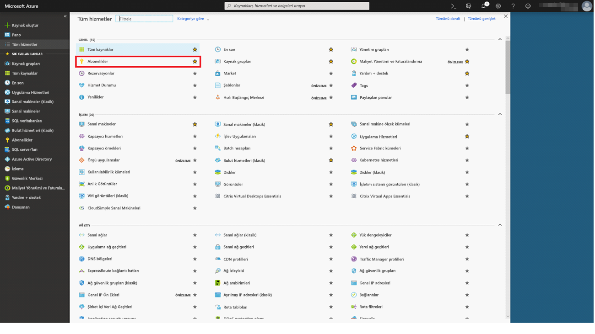

Modeli yayımlarken kullandığınız Azure aboneliğini seçin ve **Erişim Denetimi (IAM)** seçeneğini belirtin. Bundan sonra **Rol ataması ekle**'yi, **Okuyucu** rolünü ve Power BI kullanıcısını seçin. İşiniz bittiğinde **Kaydet**’i seçin. Aşağıdaki resimde bu seçimler gösterilir.

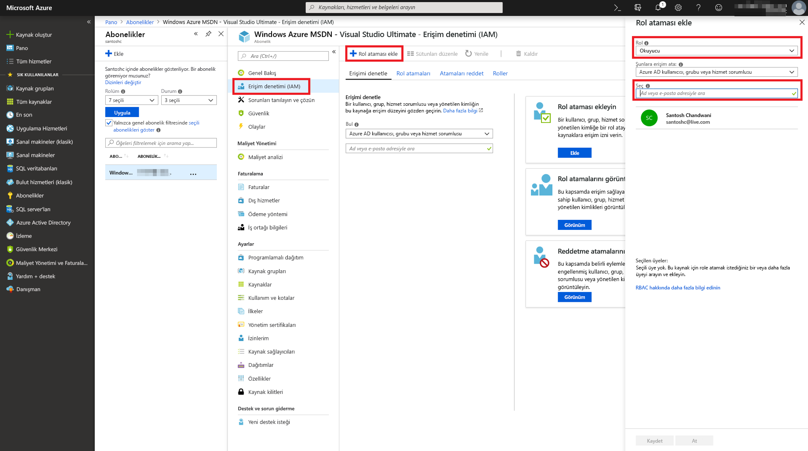

Ardından Power BI kullanıcısına Azure ML modelinin dağıtıldığı belirli bir Machine Learning web hizmeti üzerinde **Katkıda Bulunan** rolü erişimi vermek için yukarıdaki adımları yineleyin.

## Veri akışı oluşturma

### Veri akışı oluşturmak için verileri alma

Önceki adımda Azure ML modeli üzerinde erişim verdiğiniz kullanıcı kimlik bilgileriyle Power BI hizmetinde oturum açın.

Bu adımda Azure ML modelinizle puanlamak istediğiniz verilerinizin CSV biçiminde olduğu varsayılır.  Machine Learning Studio'da (klasik) modeli oluştururken **Automobile Pricing Experiment**'i kullandıysanız, bu denemenin veri kümesi aşağıdaki bağlantıda paylaşılır:

* [Azure Learning Studio (klasik) örnek modeli](https://github.com/santoshc1/PowerBI-AI-samples/blob/master/Tutorial_MLStudio_model_integration/Automobile%20price%20data%20_Raw_.csv)

### Veri akışı oluşturma

Veri akışınızda varlıkları oluşturmak için, Power BI hizmetinde oturum açın ve AI önizlemesinin etkinleştirildiği ayrılmış kapasitenizdeki çalışma alanına gidin.

Henüz çalışma alanınız yoksa, soldaki menüde **Çalışma Alanları**'nı ve sonra da alttaki panelde **Çalışma alanı oluştur**'u seçerek bir çalışma alanı oluşturabilirsiniz.  Çalışma alanı ayrıntılarını girebileceğiniz bir panel açılır. Çalışma alanı adı girin ve **Kaydet**'i seçin.

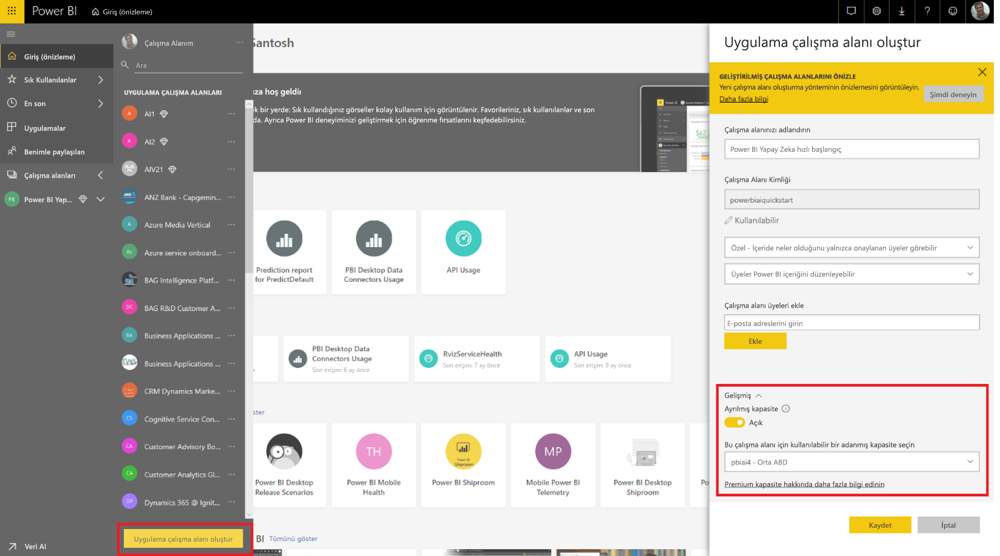

Çalışma alanı oluşturulduktan sonra Hoş Geldiniz ekranının sağ alt kısmında **Atla**'yı seçebilirsiniz.

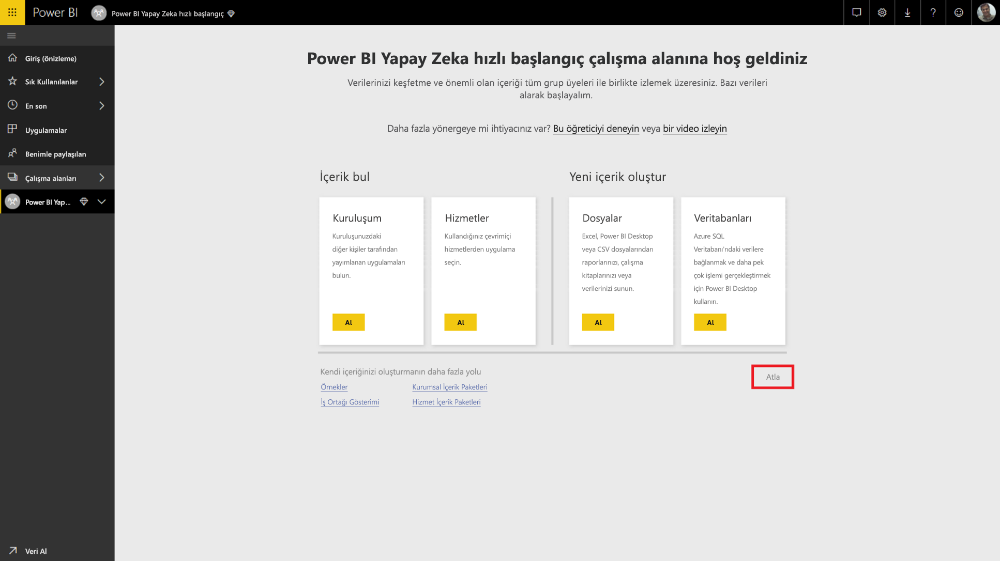

**Veri akışları (önizleme)** sekmesini seçin, çalışma alanının sağ üst kısmındaki **Oluştur** düğmesini ve sonra da **Veri akışı**'nı seçin.

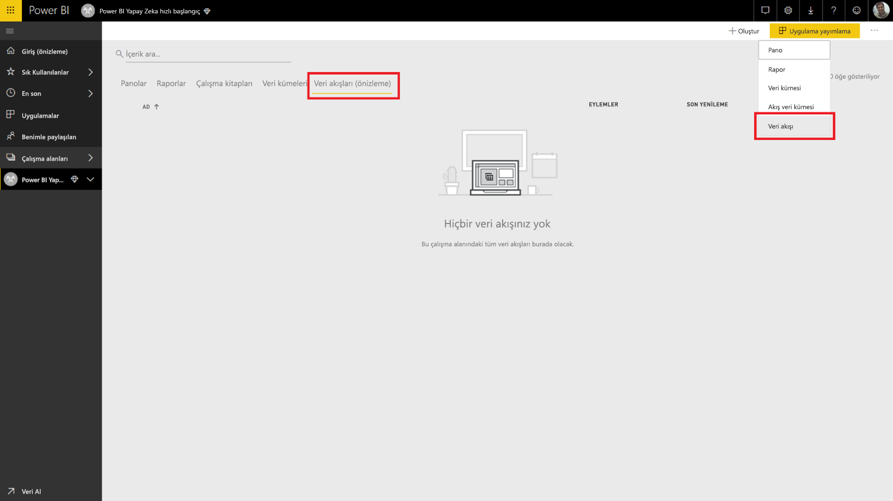

**Yeni varlıklar ekle**'yi seçin; bu seçim tarayıcıda **Power Query Düzenleyicisi**'ni başlatır.

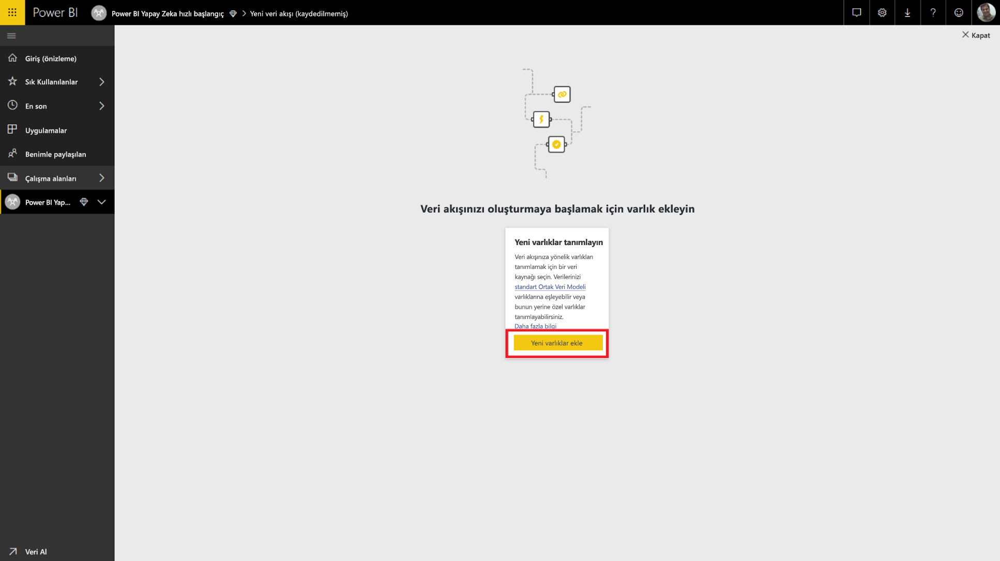

Veri kaynağı olarak **Metin/CSV Dosyası**'nı seçin.

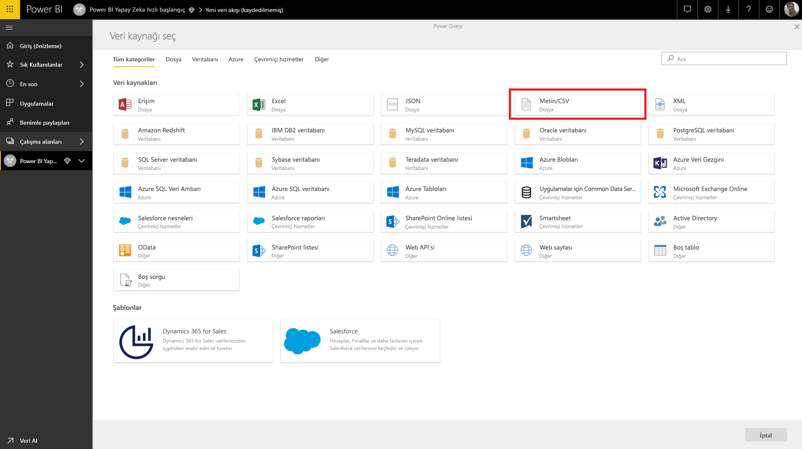

Sonraki ekranda veri kaynağına bağlanmanız istenir. Azure ML modelinizi oluştururken kullandığınız verilerin bağlantısını yapıştırın. _Automotive Pricing_ verilerini kullandıysanız, aşağıdaki bağlantıyı **Dosya yolu veya URL** kutusuna yapıştırıp **İleri**'ye tıklayabilirsiniz.

`https://raw.githubusercontent.com/MicrosoftLearning/Principles-of-Machine-Learning-Python/master/Module7/Automobile%20price%20data%20_Raw_.csv`

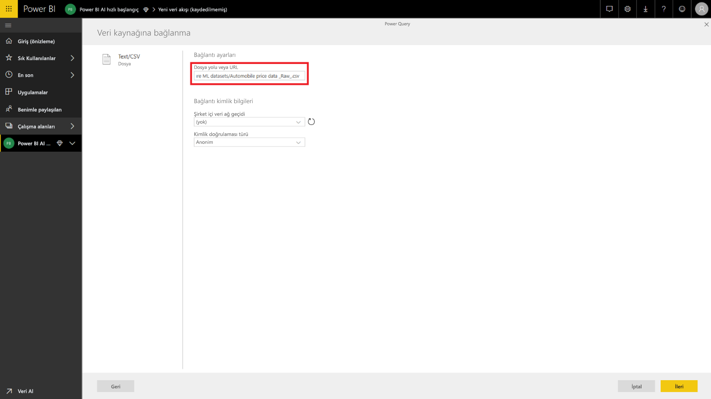

Power Query Düzenleyicisi CSV dosyasındaki verilerin önizlemesini gösterir. Komut şeridinde **Tabloyu Dönüştür**'ü seçin ve sonra da **İlk Satırı Üst Bilgi Olarak Kullan**'ı seçin.  Bu seçim sağ taraftaki _Uygulanan adımlar_ bölmesine **Yükseltilen üst bilgiler** sorgu adımını ekler. Sağ taraftaki bölmeyi kullanarak sorgunun adını _Otomobil Fiyatları_ gibi daha kolay bir adla değiştirebilirsiniz.

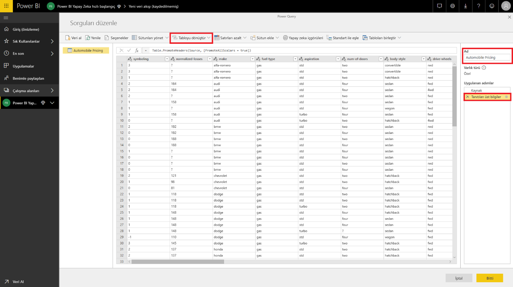

Kaynak veri kümemizde '?' olarak ayarlanmış bilinmeyen diğerler vardır.  Bunu temizlemek için, kolaylık açısından daha sonra '?' işaretlerini '0' değerleriyle değiştirebilirsiniz.  Bunu yapmak için, sütun başlıklarında adlarına tıklayarak *normalized-losses*, *bore*, *stroke*, *compression-ratio*, *horsepower*, *peak-rpm* ve *price* sütunlarını seçin, ardından 'Sütunları dönüştür' seçeneğine tıklayın ve 'Değerleri değiştir'i seçin.  '?' işaretlerini '0' değeriyle değiştirin.

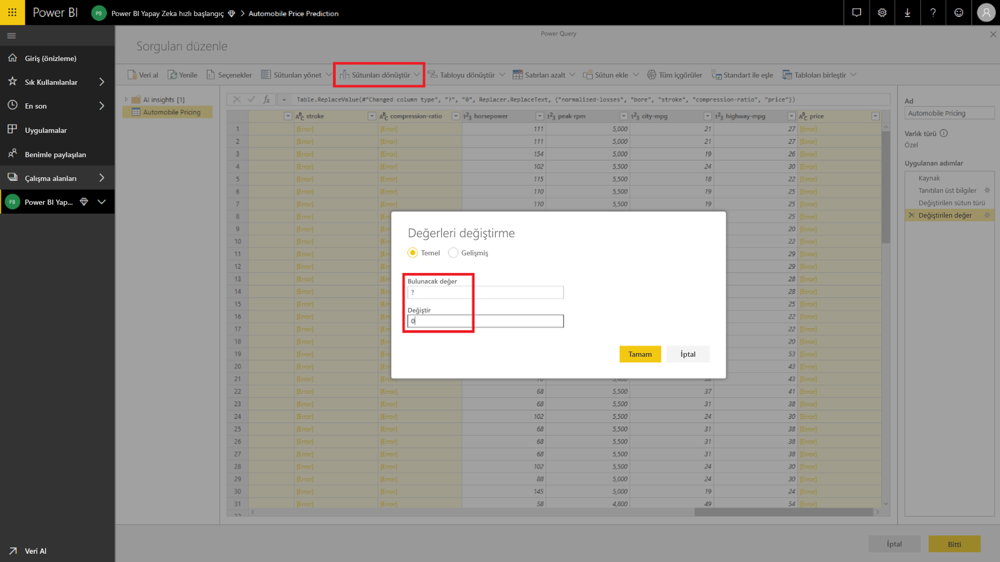

Metin/CSV kaynağından gelen tablodaki tüm sütunlar metin sütunları olarak kabul edilir.  Bundan sonra, sayısal sütunları doğru veri türlerine dönüştürmemiz gerekir.  Bu işlemi Power Query'de sütun üst bilgisindeki veri türü simgesine tıklayarak yapabilirsiniz.  Sütunları aşağıdaki türlere dönüştürün:

- **Tam sayı**: symboling, normalized-losses, curb-weight, engine-size, horsepower, peak-rpm, city-mpg, highway-mpg, price
- **Ondalık sayı**: wheel-base, length, width, height, bore, stroke, compression-ratio

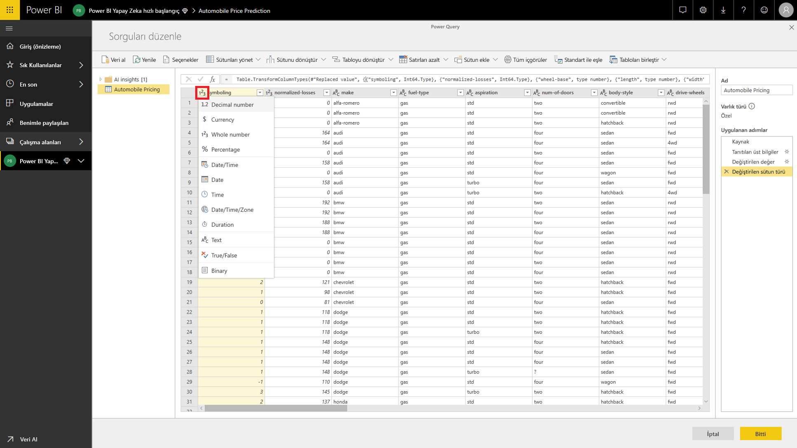

**Bitti**'ye tıklayarak Power Query Düzenleyicisi'ni kapatın. Bu işlem bize eklediğimiz _Automobile Pricing_ verileriyle varlık listesini gösterir. Sağ üst köşedeki **Kaydet**'i seçin, veri akışı için bir ad girin ve **Kaydet**'i seçin.

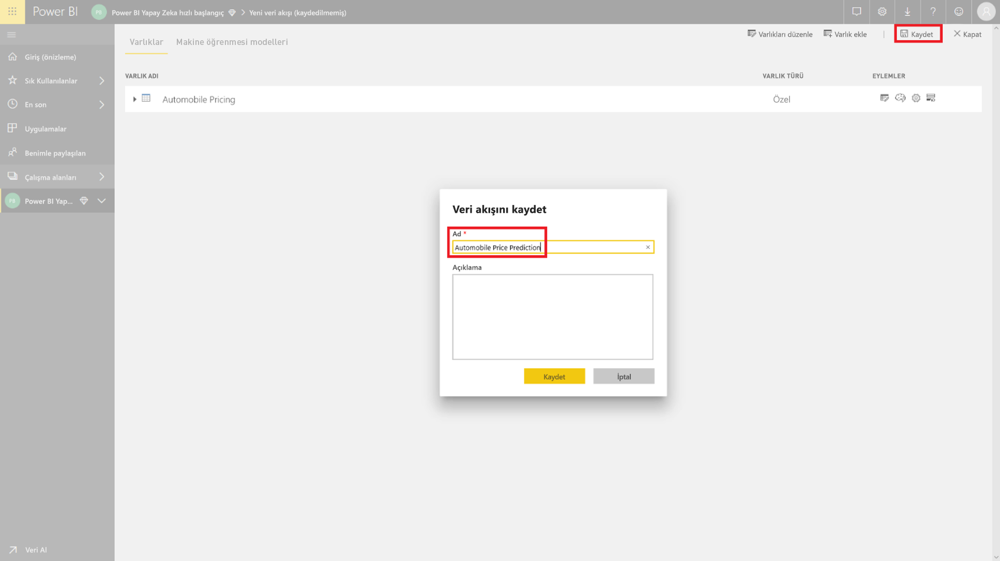

### Veri akışını yenileme

Veri akışı kaydedildiğinde, veri akışınızın kaydedildiğine ilişkin bir bildirim gösterilir. Verileri kaynaktan veri akışına almak için **Şimdi yenile**'yi seçin.

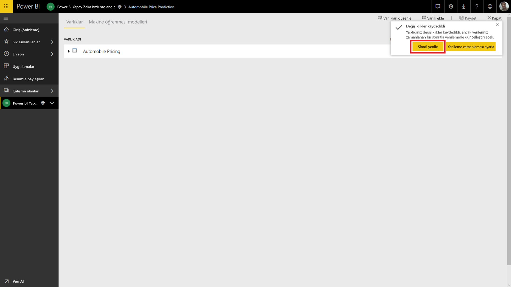

Sağ üst köşedeki **Kapat**'ı seçin ve veri akışını yenileme işleminin tamamlanmasını bekleyin.

Veri akışınızı yenilemek için **Eylemler** komutlarını da kullanabilirsiniz. Yenileme tamamlandığında veri akışı zaman damgasını görüntüler.

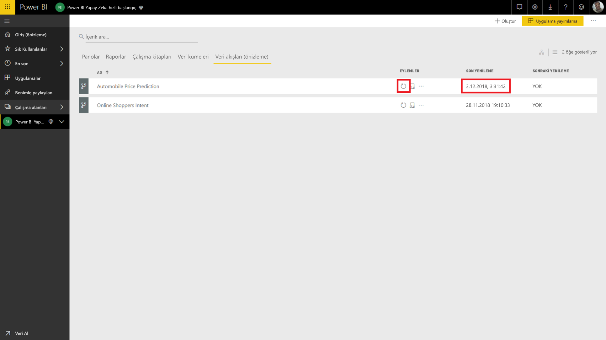

## Azure ML modelinden içgörüleri uygulama

_Automobile Price Prediction_ Azure ML modeline erişmek için, tahmini fiyatı eklemek istediğiniz _Automobile Pricing_ varlığını düzenleyebilirsiniz.

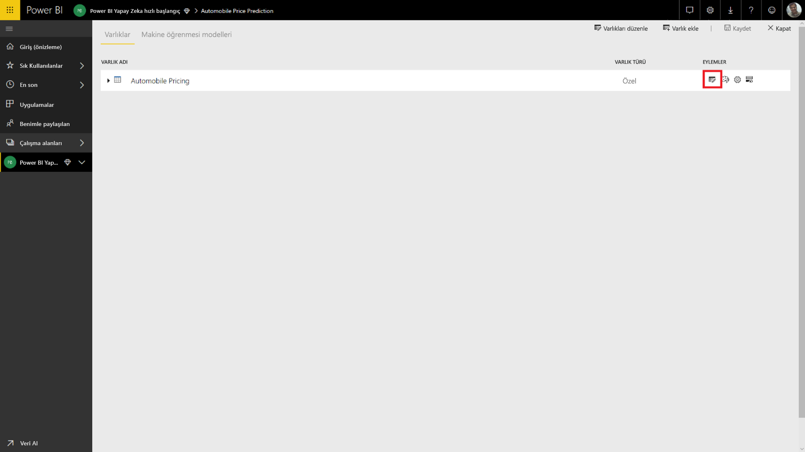

**Düzenle** simgesi seçildiğinde veri akışınızdaki varlıklar için Power Query Düzenleyicisi açılır.

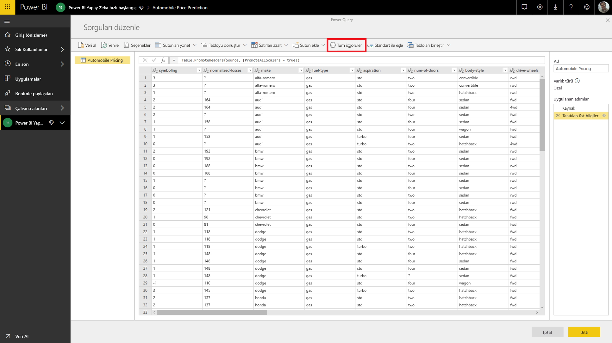

Şeritte **Yapay Zeka İçgörüleri** düğmesini seçin ve ardından gezinti menüsünden _Azure Machine Learning Modelleri_ klasörünü seçin.

Erişim verdiğiniz Azure ML modelleri, *AzureML.* ön ekiyle Power Query işlevleri olarak listelenir.  _AutomobilePricePrediction_ modeline karşılık gelen işleve tıkladığınızda, modelin web hizmetine ilişkin parametreler işlev parametreleri olarak listelenir.

Azure ML modelini çağırmak için, açılan listeden seçilen tüm varlık sütunlarını giriş olarak belirtebilirsiniz. Sütun simgesini giriş iletişim kutusunun sol tarafına doğru döndürerek giriş olarak bir sabitin kullanılmasını da belirtebilirsiniz. Bir sütun adı işlev parametre adlarından biriyle eşleştiğinde, sütun otomatik olarak bir giriş olması için önerilir.  Sütun adı eşleşmezse, bunu açılan listeden seçebilirsiniz.

_Automobile Pricing Prediction_ modelinde giriş parametreleri şunlardır:

- make
- body-style
- wheel-base
- engine-size
- horsepower
- peak-rpm
- highway-mpg

Bizim örneğimizde, tablomuz modeli eğitmek için kullanılan özgün veri kümesiyle eşleştiğinden tüm parametreler için doğru sütunlar zaten seçilmiştir.

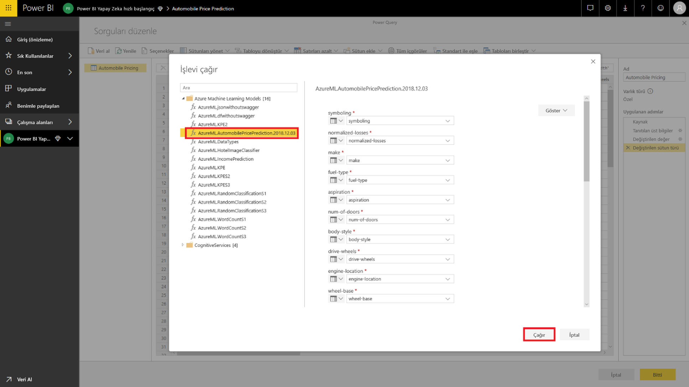

Azure ML modeli çıkışının önizlemesini varlık tablosunda yeni bir sütun olarak görüntülemek için **Çağır**'ı seçin. Ayrıca model çağrısını da sorgu için uygulanmış bir adım olarak görürsünüz.

Modelin çıkışı, çıkış sütununda bir kayıt olarak gösterilir. Sütunu genişletip ayrı sütunlarda tek tek çıkış parametreleri oluşturabilirsiniz. Bizim örneğimizde, yalnızca otomobilin tahmini fiyatını içeren _Scored Labels_ ile ilgileniyoruz.  Dolayısıyla kalan öğelerin seçimini kaldırıyor ve **Tamam**'ı seçiyoruz.

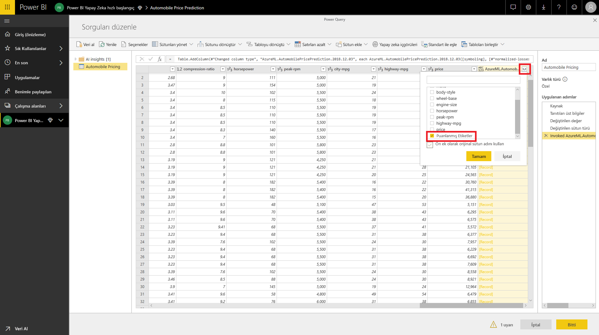

Sonuçta elde edilen *Scored Labels* sütununda Azure ML modelinden fiyat tahmini yer alır.

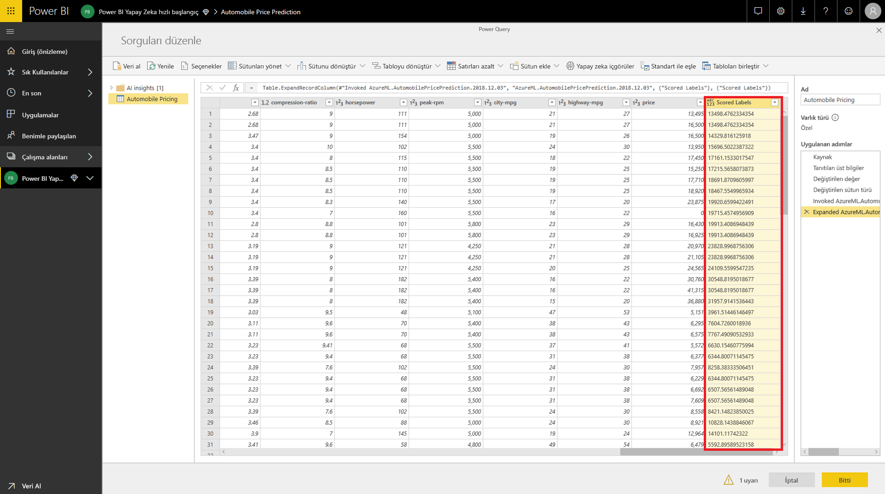

Veri akışınızı kaydettikten sonra, varlık tablosundaki yeni veya güncelleştirilmiş satırlar için veri akışını her yenilediğinizde Azure ML modeli otomatik olarak çağrılır.

## Kaynakları temizleme

Bu makalede oluşturduğunuz Azure kaynaklarına artık ihtiyacınız yoksa, ücretlendirmeden kaçınmak için bu kaynakları silin.  Artık gerekmiyorsa, oluşturduğunuz veri akışlarını da silebilirsiniz.

## Sonraki adımlar

Bu öğreticide Azure Machine Learning Studio'yla (klasik) basit bir veri kümesi kullanıp şu adımları izleyerek basit bir deneme oluşturdunuz:

- Azure Machine Learning modelini oluşturma ve yayımlama
- Power BI kullanıcısına modeli kullanması için erişim verme
- Veri akışı oluşturma
- Azure ML modelinden veri akışına içgörüleri uygulama

Power BI'da Azure Machine Learning tümleştirmesi hakkında daha fazla bilgi için bkz. [Power BI'da Azure Machine Learning tümleştirmesi (Önizleme)](service-machine-learning-integration.md).
