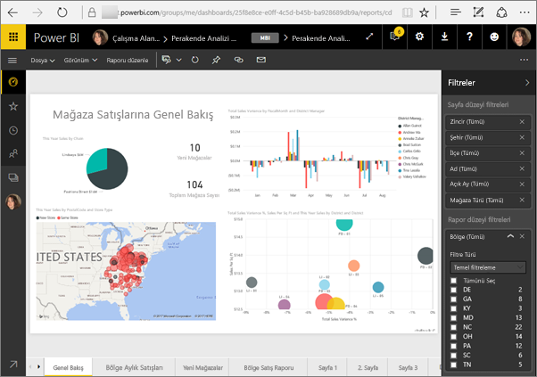
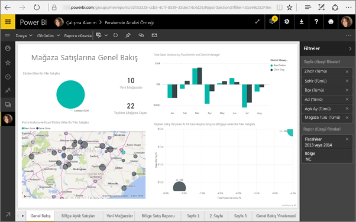
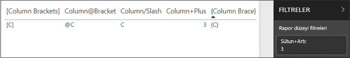
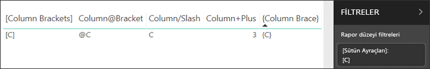

# <a name="filter-a-report-using-query-string-parameters-in-the-url"></a>URL'de sorgu dizesi parametreleri kullanarak bir raporu filtreleme

Power BI hizmetinde bir raporu açtığınızda, rapordaki her sayfanın kendine ait bir URL'si bulunur. Bu rapor sayfasının filtrelemek için rapor tuvalindeki Filtreler bölmesini kullanabilirsiniz.  Alternatif olarak URL'ye sorgu dizesi parametreleri ekleyerek rapora ön filtreleme uygulayabilirsiniz. İş arkadaşlarınıza göstermek istediğiniz bir raporunuz olabilir ve bu raporu onlar için önceden filtrelemek isteyebilirsiniz. Filtre uygulamanın bir yolu raporun varsayılan URL'si ile başlamak, filtre parametrelerini URL'ye eklemek ve ardından iş arkadaşlarınıza yeni URL'nin tamamını e-posta ile göndermektir.



## <a name="uses-for-query-string-parameters"></a>Sorgu dizisi parametrelerinin kullanımları

Power BI Desktop'ta çalıştığınızı düşünelim. Diğer Power BI raporlarına bağlantılı bir rapor oluşturmak istiyorsunuz ancak diğer raporlardaki bilgilerin yalnızca bir bölümünü göstermeyi tercih ediyorsunuz. İlk olarak sorgu dizesi parametrelerini kullanarak raporları filtrelemeniz ve URL'leri kaydetmeniz gerekir. Ardından bu rapor URL'leriyle Desktop uygulamasında yeni bir tablo oluşturabilirsiniz.  Son adımda da bu raporu yayımlayıp paylaşabilirsiniz.

Sorgu dizesi parametrelerinin başka bir kullanımı da gelişmiş Power BI çözümü oluşturmaktır.  DAX kullanarak dinamik olarak müşterisinin geçerli raporda yaptığı seçimleri temel alan filtrelenmiş rapor URL'si üreten bir rapor oluşturur. Müşteriler URL'yi seçtiğinde yalnızca istenen bilgileri görür. 

## <a name="query-string-parameter-syntax-for-filtering"></a>Filtreleme için sorgu dizesi parametresi söz dizimi

Parametreleri kullanarak boşluk veya özel karakter içerenler dahil olmak üzere raporu bir veya daha fazla değer için filtreleyebilirsiniz. Temel söz dizimi oldukça basittir; rapor URL'si ile başlayın, bir soru işareti ekleyin ve ardından filtre söz diziminizi ekleyin.

*URL*?filter=*Tablo*/*Alan* eq '*değer*'


* **Tablo** ve **Alan** adları büyük/küçük harfe duyarlıdır, **değer** ise değildir.
* Rapor görünümünden gizlenen alanlar yine de filtrelenebilir.

### <a name="reports-in-apps"></a>Uygulamalardaki raporlar

Uygulamadaki rapora URL filtresi eklemek isterseniz, biçimlendirme biraz farklıdır. Uygulamadaki raporlara yönelik bağlantıların, URL'ye eklenen bir sorgu parametresi (ctid) vardır. Sorgu parametrelerini bir ve işareti (&) ile ayırın. “?filter=” özelliğini tutun ve ctid parametresini URL’nin sonuna taşıyıp önüne bir ve işareti (&) getirin. 

Şu örnekteki gibi olmalıdır:

app.powerbi.com/groups/me/apps/*app-id*/reports/*report-id*/ReportSection?filter=*Table*/*Field* eq '*value*'&ctid=*ctid*

### <a name="field-types"></a>Alan türleri

Alan türü sayı, tarih saat veya dize olabilir ve kullanılan türün veri kümesindeki tür kümesiyle eşleşmesi gerekir.  Örneğin tarih olarak belirlenmiş bir veri kümesi sütununda (Table/StringColumn eq 1 gibi) bir tarih saat veya sayısal değer arıyorsanız tablo sütununun "dize" türünde belirtilmesi uygun olmayacaktır.

* **Dizelerin**, 'yönetici adı' gibi tek tırnak içine alınması gerekir.
* **Sayılar** için özel biçimlendirmeye gerek yoktur. Ayrıntılar için bu makalenin [Sayısal veri türleri](#numeric-data-types) bölümüne bakın.
* **Tarih ve saatler** Bu makaledeki [Tarih veri türleri](#date-data-types) bölümüne bakın. 

Yine de karmaşık geliyorsa ayrıntıları görmek için okumaya devam edin.  

## <a name="filter-on-a-field"></a>Bir alanı filtreleme

Aşağıdakinin raporumuzun URL'si olduğunu kabul edelim.


Harita görselleştirmemizde (yukarıda) Kuzey Carolina'da mağazalarımız olduğunu görüyoruz.

>[!NOTE]
>Bu örnekte [Perakende Analiz Örneği](sample-datasets.md) temel alınmıştır.
> 

Raporu yalnızca "NC"de (Kuzey Carolina) bulunan mağazaları göstermek üzere filtrelemek için URL'ye aşağıdakileri ekleyin;

?filter=Store/Territory eq 'NC'


>[!NOTE]
>*NC*, **Store** tablosunun **Territory** alanında depolanan bir değerdir.
> 

Raporumuz Kuzey Carolina için filtrelendi, rapor sayfasında bulunan tüm görselleştirmeler yalnızca Kuzey Carolina'ya ait verileri gösterir.



## <a name="filter-on-more-than-one-value-in-a-field"></a>Alandaki birden çok değere göre filtreleme

Tek bir alanda birden çok değere göre filtrelemek için **and** işleci yerine **in** işlecini kullanın. Söz dizimi aşağıdaki gibidir:

*URL*?filter=*Tablo*/*Alan* **in** ('*değer1*', '*değer2*')

Aynı örneği kullanarak raporu yalnızca "NC"de (Kuzey Carolina) veya “TN”de (Tennessee) bulunan mağazaları göstermek üzere filtrelemek için URL'ye aşağıdakileri ekleyin;

?filter=Store/Territory in ('NC', 'TN')

Diğer yararlı işleçlerin listesi için makalenin devamındaki [İşleçler](#operators) tablosuna bakın.

## <a name="filter-on-multiple-fields"></a>Birden çok alanda filtreleme

Ayrıca URL'nize ek parametreler ekleyerek birden çok alanda filtreleme yapabilirsiniz. Özgün filtre parametremize geri dönelim.

```
?filter=Store/Territory eq 'NC'
```

Ek alanlarda filtreleme yapmak için bir '**and**' ve yukarıdaki biçimde başka bir alan ekleyin. Bu işlemin bir örneği aşağıdadır.

```
?filter=Store/Territory eq 'NC' and Store/Chain eq 'Fashions Direct'
```

## <a name="operators"></a>İşleçler

Power BI, '**and**' haricinde birçok işleci de destekler. Aşağıdaki tabloda bu işleçler ve destekledikleri içerik türleri listelenmiştir.

|işleç  | tanım | dize  | sayı | Tarih |  Örnek|
|---------|---------|---------|---------|---------|---------|
|**and**     | ve |  evet      | evet |  evet|  product/price le 200 and price gt 3.5 |
|**eq**     | eşittir |  evet      | evet   |  evet       | Address/City eq 'Redmond' |
|**ne**     | eşit değildir |   evet      | evet  | evet        |  Address/City ne 'London' |
|**ge**     |  büyüktür veya eşittir       | hayır | evet |evet |  product/price ge 10
|**gt**     | büyüktür        |hayır | evet | evet  | product/price gt 20
|**le**     |   küçüktür veya eşittir      | hayır | evet | evet  | product/price le 100
|**lt**     |  küçüktür       | hayır | evet | evet |  product/price lt 20
|**in\*\***     |  dahil       | evet | evet |  evet | Student/Age in (27, 29)


\*\***in** işlecini kullanırken **in** ifadesinin sağ tarafındaki değerler parantez içinde virgülle ayrılmış liste veya koleksiyon döndüren tek bir ifade olabilir.

### <a name="numeric-data-types"></a>Sayısal veri türleri

Power BI URL filtresi aşağıdaki biçimlerde sayı içerebilir.

|Sayı türü  |Örnek  |
|---------|---------|
|**integer**     |   5      |
|**long**     |   5 L veya 5 l      |
|**double**     |   5,5 veya 55e-1 veya 0,55e+1 veya 5D veya 5d veya 0,5e1D veya 0,5e1d veya 5,5D veya 5,5d veya 55e-1D veya 55e-1d     |
|**decimal**     |   5 M veya 5 m ya da 5,5 M veya 5,5 m      |
|**float**     | 5 F veya 5 f ya da 0,5e1 F veya 0,5e-1 d        |

### <a name="date-data-types"></a>Tarih veri türleri

Power BI, **Date** ve **DateTimeOffset** veri türleri için OData V3 ve V4 desteği sunar. OData V3 için tarihlerin tek tırnak içine alınması ve önüne datetime sözcüğünün yazılması gerekir. OData V4'te tek tırnak ve datetime sözcüğü gerekli değildir. 
  
Tarihler EDM biçiminde (2019-02-12T00:00:00) gösterilir: Bu da YYYY-AA-GG biçiminde bir tarih belirttiğinizde Power BI bunu YYYY-AA-GGT00:00:00 şeklinde yorumlar. Ay ve günün iki basamaklı (AA ve GG) olduğundan emin olun.

Bu ayrım neden önemlidir? **Table/Date gt ‘2018-08-03’** şeklinde bir sorgu dizesi parametresi oluşturduğunuzu düşünelim.  Sonuçlar 3 Ağustos 2018'i kapsayacak mı yoksa 4 Ağustos 2018'den mi başlayacak? Power BI sorgunuzu **Table/Date gt '2018-08-03T00:00:00'** şekline dönüştürür. Dolayısıyla sonuçlarınız saat bölümü sıfır olmayan tarihleri kapsar çünkü bunlar **'2018-08-03T00:00:00'** tarihinden büyüktür.

V3 ile V4 arasında başka farklılıklar da vardır. OData V3'te Dates desteği yoktur; yalnızca DateTime desteklenir. Bu nedenle, V3 biçimini kullanırsanız bunu tam tarih saat değeriyle nitelemeniz gerekir. "datetime'2019-05-20'" gibi tarih değişmez değerleri V3 gösteriminde desteklenmez. Ama bunu V4 gösteriminde doğrudan "2019-05-20" olarak yazabilirsiniz. Aşağıda V3 ve V4 biçimlerinde iki eşdeğer filtre sorgusu verilmiştir:

- OData V4 biçimi: filtre=Table/Date gt 2019-05-20
- OData V3 biçimi: filtre=Table/Date gt datetime'2019-05-20T00:00:00'


## <a name="special-characters-in-url-filters"></a>URL filtrelerindeki özel karakterler

### <a name="special-characters-in-table-and-column-names"></a>Tablo ve sütun adlarındaki özel karakterler

Tablo ve sütun adlarında özel karakter ve boşluk kullanımı için gerçekleştirilmesi gereken ek biçimlendirme adımları vardır. Sorgunuz; boşluklar, tireler veya ASCII olmayan başka karakterler içerdiğinde, o özel karakterlere önek olarak bir alt çizgi ve bir X ( **_x**) ile başlayan, ardından dört haneli **Unicode** ve başka bir alt çizgi ile devam eden bir *kaçış kodu* verin. Unicode dört karakterden kısaysa sıfırlarla ile tamamlamanız gerekir. Aşağıda bazı örnekler verilmiştir.

|Tanımlayıcı  |Unicode  | Power BI için kodlama  |
|---------|---------|---------|
|**Tablo Adı**     | Boşluk 0x20        |  Tablo_x0020_Adı       |
|**Sütun**@**Numarası**     |   @ 0x40     |  Sütun_x0040_Numarası       |
|**[Sütun]**     |  [ is 0x005B ] is 0x005D       |  _x005B_Column_x005D_       |
|**Sütun+Artı**     | + 0x2B        |  Sütun_x002B_Artı       |

Table_x0020_Name/Column_x002B_Plus eq 3 


Table_x0020_Special/_x005B_Column_x0020_Brackets_x005D_ eq '[C]' 

### <a name="special-characters-in-values"></a>Değerlerdeki özel karakterler

URL filtreleri zaten alan değerlerinde tek tırnak işareti (') dışında tüm özel karakterleri destekler. Kaçış uygulamanız gereken tek karakter budur. Tek tırnak karakterini aramak için iki tane tek tırnak işareti ('') kullanın. 

Örnek:

- `?filter=Table/Name eq 'O''Brien'` şöyle olur: 

    :::image type="content" source="media/service-url-filters/power-bi-url-filter-obrien.png" alt-text="Ad O'Brien":::

- `?filter=Table/Name eq 'Lee''s Summit'` şöyle olur:

    :::image type="content" source="media/service-url-filters/power-bi-url-filter-lees.png" alt-text="Lee'nin Zirvesi":::

- `in` işleci şu kaçışı da destekler: `?filter=Table/Name in ('Lee''s Summit', 'O''Brien')` şöyle olur:

    :::image type="content" source="media/service-url-filters/power-bi-url-filter-in.png" alt-text="Lee'nin Zirvesi veya O'Brien":::

## <a name="use-dax-to-filter-on-multiple-values"></a>DAX kullanarak birden fazla değerde filtreleme

Birden fazla alanda filtrelemenin başka bir yolu da iki alanı tek bir alanda birleştiren bir hesaplanmış sütun oluşturmaktır. Ardından, elde ettiğiniz bu değeri filtreleyebilirsiniz.

Örneğin, iki alanımız bulunuyor: Territory ve Chain. Power BI Desktop'ta, TerritoryChain adlı [yeni bir Hesaplanmış sütun oluşturun](desktop-tutorial-create-calculated-columns.md) (Alan). **Alan** adında boşluk olamayacağını unutmayın. Bu sütun için DAX formülü aşağıdadır.

TerritoryChain = [Territory] & " - " & [Chain]

Raporu Power BI hizmetinde yayımlayın ve ardından yalnızca NC'deki Lindseys mağazalarına ait verileri görüntülemek üzere filtrelemek için URL sorgu dizesini kullanın.

    https://app.powerbi.com/groups/me/reports/8d6e300b-696f-498e-b611-41ae03366851/ReportSection3?filter=Store/TerritoryChain eq 'NC – Lindseys'

## <a name="pin-a-tile-from-a-filtered-report"></a>Filtrelenen bir rapordan kutucuk sabitleme

Sorgu dizesi parametrelerini kullanarak raporu filtreledikten sonra bu rapordaki görselleştirmeleri panonuza sabitleyebilirsiniz.  Pano üzerindeki kutucuk filtrelenmiş verileri görüntüler ve bu pano kutucuğunu seçtiğinizde, kutucuğu oluşturmak için kullanılan rapor açılır.  Ancak URL ile uyguladığınız filtre, rapora kaydedilmez. Pano kutucuğunu seçtiğinizde rapor filtrelenmemiş bir şekilde açılır.  Bu da pano kutucuğunda görüntülenen verilerin, rapor görselleştirmesinde görüntülenen verilerle eşleşmeyeceği anlamına gelir.

Bu uyuşmazlık panoda filtrelenmiş ve raporda filtrelenmemiş olarak değişik sonuçlar görmek istediğinizde yararlıdır.

## <a name="considerations-and-troubleshooting"></a>Önemli noktalar ve sorun giderme

Sorgu dizesi parametrelerini kullanırken dikkat edilmesi gereken bazı noktalar vardır.

* *in* işlecini kullanırken *in* ifadesinin sağındaki değerlerin parantez içinde virgülle ayrılmış değerler listesi olması gerekir.    
* Power BI Rapor Sunucusu, “filtre” URL parametresini kullanarak ek filtre belirtme özelliğini de destekler. URL’nin Power BI Rapor Sunucusu’nda nasıl gözüktüğünü şu örnekte görebilirsiniz: `https://reportserver/reports/powerbi/Store Sales?rs:Embed=true&filter= Store/Territory eq 'NC' and Store/Chain eq 'Fashions Direct'`
* Rapor URL filtrelerinin 10 ifade sınırı vardır (AND ile bağlanan 10 filtre).
* JavaScript sınırlamaları nedeniyle uzun veri türü (2^53-1) olarak belirlenmiştir.

URL filtreleri yalnızca bazı ekleme senaryolarında desteklenir.

- [Raporu güvenli bir portala veya web sitesine ekleme](service-embed-secure.md) desteklenir.
- Power BI Embedded’da URL filtreleri desteklenir. Ayrıntılar için bkz. [Power BI Embedded gelişmiş URL filtreleme özellikleri](https://azure.microsoft.com/updates/power-bi-embedded-advanced-url-filtering-capabilities).
- Sorgu dizesi filtreleme özelliği [Web'de yayımla](service-publish-to-web.md) veya [PDF’ye dışarı aktar](consumer/end-user-pdf.md) özelliği ile çalışmaz.
- [SharePoint Online'da rapor web bölümüyle ekleme](service-embed-report-spo.md), URL filtrelerini desteklemez.
- Teams, URL belirtmeye izin vermez.

## <a name="next-steps"></a>Sonraki adımlar

[Panoya görselleştirme sabitleme](service-dashboard-pin-tile-from-report.md)  
[Ücretsiz deneme için kaydolun](https://powerbi.microsoft.com/get-started/)

Başka bir sorunuz mu var? [Power BI Topluluğu'na sorun](https://community.powerbi.com/)
