# Panolar ve raporlar için kullanım ölçümleri

Kullanım ölçümleri, oluşturduğunuz panoların ve raporların etkilerini anlamanıza yardımcı olabilir. Pano kullanım ölçümü veya rapor kullanım ölçümü çalıştırdığınızda kullanılan öğeler, kullanıcılar ve kullanım amaçları dahil olmak üzere ilgili pano ve raporların kuruluşunuzda nasıl kullanıldığını görebilirsiniz.  

> [!NOTE]
> SharePoint Online'a eklenmiş raporların kullanımı, kullanım ölçümleriyle izlenir. Bununla birlikte, kullanım ölçümleri "kimlik bilgilerinin kullanıcıya ait olduğu" veya "kimlik bilgilerinin uygulamaya ait olduğu" akışlar aracılığıyla gerçekleştirilen ekleme işlemlerini izlemez. [Web'de yayımla](service-publish-to-web.md) aracılığıyla eklenen raporların kullanımı da kullanım ölçümleriyle izlenmez.

Bu kullanım ölçümleri raporları salt okunur biçimdedir. Ancak "Farklı kaydet" özelliğini kullanarak kullanım ölçümleri raporlarını kişiselleştirebilirsiniz. Bunu yaptığınızda yeni bir veri kümesi oluşturulur ve salt okunur rapor, düzenleyebileceğiniz tam özellikli bir Power BI raporuna dönüştürülür. Kişiselleştirilmiş raporda yalnızca seçilen pano veya rapora ilişkin ölçümler yer almaz. Varsayılan filtreyi kaldırdığınızda, seçilen çalışma alanındaki tüm pano veya raporlara ilişkin kullanım ölçümlerine erişebilirsiniz. Ayrıca son kullanıcılarınızın adlarını bile görebilirsiniz.

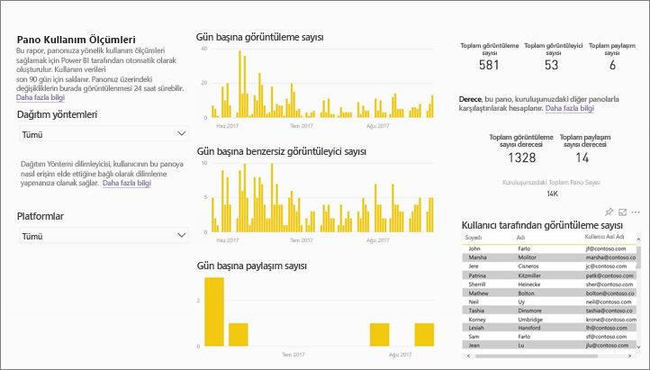

## Kullanım ölçümleri neden önemlidir?

İçeriğinizin nasıl kullanıldığını bilmeniz etkinizi göstermenize ve çalışmalarınızı önceliklendirmenize yardımcı olur. Kullanım ölçümleriniz, raporlarınızdan birinin kuruluşunuzdaki çok sayıda kullanıcı tarafından her gün kullanıldığını, oluşturduğunuz panolardan birinin ise hiç görüntülenmediğini gösterebilir. Bu tür geri bildirimler çalışmalarınızı yönlendirme açısından benzersizdir.

Kullanım ölçümleri raporları oluşturma özelliği yalnızca Power BI hizmetinde kullanılabilir.  Ancak bir kullanım ölçümleri raporunu kaydeder veya bir panoya sabitlerseniz mobil cihazlarda açıp raporla etkileşime geçebilirsiniz.

### Önkoşullar

- Kullanım ölçümleri özelliği, atanan lisanslarından bağımsız olarak tüm kullanıcılara ilişkin kullanım bilgilerini toplar. Bununla birlikte, kullanım ölçümleri verilerine erişmek için Power BI Pro lisansı gerekir.
- Kullanım ölçümleri, seçilen çalışma alanındaki panolar veya raporlarla ilgili bilgiler içerir. Belirli bir panoya veya rapora ilişkin kullanım ölçümlerine erişmek için şunlara sahip olmanız gerekir:    
    • Bu pano veya rapora erişimi düzenleme izni var • Pro lisansı var

## Kullanım Ölçümleri raporu hakkında

**Kullanım ölçümleri**’ni veya  simgesini seçtiğinizde Power BI, bu içeriğin son 90 güne ait kullanım ölçümlerinin yer aldığı, önceden oluşturulmuş bir rapor oluşturur.  Rapor, aşina olduğunuz Power BI raporlarına benzer ancak etkileşimli değil, bilgilendirici olacak şekilde tasarlanmıştır. Son kullanıcılarınızın web üzerinden mi yoksa mobil uygulamadan mı erişim sağladığını görebilir, bu bilgiye göre filtreleme yapabilirsiniz. Panolarınız ve raporlarınız geliştikçe kullanım ölçümleri raporları da yeni verilerle güncelleştirilecektir.  

Kullanım ölçümleri raporları **Son görüntülenen**, **Çalışma Alanı**, **Sık Kullanılanlar** veya diğer içerik listelerinde gösterilmez. Bu raporlar uygulamaya eklenemez. Kullanım ölçümleri raporundaki kutucuklardan birini bir panoya sabitlemeniz halinde ilgili pano bir uygulamaya veya içerik paketine eklenemez.

Rapor verilerini yakından incelemek veya veri kümesiyle kendi raporlarınızı oluşturmak için **Farklı kaydet** (bkz. [Kullanım Ölçümleri raporunu tam özellikli bir Power BI raporu olarak kaydetme](#Save-the-Usage-Metrics-report-as-a-full-featured-Power-BI-report-(personalize))) seçeneğini kullanın.

## Bir pano veya rapora ilişkin Kullanım Ölçümleri raporunu açma

1. İlgili panoyu veya raporu içeren çalışma alanından başlayın.
2. Çalışma alanı içerik listesinden veya panonun ya da raporun içinden **Kullanım ölçümleri**  simgesini seçin.

    

    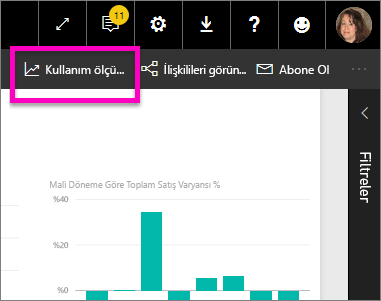
3. Bunu ilk kez yaptığınızda Power BI, kullanım ölçümleri raporunu oluşturur ve hazır olduğunda sizi bilgilendirir.

    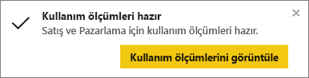
4. Sonuçları açmak için **Kullanım ölçümlerini görüntüle**'yi seçin.

    Kullanım ölçümleri, Power BI panolarını ve raporlarını dağıtma ve bunların bakımını yapma konusunda size yardımcı olacaktır. Raporunuzun en faydalı sayfalarını ve hangilerini kaldırmanız gerektiğini merak mı ediyorsunuz? Öğrenmek için **Rapor sayfası**'na göre dilimleyin. Panonuz için bir mobil düzen oluşturmanız gerekip gerekmediğini merak mı ediyorsunuz? İçeriğinize mobil uygulamalardan ve web tarayıcısından erişen kullanıcıların sayısını görmek için **Platformlar**'a göre dilimleyin.

5. İsteğe bağlı olarak, bir görselleştirmenin üzerine gelin ve görselleştirmeyi bir panoya eklemek için raptiye simgesini seçin. Alternatif olarak, sayfanın tamamını bir panoya eklemek için üstteki menü çubuğunda **Canlı Sayfayı Sabitleme** seçeneğini belirleyin. Panodan kullanım ölçümlerini daha kolayca izleyebilir veya başkalarıyla paylaşabilirsiniz.

    > [!NOTE]
    > Kullanım ölçümleri raporundaki kutucuklardan birini bir panoya sabitlemeniz halinde ilgili pano bir uygulamaya veya içerik paketine eklenemez.

## Hangi ölçümler raporda yer alır?

| Ölçüm | Pano | Rapor | Açıklama |
| --- | --- | --- | --- |
| Distribution method dilimleyicisi |evet |evet |Kullanıcıların içeriğe erişme şekli. Bunun için 3 olası yöntem vardır. Kullanıcılar panoya veya rapora bir [uygulama çalışma alanına](consumer/end-user-experience.md) üye olarak, içeriğin [kendileriyle paylaşılması](service-share-dashboards.md) yoluyla veya bir içerik paketini/uygulamayı yükleyerek erişebilir.  Uygulamadan gerçekleştirilen görüntüleme işlemleri "içerik paketi" olarak değerlendirilir. |
| Platforms dilimleyicisi |evet |evet |Panoya veya rapora Power BI hizmetinden (powerbi.com) mi yoksa mobil cihazdan mı erişim sağlandı? Mobile seçeneğine iOS, Android ve Windows uygulamalarımızın tamamı dahildir. |
| Report page dilimleyicisi |hayır |evet |Raporda 1'den fazla sayfa varsa raporu görüntülenen sayfalara göre dilimleyebilirsiniz. Listede "Boş" seçeneğinin bulunması, bir rapor sayfasının yeni eklendiğini (yeni sayfanın gerçek adının dilimleyici listesine eklenmesi 24 saate kadar sürebilir) ve/veya rapor sayfalarının silindiğini gösterir. Bu gibi durumlarda "Boş" seçeneği görüntülenir. |
| Views per day |evet |evet |Günlük toplam görüntüleme sayısı. Görüntüleme, kullanıcıların bir rapor sayfasını veya panoyu yüklemesi olarak tanımlanır. |
| Unique viewers per day |evet |evet |Panoyu veya raporu görüntüleyen *farklı* kullanıcıların sayısı (AAD kullanıcı hesabına göre). |
| Views per user |evet |evet |Her bir kullanıcıya göre ayrılmış şekilde, son 90 güne ait görüntüleme sayısı. |
| Shares per day |evet |hayır |Panonun başka bir kullanıcı veya grupla paylaşılma sayısı. |
| Total views |evet |evet |Son 90 gün içindeki görüntüleme sayısı. |
| Total viewers |evet |evet |Son 90 gün içindeki benzersiz görüntüleyen sayısı. |
| Total shares |evet |hayır |Panonun veya raporun son 90 gün içinde paylaşılma sayısı. |
| Total in organization |evet |evet |Kuruluşun tamamında son 90 gün içinde en az bir kez görüntülenen tüm panoların veya raporların sayısı.  Sıralamayı hesaplamak için kullanılır. |
| Derece: Toplam görüntüleme sayısı |evet |evet |Kuruluştaki tüm panoların veya raporların son 90 gün içindeki toplam görüntülenme sayısı değerlendirildiğinde bu panonun veya raporun sırası. |
| Derece: Toplam paylaşım sayısı |evet |hayır |Kuruluştaki tüm panoların son 90 gün içindeki toplam paylaşılma sayısı değerlendirildiğinde bu panonun veya raporun sırası. |

### Dashboard Usage Metrics raporu

### Report Usage Metrics raporu

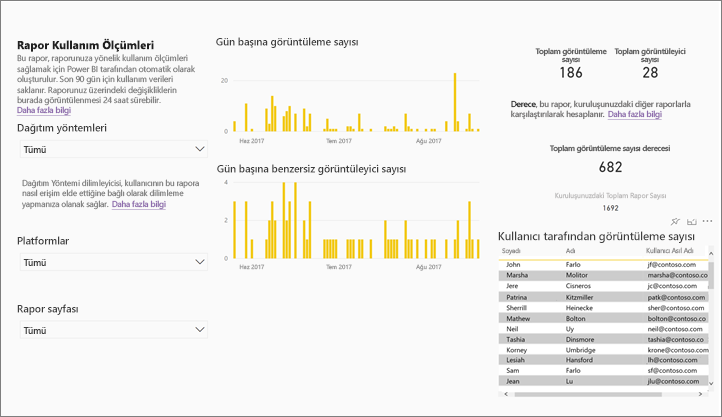

## Kullanım Ölçümleri raporunu tam özellikli bir Power BI raporu olarak kaydetme (kişiselleştirme)

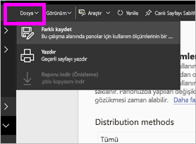

Kullanım ölçümleri raporunu özelleştirilebilen ve paylaşılabilen tam özellikli bir Power BI raporuna dönüştürmek için **Farklı kaydet** seçeneğini kullanın. Raporun kişiselleştirilmiş bir kopyasını oluşturduktan sonra, bağlantılı veri kümesine tam erişim sahibi olarak kullanım ölçümleri raporunu ihtiyaçlarınıza göre istediğiniz şekilde özelleştirebilirsiniz. Dilerseniz Power BI Desktop uygulamasını kullanıp [Power BI hizmetine canlı bağlantı özelliğinden](https://powerbi.microsoft.com/blog/connecting-to-datasets-in-the-power-bi-service-from-desktop) faydalanarak özel kullanım ölçümleri raporları oluşturabilirsiniz.

Üstelik çalışma alanındaki tüm pano veya raporlara ilişkin kullanım bilgilerini içeren bağlantılı veri kümesinden de yararlanabilirsiniz. Bu sayede çok daha fazla seçeneğe sahip olursunuz. Örneğin, çalışma alanınızdaki tüm panoları kullanım açısından karşılaştıran bir rapor oluşturabilirsiniz. Ayrıca, söz konusu uygulama içinde dağıtılmış olan tüm içeriğe ilişkin kullanım bilgilerini toplayarak Power BI uygulamanız için bir kullanım ölçümleri panosu oluşturabilirsiniz.  Aşağıdaki [Sayfa düzeyi filtresini kaldırma](#remove-the-filter-to-see-all-the-usage-metrics-data-in-the-workspace) bölümüne bakın.

### "Farklı kaydet" seçeneğini kullandığınızda neler oluşturulur?

Power BI tam özellikli bir rapor oluşturduğunda, son 90 gün içinde erişilmiş olan **geçerli çalışma alanındaki tüm panolardan veya raporlardan oluşan** yeni bir veri kümesi de oluşturur. Örneğin, üç pano ve iki rapor içeren "Sales" adında bir çalışma alanınız olduğunu ve "Northeast" panosu için bir kullanım ölçümleri raporu oluşturduğunuzu düşünelim. Ardından, raporu kişiselleştirmek ve tam özellikli bir rapora dönüştürmek için **Farklı kaydet** seçeneğini kullandığınızı kabul edelim. Yeni rapora ilişkin veri kümesinde *yalnızca "Northeast" adlı panoya ait değil*, "Sales" çalışma alanındaki üç panonun tamamına ait kullanım ölçümleri bulunur. Raporda varsayılan olarak "Northeast" panosuna ait veriler gösterilir. Üç panoya ait verilerin tamamını görüntülemek için [filtreyi kaldırmanız](#remove-the-filter-to-see-all-the-usage-metrics-data-in-the-workspace) (tek tıklama) gerekir.

### "Farklı kaydet" seçeneğiyle kullanım raporunun bir kopyasını oluşturma

"Farklı kaydet" seçeneğini kullanarak bir kopya oluşturduğunuzda (kişiselleştirme), Power BI önceden oluşturulmuş salt okunur raporu tam özellikli bir rapora dönüştürür.  İlk bakışta iki rapor aynı görünür. Ancak artık raporu Düzenleme görünümü'nde açabilir; yeni görselleştirme, filtre ve sayfa ekleyebilir, var olan görselleştirmeleri değiştirebilir veya silebilir ve çok daha fazlasını yapabilirsiniz. Power BI, yeni raporu ve veri kümesini geçerli çalışma alanına kaydeder. Aşağıdaki örnekte geçerli çalışma alanı **mihart**'tır.

1. Önceden oluşturulmuş kullanım ölçümleri raporunda **Dosya > Farklı Kaydet**'i seçin. Power BI, kullanım ölçümleri raporunu tam özellikli bir Power BI raporuna dönüştürür. Buna *kişiselleştirilmiş* kullanım ölçümleri raporu adı verilir. Kişiselleştirilmiş kullanım raporu ve veri kümesi, **mihart* adlı geçerli çalışma alanına kaydedilir.

    
2. Raporu, Düzenleme görünümü'nde açın ve [diğer Power BI raporlarında olduğu gibi etkileşim kurun](service-interact-with-a-report-in-editing-view.md). Örneğin, yeni sayfalar ekleyebilir, yeni görselleştirmeler oluşturabilir, filtreler ekleyebilir, yazı tiplerini ve renklerini biçimlendirebilirsiniz.

    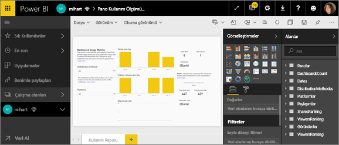
3. Alternatif olarak, yeni veri kümesini kullanarak sıfırdan bir rapor oluşturabilirsiniz.

    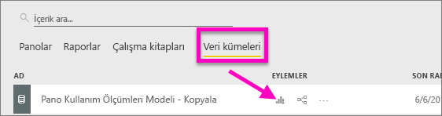
4. Yeni rapor, geçerli çalışma alanına (mihart) kaydedilir ve ayrıca **Son görüntülenen** içerik listesine eklenir.

    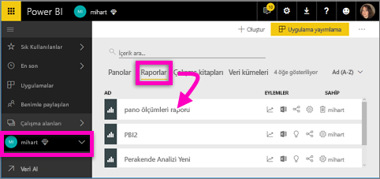

### Çalışma alanındaki ***tüm*** kullanım ölçümleri verilerini görmek için filtreyi kaldırma

Çalışma alanındaki tüm pano veya raporlara ait ölçümleri görmek için bir filtreyi kaldırmanız gerekir. Kişiselleştirilmiş rapor, varsayılan olarak yalnızca oluşturulduğu panoya veya rapora ait ölçümleri görüntüleyecek şekilde filtrelenmiştir.

Örneğin, bu yeni kişiselleştirilmiş raporu oluşturmak için "European sales" adlı panoyu kullandıysanız yalnızca "European sales" panosuna ait kullanım verileri görüntülenir. Filtreyi kaldırmak ve çalışma alanındaki tüm panolara ait verileri görüntülemek için:

1. Kişiselleştirilmiş raporu Düzenleme görünümü'nde açın.

    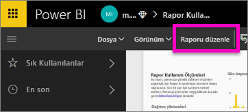
2. Filtreler bölmesinde **Rapor düzeyi filtreleri** demetini bulun ve "x" simgesini seçerek filtreyi kaldırın.

    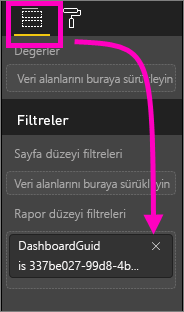

    Kişiselleştirilmiş raporunuzda artık çalışma alanının tamamına ait ölçümler görüntülenir.

## Power BI yöneticileri için kullanım ölçümlerine ilişkin yönetici denetimleri

Kullanım ölçümleri raporları, Power BI veya Office 365 yöneticileri tarafından etkinleştirilip devre dışı bırakılabilecek bir özelliktir. Yöneticiler kullanım ölçümlerine erişim sahibi olan kullanıcılar üzerinde ayrıntılı denetime sahiptir. Varsayılan olarak bu özellik, kuruluştaki tüm kullanıcılar için Etkin durumdadır.

1. Power BI hizmetinin sağ üst köşesindeki dişli simgesini ve ardından **Yönetici portalı**'nı seçerek Yönetici portalını açın.

    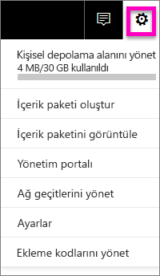
2. Yönetici portalında **Kiracı ayarları**'nı ve ardından **İçerik oluşturucuları için kullanım ölçümleri**'ni seçin.

    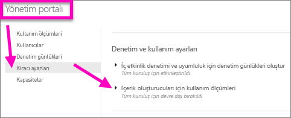
3. Kullanım ölçümlerini etkinleştirin (veya devre dışı bırakın) ve **Uygula**'yı seçin.

    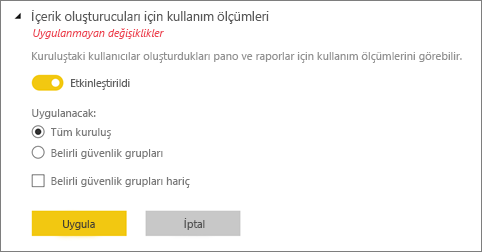

Varsayılan olarak, kullanım ölçümleri için kullanıcı başına veriler etkinleştirilir ve içerik oluşturucunun hesap bilgileri ölçüm raporuna eklenir. Kullanıcılardan bazıları veya tümü için bu bilgilerin eklenmesini istemezsiniz, belirtilen güvenlik grupları veya kuruluşun tamamı için özelliği devre dışı bırakın. Bu durumda hesap bilgileri raporda *Adsız* olarak gösterilir.

Yöneticiler kullanım ölçümlerini kuruluşun tamamı için devre dışı bırakırken **Tüm mevcut kullanım ölçümleri içeriğini silin** seçeneğini kullanarak kullanım ölçümleri raporları ve veri kümeleri kullanılarak oluşturulmuş olan mevcut tüm raporları ve pano kutucuklarını silebilir. Bu seçenek, kullanmakta olanlar dahil olmak üzere kuruluştaki tüm kullanıcılar için kullanım ölçümlerine yönelik erişimi kaldırır. Kullanım ölçümleri içeriğini silme işlemi geri alınamadığından dikkatli hareket etmeniz önerilir.

## Ulusal bulutlarda kullanım ölçümleri

Power BI, ayrı ayrı ulusal bulutlarda kullanılabilir. Bu bulutlar hizmet teslimi, veri dayanıklılığı, erişim ve denetimle ilgili yerel yasal düzenlemelere yönelik benzersiz bir modelle birlikte, Power BI'ın küresel sürümüyle aynı güvenlik, gizlilik, uyumluluk ve saydamlık düzeyleri sunar. Yerel yasal düzenlemelere yönelik bu benzersiz modelden dolayı, ulusal bulutlarda kullanım ölçümleri sağlanmaz. Daha fazla bilgi için [ulusal bulutlar](https://powerbi.microsoft.com/en-us/clouds/) konusuna bakın.

## Önemli noktalar ve sınırlamalar

Kullanım ölçümleriyle denetim günlüklerini karşılaştırırken farklılıklar olabileceğini ve bunların nedenlerini anlamak önemlidir. *Denetim günlükleri* Power BI hizmetinin verileri kullanılarak toplanırken, *Kullanım ölçümleri* istemcide toplanır. Bu farklılıktan dolayı denetim günlüklerindeki etkinliklerin toplam sayısı her zaman kullanım ölçümleriyle uyuşmaz. Nedenleri şunlardır:

* Kullanım ölçümleri bazen ağ bağlantılarındaki tutarsızlıklar, reklam engelleyiciler veya istemciden etkinlikleri göndermeyi aksatan diğer sorunlar nedeniyle etkinlikleri eksik sayabilir.
* Bu makalede daha önce açıklandığı gibi belirli görünüm türleri kullanım ölçümlerine dahil edilmez.
* Kullanım ölçümleri istemcinin isteği Power BI hizmetine geri göndermesine gerek olmadan yenilemesi durumlarında, bazen etkinlikleri fazla sayabilir.

Kullanım ölçümleriyle denetim günlükleri arasındaki farklılıklara ek olarak, kullanım ölçümleri hakkında aşağıda yer alan soru ve yanıtlar kullanıcılara ve yöneticilere yararlı olabilir:

S:    Bir pano veya raporda kullanım ölçümleri çalıştıramıyorum C:    Kullanım ölçümlerimi yalnızca sahip olduğunuz veya düzenleme izniniz olan içeriklerde görürsünüz.

S:    Kullanım ölçümleri, eklenen pano ve raporlara ilişkin görüntülenme verilerini kaydeder mi?
C:    Kullanım ölçümleri şu anda tümleşik panolar, raporlar ve [web’de yayınlama](service-publish-to-web.md) akışının kullanımını yakalamayı desteklememektedir.          Bu gibi durumlarda mevcut web analizi platformlarını kullanarak içeriği barındıran uygulamaya veya portala ilişkin kullanımı takip etmenizi öneririz.

S:    Hiçbir içerikte kullanım ölçümleri çalıştıramıyorum.
C1:    Yöneticiler bu özelliği kuruluş çapında devre dışı bırakabilir.  Böyle bir durumun söz konusu olup olmadığını görmek için yöneticinizle iletişime geçin.
C2:    Kullanım ölçümleri Power BI Pro özelliğidir.

S:    Veriler güncel değil gibi görünüyor. Örneğin, dağıtım yöntemleri görünmüyor, rapor sayfaları eksik vs. C:    Verilerin güncelleştirilmesi 24 saat sürebilir.

S:    Çalışma alanında dört rapor var ancak kullanım ölçümleri yalnızca 3 tanesini gösteriyor.
C:    Kullanım ölçümleri raporu, yalnızca son 90 gün içinde erişilmiş olan raporları (veya panoları) kapsar.  Bir rapor (veya pano) gösterilmiyorsa en son 90 günden daha uzun bir süre önce kullanılmıştır.

## Sonraki adımlar

[Bir panoyu sık kullanılanlara ekleme](consumer/end-user-favorite.md)

Başka bir sorunuz mu var? [Power BI Topluluğu'na başvurun](http://community.powerbi.com/)
