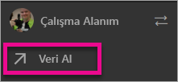
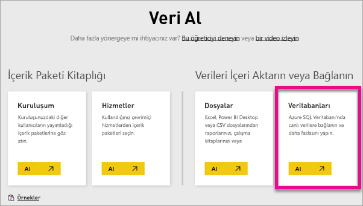
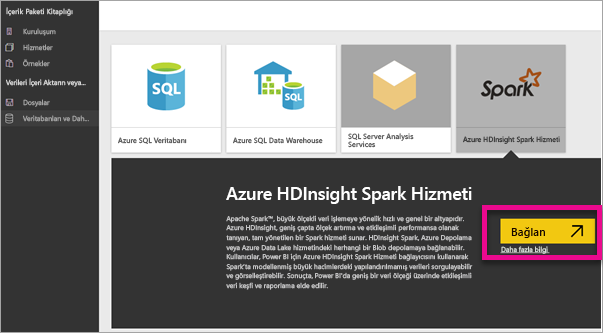
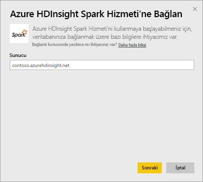
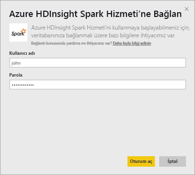
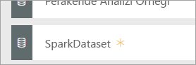
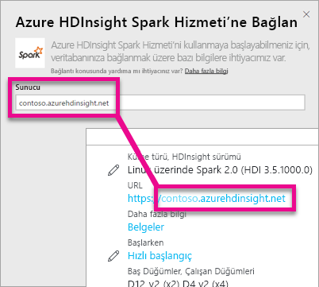
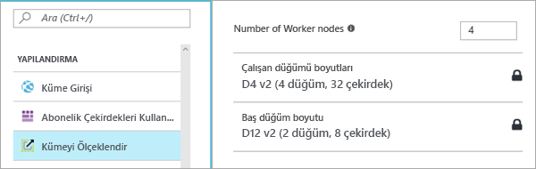

# DirectQuery ile HDInsight Spark
DirectQuery ile Azure HDInsight'taki Spark hizmeti, Spark kümenizde bulunan verilere ve ölçümlere dayalı dinamik raporlar oluşturmanıza olanak sağlar. DirectQuery ile, siz verileri rapor görünümünde araştırırken Azure HDInsight Spark kümenize sorgular gönderilir. Bu deneyim, bağlandıkları varlıkları nasıl kullanacakları konusunda yeterli bilgi sahibi olan kullanıcılar için önerilir.

> [!WARNING]
> Spark'ı temel alan veri kümelerinde oluşturulan pano kutucukları için otomatik kutucuk yenileme özelliği devre dışı bırakıldı. Yenileme işlemini elle gerçekleştirmek için **Pano Kutucuklarını Yenile**'yi seçebilirsiniz. Raporlar bu işlemden etkilenmez ve güncel kalır. 
> 
> 

Power BI hizmetinde DirectQuery'yi kullanarak Azure HDInsight'taki Spark veri kaynağınıza bağlanmak için aşağıdaki adımları uygulayabilirsiniz.

1. Sol gezinti bölmesinin alt kısmında bulunan **Veri Al**'ı seçin.
   
     
2. **Veritabanları ve Daha Fazlası**'nı seçin.
   
     
3. **Spark on Azure HDInsight** bağlayıcısını ve ardından **Bağlan**'ı seçin.
   
     
4. Bağlanmak istediğiniz **sunucunun** adını, **kullanıcı adınızı** ve **parolanızı** girin. Sunucu adı her zaman \<kümeadı\>.azurehdinsight.net biçimindedir. Bu değerleri nasıl bulacağınız hakkında daha ayrıntılı bilgi aşağıda yer almaktadır.
   
     
   
     
5. Bağlantı gerçekleştikten sonra "SparkDataset" adlı yeni bir veri kümesi görürsünüz. Veri kümesine, oluşturulan yer tutucu kutucuğu aracılığıyla da erişebilirsiniz.
   
     
6. Veri kümesini ayrıntılı olarak incelediğinizde veritabanınızdaki tüm tablo ve sütunları keşfedebilirsiniz. Bir sütunu seçtiğinizde kaynağa bir sorgu gönderilir ve görseliniz dinamik olarak oluşturulur. Bu görseller yeni bir rapora kaydedilerek panonuza sabitlenebilir.

## Spark on HDInsight parametrelerinizi bulma
Sunucu her zaman \<kümeadı\>.azurehdinsight.net biçimindedir ve Azure portalında bulunabilir.

Kullanıcı adı ve parola bilgileri de Azure portalında bulunabilir.

## Sınırlamalar
Bu kısıtlamalar ve notlar, biz deneyimleri iyileştirmeye devam ettikçe değişebilir. Ek belgeler [Azure HDInsight'taki Apache Spark ile BI araçlarını kullanma](https://azure.microsoft.com/documentation/articles/hdinsight-apache-spark-use-bi-tools/) sayfasında mevcuttur

* Power BI hizmeti yalnızca Spark 2.0 ve HDInsight 3.5 yapılandırmalarını destekler.
* Sütun seçme veya filtre ekleme gibi her eylemin ardından veritabanına bir sorgu gönderilir. Çok büyük alanları seçmeden önce uygun bir görsel türü belirlemeyi göz önünde bulundurun.
* DirectQuery veri kümeleri için Soru-Cevap özelliği kullanılamaz.
* Şema değişiklikleri otomatik olarak alınmaz.
* Power BI, bir veri kümesindeki **tüm tablolarda** 16.000'e kadar sütunu destekler. Ayrıca Power BI her tablo için dahili bir satır numarası sütunu ekler. Bu da veri kümesinde 100 tablonuz olması halinde kullanabileceğiniz sütun sayısının 15.900 olacağı anlamına gelir. Spark veri kaynağınızda bulunan veri miktarına bağlı olarak bu sınırlama ile karşılaşabilirsiniz.

## Sorun giderme
Kümenizde sorgu yürütme ile ilgili sorunlarla karşılaşıyorsanız uygulamanın çalışmakta olduğunu doğrulayın ve gerekirse uygulamayı yeniden başlatın.

Ayrıca Azure portalında **Yapılandırma** > **Kümeyi Ölçeklendirin** bölümünde ek kaynak ayırabilirsiniz:

## Sonraki adımlar
[Başlangıç: HDInsight Linux'te Apache Spark kümesi oluşturma ve Spark SQL'i kullanarak etkileşimli sorgular çalıştırma](https://azure.microsoft.com/documentation/articles/hdinsight-apache-spark-jupyter-spark-sql)  
[Power BI ile çalışmaya başlama](service-get-started.md)  
[Power BI için veri alma](service-get-data.md)  
Başka bir sorunuz mu var? [Power BI Topluluğu'na başvurun](http://community.powerbi.com/)

