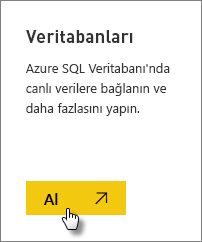
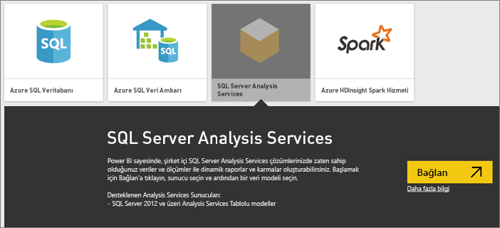
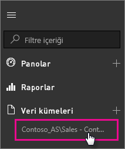

# Power BI'da SQL Server Analysis Services canlı verileri
Power BI'da canlı SQL Server Analysis Services sunucusuna bağlanmak için kullanabileceğiniz iki yöntem vardır. **Veri al** ekranından SQL Server Analysis Services sunucusuna bağlanabilir veya Analysis Services sunucusuna bağlı bir [Power BI Desktop dosyası](service-desktop-files.md) veya [Excel çalışma kitabı](service-excel-workbook-files.md) ile bağlantı kurabilirsiniz. En iyi deneyim için Microsoft, zengin araç setine ve Power BI Desktop dosyasının yedek bir kopyasını yerel olarak saklama olanağına sahip olan Power BI Desktop’u kullanmanızı önerir.

 >[!IMPORTANT]
 >* Canlı bir Analysis Services sunucusuna bağlanmak için yönetici tarafından yüklenmiş ve yapılandırılmış bir Şirket içi veri ağ geçidi olması gerekir. Daha fazla bilgi için bkz. [Şirket içi veri ağ geçidi](service-gateway-onprem.md).
 >* Ağ geçidi kullandığınızda veriler şirket içinde kalır.  Oluşturduğunuz raporlar, Power BI hizmetine kaydettiğiniz verileri kullanır. 
 >* [Soru-Cevap doğal dilde sorgu özelliği](service-q-and-a-direct-query.md), Analysis Services canlı bağlantıları için önizleme sürümdedir.

## Veri al ekranından bir modele bağlanmak için
1. **Çalışma Alanım**'da **Veri al**'ı seçin. Varsa grup çalışma alanı da kullanabilirsiniz.
   
   
2. **Veritabanları ve Daha Fazlası**'nı seçin.
   
   
3. **SQL Server Analysis Services** > **Bağlan**'ı seçin. 
   
   
4. Bir sunucu seçin. Bu adımda hiç sunucu görmüyorsanız ağ geçidi veya veri kaynağı yapılandırılmamış veya hesabınız ağ geçidinde veri kaynağının **Kullanıcılar** sekmesine eklenmemiş olabilir. Yöneticinize başvurun.
5. Bağlanmak istediğiniz modeli seçin. Bu, Tablolu veya Çok Boyutlu olabilir.

Bağlandığınız model, Power BI sitesinin **Çalışma Alanım/Veri Kümeleri** sayfasında görünür. Grup çalışma alanına geçtiyseniz veri kümesi grup içinde görünür.

## Pano kutucukları
Bir rapordan panoya sabitlediğiniz görsellere ait kutucuklar 10 dakikada bir otomatik olarak yenilenir. Şirket içi Analysis Services sunucunuzdaki veriler güncelleştirilirse kutucuklar, 10 dakika sonra otomatik olarak güncelleştirilir.

## Sık Karşılaşılan Sorunlar

* Model şeması yüklenemiyor hatası - Bu hata, SSAS’ye bağlanan kullanıcının SSAS veritabanına, küpüne ve modeline erişimi olmadığında meydana gelir.

## Sonraki adımlar
[Şirket içi veri ağ geçidi](service-gateway-onprem.md)  
[Analysis Services veri kaynaklarını yönetme](service-gateway-enterprise-manage-ssas.md)  
[Şirket içi veri ağ geçidiyle ilgili sorunları giderme](service-gateway-onprem-tshoot.md)  
Başka bir sorunuz mu var? [Power BI Topluluğu'na başvurun](http://community.powerbi.com/)