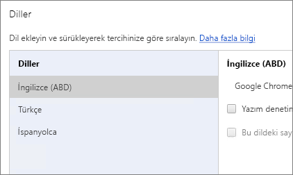
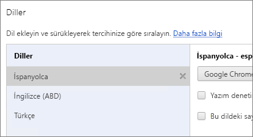
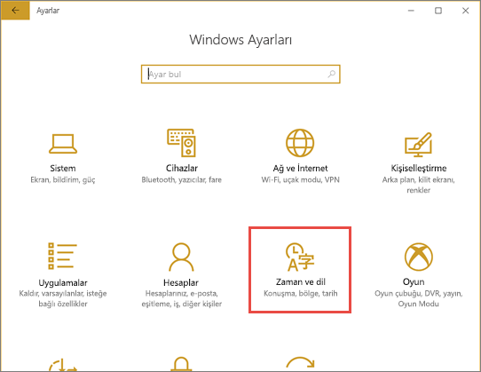
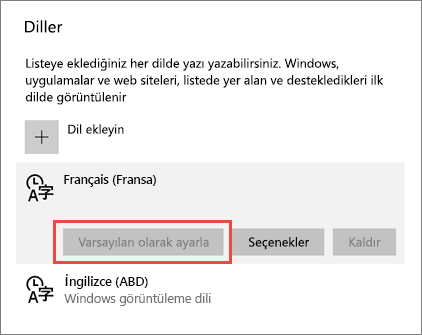
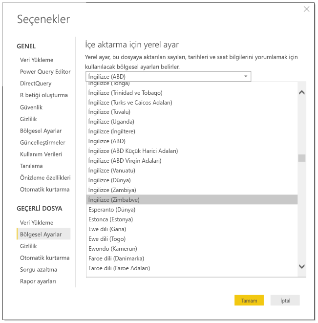
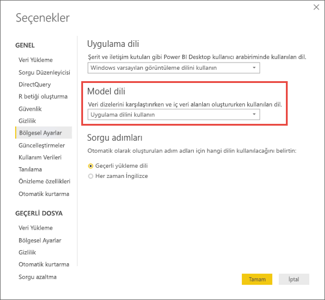

# Power BI için desteklenen diller ve ülkeler/bölgeler

Bu makalede Power BI hizmeti, Power BI Desktop ve Power BI belgeleri için desteklenen diller ile ülkelerin/bölgelerin bulunduğu listelere yer verilmiştir.

## Power BI'ın kullanılabildiği ülkeler ve bölgeler
Power BI'ın kullanılabildiği ülkelerin ve bölgelerin bir listesi için [uluslararası kullanılabilirlik listesine](https://products.office.com/business/international-availability) göz atın. 

## Power BI hizmetinin kullanıma sunulduğu diller
Power BI hizmeti (tarayıcıdaki) şu 44 dilde kullanılabilir:

* Arapça
* Baskça - Basque
* Bulgarca - Български
* Katalanca - català
* Çince (Basitleştirilmiş) - 中文(简体)
* Çince (Geleneksel) - 中文(繁體)
* Hırvatça - hrvatski
* Çekçe - čeština
* Danca - dansk
* Felemenkçe - Nederlands
* İngilizce - English
* Estonca - eesti
* Fince - suomi
* Fransızca - français
* Galiçya dili - galego
* Almanca - Deutsch
* Yunanca - Ελληνικά
* İbranice
* Hintçe - हिंदी
* Macarca - magyar
* Endonezce - Bahasa Indonesia
* İtalyanca - italiano
* Japonca - 日本語
* Kazakça - Қазақ
* Korece - 한국어
* Letonca - latviešu
* Litvanca - lietuvių
* Malayca - Bahasa Melayu
* Norveççe (Bokmål) - norsk (bokmål)
* Lehçe - Polski
* Portekizce (Brezilya) - Português
* Portekizce (Portekiz) - português
* Rumence - română
* Rusça - Русский
* Sırpça (Kiril) - српски
* Sırpça (Latin) - srpski
* Slovakça - slovenčina
* Slovence - slovenski
* İspanyolca - español
* İsveççe - svenska
* Tayca - ไทย
* Türkçe
* Ukraynaca - українська
* Vietnamca - Tiếng Việt

### Neler çevrilir?
Menüler, düğmeler, iletiler ve deneyiminiz sırasında karşılaşacağınız diğer öğeler dilinize çevrilir. Böylece Power BI'da kolayca gezinebilir ve hizmetle etkileşime geçebilirsiniz.

Şu anda birkaç özellik yalnızca İngilizce dilinde kullanıma sunulmaktadır:

* Microsoft Dynamics CRM, Google Analytics, Salesforce gibi hizmetlere bağlandığınızda Power BI'ın sizin için oluşturduğu panolar ve raporlar. (Yine de kendi dilinizde pano ve rapor oluşturabilirsiniz.)
* Soru-Cevap ile verilerinizi araştırma.

Diğer diller için yeni özellikler sunmaya devam edeceğiz, bizimle kalın. 

### Power BI hizmetinde dilinizi seçme
1. Power BI hizmetinde **Ayarlar** simgesi  > **Ayarlar**'ı seçin.
2. **Genel** sekmesi > **Dil**'i seçin.
3. Dilinizi ve ardından **Uygula**'yı seçin.

### Tarayıcınızda dilinizi değiştirme
Power BI, bilgisayarınızdaki dil tercihlerine göre dilinizi algılar. Bu tercihlere erişmek ve tercihleri değiştirmek için izleyeceğiniz yol işletim sisteminize ve tarayıcınıza göre değişiklik gösterebilir. Aşağıda söz konusu tercihlere Internet Explorer ve Google Chrome'dan nasıl erişebileceğiniz açıklanmıştır.

#### Internet Explorer (11 sürümü)
1. Tarayıcı pencerenizin sağ üst köşesindeki **Araçlar** düğmesine tıklayın:
   
   
2. **Internet Seçenekleri**'ne tıklayın.
3. Internet Seçenekleri iletişim kutusunun Genel sekmesinde Görünüm'ün altında bulunan **Diller** düğmesine tıklayın.

#### Google Chrome (42 sürümü)
1. Tarayıcı pencerenizin sağ üst köşesindeki menü düğmesine tıklayın:
   
   
2. **Ayarlar**'a tıklayın.
3. **Gelişmiş ayarları göster**'e tıklayın.
4. Diller bölümünde **Dil ve giriş ayarları** düğmesine tıklayın.
5. **Ekle**'ye tıklayın, bir dil seçin ve **Tamam**'a tıklayın.
   
   
   
   Yeni dil, listenin sonuna eklenir. 
6. Yeni dili listenin başına sürükleyin ve **Google Chrome'u bu dilde görüntüle**'ye tıklayın.
   
   
   
   Değişikliğin uygulanması için tarayıcınızı kapatıp yeniden açmanız gerekebilir.

## Power BI Desktop'ta dili veya yerel ayarı seçme
Power BI Desktop'ı almanızın iki yolu vardır: Uygulamayı indirebilir veya Windows Store'dan yükleyebilirsiniz.

* [Power BI Desktop'ı Windows Mağazası'ndan yükleyecekseniz](#choose-a-language-for-power-bi-desktop-installed-from-the-windows-store) tüm diller yüklenir ve Windows işletim sisteminizdeki varsayılan dile karşılık gelen dil gösterilir.
* [Power BI Desktop'ı indirecekseniz](#choose-a-language-when-you-download-power-bi-desktop) dili, indirme işleminden önce seçersiniz. 
* Belirli bir rapor için [veriler içeri aktarılırken kullanılacak bir yerel ayar](#choose-the-locale-to-be-used-when-importing-data-into-power-bi-desktop) da seçebilirsiniz. 

### Windows Mağazası'ndan yüklenen Power BI Desktop için dil seçme
1. Microsoft Store'dan [Power BI Desktop'ı yükleyin](http://aka.ms/pbidesktopstore).
2. Dili değiştirmek için bilgisayarınızda **Windows Ayarları** ifadesini arayın. 
3. **Zaman ve dil**'i seçin.
   
     
4. **Bölge ve dil**'i seçin, bir dil belirleyin ve ardından **Varsayılan olarak ayarla**'yı seçin.
   
     
   
     Power BI Desktop'ı tekrar başlattığınızda, varsayılan olarak ayarladığınız dil kullanılır. 

### Power BI Desktop'ı indirirken dil seçme
Power BI Desktop için seçtiğiniz dil, raporlardaki sayıların ve tarihlerin görüntülenme biçimini etkiler. 

* [Power BI Desktop'ı indirirken](https://powerbi.microsoft.com/desktop) bir dil seçin. 

Power BI Desktop'ın dilini değiştirmek için indirme sayfasına tekrar gidin ve uygulamayı farklı bir dilde indirin.

### Power BI Desktop'a veri aktarılırken kullanılacak yerel ayarı seçme
Power BI Desktop'ı indirerek veya Windows Mağazası'ndan yükleyerek edinmiş olmanız fark etmeksizin belirli bir rapor için Power BI Desktop sürümünüzdekinden farklı bir yerel ayar seçebilirsiniz. Bu, veri kaynağınızdan aktarılan verilerin yorumlanma biçimini değiştirir. Örneğin, "3/4/2017" tarihi 3 Nisan veya 4 Mart olarak yorumlanabilir. 

1. Power BI Desktop'ta **Dosya** > **Seçenekler ve ayarlar** > **Seçenekler** bölümüne gidin.
2. **Geçerli dosya** bölümünde **Bölgesel Ayarlar**'ı seçin.
3. **İçeri aktarma için yerel ayar** kutusunda farklı bir yerel ayar seçin. 
   
   
4. **Tamam**'ı seçin.

### Power BI Desktop'ta model dilini seçme

Power BI Desktop uygulamasının dilini ayarlamanın yanı sıra model dilini de ayarlayabilirsiniz. Model dili temelde iki öğeyi etkiler:

- Dizeleri karşılaştırma ve sıralama yöntemi. Örneğin, Türkçe iki farklı i harfine sahip olduğu için veritabanınızın harmanlama özelliğine göre sıralama sırasında bu iki harf farklı sıralarda yer alabilir. 
- Power BI Desktop uygulamasının tarih alanlarından gizli tarih tablosu oluştururken kullandığı dil. Örneğin alanların adı Month/Monat/Mois/Ay vs. olabilir.

> [!NOTE]
> Power BI modeli şu anda büyük/küçük harfe duyarlı (veya kana duyarlı) olmayan bir yerel ayar kullandığı için “ABC” ile “abc” eşdeğer kabul edilir. Veri kümesine ilk olarak “ABC” yüklenirse, yalnızca büyük harf bakımından farklılık gösteren “Abc” gibi diğer dizeler ayrı bir değer olarak yüklenmez.
> 
>

Model dilini ayarlamak için aşağıdaki yönergeleri izleyin.

1. Power BI Desktop'ta **Dosya** > **Seçenekler ve ayarlar** > **Seçenekler** bölümüne gidin.
2. **Genel**'in altında **Bölgesel Ayarlar**'ı seçin.
3. **Model dili** kutusundan farklı bir dil seçin. 

    

> [!NOTE]
> Bir Power BI modeli oluşturulduktan sonra dili değiştirilemez.
> 
>

## Yardım belgelerinin kullanıma sunulduğu diller
Yardım belgeleri şu 10 dilde kullanıma sunulmuştur: 

* Çince (Basitleştirilmiş) - 中文(简体)
* Çince (Geleneksel) - 中文(繁體)
* Fransızca - français
* Almanca - Deutsch
* İtalyanca - italiano
* Japonca - 日本語
* Korece - 한국어
* Portekizce (Brezilya) - Português
* Rusça - Русский
* İspanyolca - español

## Sonraki adımlar
* Power BI mobil uygulamalarından birini kullanıyor musunuz? Ayrıntılı bilgi için bkz. [Power BI mobil uygulamalarında desteklenen diller](consumer/mobile/mobile-apps-supported-languages.md).
* Sorularınız mı var? [Power BI Topluluğu](http://community.powerbi.com/)'na sorun.
* Sorununuz hâlâ çözülmedi mi? Lütfen [Power BI destek sayfasını](https://powerbi.microsoft.com/support/) ziyaret edin.

