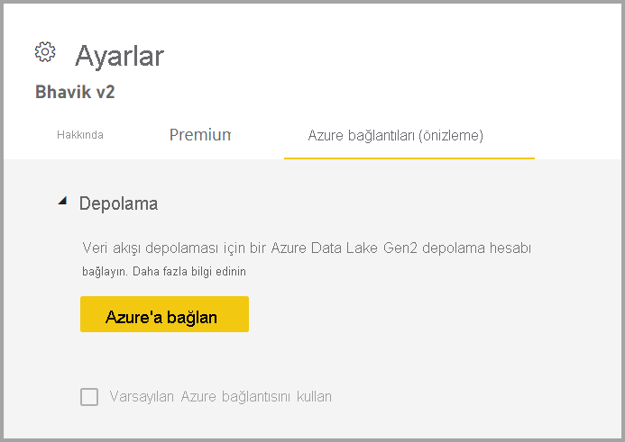
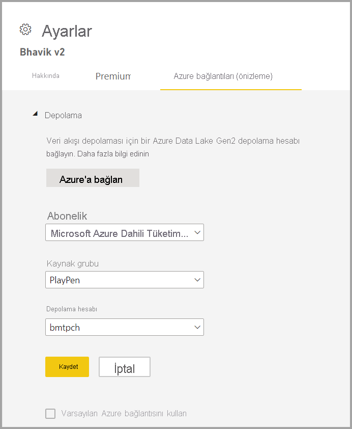

# Veri akışı depolama alanını Azure Data Lake 2. Nesil kullanacak şekilde yapılandırma 

Power BI ile kullanılan veriler varsayılan olarak Power BI tarafından sağlanan iç depolama alanında depolanır. Veri akışları ve Azure Data Lake Storage 2. Nesil (ADLS 2. Nesil) tümleştirmesi ile, kuruluşunuzun Azure Data Lake Storage 2. Nesil hesabında veri akışlarınızı depolayabilirsiniz.

Kullanılacak ADLS 2. Nesil depolama alanını yapılandırmanın iki yolu vardır: kiracı tarafından atanmış ADLS 2. Nesil hesabı kullanabilir veya çalışma alanı düzeyinde kendi ADLS 2. Nesil deponuzu getirebilirsiniz. 

## Ön koşullar

Kendi ADLS 2. Nesil hesabınızı getirmek için depolama hesabı, kaynak grubu veya abonelik katmanında sahip izinlerine sahip olmanız gerekir. Yönetici olsanız dahi kendinize sahip iznini atamanız şarttır. 

Ayrıca ADLS 2. Nesil hesabı, Power BI kiracınızla aynı bölgeye dağıtılmalıdır. Kaynakların konumunun aynı bölgede olmaması durumunda bir hata oluşur.

Son olarak ADLS 2. Nesil hesaplarına yönetici portalından bağlanabilirsiniz ancak doğrudan bir çalışma alanına bağlanacak olursanız bağlanmadan önce çalışma alanında veri akışı bulunmadığından emin olmanız gerekir.

## Çalışma alanında Azure Data Lake 2. Nesil hesabına bağlanma
İçinde veri akışı olmayan bir çalışma alanına gidin. **Çalışma alanı ayarları**'nı seçtikten sonra yeni eklenen **Azure Bağlantıları** sekmesine gidin. **Azure Bağlantıları** sekmesini ve ardından **Depolama** bölümünü seçin.

 
Kiracıda ADLS 2. Nesil yapılandırılmışsa **Varsayılan Azure bağlantısını kullan** seçeneği görünür. Bu aşamada iki seçeneğiniz vardır: **Varsayılan Azure bağlantısını kullan** kutusunu işaretleyerek kiracıda yapılandırılmış olan ADLS 2. Nesil hesabını kullanabilir veya **Azure'a bağlan**'ı seçerek yeni bir Azure Depolama hesabına bağlanabilirsiniz. 

**Azure'a bağlan**'ı seçtiğinizde Power BI, erişim sahibi olduğunuz Azure aboneliklerinin listesini alır. Açılan listeden ADLS 2. Nesil'in etkin olduğunu gösteren hiyerarşik ad alanı seçeneğinin etkinleştirilmiş olduğu geçerli bir Azure aboneliği, kaynak grubu ve depolama hesabı seçin.

 
Seçim yaptıktan sonra **Kaydet**'i seçin. Çalışma alanını kendi ADLS 2. Nesil hesabınıza başarıyla eklemiş oldunuz. Power BI, depolama hesabını gerekli izinlerle otomatik olarak yapılandırır ve verilerin yazılacağı Power BI dosya sistemini ayarlar. Bu noktada bu çalışma alanının içindeki tüm veri akışlarının verileri doğrudan bu dosya sistemine yazılır ve bunu diğer Azure hizmetlerinde kullanarak tüm kuruluş veya departman verileri için tek bir kaynak oluşturabilirsiniz.

## Azure Data Lake 2. Nesil hesabını çalışma alanından veya kiracıdan ayırma

Çalışma alanı düzeyindeki bir bağlantıyı kaldırmak için öncelikle çalışma alanındaki tüm veri akışlarının silindiğinden emin olmanız gerekir. Tüm veri akışları kaldırıldıktan sonra çalışma alanı ayarlarından **Bağlantıyı kes**'i seçin. Bu durum kiracı için de geçerlidir ancak kiracı düzeyinde bağlantıyı kesebilmek için öncelikle tüm çalışma alanlarının da kiracı depolama hesabından ayrıldığından emin olmanız gerekir.

## Azure Data Lake 2. Nesil'i devre dışı bırakma

**Yönetici portalının** **veri akışları** bölümünde kullanıcıların bu özelliğe erişimini devre dışı bırakabilir ve çalışma alanı yöneticilerinin kendi Azure Depolama hesaplarını getirme iznini kaldırabilirsiniz.

## Sonraki adımlar
Aşağıdaki makaleler veri akışları ve Power BI hakkında daha fazla bilgi sunmaktadır:

* [Veri akışlarına giriş ve self servis veri hazırlığı](dataflows-introduction-self-service.md)
* [Veri akışı oluşturma](dataflows-create.md)
* [Veri akışı yapılandırma ve kullanma](dataflows-configure-consume.md)
* [Veri akışlarının Premium özellikleri](dataflows-premium-features.md)
* [Veri akışları ve yapay zeka](dataflows-machine-learning-integration.md)
* [Veri akışı sınırlamaları ve önemli noktalar](dataflows-features-limitations.md)
* [Veri akışları için en iyi yöntemler](dataflows-best-practices.md)