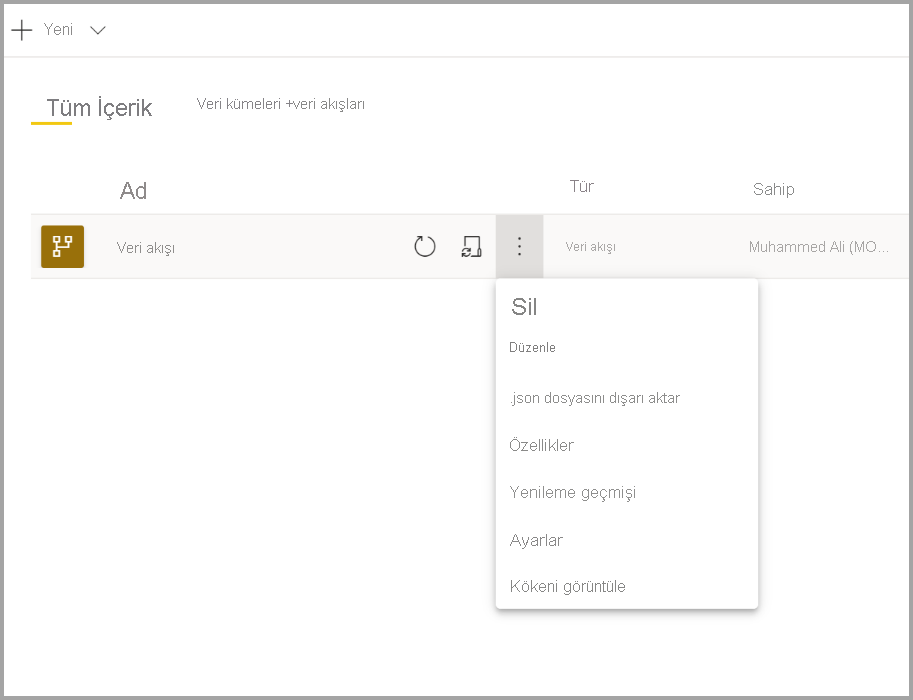
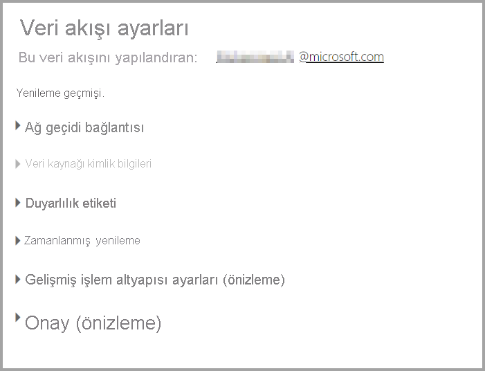
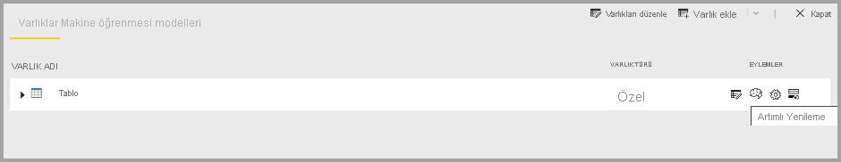
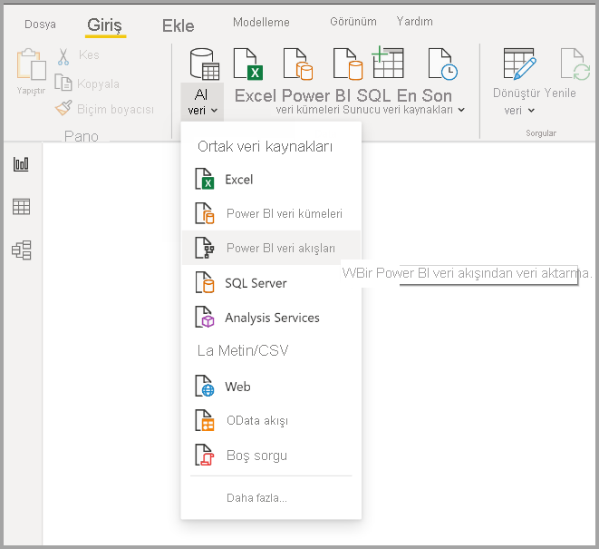
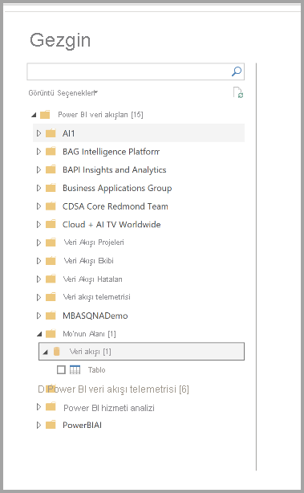

# Veri akışı yapılandırma ve kullanma

Veri akışlarını kullanarak birden çok veri kaynağından gelen verileri birleştirebilir ve modelleme için hazırlayabilirsiniz. Bir veri akışı oluşturduğunuzda o veri akışının verilerini yenilemeniz istenir. Power BI Desktop içindeki bir veri kümesinde kullanabilmek veya bağlantılı ya da hesaplanmış varlık olarak başvurmak için veri akışının yenilenmesi gerekir.

## Veri akışı yapılandırma

Veri akışının yenilenmesini yapılandırmak için **Daha Fazla** menüsünü (üç nokta) ve ardından **Ayarlar**'ı seçin.

**Ayarlar** içinde bulunan ve veri akışınız için kullanabileceğiniz seçenekler aşağıda açıklanmıştır.

* **Sahipliği Al:** Veri akışının sahibi siz değilseniz bu ayarların birçoğu devre dışı bırakılır. Veri akışının sahipliğini almak için **Devral**'ı seçerek denetimi üstlenin. Gerekli erişim düzeyine sahip olduğunuzdan emin olmak için kimlik bilgilerini sağlamanız istenir.

* **Ağ Geçidi Bağlantısı:** Bu bölümde veri akışının ağ geçidi kullanıp kullanmayacağını ve kullanılacak ağ geçidini seçebilirsiniz. 

* **Veri Kaynağı Kimlik Bilgileri:** Bu bölümde kullanılan kimlik bilgilerini seçebilir ve veri kaynağının kimlik doğrulama yöntemini değiştirebilirsiniz.

* **Duyarlılık Etiketi:** Burada veri akışındaki verilerin duyarlılık düzeyini tanımlayabilirsiniz. Duyarlılık etiketleri hakkında daha fazla bilgi edinmek için bkz. [Power BI'da duyarlılık etiketlerini uygulama](../../admin/service-security-apply-data-sensitivity-labels.md).

* **Zamanlanmış Yenileme:** Burada seçilen veri akışının yenileneceği saatleri tanımlayabilirsiniz. Veri akışı, veri kümesiyle aynı sıklıkta yenilenebilir.

* **Gelişmiş İşlem Altyapısı ayarları:** Burada veri akışının işlem altyapısında depolanıp depolanmayacağını belirleyebilirsiniz. İşlem altyapısı bu veri akışına başvuran ek veri akışlarına izin vererek birleştirme ve diğer dönüştürme işlemlerini normale kıyasla çok daha hızlı gerçekleştirmenizi sağlar. Ayrıca veri akışında DirectQuery kullanılmasını da mümkün kılar. **Açık** seçeneği, veri akışının her zaman DirectQuery modunu desteklemesini ve başvuruların altyapıdan faydalanmasını sağlar. **İyileştirilmiş**, altyapının yalnızca bu veri akışına başvurulduğunda kullanılacağı anlamına gelir. **Kapalı** seçildiğinde işlem altyapısı ve DirectQuery özelliği bu veri akışı için devre dışı bırakılır.

* **Onaylar:** Veri akışının sertifikalı mı yoksa yükseltilmiş mi olacağını tanımlayabilirsiniz. 

## Veri akışını yenileme
Veri akışları, birbirine bağlı yapı taşları gibi hareket eder. *Ham Veriler* adlı bir veri akışına ve *Ham Veriler* veri akışına bağlantılı varlık içeren *Dönüştürülmüş Veriler* adlı bir bağlantılı varlığa sahip olduğunuzu düşünün. *Ham Veriler* için zamanlanan yenileme tetiklendiğinde, tamamlandığında kendisine başvuran tüm veri akışlarını da tetikler. Bu işlev, yenileme işlemlerinden oluşan bir zincir etkisi yaratır ve veri akışlarını el ile zamanlama gereksinimini ortadan kaldırır. Bağlantılı varlıkların yenileme süreçleri konusunda dikkat etmeniz gereken birkaç nokta vardır:

* Bağlantılı varlıklar yalnızca aynı çalışma alanındaki yenileme işlemleriyle tetiklenir

* Kaynak varlığın yenilenmesi durumunda bağlantılı varlık kilitlenir ve düzenlenemez. Başvuru zincirindeki veri akışlarından birinin yenilenmemesi durumunda tüm veri akışları eski verilere geri gönder (veri akışı yenileme işlemleri çalışma alanı içinde gerçekleşir).

* Kaynak yenilemesinin tamamlanmasıyla tetiklendiğinde yalnızca başvurulan varlıklar yenilenir. Tüm varlıkları zamanlamak için bağlantılı varlık için de bir yenileme zamanlamanız gerekir. Tekrar eden yenileme işlemlerinden kaçınmak için bağlantılı veri akışlarında yenileme zamanlaması ayarlamaktan kaçının.

**Yenilemeyi İptal Et**: Veri kümelerinden farklı olarak veri akışları, yenileme işlemlerinin iptal edilmesini destekler. Uzun süre çalışan yenilemeler için veri akışı seçeneklerini (veri akışının yanındaki üç nokta simgesi) ve ardından **Yenilemeyi iptal et**'i seçebilirsiniz.

**Artımlı Yenileme (yalnızca Premium)** : Veri akışları artımlı olarak yenilenecek şekilde de ayarlanabilir. Bunun için artımlı yenilemeyi ayarlamak istediğiniz veri akışını belirleyip artımlı yenileme simgesini seçin.

Artımlı yenileme ayarlandığında veri akışına tarih aralığını belirten parametreler eklenir. Artımlı yenilemeyi ayarlama hakkında ayrıntılı bilgi için [Power Query'de artımlı yenileme](/power-query/dataflows/incremental-refresh) makalesini inceleyin.

Artımlı yenilemeyi ayarlamamanız gereken bazı durumlar vardır:

* Veri akışına başvuran bağlantılı varlıklar için artımlı yenileme kullanılmamalıdır. Veri akışları sorgu katlamayı desteklemez (varlık DirectQuery desteğine sahip olsa dahi). 

* Veri akışlarına başvuran veri kümeleri için artımlı yenileme kullanılmamalıdır. Veri akışı yenileme işlemleri genellikle yeterli performansa sahiptir. Bu nedenle artımlı yenilemelere ihtiyaç duyulmaz. Yenileme işlemleri çok uzun sürüyorsa işlem altyapısını veya DirectQuery modunu kullanabilirsiniz.

## Veri akışını kullanma

Veri akışları üç şekilde kullanılabilir. Bunlar:

* Başka bir veri akışı yazarının verileri kullanmasına izin vermek için veri akışından bağlantılı varlık oluşturma

* Kullanıcının verileri kullanarak rapor oluşturmasına izin vermek için veri akışından veri kümesi oluşturma

* CDM biçimini okuyabilen dış araçlardan bağlantı oluşturma

**Power BI Desktop'tan kullanma**: Bir veri akışını kullanmak için Power BI Desktop'ı çalıştırıp **Veri Al** iletişim kutusundan **Power BI veri akışları bağlayıcısını** seçin.

> [!NOTE]
> Power BI veri akışları bağlayıcısı, oturum açmış olan kullanıcının sahip olduğundan farklı kimlik bilgileri kullanır. Bu, çok kiracılı kullanıcıları desteklemek için bilinçli olarak eklenmiş olan bir özelliktir.

Bağlanmak istediğiniz veri akışını ve varlıkları seçin. 

> [!NOTE]
> Ait olduğu çalışma alanından ve Premium ya da Premium olmayan bir çalışma alanında tanımlanmış olma durumundan bağımsız olarak herhangi bir veri akışına veya varlığa bağlanabilirsiniz.

DirectQuery varsa varlıklara DirectQuery veya İçeri Aktarma yöntemiyle bağlanma seçeneği sunulur. 

DirectQuery modunda büyük ölçekli veri kümelerini yerel ortamda hızlı bir şekilde sorgulayabilirsiniz. Ancak ek dönüşüm gerçekleştiremezsiniz. 

İçeri Aktar seçeneği verileri Power BI'a getirir ve veri kümesinin veri akışından bağımsız bir şekilde yenilenmesi gerekir.

## Sonraki adımlar
Aşağıdaki makaleler veri akışları ve Power BI hakkında daha fazla bilgi sunmaktadır:

* [Veri akışlarına giriş ve self servis veri hazırlığı](dataflows-introduction-self-service.md)
* [Veri akışı oluşturma](dataflows-create.md)
* [Veri akışı depolama alanını Azure Data Lake 2. Nesil kullanacak şekilde yapılandırma](dataflows-azure-data-lake-storage-integration.md)
* [Veri akışlarının Premium özellikleri](dataflows-premium-features.md)
* [Veri akışları ve yapay zeka](dataflows-machine-learning-integration.md)
* [Veri akışı sınırlamaları ve önemli noktalar](dataflows-features-limitations.md)
* [Veri akışları için en iyi yöntemler](dataflows-best-practices.md)