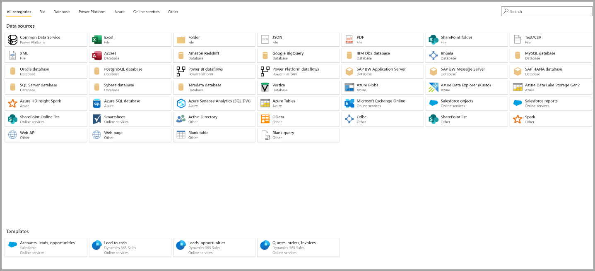
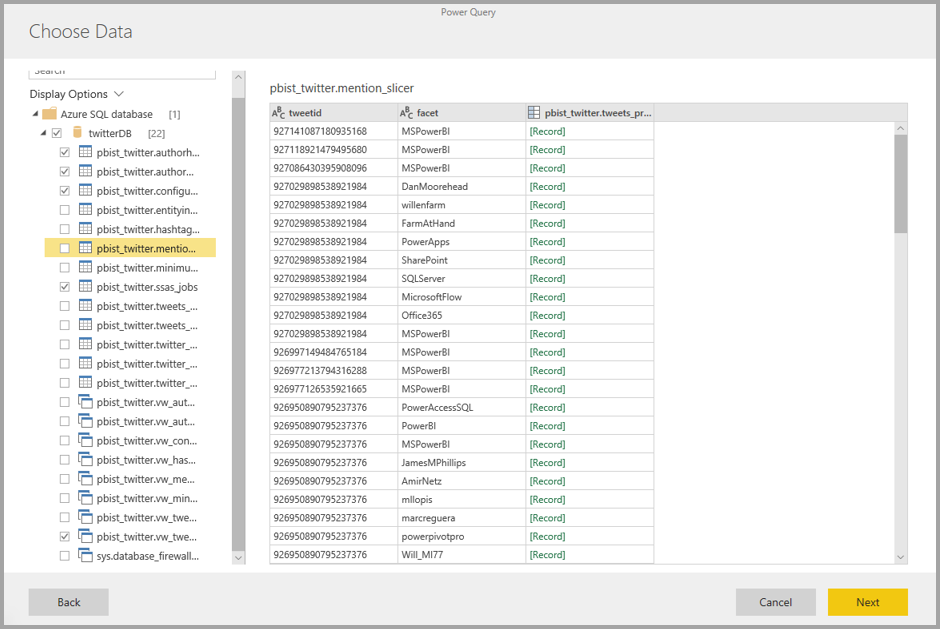
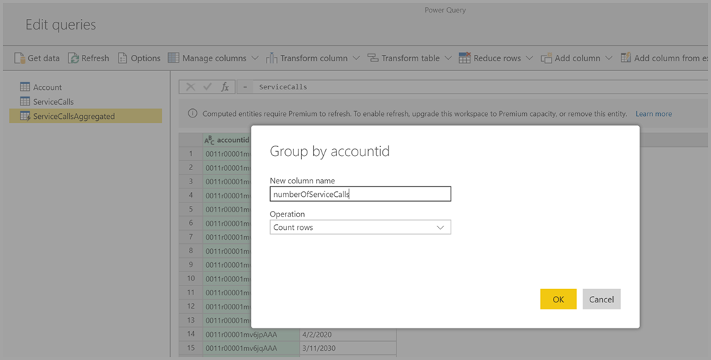

# Veri akışı oluşturma
**Veri akışı**, Power BI hizmetindeki çalışma alanlarında oluşturulan ve yönetilen bir varlık koleksiyonudur (varlıklar, tablolara benzer). **Varlık/tablo**, veritabanlarındaki tablolara çok benzeyen ve verileri depolamak için kullanılan bir alan kümesidir. Veri akışınızda varlıkları/tabloları ekleyip düzenleyebilir, ayrıca doğrudan veri akışınızı oluşturduğunuz çalışma alanından veri yenileme zamanlamalarını yönetebilirsiniz.

Veri akışı oluşturmak için, tarayıcıda Power BI hizmetini başlatın ve ardından aşağıdaki ekranda gösterildiği gibi sol taraftaki gezinti bölmesinden **çalışma alanını** (veri akışları Power BI hizmetindeki *my-workspace* içinde kullanılamaz) seçin. İçinde yeni veri akışı oluşturmak üzere yeni bir çalışma alanı da oluşturabilirsiniz.

Yeni bir veri akışı oluşturmak veya var olan bir veri akışını geliştirmek için kullanabileceğiniz birçok farklı yöntem vardır:

* [Yeni varlıklar tanımlayarak veri akışı oluşturma](#create-a-dataflow-using-define-new-entities)
* [Bağlantılı varlıkları kullanarak veri akışı oluşturma](#create-a-dataflow-using-linked-entities)
* [Hesaplanan varlık kullanarak veri akışı oluşturma](#create-a-dataflow-using-a-computed-entity)
* [İçeri/dışarı aktarma kullanarak veri akışı oluşturma](#create-a-dataflow-using-importexport)

Aşağıdaki bölümlerde bu veri akışı oluşturma yöntemleri ayrıntılı bir şekilde anlatılmıştır.

## Yeni varlıklar tanımlayarak veri akışı oluşturma

Yeni varlıklar tanımlama seçeneğini kullanarak yeni bir varlık/tablo tanımlayabilir ve yeni bir veri kaynağına bağlanabilirsiniz.

Veri kaynağı seçtiğinizde, aşağıdaki resimde gösterildiği gibi veri kaynağına bağlanırken kullanılacak hesap da dahil olmak üzere bağlantı ayarlarını sağlamanız istenir.

Bağlantı kurulduktan sonra, varlığınız için hangi verilerin kullanılacağını seçebilirsiniz. Veriler ve kaynak seçildikten sonra, Power BI veri akışınızdaki verileri yenilenmiş durumda tutmak için veri kaynağına yeniden bağlanır. Bu bağlanmaların sıklığını bu kurulum işleminin sonraki adımlarında siz seçersiniz.

Varlıkta kullanılacak verileri seçtikten sonra, veri akışı düzenleyicisini kullanarak bu verileri veri akışınızda kullanılırken gereken biçime getirebilir veya dönüştürebilirsiniz. 

## Bağlantılı varlıkları kullanarak veri akışı oluşturma

Bağlantılı varlıkları kullanarak veri akışı oluşturma, başka bir veri akışında tanımlanmış olan bir varlığa salt okunur bir şekilde başvurmanızı sağlar. Aşağıdaki listede bu yaklaşımı kullanmanızı gerektirebilecek nedenlerden bazıları verilmiştir:

* Tarih varlığı veya statik arama tablosu gibi bir varlığı birden çok veri akışında kullanmak istiyorsanız varlığı bir kez oluşturduktan sonra diğer veri akışlarından başvurmanız gerekir.

* Bir veri kaynağı için birden çok yenileme oluşturmaktan kaçınmak istiyorsanız verileri depolamak için önbellek görevi görecek bağlantılı varlıkları kullanmak iyi bir seçenektir. Bunu yaptığınızda sonraki tüketiciler bu varlığı kullanır ve temel alınan veri kaynağı üzerindeki yük azalmış olur.

* İki varlık arasında birleştirme gerçekleştirmeniz gerekiyorsa.

> [!NOTE]
> Bağlantılı varlıklar yalnızca Power BI Premium ile birlikte kullanılabilir.

## Hesaplanan varlık kullanarak veri akışı oluşturma

Hesaplanan varlık kullanarak veri akışı oluşturma, bağlantılı bir varlığa başvurmanızı ve üzerinde salt okunur bir şekilde işlem gerçekleştirmenizi sağlar. Sonuç olarak veri akışının parçası olan yeni bir varlık elde edersiniz. Bağlantılı bir varlığı hesaplanan varlığa dönüştürmek için birleştirme işleminden yeni bir sorgu oluşturabilir veya varlığı düzenlemek ya da dönüştürmek isterseniz varlığa başvurabilir veya kopyasını oluşturabilirsiniz.

### Hesaplanan varlık oluşturma

Varlık listesini içeren bir veri akışı oluşturduktan sonra, bu varlıklar üzerinde hesaplamalar yapabilirsiniz.
Power BI hizmetindeki veri akışı yazma aracında **Varlıkları düzenle**’yi seçin, ardından hesaplanmış varlığınızın temeli olarak kullanmak ve üzerinde hesaplamalar yapmak istediğiniz varlığa sağ tıklayın. Bağlam menüsünde **Başvuru**’yu seçin.
Varlığın hesaplanan varlık olarak kabul edilmesi için, aşağıdaki görüntüde gösterildiği gibi **Yükü etkinleştir** seçiminin işaretlenmesi gerekir. Bu bağlam menüsünü görüntülemek için varlığa sağ tıklayın.

**Yükü etkinleştir**’i seçerek, kaynağı başvurulan varlık olan yeni bir varlık oluşturursunuz. Simge değişir ve aşağıdaki görüntüde gösterildiği gibi **hesaplanan** simgesini gösterir.

Bu yeni oluşturulan varlık üzerinde gerçekleştirdiğiniz tüm dönüşümler, Power BI veri akışı deposunda zaten mevcut olan veriler üzerinde çalıştırılır. Bunun anlamı, sorgunun verilerin içeri aktarıldığı dış veri kaynağına göre çalıştırılmayacağı (örneğin, verilerin çekildiği SQL veritabanı), bunun yerine veri akışı depolama alanında bulunan veriler üzerinde gerçekleştirileceğidir.

**Kullanım örnekleri** Hesaplanan varlıklarla ne tür dönüşümler gerçekleştirilebilir? Depolama içi hesaplama yaparken Power BI’daki dönüşüm kullanıcı arabirimini veya M düzenleyicisini kullanarak genellikle belirttiğiniz tüm dönüşümler desteklenir.

Şu örneği düşünün: Dynamics 365 aboneliğinizdeki tüm müşteriler için ham verileri içeren bir *Account* varlığınız var. Ayrıca, yılın her gününde farklı hesaptan gerçekleştirilen destek çağrılarının verileri ile birlikte Hizmet Merkezi’nden *ServiceCalls* ham verilerine sahipsiniz.

*Account* varlığını *ServiceCalls* verileri ile zenginleştirmek istediğinizi hayal edin.
İlk olarak her hesap için önceki yıl içinde yapılan destek aramalarının sayısını hesaplamak için *ServiceCalls*’dan gelen verileri toplamanız gerekir.

Sonra, zenginleştirilmiş *Hesap* tablosunu hesaplamak için *Account* varlığını *ServiceCallsAggregated* varlığı ile birleştirmek istersiniz.

Bundan sonra, aşağıdaki görüntüde *EnrichedAccount* olarak gösterilen sonuçları görebilirsiniz.

İşte bu kadar. Dönüşüm kaynak verileriniz üzerinde değil Power BI Premium aboneliğinizde bulunan veri akışındaki veriler üzerinde gerçekleştirilir.

> [!NOTE]
> Hesaplanan varlıklar Premium'a özgü bir özelliktir

## CDM klasörü kullanarak veri akışı oluşturma

CDM klasörü kullanarak veri akışı oluşturmak, başka bir uygulama tarafından Common Data Model (CDM) biçiminde yazılmış olan bir varlığa başvurmanızı sağlar. ADLS 2. Nesil üzerinde depolanan CDM biçimindeki dosyanın tam yolunu sağlamanız istenir.

 

Aşağıdaki listede açıklandığı gibi CDM klasörlerinden veri akışları oluşturmak için birkaç gereksinim vardır:

* PBI ortamının dosyaya erişebilmesi için ADLS 2. Nesil hesabında uygun izinlerin ayarlanmış olması gerekir

* Veri akışını oluşturmaya çalışan kullanıcı, ADLS 2. Nesil hesabına erişebiliyor olmalıdır

* CDM klasörlerinden veri akışları oluşturma yalnızcayeni çalışma alanı deneyiminde mevcuttur

* URL'nin JSON dosyasına ait doğrudan dosya yolu olması ve ADLS 2. Nesil uç noktasını kullanması gerekir; blob.core desteklenmez

## İçeri/dışarı aktarma kullanarak veri akışı oluşturma

İçeri/dışarı aktarma kullanarak veri akışı oluşturmak, bir dosyadaki veri akışını içeri aktarmanızı sağlar. Bu seçeneği veri akışının çevrimdışı kopyasını kaydetmek veya veri akışını başka bir çalışma alanına taşımak istediğinizde kullanabilirsiniz. 

Bir veri akışını dışarı aktarmak için oluşturduğunuz veri akışını seçin, **Daha fazla** menü öğesini (üç nokta) seçerek seçenekleri genişletin ve ardından **.json dosyasını dışarı aktar**'ı seçin. Veri akışını CDM biçiminde indirmeye başlayabilirsiniz.

Bir veri akışını içeri aktarmak için içeri aktarma kutusunu seçin ve dosyayı karşıya yükleyin. Power BI, veri akışını sizin için oluşturur ve veri akışını olduğu gibi kaydetmenizi veya ek dönüşümler gerçekleştirmenizi sağlar.

## Sonraki adımlar

Veri akışını oluşturduktan sonra, Power BI Desktop'ı veya Power BI hizmetini kullanarak Power BI veri akışlarına yerleştirdiğiniz verileri temel alan veri kümeleri, raporlar, panolar ve uygulamalar oluşturabilir, bu yolla iş etkinliklerinizle ilgili içgörüler kazanabilirsiniz. Aşağıdaki makalelerde, veri akışlarının yaygın kullanım senaryoları daha ayrıntılı olarak ele alınır:

* [Veri akışlarına giriş ve self servis veri hazırlığı](dataflows-introduction-self-service.md)
* [Veri akışı yapılandırma ve kullanma](dataflows-configure-consume.md)
* [Veri akışı depolama alanını Azure Data Lake 2. Nesil kullanacak şekilde yapılandırma](dataflows-azure-data-lake-storage-integration.md)
* [Veri akışlarının Premium özellikleri](dataflows-premium-features.md)
* [Veri akışları ve yapay zeka](dataflows-machine-learning-integration.md)
* [Veri akışı sınırlamaları ve önemli noktalar](dataflows-features-limitations.md)
* [Veri akışları için en iyi yöntemler](dataflows-best-practices.md)