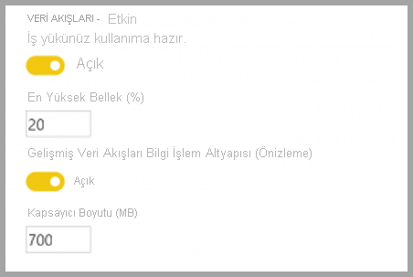
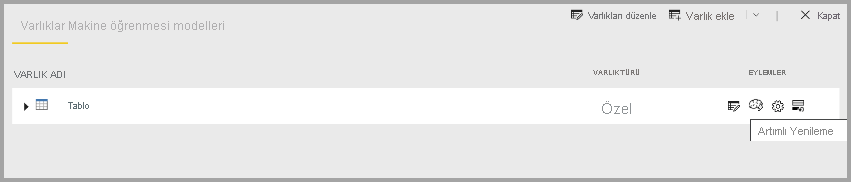

# Veri akışlarının Premium özellikleri

Veri akışları Power BI Pro ve Power BI Premium kullanıcıları için desteklenir. Bazı özellikler yalnızca Power BI Premium aboneliğiyle kullanılabilir. Bu makalede Premium aboneliğine özgü özellikler ve kullanım alanları anlatılmıştır. 

Aşağıdaki özellikler yalnızca Power BI Premium ile birlikte kullanılabilir:

* Geliştirilmiş işlem altyapısı
* Direct Query
* Hesaplanan varlıklar
* Bağlantılı varlıklar
* Artımlı yenileme

Aşağıdaki bölümlerde bu özellikler daha ayrıntılı olarak açıklanmıştır.

## Geliştirilmiş işlem altyapısı

Power BI geliştirilmiş işlem altyapısı, Power BI Premium abonelerinin kapasitelerini kullanarak veri akışlarının kullanımını iyileştirmelerini sağlar. Geliştirilmiş işlem altyapısını kullanmak şu avantajları sunar:

* *Birleştirme*, *benzersiz*, *filtre* ve *gruplama* gibi işlemleri gibi hesaplanan varlıklar üzerinde gerçekleştirilen uzun süreli ETL adımları için gerekli olan yenileme süresini önemli ölçüde azaltır.
* Varlıklar üzerinde DirectQuery sorgusu gerçekleştirme

Geliştirilmiş işlem altyapısı varsayılan olarak **Açık** durumdadır. Gelişmiş işlem altyapısı açık değilse bunu etkinleştirme işlemi, sık sorulan soruların yanıtlarıyla birlikte sonraki bölümde açıklanmaktadır.

### Geliştirilmiş işlem altyapısını kullanma

Geliştirilmiş işlem altyapısı, Power BI hizmetinin **Kapasite Ayarları** sayfasının **veri akışları** bölümünden etkinleştirilir. Geliştirilmiş işlem altyapısı varsayılan olarak **Kapalı** durumdadır. Geliştirilmiş işlem altyapısını etkinleştirmek için aşağıdaki görüntüde gösterildiği gibi düğmeyi **Açık** duruma getirin ve ayarlarınızı kaydedin. 

> [!IMPORTANT]
> Geliştirilmiş işlem altyapısı yalnızca A3 ve üzeri Power BI kapasitelerinde çalışır.

Geliştirilmiş işlem altyapısı açıldıktan sonra **veri akışlarına** döndüğünüzde, aynı kapasitedeki var olan bağlantılı varlıklardan oluşan veri akışları için *birleşim* veya *gruplama* gibi karmaşık işlemler gerçekleştirilen hesaplanan varlıklarda performans artışı görmeniz gerekir. 

İşlem altyapısını en verimli şekilde kullanmak için ETL aşamasını şu şekilde iki ayrı veri akışına ayırın:

* **Veri akışı 1**: Bu veri akışı yalnızca veri kaynağındaki gerekli verileri almalı ve veri akışı 2 içine yerleştirmelidir.
* **Veri akışı 2**: Tüm ETL işlemlerini bu ikinci veri akışında gerçekleştirin ancak aynı kapasite üzerinde yer alan Veri akışı 1'e başvurduğunuzdan emin olun. Ayrıca işlem altyapısının kullanıldığından emin olmak için diğer işlemlerden önce katlanabilecek (filtre, gruplama, benzersiz, birleşim) işlemler gerçekleştirdiğinizden emin olun.

### Sık sorulan sorular ve yanıtları

**Soru:** Geliştirilmiş işlem altyapısını etkinleştirdim ancak veriler daha yavaş yenileniyor. Neden mi?

**Cevap:** Geliştirilmiş işlem altyapısını etkinleştirmenize rağmen verilerin yavaş yenilenmesinin iki nedeni olabilir:

 * Geliştirilmiş işlem altyapısı etkinleştirildikten sonra düzgün çalışmak için bir miktar belleğe ihtiyaç duyar. Bu nedenle yenileme gerçekleştirme için ayrılan bellek miktarı azalır ve bunun sonucunda yenileme işlemleri kuyruğa alınır ve eşzamanlı olarak yenilenebilecek veri akışı sayısı azalır. Bu sorunu çözmek için geliştirilmiş işlemi etkinleştirdiğinizde veri akışlarına ayrılan belleği artırarak eşzamanlı veri akışı yenileme işlemleri için gerekli belleği aynı düzeyde kalmasını sağlayın.

 * Yenileme işlemlerinin yavaş olmasının bir diğer nedeni de işlem altyapısının yalnızca var olan varlıklarla birlikte çalışmasıdır. Veri akışınızın, veri akışı olmayan bir veri kaynağına başvurması durumunda geliştirme göremezsiniz. Bazı büyük veri senaryolarında verilerin geliştirilmiş işlem altyapısına geçirilmesi gerektiğinden veri kaynağından gerçekleştirilen ilk okuma işlemi daha yavaş olacağından performans artışı yaşanmayacaktır.  

**Soru:** Geliştirilmiş işlem altyapısını açma veya kapatma seçeneğini göremiyorum. Neden mi?

**Cevap:** Geliştirilmiş işlem altyapısı, dünyanın farklı yerlerindeki bölgelerde aşamalı olarak kullanıma sunulmaktadır. Bu desteğin 2020'nin sonuna kadar tüm bölgelere yayılmış olmasını planlıyoruz.

**Soru:** İşlem altyapısı için desteklenen veri türleri nelerdir?

**Cevap:** Geliştirilmiş işlem altyapısı ve veri akışları şu anda aşağıdaki veri türlerini desteklemektedir. Veri akışınız aşağıdaki veri türlerinden birini kullanmıyorsa yenileme sırasında hata oluşur:

* Tarih/Saat
* Ondalık Sayı
* Metin
* Tam sayı
* Tarih/Saat/Bölge
* True/False
* Tarih
* Saat

## Power BI’da veri akışları ile DirectQuery kullanma (önizleme)

Veri akışlarına doğrudan bağlanmak için DirectQuery’yi kullanabilir ve böylece verilerini içeri aktarmak zorunda kalmadan veri akışınıza doğrudan bağlanabilirsiniz. 

Veri akışlarıyla DirectQuery’nin kullanılması Power BI ve veri akışı işlemlerinizde şu geliştirmelere olanak tanır:

* **Ayrı yenileme zamanlamalarından kaçınma** - DirectQuery doğrudan veri akışına bağlandığından içeri aktarılan bir veri kümesi oluşturma ihtiyacını ortadan kaldırır. Dolayısıyla veri akışlarınız için DirectQuery’yi kullandığınızda artık veri akışı için ayrı yenileme zamanlamalarına ve verilerinizin eşitlendiğinden emin olmak için bir veri kümesine gerek kalmaz.

* **Verileri filtreleme** - DirectQuery, veri akışının içinde verilerin filtrelenmiş görünümüyle çalışmak için yararlıdır. Verileri filtrelemek ve böylece veri akışınızdaki verilerin daha küçük bir alt kümesiyle çalışmak istiyorsanız DirectQuery’yi (ve işlem altyapısını) kullanarak veri akışı verilerini filtreleyebilir ve ihtiyacınız olan filtrelenmiş alt kümeyle çalışabilirsiniz.

### Veri akışları için DirectQuery kullanma

Veri akışlarıyla DirectQuery kullanma, Power BI Desktop’ın Mayıs 2020 sürümünden başlayarak kullanıma sunulan bir önizleme özelliğidir. 

Veri akışlarıyla DirectQuery kullanmanın önkoşulları da vardır:

* Veri akışınız Power BI Premium etkinleştirilmiş bir çalışma alanının içinde yer almalıdır
* **İşlem altyapısı** açık olmalıdır

### Veri akışları için DirectQuery’yi etkinleştirme

Veri akışınızın DirectQuery erişiminde kullanılabildiğinden emin olmak için gelişmiş işlem altyapısının iyileştirilmiş durumda olması gerekir. Veri akışlarında DirectQuery’yi etkinleştirmek için yeni **Gelişmiş işlem altyapısı ayarları** seçeneğini **Açık** olarak ayarlayın. Aşağıdaki resimde düzgün bir şekilde seçilmiş ayar gösterilir.

Bu ayarı uyguladıktan sonra, iyileştirmenin geçerlilik kazanması için veri akışını yenileyin.

### DirectQuery için önemli noktalar ve sınırlamalar

DirectQuery ve veri akışlarıyla ilgili bilinen birkaç sınırlama vardır:

* Bu özelliğin önizleme dönemi boyunca bazı müşteriler veri akışlarıyla DirectQuery’yi kullanırken zaman aşımlarıyla veya performans sorunlarıyla karşılaşabilir. Bu önizleme döneminde bu tür sorunlar üzerinde etkin bir şekilde çalışılmaktadır.

* İçeri aktarma ve DirectQuery veri kaynaklarına sahip bileşik/karışık modeller şu anda desteklenmiyor.

* Büyük veri akışlarında görselleştirmeler görüntülenirken zaman aşımı sorunları ortaya çıkabilir. Zaman aşımı sorunlarıyla karşılaşılan büyük veri akışlarında İçeri aktarma modu kullanılmalıdır.

* DirectQuery kullanıyorsanız veri akışı bağlayıcısı, veri kaynağı ayarları bölümünde geçersiz kimlik bilgileri gösterir. Bu, davranışı etkilemez ve veri kümesi düzgün bir şekilde çalışır. 

## Hesaplanan varlıklar

Bir Power BI Premium aboneliği ile **veri akışlarını** kullanırken **depolama içi hesaplamalar** yapabilirsiniz. Bu özellik, mevcut veri akışlarınızda hesaplamalar yapmanıza ve rapor oluşturma ve analizine odaklanmanızı sağlayan sonuçlar döndürmenize olanak sağlar.

Depolama içi hesaplamalar yapmak için ilk olarak veri akışını oluşturmanız ve verileri Power BI veri akışı depolama alanına getirmeniz gerekir. Veri içeren bir veri akışı elde ettikten sonra, depolama içi hesaplamalar yapan varlıklar olan hesaplanan varlıklar oluşturabilirsiniz.

### Hesaplanan varlıklarla ilgili önemli noktalar ve sınırlamalar

* Bir kuruluşun Azure Data Lake Storage 2. Nesil hesabında oluşturulan veri akışlarıyla çalışırken bağlantılı varlıklar ve hesaplanan varlıklar yalnızca varlıklar aynı depolama hesabında bulunduğunda düzgün şekilde çalışır. 

Şirket içi ve bulut verileri tarafından birleştirilen veriler üzerinde hesaplamalar gerçekleştirirken en iyi deneyim olarak, her veri kaynağı için yeni bir veri akışı oluşturun (bir tane şirket içi ortam, bir tane bulut için) ve daha sonra bu iki veri kaynağında birleştirme/işlem gerçekleştirecek üçüncü bir veri akışı oluşturun.

## Bağlantılı varlıklar

Power BI Premium aboneliği kullandığınızda var olan veri akışlarına başvurabilirsiniz. Bu sayede hesaplanan varlıkları kullanarak bu varlıklarla ilgili hesaplama gerçekleştirebilir veya birden çok veri akışında yeniden kullanabileceğiniz "tek gerçeklik kaynağı" olan bir tablo oluşturabilirsiniz.

## Artımlı yenileme

Her yenileme işleminde verilerin çekilmesinden kaçınmak için veri akışları artımlı olarak yenilenecek şekilde ayarlanabilir. Bunun için veri akışını seçtikten sonra artımlı yenileme simgesini seçin.

Artımlı yenileme ayarlandığında veri akışına tarih aralığını belirten parametreler eklenir. Artımlı yenilemeyi ayarlama hakkında ayrıntılı bilgi için [artımlı yenileme](/power-query/dataflows/incremental-refresh) makalesini inceleyin.

### Artımlı yenilemenin kullanılmaması gereken durumlar

Aşağıdaki durumlarda veri akışını artımlı yenileme olarak ayarlamayın:

* Veri akışına başvuran bağlantılı varlıklar için artımlı yenileme kullanılmamalıdır. Veri akışları sorgu katlamayı desteklemez (varlık DirectQuery desteğine sahip olsa dahi). 
* Veri akışlarına başvuran veri kümeleri için artımlı yenileme kullanılmamalıdır. Veri akışı yenileme performansı yeterli olmalıdır. Yenileme işlemleri beklenenden uzun sürüyorsa işlem altyapısını veya DirectQuery modunu kullanabilirsiniz.

## Sonraki adımlar
Aşağıdaki makaleler veri akışları ve Power BI hakkında daha fazla bilgi sunmaktadır:

* [Veri akışları için en iyi yöntemler](dataflows-best-practices.md)
* [Power BI Premium veri akışı iş yüklerini yapılandırma](dataflows-premium-workload-configuration.md)
* [Veri akışlarına giriş ve self servis veri hazırlığı](dataflows-introduction-self-service.md)
* [Veri akışı oluşturma](dataflows-create.md)
* [Veri akışı yapılandırma ve kullanma](dataflows-configure-consume.md)
* [Veri akışı depolama alanını Azure Data Lake 2. Nesil kullanacak şekilde yapılandırma](dataflows-azure-data-lake-storage-integration.md)
* [Veri akışları ve yapay zeka](dataflows-machine-learning-integration.md)
* [Veri akışı sınırlamaları ve önemli noktalar](dataflows-features-limitations.md)