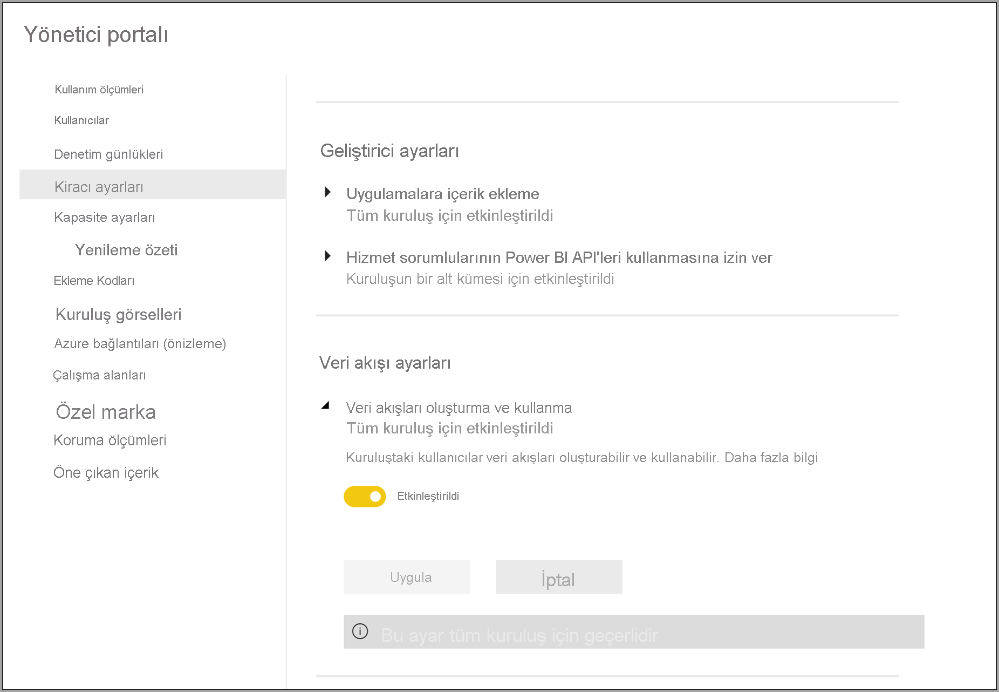
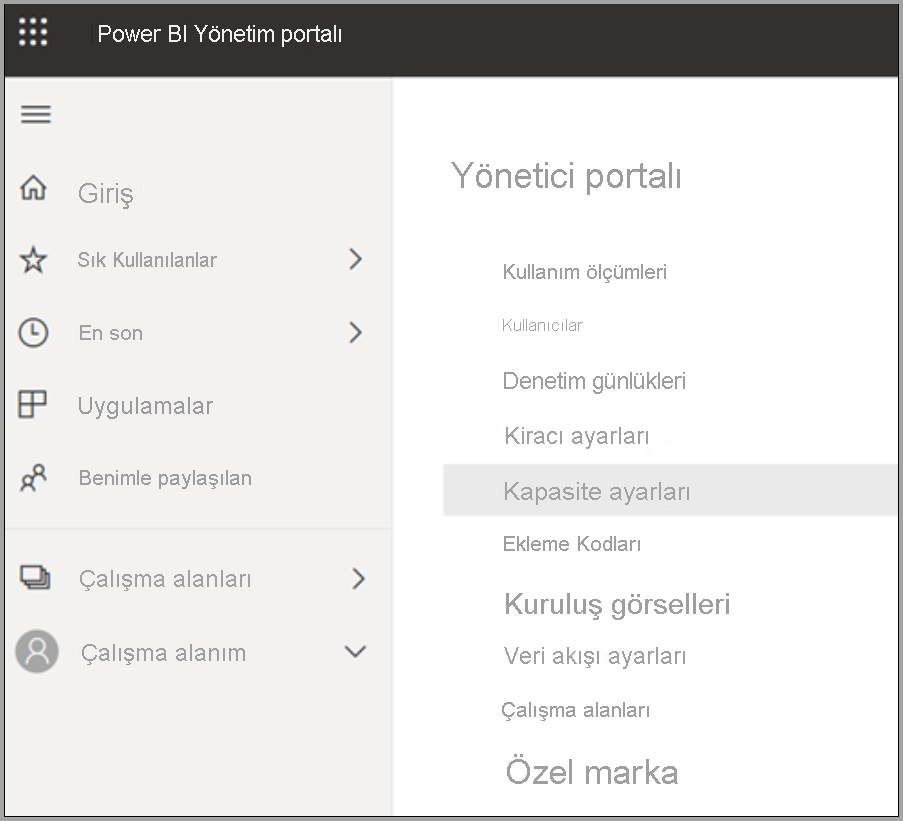
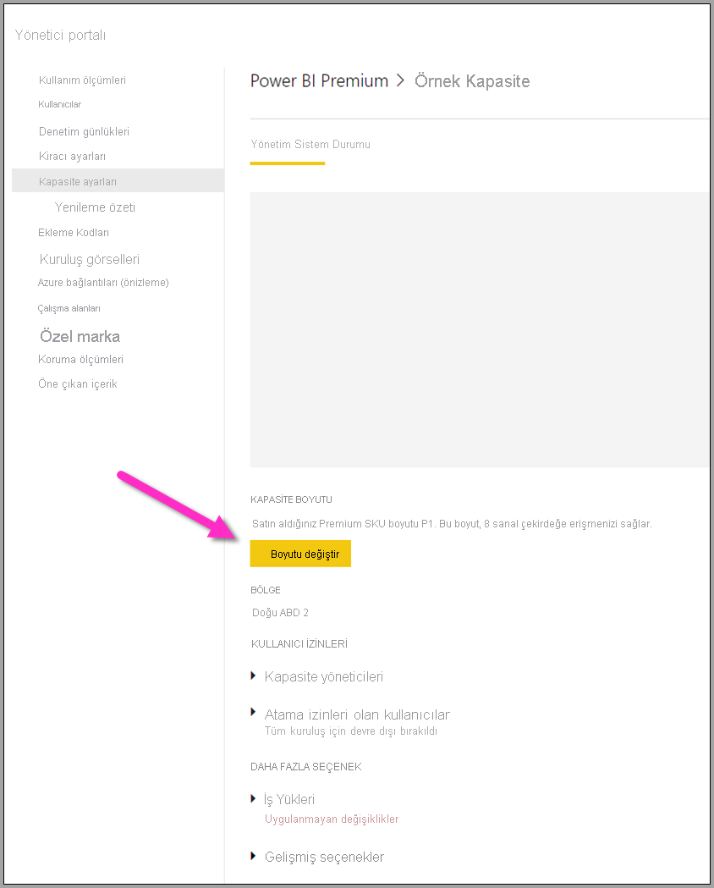
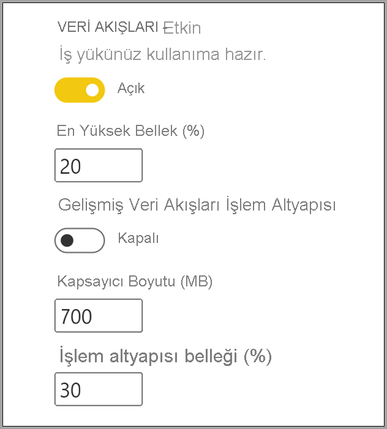

# Power BI Premium veri akışı iş yüklerini yapılandırma

Power BI Premium aboneliğinizde veri akışı iş yükleri oluşturabilirsiniz. Power BI, Premium içerikleri tanımlamak için *iş yükleri* kavramını kullanır. İş yükleri arasında veri kümeleri, sayfalandırılmış raporlar, veri akışları ve yapay zeka özellikleri bulunur. *Veri akışları* iş yükü verileri almak, dönüştürmek, tümleştirmek ve zenginleştirmek için veri akışları self servis veri hazırlığını kullanmanıza olanak tanır. Power BI Premium veri akışları, **Yönetici portalından** yönetilir.

Aşağıdaki bölümlerde kuruluşunuzda veri akışlarını kullanma, Premium kapasitenizdeki ayarları düzenleme ve genel kullanıma yönelik yönlendirme adımları verilmiştir.

## Power BI Premium'da iş yüklerini etkinleştirme

Power BI premium aboneliğinizde veri akışlarını kullanabilmek için yapmanız gereken ilk şey, kuruluşunuzda veri akışı oluşturma ve kullanma özelliğini etkinleştirmektir. **Yönetici portalında** **Kiracı Ayarları**'nı seçtikten sonra aşağıdaki görüntüde gösterildiği gibi **Veri akışı ayarları** altındaki kaydırıcıyı **Etkin** konumuna getirin.

Veri akışı iş yükü etkinleştirildikten sonra varsayılan ayarlarla yapılandırılır. İsterseniz bu ayarlarda değişiklik yapabilirsiniz. Sonraki bölümlerde bu ayarların yerlerini gösterecek, her birini açıklayacak ve veri akışı performansınızı iyileştirme amacıyla değerleri değiştirmek isteyebileceğiniz noktaları anlamanıza yardımcı olacağız.

## Veri akışı ayarlarını düzenleme

Veri akışları etkinleştirildikten sonra **Yönetici portalını** kullanarak veri akışlarının oluşturulma şeklini ve Power BI Premium aboneliğinizdeki kaynakların nasıl kullanılacağını değiştirebilir veya düzenleyebilirsiniz. Aşağıdaki adımlarda veri akışı ayarlarınızı nasıl düzenleyebileceğiniz gösterilmiştir.

1. **Yönetici portalında**  **Kiracı ayarları**'nı seçerek oluşturulan tüm kapasiteleri listeleyin. Ayarlarını yönetmek istediğiniz kapasiteyi seçin.

    

2. Veri akışlarınızda kullanabileceğiniz kaynaklar, Power BI Premium kapasitenize göre değişir. Aşağıdaki görüntüde gösterildiği gibi **Boyutu değiştir** düğmesini seçerek kapasitenizin boyutunu değiştirebilirsiniz.

    

3. Kapasite ayarlarının **İş yükleri** bölümünü genişleterek veri akışı ayarlarını yapılandırabilirsiniz.

    

4. **İş yükleri** bölümünde **Veri akışları** alanına gidin. Aşağıdaki görüntüde, kapasitenizdeki veri akışı iş yüklerinin davranışını denetlemek veya düzenlemek için kullanabileceğiniz ayarlar gösterilmiştir.

    

Aşağıdaki tabloda veri akışı ayarları hakkında kısa bilgiler verilmiştir.

| **Yönetici bölümü** | **Ayar adı** | **Açıklama** |
|---------|---------|---------|
| **Kapasite Boyutu** | **Boyutu Değiştir** | Seçili olan kapasite listelenir ve kapasiteyi değiştirme seçenekleri sunulur. Bu ayarı değiştirerek kapasitenin ölçeğini artırabilir veya azaltabilirsiniz. |
| **İş yükü** | **En Yüksek Bellek (%)** | Kapasitede veri akışlarının kullanabileceği en yüksek kullanılabilir bellek yüzdesi. |
| **İş yükü** | **Geliştirilmiş Veri Akışları İşlem Altyapısı** | Büyük ölçekli veri hacimleriyle çalışırken hesaplanan varlıkların 20 kata kadar daha hızlı hesaplanması için bu seçeneği etkinleştirin.  **Yeni altyapıyı etkinleştirmek için kapasiteyi yeniden başlatmanız gerekir.**  Daha fazla bilgi için bkz. [Gelişmiş veri akışları işlem altyapısı](../../admin/service-admin-premium-workloads.md#enhanced-dataflows-compute-engine). |
| **İş yükü** | **Kapsayıcı Boyutu** | Veri akışlarının, veri akışındaki her varlık için kullanabileceği kapsayıcı boyutu üst sınırı. Varsayılan değer 700 MB'tır. Daha fazla bilgi için bkz. [Kapsayıcı boyutu](../../admin/service-admin-premium-workloads.md#container-size). |
| **İş yükü** | **İşlem altyapısı belleği (%)** | İşlem altyapısına ayrılan en yüksek bellek yüzdesidir. Varsayılan değer %30’dur. |

Sonraki bölümlerde bu ayarların her biriyle ilgili ayrıntılı bilgiler sağlanmakta ve veri akışı iş yükünüzü nasıl etkiledikleri anlatılmaktadır.

### Veri akışı iş yükü seçeneklerini anlama

Veri akışı iş yükü seçeneklerini daha iyi kavramanız için bir benzetme üzerinden gidebiliriz. *Kapasite boyutunu* veya sahip olduğunuz Power BI Premium örneğinin türünü bir *restoran* gibi düşünebilirsiniz. Restoranın *mutfağı*, sizin *iş yükü belleğinizdir*. *İşlem altyapısı* ise *fırınınızdır*. Son olarak *kapsayıcıyı* da *şefinizin* tecrübesi olarak düşünebilirsiniz. Veri akışı iş yükü seçeneklerinizi değerlendirmek için önemli bir davette yemek hazırladığınızı düşünün. Çok önemli konukları ağırlayacaksınız ve onlar geldiğinde tüm yemeklerin servise hazır olması gerekiyor.

Ayarlarla ilgili açıklamalar yaparken ve kullanımlarıyla ilgili yol gösterirken bu restoran benzetmesini kullanacağız. En üst düzeyde Power BI Premium'u kullanırken yaptığınız ilk seçenek olan Premium kapasiteniz bulunur.

#### Premium kapasite SKU'ları: donanımın ölçeğini artırma

Power BI Premium iş yükleri, farklı iş yükü türleriyle ilgili sorgulara hızlı yanıt vermek için ön uçtaki birimlerden ve arka uçtaki çekirdeklerden oluşan bir birleşimden faydalanır. [Kapasite düğümleri](../../admin/service-premium-what-is.md#capacity-nodes) makalesinde mevcut iş yükü tekliflerinin özelliklerini gösteren bir tablo bulunmaktadır. A3 ve üzeri kapasiteler işlem altyapısından kullanabilir. Geliştirilmiş işlem altyapısını kullanmak isterseniz [Kapasite düğümleri](../../admin/service-premium-what-is.md#capacity-nodes) makalesiyle başlangıç yapabilirsiniz. 

Restoran benzetmesine dönecek olursak kapasite seçiminin, restoran kalitesiyle ilgili bir seçim olduğunu söyleyebiliriz. Ön uç çekirdeği, arka uç çekirdeği ve bellek miktarının daha fazla olduğu yüksek maliyetli kapasitelerden daha fazla performans elde edebilirsiniz. Büyük bir restorana gittiğinizde daha büyük bir mutfakla ve daha iyi şeflerle karşılaşırsınız. Power BI Premium'daki üst düzey SKU'lar da bunun gibidir. Daha fazla CPU hızı, işlem başına daha fazla bellek ve daha fazla paralel çalışma olanağı sunar.

#### Maksimum bellek: iş akışları için kapasite ayırma 

**En Yüksek Bellek (%)** ayarı, Premium kapasite için kullanılabilen fiziksel belleğin veri akışı iş yüklerine ayrılacak miktarını yüzde cinsinden belirtmek için kullanılır. Kapasitenin tamamını bir veri akışı iş yükü için ayırabilirsiniz. Bunu yaptığınızda kapasite, istediğiniz düzeye ulaşana kadar dinamik olarak ölçeklendirilir. Restoran örneğinde de mutfağınız ne kadar büyük olursa servis edebileceğiniz yemek miktarı da o kadar fazla olur. Benzer şekilde veri akışları için kapasitenizin iş yükü boyutunu artırarak daha fazla veri akışı çalıştırabilirsiniz. Dinamik kaynak idaresi mevcut olsa da *En Yüksek Bellek (%)* yapılandırma seçeneği, belleğin %100'ünü veri akışı iş yüküne ayırmanızı sağlar. Ender de olsa kaynak idaresini kullanmak yerine kapasitenizin belleğinin tamamının veri akışı iş yükü tarafından kullanılabilir olmasını sağlamak istediğinizde bu seçeneği kullanabilirsiniz. Restoran benzetmesinde bunu mutfağınızın tamamının belirli bir konuğun yemeğini hazırlamaya odaklanması, tüm kaynakların bu yemeğe ayrılması gibi düşünebilirsiniz. Elbette daha fazla kaynak ayırmak yemeğin daha iyi olmasını veya masaya daha hızlı servis edilmesini garanti etmez. Bu durum bir sonraki bölümde açıklanmıştır.

#### Kapsayıcı boyutu: yenileme veya yetersiz bellek sorunları

Bu bölümde **Kapsayıcı Boyutu (MB)** ayarını inceleyeceğiz. Veri akışları, ETL işlemlerinizi değerlendirmek için *karma kapsayıcıları* adlı bir iç işlem kullanır. Altyapı, sorgu mantığınızı paralel olarak işlenebilecek bu kapsayıcılara böler. Kapsayıcı sayısının fazla olması eş zamanlı işleme olanağı sunar ve performansı artırır. Bu kapsayıcıların performansı sırasıyla **Kapasite** ayarına, **En Yüksek Bellek (%)** ayarına ve son olarak kapsayıcıda kendilerine ayırdığınız bellek miktarı ayarına (varsayılan olarak 700 MB) bağlıdır. Dolayısıyla donanım belleği miktarını ve kapsayıcı boyutunu artırmak mümkündür. Ancak bunu yapmanız durumunda paralel çalıştırılan işlem sayısı azalır ve kapsayıcılarınızdaki belirli ETL işlemleri için daha fazla bellek ayrılması gerekir. Kapsayıcı sayısı, arka uç çekirdeği sayısının üç katıyla sınırlıdır. Kapsayıcıyı çok küçük hale getirip bu noktanın ardında çok fazla paralel kapsayıcıya sahip olamayacağınız için bu değer önemlidir. Bir kapsayıcı için belirleyebileceğiniz en küçük boyut 200 MB olarak belirlenmiştir. Kapsayıcı boyutunun kapsamı, sorgu düzeyidir. Dolayısıyla her sorgu kendi kapsayıcısı içinde yürütülür. Yalnızca başka sorgulara başvuran sorgular aynı kapsayıcıda yenilenir.

Benzetmemize dönecek olursak mutfakta daha az sayıda ancak daha çok odaklanmış şefin bulunması, verilen siparişlere ve yemeğin karmaşıklık düzeyine bağlı olarak bir yemeği çok daha hızlı hazırlamanızı sağlar. Burada şef sayısı daha az olsa da hazırlık için odaklanma süresi daha fazladır. Benzer şekilde kapsayıcı boyutu ölçüsünü 1200-1500 MB yapmak, karmaşık ETL işlerinin (toplama, birleştirme, özetleme, satır veya sütun düzenleme gibi etkinlikler) sayısının azalmasına neden olabilir. Her bir kapsayıcı için sağlanan bellek miktarı arttığından performans artışı yaşanabilir ancak bu durumda kapsayıcı sayısı azaltılmış olur. Benzetmeye dönecek olursak sipariş sayısının çok fazla olması mutfaktan yemeklerin daha yavaş çıkmasına neden olabilir. Kapsayıcı boyutunu da bu şekilde düşünebilirsiniz. Karmaşık varlık işlemlerini tamamlamak için bu yöntemi kullanabilirsiniz. Bu kaynağı artırmak ayrılan belleği daha az kapsayıcıya bölünmesine neden olacağından performansı artırmış ancak paralel çalışan işlem sayısını azaltmış olursunuz.

Özetlemek gerekirse kapsayıcılarınızın boyutunu kullanılan sorgulara göre iyileştirmek istersiniz. Örneğin bir kaynaktan bir varlığa veri yüklemek için verilerin çekilmesi ve üzerinde işlem yapılmasına gerek yoktur. Yapılan tek işlem, verilerin depolama alanına yüklenmesidir. Yükleme ve yenileme işlemlerinin hızını artırmak istediğinizden bu durumda paralel çalışan işlem sayısını mümkün olduğunca yüksek tutmak istersiniz. Diğer taraftan daha fazla dönüşüm işlemi (karmaşık filtreler, birleştirmeler, toplamalar) eklediğinizde bu dönüşüm işlemlerinin bazılarının bellek içinde işlenmesi gerekebileceğinden ihtiyaç duyulan bellek miktarı çok daha fazla olabilir. Kapasitede çalışan başka veri akışı işlemleriniz varsa bu işlemler yavaşlayabilir ve yürütme yuvası beklemek üzere kuyruğa alınabilir. Bu bağlamda veri akışlarının, yenileme performansının ve kapasitenin tamamının izlenmesi ve yönetilmesi **Power BI Premium Kapasite Ölçümleri** uygulaması tarafından gerçekleştirilir. Kapasiteye göre filtrelemek ve çalışma alanı içeriği için performans ölçümlerini gözden geçirmek için [Power BI Premium Kapasite Ölçümleri](../../admin/service-premium-capacity-optimize.md#what-content-is-using-up-my-capacity) uygulamasını kullanabilirsiniz. Bir Premium kapasitede depolanan tüm içerikler için performans ölçümlerini ve kaynak kullanımını saate göre gözden geçirme olanağı bulunur. Dolayısıyla veri akışı performansını araştırmak için uygulamadan başlamanız önerilir.

#### Geliştirilmiş işlem altyapısı: performansı geliştirme fırsatı

Benzetmemize dönecek olursak [geliştirilmiş işlem altyapısını](dataflows-premium-features.md#the-enhanced-compute-engine) bir fırın gibidir. Power BI, sorgularınızı ve yenileme işlemlerinizi işlemek için bir işlem altyapısı kullanır. Geliştirilmiş işlem altyapısı, standart altyapıya kıyasla önemli avantajlar sunar ve verileri bir SQL önbelleğine yükleyip SQL kullanarak varlık dönüşümleriyle yenileme seçeneklerini hızlandırır ve DirectQuery bağlantısı sunar. Altyapıları fırınlarla karşılaştıracak olursak kullandığınız fırın ne kadar gelişmiş olursa yemekleri de o kadar hızlı ve verimli bir şekilde pişirebilirsiniz. Hesaplanan varlıklar için **Açık** veya **İyileştirilmiş** olarak yapılandırıldığında, iş mantığınızın uygun olması durumunda Power BI, performansı artırmak için SQL özelliklerini kullanır. Altyapının **Açık** olarak ayarlanması, DirectQuery bağlantısını da etkinleştirir. Benzetmeye dönecek olursak bazı yemekler fırında pişirilmez ve bu durumda fırının ne kadar iyi olduğunun bir önemi olmaz. Geliştirilmiş işlem altyapısını da bu şekilde düşünebilirsiniz. Veri akışınızın geliştirilmiş işlem altyapısını uygun şekilde kullandığından emin olmanız gerekir.

> [!NOTE]
> Geliştirilmiş işlem altyapısı henüz tüm bölgelerde kullanılabilir durumda değildir.

## Yaygın senaryolara yönelik kılavuz

Bu bölümde Power BI Premium ile birlikte kullanılan veri akışı iş yükleriyle ilgili yaygın senaryolar hakkında bilgiler sunulmaktadır.

### Uzun yenileme süreleri

Uzun yenileme süreleri genellikle paralel çalıştırmayla ilgili bir sorundur. Aşağıdaki seçenekleri verilen sırayla gözden geçirmeniz gerekir:

1. Uzun yenileme süreleri için en önemli nokta, veri hazırlama sürecidir. Bu makalenin önceki bölümlerinde incelediğimiz restoran benzetmesine dönecek olursak bir yemeğin servise hazır olması durumunu düşünebilirsiniz. Bu senaryoda hazırlama süresinin kısa olması nedeniyle yemek çok daha hızlı pişirilebilir. Benzer şekilde hazırlama ve sorgu mantığının hazırlanması işlemlerinin veri kaynağınız tarafından gerçekleştirilmesini sağlayarak uzun yenileme sürelerini iyileştirebilirsiniz. Özellikle SQL gibi bir ilişkisel veritabanını kaynak olarak kullanıyorsanız ilk sorgunun kaynakta çalıştırılıp çalıştırılamayacağına bakın ve veri kaynağı için ilk çıkarma veri akışınızda bu kaynak sorgusunu kullanın. Kaynak sisteminde doğal sorgu kullanamıyorsanız veri akışları [altyapısının veri kaynağına döndürebileceği](/power-query/power-query-folding) işlemler gerçekleştirin.

2. Yenileme sürelerinin aynı kapasiteye yayılma ihtimalini değerlendirin. Yenileme işlemleri, önemli miktarda işlem kapasitesi kullanır. Restoran benzetmesine dönecek olursak yenileme sürelerini yaymak, restoranınızdaki konuk sayısını sınırlamakla aynıdır. Restoranların konukları rezervasyonla kabul edip ona göre plan yaptıkları gibi yenileme işlemlerini de kullanımın en yoğun olduğu dönemlerden farklı zamanlarda yapmayı düşünebilirsiniz. Bunu yaparak kapasitenin üzerindeki yükü önemli ölçüde azaltmış olursunuz.

3. İş yüküne verilen genel bellek miktarını artırın. Bunu bir mutfağın büyüklüğü olarak düşünün. Bu kaynağı düzenlemek, mutfakta çalışabilecek şef sayısını ayarlamaya benzer. Bunun için **En Yüksek Bellek (%)** ayarını %100'e çıkarabilirsiniz.

4. Kapsayıcıya ayrılan bellek miktarını azaltarak daha fazla kapsayıcı kullanabilirsiniz. Bunu şöyle düşünebilirsiniz: Gordon Ramsey gibi dünya genelinde tanınan bir şefi çalıştırmak yerine yetenekli ancak ücreti daha uygun olan çok sayıda şef çalıştırabilirsiniz. Bu şekilde mutfağınızdaki şef sayısı fazla olur ancak bu şefler yalnızca daha küçük görevleri gerçekleştirebilir. Daha fazla kapsayıcıya sahip olursunuz ancak her birinin belleği daha azdır.

5. Yukarıdaki adımların ikisini birlikte kullandığınızda hem şef sayısını hem de mutfağın boyutunu artırarak paralel işlem sayısını yükseltmiş olursunuz.
    
6. Bu bölümdeki adımlarla istediğiniz düzeyde paralelliğe ulaşamazsanız kapasitenizi daha büyük bir SKU'ya geçirmeyi düşünebilirsiniz. Bunu yaptıktan sonra yine bu bölümün önceki bölümlerindeki adımları izleyin.

### Yetersiz bellek özel durumları

**Yetersiz bellek özel durumlarıyla** karşılaştığınızda kapsayıcı ve bellek performansını artırmanız gerekir. Aşağıdaki adımları uygulayın.

1. Kapsayıcı belleğini artırın. Bu, önceki bölümde değindiğimiz gibi çok sayıda şef yerine bir tane yıldız şef çalıştırmakla aynı şeydir.

2. İş yükü belleğini artırıp kapsayıcıya daha fazla bellek ekleyin. Bu durum benzetmemiz için daha büyük bir mutfak ve daha kaliteli şefler demektir.

3. Bu işlemlerin sonucunda istediğiniz düzeyde paralellik elde edemezseniz daha yüksek bir Power BI Premium SKU'su seçebilirsiniz.

### Performansı artırmak için işlem altyapısını kullanma

İş yüklerinin işlem altyapısını tetiklemesini ve performansı sürekli artırmasını sağlamak için aşağıdaki adımları izleyin:

**Aynı çalışma alanındaki hesaplanan ve bağlantılı varlıklar için:**

1. *Alma* aşamasında verileri depolama alanına mümkün olduğunca hızlı almaya odaklanın. Filtreleri yalnızca veri kümesinin genel boyutunu azaltmaları durumunda kullanın. Dönüşüm mantığınızı bu adımdan ayırmak ve altyapının ilk bileşenleri toplamaya odaklanmasını sağlamak en iyi deneyimdir. Ardından bağlantılı veya hesaplanan varlıkları kullanarak dönüşüm ve iş mantığınızı aynı çalışma alanındaki farklı iş akışlarına ayırın. Bunu yapmak, altyapının etkinleştirilmesini ve hesaplamalarınızı hızlandırmasını sağlar. Benzetmemize dönecek olursak bunu mutfakta yemek hazırlamaya benzetebiliriz. Yemeği hazırlamak genellikle gerekli malzemeleri temin etmekten ayrı bir adımdır ve yemeğin fırına verilmesi için bu adımın tamamlanması şarttır. Benzer şekilde işlem altyapısından faydalanabilmek için mantığınızın ayrı bir şekilde hazırlanması gerekir.

2. Birleştirme, birleşim, dönüştürme ve [diğer](/power-query/power-query-folding#transformations-that-can-achieve-folding) işlemleri gerçekleştirdiğinizden emin olun.

3. Veri akışlarının [yayımlanan yönergeler ve sınırlamalar](dataflows-features-limitations.md#dataflows-in-premium) dahilinde olmasını sağlayın.

DirectQuery de kullanabilirsiniz.

### İşlem altyapısı açık ancak performans yetersiz

İşlem altyapısı açık olmasına rağmen performansın yetersiz olduğu senaryoları incelerken aşağıdaki adımları izleyin:

1. Çalışma alanında bulunan hesaplanan ve bağlantılı varlık sayısını sınırlayın.

2. İşlem altyapısını etkinleştirdikten sonra gerçekleştirdiğiniz ilk yenileme işleminde veriler göle ve önbelleğe yazılır. Verilerin iki kez yazılması, bu yenileme işlemlerinin yavaş olmasına neden olur.

3. Birden çok veri akışıyla bağlantılı bir veri akışınız varsa kaynak veri akışlarının yenileme işlemlerini zamanlayarak hepsinin aynı anda gerçekleştirilmemesini sağlayın.

## Sonraki adımlar
Aşağıdaki makaleler veri akışları ve Power BI hakkında daha fazla bilgi sunmaktadır:

* [Veri akışlarına giriş ve self servis veri hazırlığı](dataflows-introduction-self-service.md)
* [Veri akışı oluşturma](dataflows-create.md)
* [Veri akışı yapılandırma ve kullanma](dataflows-configure-consume.md)
* [Veri akışı depolama alanını Azure Data Lake 2. Nesil kullanacak şekilde yapılandırma](dataflows-azure-data-lake-storage-integration.md)
* [Veri akışları ve yapay zeka](dataflows-machine-learning-integration.md)
* [Veri akışı sınırlamaları ve önemli noktalar](dataflows-features-limitations.md)