# Power BI Desktop’ta toplamaları kullanma

Power BI’da *Toplamalar* tablo boyutlarını azaltmanıza olanak tanıdığından önemli verilere odaklanabilir ve sorgu performansını geliştirebilirsiniz. Toplamalar, büyük veriler üzerinde başka türlü mümkün olmayan yollarla etkileşimli analiz yapılabilmesini sağlar ve karar alma sürecinde büyük veri kümelerini kullanılabilir hale getirmenin maliyetini önemli ölçüde azaltabilir.

Toplamaları kullanmanın avantajlarından bazıları şunlardır:

- **Büyük veriler üzerinde daha iyi bir sorgu performansı**. Power BI görselleriyle her etkileşim veri kümesine DAX sorguları gönderir. Önbelleğe alınan toplanmış verilerin kullandığı kaynaklar ayrıntılı veriler için gerekenlerin çok altındadır, dolayısıyla başka türlü erişilemeyen büyük verileri kullanılabilir hale getirebilirsiniz.
- **İyileştirilmiş veri yenileme**. Önbellek boyutunun daha küçük olması yenileme sürelerini kısaltır ve bu nedenle veriler kullanıcılara daha hızlı ulaşır.
- **Dengeli mimariler**. Power BI belleğe yüklenmiş önbelleği toplu sorguları işleyebilir; DirectQuery modunda gönderilen sorguları sınırlandırır ve eşzamanlılık sınırlarına uymanıza yardımcı olur. Kalan ayrıntı düzeyi sorguları veri ambarlarıyla büyük veri sistemlerinin normalde gayet iyi işlediği filtrelenmiş, işlem düzeyinde sorgulardır.

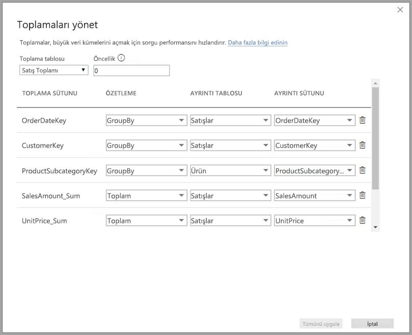

Veri ambarları ve veri reyonları gibi boyutlu veri kaynakları [ilişkiye dayalı toplamalar](#aggregation-based-on-relationships) kullanabilir. Hadoop tabanlı büyük veri kaynakları sıklıkla [toplamaları GroupBy sütunlarına dayandırır](#aggregation-based-on-groupby-columns). Bu makalede her veri kaynağı türü için tipik Power BI modelleme farkları açıklanır.

## Toplu tablo oluşturma

Toplu tablo oluşturmak için:
1. Veri kaynağınıza ve modeline bağlı olarak, istediğiniz alanlarla yeni bir tablo ayarlayın. 
1. **Toplamaları yönet** iletişim kutusunu kullanarak toplamaları tanımlayın.
1. Uygunsa, toplu tablo için [depolama modunu](#storage-modes) değiştirin. 

### Toplamaları yönet

İstediğiniz alanların bulunduğu yeni tabloyu oluşturduktan sonra, herhangi bir Power BI Desktop görünümünün **Alanlar** bölmesinde tabloya sağ tıklayın ve **Toplamaları yönet**’i seçin.

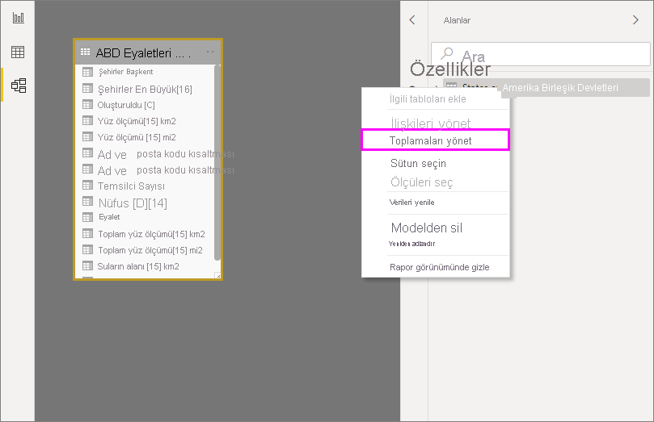

**Toplamaları yönet** iletişim kutusunda tablodaki her sütun için bir satır bulunur ve buradan toplama davranışını belirtebilirsiniz. Aşağıdaki örnekte **Sales** ayrıntı tablosuna yönelik sorgular dahili olarak **Sales Agg** toplama tablosuna yönlendirilir. 

**Toplamaları yönet** iletişim kutusundaki **Özetleme** açılan listesinde aşağıdaki değerler sağlanır:
- Sayı
- GroupBy
- Max
- Min
- Sum
- Tablo satırlarını say

İlişkiye dayalı bu toplama örneğinde GroupBy girdileri isteğe bağlıdır. DISTINCTCOUNT haricinde bunlar toplama davranışını etkilemez ve asıl olarak okunabilirliğe yöneliktir. GroupBy girişleri olmadan da toplamalar ilişkilere göre isabet alacaktır. Bu, GroupBy girdilerinin gerekli olduğu makalenin devamındaki [büyük veri örneğinden](#aggregation-based-on-groupby-columns) farklıdır.

İstediğiniz toplamaları tanımladıktan sonra **Tümünü Uygula**’yı seçin. 

### Doğrulamalar

**Toplamaları yönet** iletişim kutusu aşağıdaki önemli doğrulamaları zorunlu tutar:

- **Ayrıntı Sütunu**’nun veri türü Sayı ve Tablo satırlarını say **Özetleme** işlevlerinin dışında **Toplama Sütunu** ile aynı veri türüne sahip olmalıdır. Sayı ve Tablo satırlarını say işlevleri yalnızca tamsayı toplama sütunları için kullanılabilir ve veri türünün eşleşmesi gerekmez.
- Üç veya daha fazla tabloyu kapsayan zincirleme toplamalara izin verilmez. Örneğin, **Tablo A**’daki toplamalar, **Tablo C**’ye başvuran toplamaların bulunduğu **Tablo B**’ye başvuramaz.
- İki girdinin aynı **Özetleme** işlevini kullandığı ve aynı **Ayrıntı Tablosu**’yla **Ayrıntı Sütunu**’na başvurduğu yinelenen toplamalara izin verilmez.
- **Ayrıntı Tablosu** içeri aktarmayı değil DirectQuery depolama modunu kullanmalıdır.
- Etkin olmayan bir ilişki tarafından kullanılan yabancı anahtara göre gruplandırma ve toplama isabetleri için USERELATIONSHIP işlevine dayanma desteklenmez.

Buna benzer doğrulamaların çoğu aşağıdaki resimde olduğu gibi açılan menü değerlerini devre dışı bırakarak ve araç ipucunda açıklama metni görüntülenerek zorlanır.

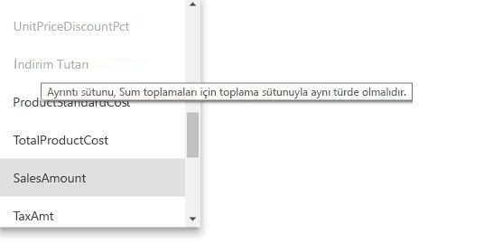

### Toplama tabloları gizlidir

Veri kümesi üzerinde salt okuma erişimi olan kullanıcılar toplama tablolarını sorgulayamaz. *Satır düzeyi güvenlik* ile kullanıldığında bu durum güvenlik kaygılarını önler. Kullanıcılar ve sorgular toplama tablosuna değil ayrıntı tablosuna başvurur ve toplama tablosu hakkında bilgileri olması gerekmez.

Bu nedenle toplama tabloları **Rapor** görünümünde gizlenir. Tablo henüz gizli değilse, **Tümünü uygula**’yı seçtiğinizde **Toplamaları yönet** iletişim kutusu bunu gizli olarak ayarlar.

### Depolama modları
Toplama özelliği tablo düzeyi depolama modlarıyla etkileşim kurar. Power BI tabloları *DirectQuery*, *İçeri Aktarma* veya *İkili* depolama modlarını kullanabilir. DirectQuery arka ucu doğrudan sorgularken İçeri Aktarma verileri önbelleğe alır ve sorguları önbelleğe alınmış verilere gönderir. Tüm Power BI İçeri Aktarma ve çok boyutlu olmayan DirectQuery veri kaynakları toplamalarla çalışabilir. 

Toplu tablonun depolama modunu İçeri Aktarma olarak ayarlayıp sorguları hızlandırmak için Power BI Desktop **Model** görünümünde toplu tabloyu seçin. **Özellikler** bölmesinde **Gelişmiş**’i genişletin, **Depolama modu** altındaki seçimi açın ve **İçeri Aktarma**’yı seçin. Bu eylemin geri alınamayacağını unutmayın. 

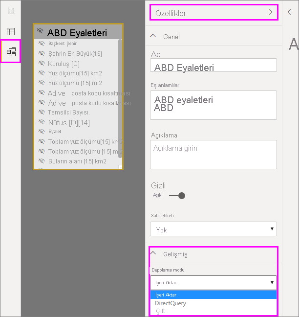

Tablo depolama modları hakkında daha fazla bilgi için bkz. [Power BI Desktop’ta depolama modunu yönetme](desktop-storage-mode.md).

### Toplamalar için RLS

Toplamalarda doğru bir şekilde çalışmak için RLS ifadeleri hem toplama tablosunu hem de ayrıntı tablosunu filtrelemelidir. 

Aşağıdaki örnekte **Geography** tablosundaki RLS ifadesi toplamalar için çalışır çünkü Geography hem **Sales** tablosuyla hem de **Sales Agg** tablosuyla ilişkilerin filtreleme tarafından yer alır. Toplama tablosuna hem isabet eden hem de etmeyen sorgulara RLS başarıyla uygulanır.

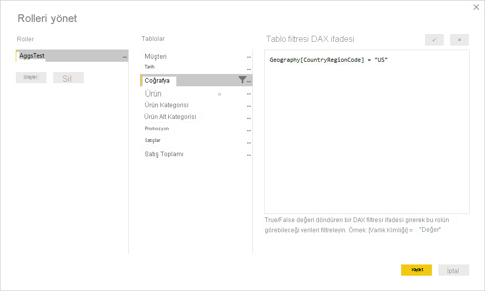

**Product** tablosundaki RLS ifadesi yalnızca ayrıntılı **Sales** tablosunu filtreler; toplanmış **Sales Agg** tablosunu filtrelemez. Toplama tablosu, ayrıntı tablosundaki verilerin başka bir gösterimi olduğundan, RLS filtresi uygulanamazsa toplama tablosundan gelen sorguları yanıtlamak güvenli olmayabilir. Yalnızca ayrıntı tablosunu filtrelemek önerilmez çünkü bu rolden yapılan kullanıcı sorguları toplama isabetlerinden yararlanmaz. 

Yalnızca **Sales Agg** toplama tablosunu filtreleyen ve **Sales** ayrıntı tablosunu filtrelemeyen bir RLS ifadesine izin verilmez.

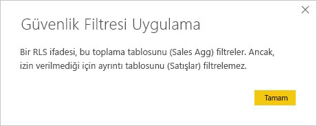

[GroupBy sütunlarını temel alan toplamalar](#aggregation-based-on-groupby-columns) için, ayrıntı tablosuna uygulanan RLS ifadesi toplama tablosunu filtrelemek için kullanılabilir çünkü toplama tablosundaki GroupBy sütunlarının hepsi ayrıntı tablosunun kapsamındadır. Öte yandan toplama tablosundaki RLS filtresi ayrıntı tablosuna uygulanamaz, dolayısıyla buna izin verilmez.

## İlişkilere dayanan toplama

Boyutlu modeller normalde *ilişkilere dayanan toplamaları* kullanır. Veri ambarlarından ve veri reyonlarından gelen Power BI veri kümeleri, aralarında ilişki bulunan boyut tabloları ve olgu tablolarından oluşan yıldız/kar tanesi şemalarına benzer.

Aşağıdaki tek veri kaynağından gelen modelde tablolar DirectQuery depolama modunu kullanmaktadır. **Sales** olgu tablosunda milyarlarca satır bulunur. Önbellek için **Sales** tablosunun depolama modunu İçeri Aktarma olarak belirlemek yüksek bellek ve yönetim yüküne neden olacaktır.

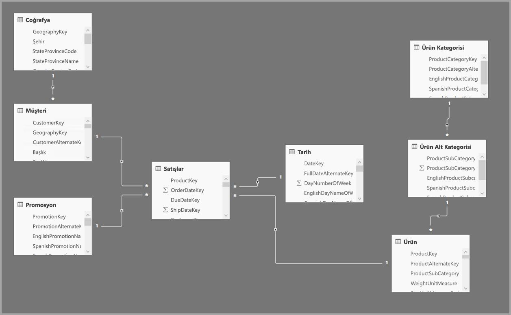

Bunun yerine **Sales Agg** toplama tablosunu oluşturun. **Sales Agg** tablosunda, satır sayısı **CustomerKey**, **DateKey** ve **ProductSubcategoryKey** ölçütlerine göre gruplandırılmış **SalesAmount** toplamına eşit olmalıdır. **Sales Agg** tablosu **Sales** tablosundan daha yüksek bir ayrıntı düzeyindedir, dolayısıyla milyarlarca değil milyonlarca satır içerebilir ve bunların yönetimi çok daha kolaydır.

Aşağıdaki boyut tabloları iş değeri yüksek sorgularda en yaygın kullanılan tablolarsa, **bire çok** veya *çoka bir* ilişkileri kullanarak *Sales Agg* tablosunu filtreleyebilir.

- Coğrafya
- Müşteri
- Tarih
- Ürün Alt Kategorisi
- Ürün Kategorisi

Aşağıdaki görüntüde bu model gösterilmektedir.

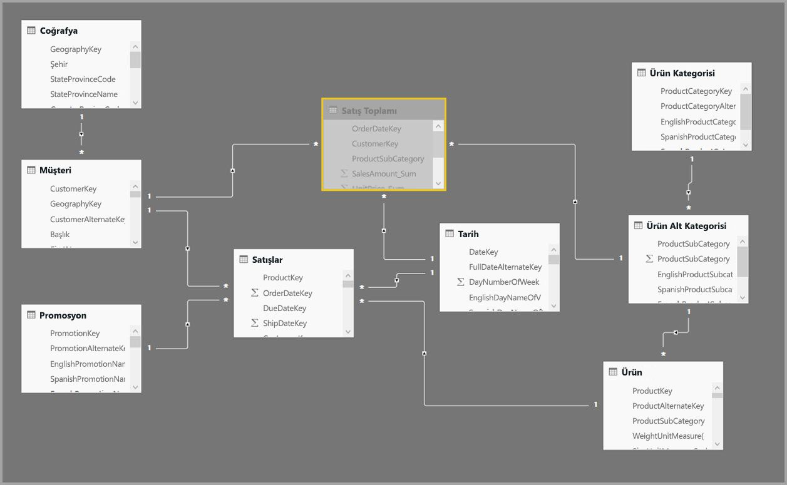

Aşağıdaki tabloda **Sales Agg** tablosunun toplamaları gösterilmiştir.

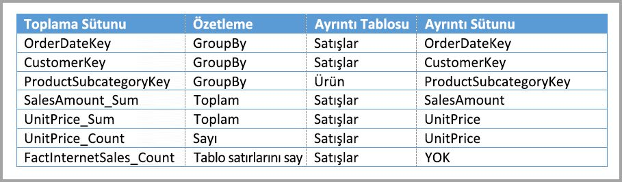

> [!NOTE]
> Diğer herhangi bir tablo gibi **Sales Agg** tablosu da farklı şekillerde yüklenme esnekliğine sahiptir. ETL/ELT işlemleri veya tablo için [M ifadesi](/powerquery-m/power-query-m-function-reference) kullanılarak kaynak veritabanında toplama gerçekleştirilebilir. Toplanan tablo [Power BI Premium'da artımlı yenileme](../admin/service-premium-incremental-refresh.md) seçeneğiyle veya bu seçenek olmadan İçeri Aktarma depolama modunu kullanabileceği gibi DirectQuery de kullanabilir ve [columnstore dizinlerini](/sql/relational-databases/indexes/columnstore-indexes-overview) kullanarak hızlı sorgular için iyileştirilebilir. Bu esneklik performans sorunlarından kaçınmak için sorgu yükünü yayabilen dengeli mimarileri mümkün kılar.

Toplanan **Sales Agg** tablosunun depolama modu **İçeri Aktarma** olarak değiştirildiğinde, ilgili boyut tablolarının *İkili* depolama moduna ayarlanabileceğini belirten bir iletişim kutusu açılır. 

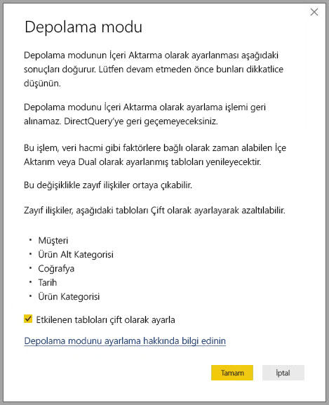

İlgili boyut tablolarını İkili olarak ayarlamak, bunların alt sorguya göre İçeri Aktarma veya DirectQuery gibi davranmasına olanak tanır. Örnekte:

- İçeri Aktarma modundaki **Sales Agg** tablosundaki ölçümleri toplayan sorgular ve ilgili İkili tablolardan alınan gruplandırma ölçütü öznitelikleri bellek içi önbellekten döndürülebilir.
- DirectQuery **Sales** tablosundan ölçümleri toplayan sorgular ve ilgili İkili tablolardan gruplandırma ölçütü öznitelikleri DirectQuery modunda döndürülebilir. GroupBy işlemini içeren sorgu mantığı kaynak veritabanına gönderilir.

İkili depolama modu hakkında daha fazla bilgi için bkz. [Power BI Desktop’ta depolama modunu yönetme](desktop-storage-mode.md).

### Güçlü ve zayıf ilişkiler

Toplamada ilişkileri temel alan isabetler için güçlü ilişkiler gerekir.

Güçlü ilişkiler, her iki tablonun da tek kaynaktan geldiği aşağıdaki depolama modu bileşimlerini içerir:

| *Çok* taraflarındaki tablo | *1* tarafındaki tablo |
| ------------- |----------------------| 
| İkili          | İkili                 | 
| İçeri Aktar        | İçeri Aktarma veya İkili       | 
| DirectQuery   | DirectQuery veya İkili  | 

*Çapraz kaynak* ilişkisinin güçlü kabul edildiği tek durum, her iki tablonun da İçeri Aktarma moduna ayarlanmasıdır. Çoka çok ilişkiler her zaman zayıf olarak kabul edilir.

*Çapraz kaynak* toplamasında ilişkilere dayanmayan isabetler için bkz. [GroupBy sütunlarına dayanan toplamalar](#aggregation-based-on-groupby-columns). 

### İlişki tabanlı toplama sorgusu örnekleri

**Date** tablosundaki sütunlar toplamaya isabet edebilecek ayrıntı düzeyinde olduğundan aşağıdaki sorgu toplamaya isabet eder. **SalesAmount** sütunu **Sum** toplamasını kullanır.

Aşağıdaki sorgu toplamaya isabet etmez. **SalesAmount** tablosunun toplamını istemesine rağmen, sorgu toplamaya isabet edebilecek ayrıntı düzeyinde olmayan **Product** tablosundaki bir sütunda gruplandırma işlemi gerçekleştirmektedir. Modeldeki ilişkiyi gözlemlerseniz, bir ürün alt kategorisinin birden çok **Product** satırı olabilir. Sorgu hangi ürünün toplanacağını saptayamaz. Sorgu bu durumda DirectQuery modeline döner ve veri kaynağına bir SQL sorgusu gönderir.

Toplamalar, yalnızca bir toplama işlemi gerçekleştiren basit hesaplama adımları değildir. Karmaşık hesaplamalar da toplamalardan faydalanabilir. Kavramsal açıdan karmaşık bir hesaplama işlemi SUM, MIN, MAX ve COUNT alt sorgularına ayrılır ve her alt sorgu toplama isabeti açısından değerlendirilir. Bu mantık sorgu planı uygulaması nedeniyle her durumda geçerli olmayabilir ancak genellikle uygulanır. Aşağıdaki örnek toplamaya isabet eder:

COUNTROWS işlevi toplamalardan yararlanabilir. **Sales** tablosu için tanımlanmış bir **Count** tablo satırı toplaması bulunduğundan aşağıdaki sorgu toplamaya isabet eder.

AVERAGE işlevi toplamalardan yararlanabilir. AVERAGE, COUNT ile bölünen bir SUM sorgusuna dönüştürüldüğünden aşağıdaki sorgu toplamaya isabet eder. **UnitPrice** sütununda hem SUM hem de COUNT için tanımlanmış toplamalar bulunduğundan toplamaya isabet eder.

Bazı durumlarda DISTINCTCOUNT işlevi de toplamaları kullanabilir. Toplama tablosundaki **CustomerKey** sütununun benzersizliğini koruyan **CustomerKey** GroupBy girişi olduğundan aşağıdaki sorgu toplamaya isabet eder. İki ile beş milyon arasındaki benzersiz değerin aşılması sorgu performansını etkileyebileceğinden bu teknik de performans eşiğine ulaşabilir. Öte yandan ayrıntı tablosunda milyarlarca satır ama sütunda iki ile beş milyon arasında benzersiz değer bulunan senaryolarda faydalı olabilir. Bu durumda DISTINCTCOUNT, önbelleğe alınmış olsa dahi milyarlarca satıra sahip bir tabloyu taramaktan daha hızlı bir performans sergileyebilir.

DAX akıllı zaman gösterimi işlevleri toplama işlemlerini kullanır. Aşağıdaki sorgu, DATESYTD işlevi **CalendarDay** değerlerinden oluşan bir tablo oluşturduğundan ve toplama tablosu **Date** tablosundaki gruplama ölçütü sütunlarının kapsamına giren bir ayrıntı düzeyinde olduğundan toplama gerçekleştirir. Bu, toplamalarla çalışabilen CALCULATE işlevi için tablo değerli filtre örneğidir.

## GroupBy sütunlarını temel alan toplama 

Hadoop tabanlı büyük veri modellerinin özellikleri boyutlu modellerden farklıdır. Büyük tablolar arasında birleştirmeleri önlemek için, büyük veri modelleri genellikle ilişkileri kullanmaz ama boyut özniteliklerini olgu tablolarına normalleştirilmişlikten çıkarır. Bu büyük veri modellerinde *GroupBy sütunlarını temel alan toplamaları* kullanarak etkileşimli analiz gerçekleştirebilirsiniz.

Aşağıdaki tabloda toplanacak **Movement** sayısal sütunu bulunmaktadır. Diğer tüm sütunlar gruplandırma ölçütü öznitelikleridir. Tabloda IoT verileri ve çok sayıda satır vardır. Depolama modu DirectQuery olarak belirlenmiştir. Veri hacminin çok büyük olması nedeniyle veri kümesinin tamamında toplanan veri kaynağıyla ilgili sorgular yavaş gerçekleşmektedir. 

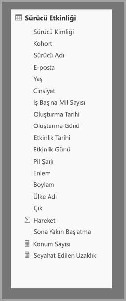

Bu veri kümesinde etkileşimli analizi etkinleştirmek için özniteliklerin çoğuna göre gruplandırma yapan ancak boylam ve enlem gibi kardinalite özniteliklerini dışlayan bir toplama tablosu ekleyebilirsiniz. Bu işlem satır sayısını önemli ölçüde azaltır ve bellek içi önbelleğe rahatça sığacak kadar küçük hale getirir. 

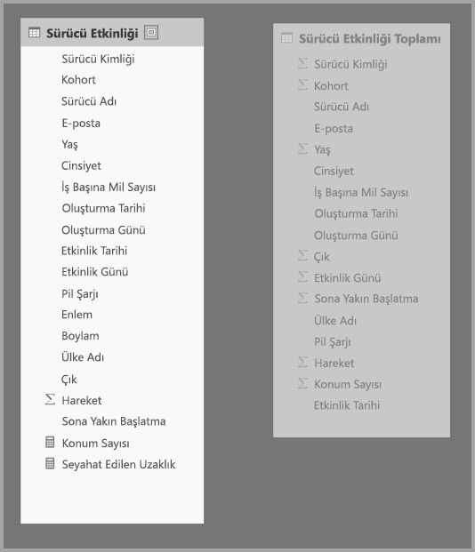

**Toplamaları yönet** iletişim kutusunda **Driver Activity Agg** tablosu için toplama eşlemeleri tanımlarsınız. 

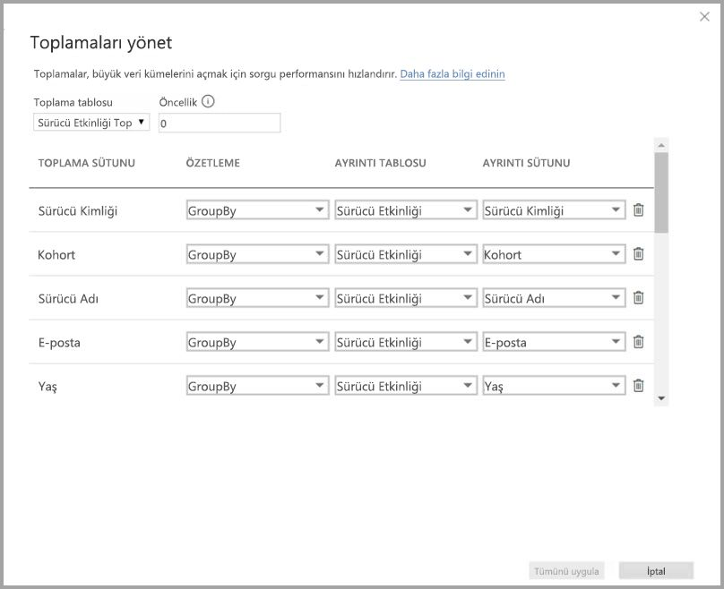

GroupBy sütunlarını temel alan toplamalarda **GroupBy** girdileri isteğe bağlı değildir. Bunlar olmadan toplamalar isabet almaz. Bu, ilişkileri temel alan ve GroupBy girdilerinin isteğe bağlı olduğu toplamalardan farklıdır.

Aşağıdaki tabloda **Driver Activity Agg** tablosunun toplamaları gösterilmiştir.

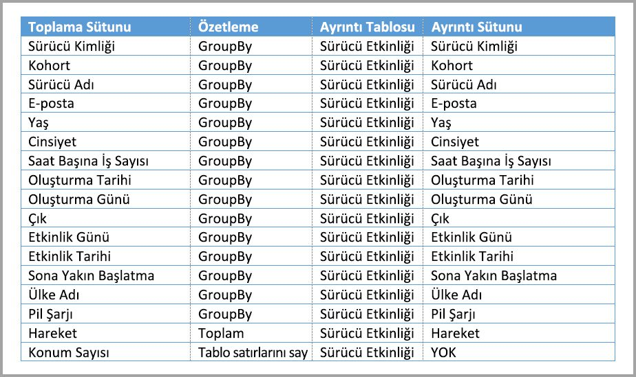

Toplanan **Driver Activity Agg** tablosunun depolama modunu İçeri Aktarma olarak ayarlayabilirsiniz.

### GroupBy toplaması sorgu örneği

**Activity Date** sütunu toplama tablosunun kapsamında olduğundan aşağıdaki sorgu toplamaya isabet eder. COUNTROWS işlevi **Tablo satırlarını say** toplamasını kullanır.

**Tablo satırlarını say** toplamalarını kullanmak, özellikle olgu tablolarında filtre özniteliklerini içeren modeller için iyi bir fikirdir. Power BI, kullanıcı tarafından açıkça istenmediği durumlarda sorguları veritabanına COUNTROWS kullanarak gönderebilir. Örneğin filtre iletişim kutusunda her değer için satır sayısı gösterilmektedir.

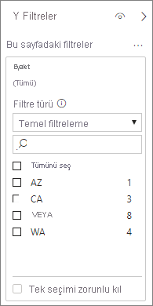

## Birleştirilen toplama teknikleri

Toplamalar içi ilişkiler ve GroupBy sütunları tekniklerini birleştirebilirsiniz. İlişkileri temel alan toplamaların birden fazla tabloya ayrılabilmesi için normalleştirilmişlikten çıkarılmış boyut tablolarına ihtiyaç duyulabilir. Bu işlemin belirli boyut tabloları için yüksek maliyetli veya zahmetli olacağı durumlarda, söz konusu boyutlar için toplama tablosunda gerekli öznitelikleri çoğaltabilir ve diğerleri için ilişkileri kullanılabilir.

Örneği aşağıdaki model **Sales Agg** tablosundaki **Month**, **Quarter**, **Semester** ve **Year** bölümlerini çoğaltır. **Sales Agg** ile **Date** tablosu arasında ilişki yoktur ama **Customer** ve **Product Subcategory** ile ilişkiler vardır. **Sales Agg** depolama modu İçeri Aktar olarak belirlenmiştir.

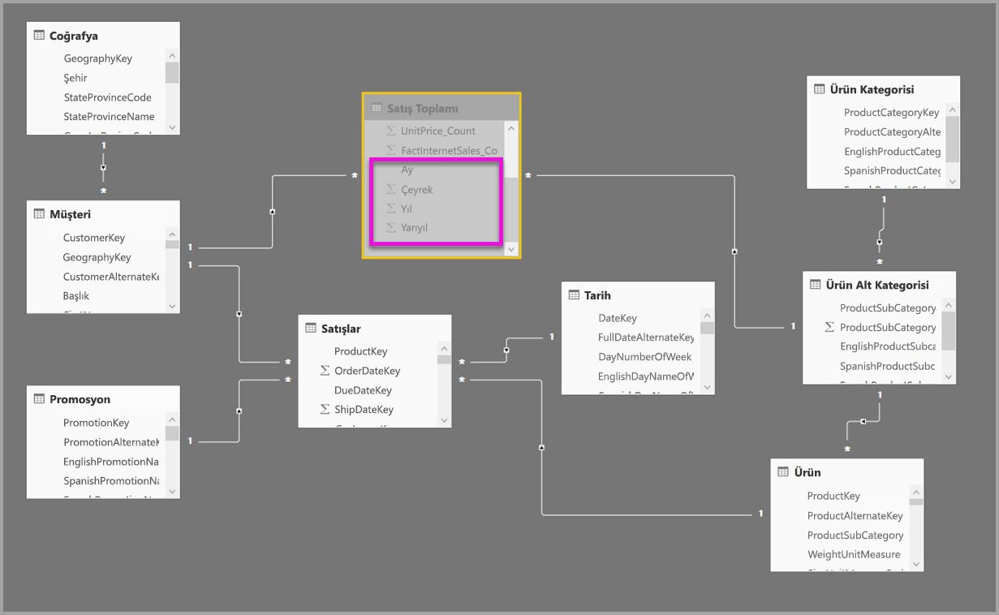

Aşağıdaki tabloda **Sales Agg** tablosunun **Toplamaları yönet** iletişim kutusundaki girişler gösterilmiştir. Ayrıntı tablosunun **Date** olduğu GroupBy girişleri, **Date** özniteliklerine göre gruplandırma yapan sorguların toplamalara isabet etmesi için zorunludur. Önceki örnekte olduğu gibi ilişkilerin mevcut olması nedeniyle **CustomerKey** ve **ProductSubcategoryKey** için **GroupBy** girdileri (DISTINCTCOUNT hariç olmak üzere) toplama isabetlerini etkilemez.

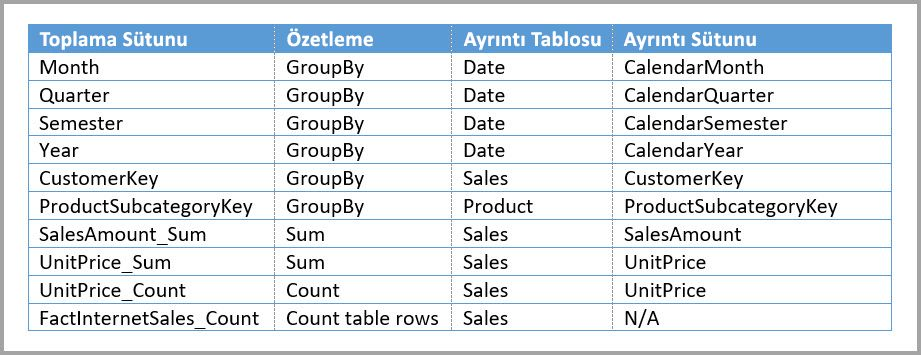

### Birleştirilen toplaması sorgusu örneği

Aşağıdaki sorgu toplamayı isabet alır çünkü toplama tablosu **CalendarMonth**'u kapsar ve **CategoryName**'ye bire çok ilişkileri yoluyla erişilebilir. **SalesAmount** **SUM** toplamasını kullanır.

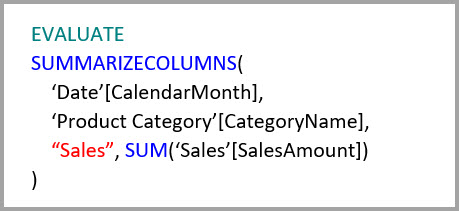

Aşağıdaki sorgu toplamaya isabet etmez çünkü toplama tablosu **CalendarDay** öğesini kapsamaz.

Aşağıdaki akıllı zaman sorgusu toplamaya isabet etmez çünkü DATESYTD işlevi bir **CalendarDay** değerleri tablosu oluşturur ve toplama tablosu **CalendarDay** değerlerini kapsamaz.

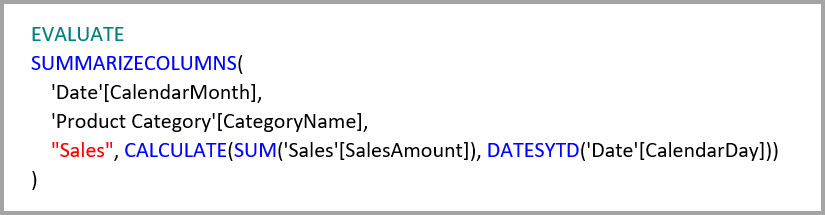

## Toplama önceliği

Toplama önceliği, tek bir alt sorgunun birden fazla toplama tablosu tarafından değerlendirilmesini sağlar.

Aşağıdaki örnek birden çok kaynak içeren bir [bileşik modeldir](desktop-composite-models.md):

- **Driver Activity** DirectQuery tablosu bir büyük veri sisteminden alınan trilyonlarca IoT verisi satırına sahiptir. Bağımsız IoT değerlerinin denetlenen filtre bağlamlarında görüntülenmesi için ayrıntılandırma sorgularını destekler.
- **Driver Activity Agg** tablosu DirectQuery modundaki bir ara toplama tablosudur. Azure SQL Veri Ambarı'nda bir milyardan fazla satır içermektedir ve columnstore dizinleri kullanılarak iyileştirilmiştir.
- **Driver Activity Agg2** İçeri Aktarma tablosu, gruplandırma ölçütü öznitelikleri az ve düşük kardinaliteye sahip olduğundan yüksek ayrıntı düzeyindedir. Satır sayısı binlere indiğinden bellek içi önbelleğe kolayca sığabilir. Bu öznitelikler yüksek profilli bir yönetici panosunda kullanılacağından ilgili sorguların mümkün olduğunca hızlı olması gerekir.

> [!NOTE]
> Ayrıntı tablosundan farklı bir veri kaynağı kullanan DirectQuery toplama tabloları yalnızca toplama tablosu bir SQL Server, Azure SQL veya Azure SQL Veri Ambarı kaynağından geldiğinde desteklenir.

Bu modelin bellek ayak izi oldukça küçüktür ancak çok büyük bir veri kümesine erişim sağlamaktadır. Sorgu yükünü mimarinin bileşenlerine dağıttığından ve her bileşenin güçlü olduğu yönleri kullandığından dengeli bir mimariyi temsil etmektedir.

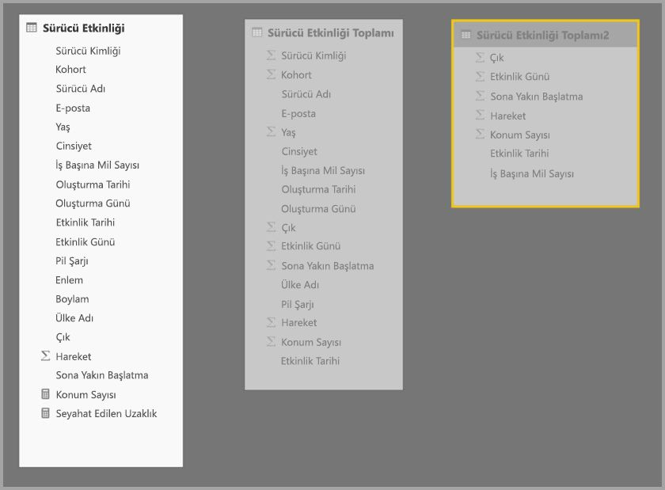

**Driver Activity Agg2** için **Toplamaları yönet** iletişim kutusu **Öncelik** alanını *10* olarak ayarlar ve bu değer **Driver Activity Agg** tablosununkinden yüksektir. Öncelik ayarının yüksek olması toplamaları kullanan sorguların önce **Driver Activity Agg2**'yi hesaba katacağı anlamına gelir. **Driver Activity Agg2** tarafından yanıtlanabilecek ayrıntı düzeyinde olmayan alt sorgular **Driver Activity Agg** tablosunu kullanacaktır. İki toplama tablosu tarafından da yanıtlanamayacak ayrıntılı sorgular **Driver Activity** tablosuna yönlendirilecektir.

Zincirleme toplamalara izin verilmediğinden **Ayrıntı Tablosu** sütununda **Driver Activity Agg** değil **Driver Activity** tablosu belirtilmiştir.

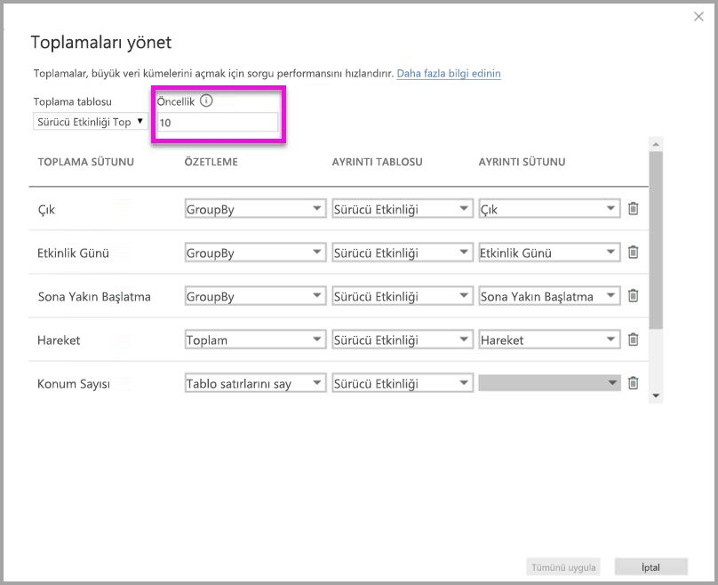

Aşağıdaki tabloda **Driver Activity Agg2** tablosunun toplamaları gösterilmiştir.

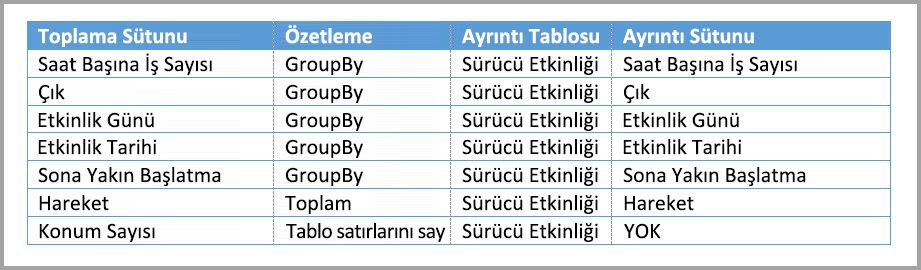

## Sorguların toplamaları isabet aldığını veya kaçırdığını algılama

SQL Profiler sorguların bellek içi önbellek depolama motorundan mı döndürüldüğünü yoksa DirectQuery tarafından veri kaynağına mı gönderildiğini algılayabilir. Toplamaların isabet alıp almadığını algılamak için de aynı işlem kullanılabilir. Daha fazla bilgi için bkz. [Önbelleğe isabet eden veya etmeyen sorgular](desktop-storage-mode.md#queries-that-hit-or-miss-the-cache). 

SQL Profiler ayrıca `Query Processing\Aggregate Table Rewrite Query` genişletilmiş olayı da sağlar.

Aşağıdaki JSON kod parçacığında, toplama kullanıldığında elde edilen olay çıktısı örneği gösterilmektedir.

- **matchingResult**, alt sorgunun bir toplama kullandığını gösterir.
- **dataRequest**, alt sorgunun kullandığı GroupBy sütunlarını ve toplanan sütunları gösterir.
- **mapping**, toplama tablosundaki sütunların eşlenmiş olduğu sütunları gösterir.

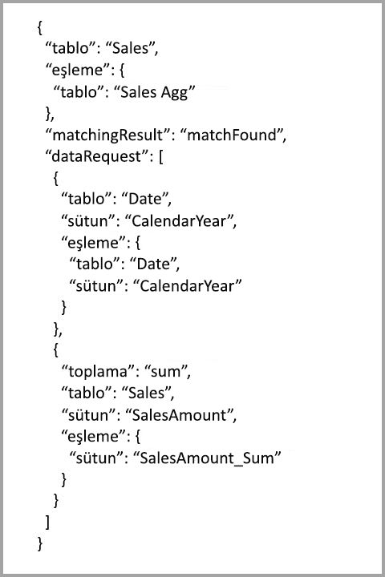

## Önbellekleri eşitlenmiş durumda tutma

Bellek içi önbelleğin kaynak verilerle eşitlenmemesi durumunda DirectQuery, İçeri Aktarma ve/veya İkili depolama modlarını birlikte kullanan toplamalar farklı veri döndürebilir. Örneğin sorgu yürütme, DirectQuery sonuçlarını önbelleğe alınmış değerlerle eşleşecek şekilde filtreleyerek veri sorunlarını maskeleme girişiminde bulunmaz. Gerekirse, kaynakta bu tür sorunlarla başa çıkmak için yerleşik teknikler vardır. Performans iyileştirmeleri yalnızca iş gereksinimlerinizi karşılama imkanını tehlikeye atmayacak şekillerde kullanılmalıdır. Veri akışlarınızı bilmek ve buna uygun tasarım yapmak sizin sorumluluğunuzdadır. 

## Sonraki adımlar

Bileşik modeller hakkında daha fazla bilgi için bkz:

- [Power BI Desktop’ta bileşik modeller kullanma](desktop-composite-models.md)
- [Power BI Desktop’ta çoka çok ilişkileri uygulama](desktop-many-to-many-relationships.md)
- [Power BI Desktop’ta depolama modunu yönetme](desktop-storage-mode.md)

DirectQuery hakkında daha fazla bilgi için bkz:

- [Power BI'da DirectQuery kullanma hakkında](../connect-data/desktop-directquery-about.md)
- [Power BI veri kaynakları](../connect-data/power-bi-data-sources.md)
