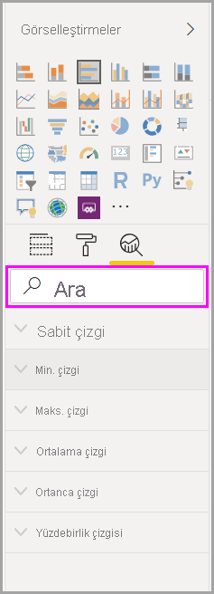
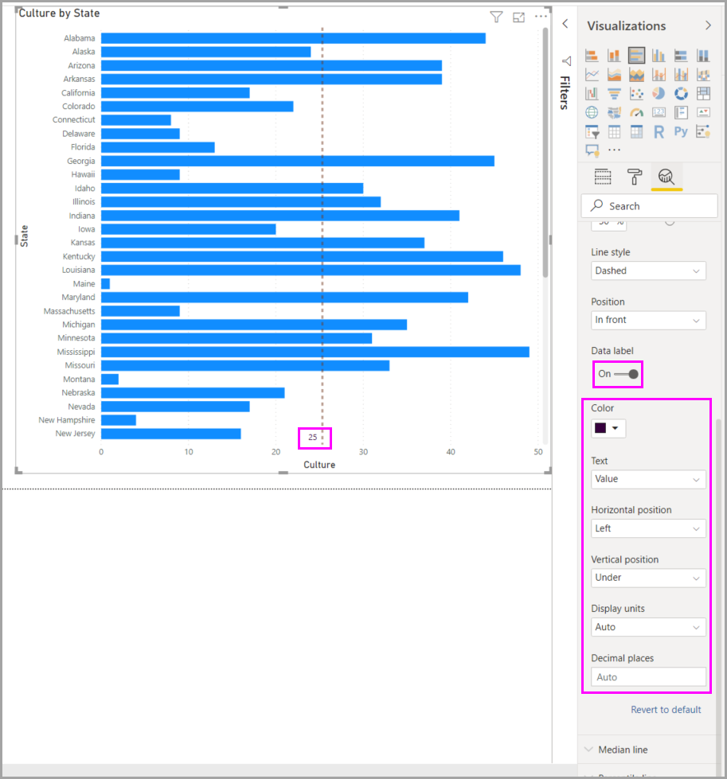

# Power BI Desktop'taki Analiz bölmesini kullanma

Power BI Desktop'taki **Analiz** bölmesini kullanarak görsellere dinamik *başvuru çizgileri* ekleyebilir ve önemli eğilimlere veya içgörülere odaklanılmasını sağlayabilirsiniz. **Analiz** simgesi ve bölmesi, Power BI Desktop’ın **Görselleştirmeler** alanında bulunur.

> [!NOTE]
> **Analiz** bölmesi yalnızca Power BI Desktop tuvalinde bir görsel seçmeniz halinde görünür.

## Analiz bölmesinde arama

Power BI Desktop’ın Şubat 2018 sürümünden (sürüm 2.55.5010.201 veya üzeri) itibaren, **Görselleştirmeler** bölmesinin alt bölümü olan **Analiz** bölmesi içinde arama yapabilirsiniz. **Analiz** simgesini seçtiğinizde arama kutusu görüntülenir.

## Analiz bölmesini kullanma

**Analiz** bölmesi ile aşağıdaki türlerde dinamik başvuru çizgileri oluşturabilirsiniz:

* X Ekseni sabit çizgisi
* Y Ekseni sabit çizgisi
* Min. çizgi
* Maks. çizgi
* Ortalama çizgisi
* Ortanca çizgisi
* Yüzdebirlik çizgisi
* Simetri gölgelendirme

> [!NOTE]
> Kullanılabilen çizgiler görsel türüne göre değişir.

Aşağıdaki bölümlerde, **Analiz** bölmesini ve dinamik başvuru çizgilerini görselleştirmelerinizde nasıl kullanabileceğiniz gösterilmiştir.

Bir görsel için kullanılabilen dinamik başvuru çizgilerini görüntülemek için şu adımları uygulayın:

1. Bir görsel oluşturun veya seçin, ardından **Görsel Öğeler** bölmesindeki **Analiz** simgesini seçin.

    

2. Oluşturmak istediğiniz çizgi türünü seçerek söz konusu çizgi türünün seçeneklerini genişletin. Bu örnekte **Ortalama çizgisi**’ni seçeceğiz.

    

3. Yeni çizgi oluşturmak için **+&nbsp;Ekle**'yi seçin. Sonra çizgiyi adlandırabilirsiniz. Metin kutusuna çift tıklayın ve adınızı girin.

    Şimdi çizginiz için tüm seçenekler sağlanır. **Renk**, **Saydamlık** yüzdesi, **Çizgi stili** ve **Konum** (görselin veri öğelerine göre) ayarlarını belirtebilirsiniz. Ayrıca **Veri etiketi** eklenip eklenmeyeceğini de seçebilirsiniz. Çizginizde temel alacağınız görsel ölçüsünü belirtmek için **Ölçü** açılan listesini seçin. Bu liste görseldeki veri öğeleriyle otomatik olarak doldurulur. Burada ölçü olarak **Culture** öğesini seçip buna *Average of Culture* etiketini ekleyecek ve birkaç seçeneği daha özelleştireceğiz.

    

4. Veri etiketinin görüntülenmesini istiyorsanız, **Kapalı** olan **Veri etiketi** ayarını **Açık** olarak değiştirin. Bu işlemi gerçekleştirdiğinizde veri etiketiniz için ek seçenekler barındıran yeni bir bölüme sahip olursunuz.

    

5. **Analiz** bölmesindeki **Ortalama çizgisi**'nin yanında görünen sayıya dikkat edin. Bu, o anda görselinizde hangi türden kaç dinamik çizgi bulunduğunu gösterir. **Affordability** için **Maks. çizgi** eklersek **Analiz** bölmesinde bu görsele bir de **Maks. çizgi** dinamik başvuru çizgisi eklediğimiz gösterilir.

    

Seçtiğiniz görselde (bu örnekte, bir **Harita** görseli) dinamik başvuru çizgileri kullanılamıyorsa **Analiz** bölmesini seçtiğinizde aşağıdaki iletiyi görürsünüz.

**Analiz** bölmesiyle dinamik başvuru çizgileri oluşturarak birçok ilginç içgörüyü vurgulayabilirsiniz.

Dinamik başvuru çizgilerinin kullanılabildiği görsel türlerini genişletmek de dahil daha fazla özellik ve işlev sunmayı planlıyoruz. Yenilikleri sık sık kontrol etmenizde fayda var.

## Tahmin uygulama

Veri kaynağınızda zaman verileri varsa *tahmin* özelliğini kullanabilirsiniz. Görseli seçip **Analiz** bölmesinin **Tahmin** bölümünü genişletmeniz yeterli olur. Tahmini değiştirmek için, **Tahmin uzunluğu** ve **Olasılık aralığı** gibi birçok giriş belirtebilirsiniz. Aşağıdaki resimde tahmin uygulanmış temel çizgi görseli gösterilir. Bunun modellerinize nasıl uygulanabileceğini görmek için hayal gücünüzü kullanın ve tahminle denemeler yapın.

> [!NOTE]
> Tahmin özelliği yalnızca çizgi grafik görsellerinde kullanılabilir.

## Sınırlamalar

Dinamik başvuru çizgilerinin kullanılabilirliği, birlikte çalışılan görsele göre değişiklik gösterir. Aşağıdaki listelerde bu sınırlamalar daha ayrıntılı olarak açıklanmıştır.

Aşağıdaki görselde *x ekseni sabit çizgisi*, *y ekseni sabit çizgisi* ve *simetri gölgelendirme* kullanabilirsiniz:

* Dağılım grafiği

Bu görsellerde *sabit çizgi*, *min. çizgi*, *maks. çizgi*, *ortalama çizgisi*, *ortanca çizgisi* ve *yüzdebirlik çizgisi* kullanılabilir:

* Alan grafiği
* Kümelenmiş çubuk grafik
* Kümelenmiş sütun grafik
* Çizgi grafik
* Dağılım grafiği

Şu görsellerle *Analiz* bölmesinde yalnızca **sabit çizgi** kullanılabilir:

* Yığılmış alan grafiği
* Yığılmış çubuk grafik
* Yığılmış sütun grafik
* Şelale grafiği
* %100 Yığılmış çubuk grafik
* %100 Yığılmış sütun grafik

Zaman verileri varsa, aşağıdaki görseller *eğilim çizgisi* kullanabilir:

* Alan grafiği
* Kümelenmiş sütun grafik
* Çizgi grafik
* Çizgi ve kümelenmiş sütun grafik

Son olarak, şu anda birçok görsele hiçbir dinamik çizgi ekleyemezsiniz. Bunlardan bazıları:

* Huni
* Çizgi ve kümelenmiş sütun grafik
* Çizgi ve yığılmış sütun grafik
* Şerit grafik
* Halka grafik, Ölçer, Matris, Pasta grafiği ve Tablo gibi kartezyen olmayan görseller

*Yüzdebirlik çizgisi* yalnızca Power BI Desktop’ta içeri aktarılmış veriler kullanılırken veya **Analysis Service 2016** veya sonraki sürümünü, **Azure Analysis Services**’i ya da Power BI hizmetindeki bir veri kümesini çalıştıran sunucudaki modellere canlı bağlantı kurulduğunda kullanılır.

## Sonraki adımlar

Power BI Desktop ile her şeyi yapabilirsiniz. Özellikleri hakkında daha fazla bilgi için aşağıdaki kaynaklara bakın:

* [Power BI Desktop'taki yenilikler](../fundamentals/desktop-latest-update.md)
* [Power BI Desktop'ı alma](../fundamentals/desktop-get-the-desktop.md)
* [Power BI Desktop nedir?](../fundamentals/desktop-what-is-desktop.md)
* [Power BI Desktop ile sorgulara genel bakış](desktop-query-overview.md)
* [Power BI Desktop'taki veri türleri](../connect-data/desktop-data-types.md)
* [Power BI Desktop'ta verileri şekillendirme ve birleştirme](../connect-data/desktop-shape-and-combine-data.md)
* [Power BI Desktop'ta yaygın görevleri gerçekleştirme](desktop-common-query-tasks.md)
