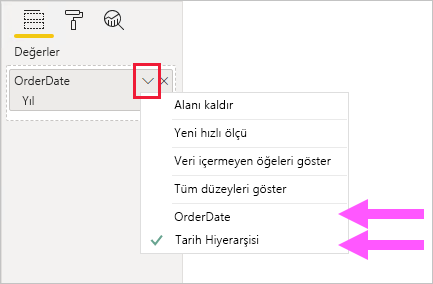
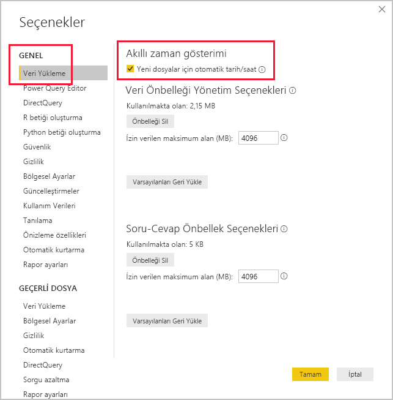

# <a name="apply-auto-datetime-in-power-bi-desktop"></a>Power BI Desktop’ta otomatik tarih/saat uygulama

Bu makale, Power BI Desktop'ta İçeri Aktarma modelleri veya Bileşik modeller geliştiren veri modelleyicilerine yöneliktir. _Otomatik tarih/saat_ seçeneği tanıtılır ve açıklanır.

Otomatik tarih/saat, Power BI Desktop'taki bir veri yükleme seçeneğidir. Bu seçeneğin amacı, modele yüklenmiş olan tarih sütunlarını kullanarak kolay akıllı zaman gösterimi raporlaması sağlamaktır. Bu seçenek, veri modelinizi kullanan rapor yazarlarının takvim zaman aralıklarını (yıl, üç ay, ay ve gün) kullanarak filtreleme, gruplandırma ve detaya gitme işlemleri gerçekleştirmesini sağlar. Önemli olan bu akıllı zaman gösterimi özelliklerini açıkça geliştirmenizin gerekmemesidir.

Bu seçenek etkinleştirildiğinde ve aşağıdaki koşulların karşılanması durumunda Power BI Desktop, her bir tarih sütunu için gizli bir otomatik tarih/saat tablosu oluşturur:

- Tablo depolama modu: İçeri Aktarma
- Sütun veri türü: Tarih veya tarih/saat
- Sütun, bir model ilişkisinin "çok" tarafı değil

## <a name="how-it-works"></a>Nasıl çalışır?

Her otomatik tarih/saat tablosu aslında DAX [CALENDAR](/dax/calendar-function-dax) işlevini kullanarak veri satırları oluşturan bir [hesaplanmış tablodur](desktop-calculated-tables.md). Her tablo da altı hesaplanmış sütun içerir: **Day** (Gün), **MonthNo** (Ay Numarası), **Month** (Ay), **QuarterNo** (Üç Aylık Dönem Numarası), **Quarter** (Üç Aylık Dönem) ve **Year** (Yıl).

> [!NOTE]
> Power BI, sütun adlarını ve değerlerini [model diline](../fundamentals/supported-languages-countries-regions.md#choose-the-language-for-the-model-in-power-bi-desktop) göre çevirir ve biçimlendirir. Örneğin, model İngilizce dili kullanılarak oluşturulduysa, Kore dilinde bir istemciyle görüntülense bile ay adlarını vb.’yi İngilizce göstermeye devam eder.

Ayrıca Power BI Desktop otomatik tarih/saat tablosunun **Tarih** sütunuyla model tarih sütunu arasında bir ilişki oluşturur.

Otomatik tarih/saat tablosu, model tarih sütununda kayıtlı olan tüm tarih değerlerini kapsayan tam takvim yıllarını içerir. Örneğin bir tarih sütunundaki en eski değer 20 Mart 2016, en yeni değer de 23 Ekim 2019 ise tabloda 1.461 satır yer alır. Bu tablo, 2016 ile 2019 arasındaki dört takvim yılındaki her gün için bir satır içerir. Power BI modeli yenilediğinde her otomatik tarih/saat tablosu da yenilenir. Bu şekilde model her zaman tarih sütunu değerlerini kapsayan tarihleri içerir.

Otomatik tarih/saat tablosunun satırlarını görmek mümkün olsaydı şu şekilde görünürdü:


> [!NOTE]
> Otomatik tarih/saat tabloları kalıcı olarak gizlenmiştir ve modelleyiciler dahi göremez. Tablolar **Alanlar** bölmesinde veya Model görünümü diyagramında görüntülenmez, satırları da Veri görünümünde yer almaz. Ayrıca tablo ve sütununa DAX ifadeleri ile doğrudan başvuru yapılamaz.
>
> Ayrıca, [Excel’de Çözümle](../collaborate-share/service-analyze-in-excel.md) ayarını kullanarak veya modele Power BI dışı rapor tasarımcılarıyla bağlanarak bunlarla çalışmak mümkün değildir.

Tablo aynı zamanda bir hiyerarşi tanımlar ve görsellerde yıl, üç aylık dönem, ay ve gün düzeylerinde detaya gitme seçeneği sunar.

Otomatik tarih/saat tablosunu Model görünümünde görmek mümkün olsaydı şu şekilde görünürdü (ilgili sütunlar vurgulanmıştır):

![Gizli tarih/saat tablosunun içeriğini gösteren örnek tablo. İki tablo görüntüler: Sales ve LocalDateTime tablosu. Tablolar, Satış tablosu OrderDate sütunu ve LocalDateTime tablosu Tarih sütunu ile ilişkilendirilmiştir. LocalDateTime yedi sütun tanımlar: Date (Tarih), Day (Gün), Month (Ay), MonthNo (Ay Numarası), Quarter (Üç Aylık Dönem), QuarterNo (Üç Aylık Dönem Numarası), Year (Yıl) ve tek bir hiyerarşi vardır. Tarih Hiyerarşisi adlı hiyerarşi dört düzeyden oluşur: Year (Yıl), Quarter (Üç Aylık Dönem), Month (Ay) ve Day (Gün).](media/desktop-auto-date-time/auto-date-time-hidden-table-example-diagram.png)

## <a name="work-with-auto-datetime"></a>Otomatik tarih/saat ile çalışma

Bir tarih sütunu için otomatik tarih/saat sütunu mevcut olduğunda (ve bu sütun görünür olduğunda), rapor yazarları bu sütunu **Alanlar** bölmesinde görmez. Bunun yerine tarih sütununun adına sahip olan bir genişletilebilir nesne görürler. Takvim simgesi sayesinde bunu kolayca tanımlayabilirsiniz. Rapor yazarları takvim nesnesini genişlettiğinde **Tarih Hiyerarşisi** adlı bir hiyerarşiyle karşılaşırlar. Hiyerarşi genişletildiğinde de dört düzey görünür: **Year** (Yıl), **Quarter** (Üç Aylık Dönem), **Month** (Ay) ve **Day** (Gün).


Otomatik tarih/saat tarafından oluşturulan hiyerarşi, normal hiyerarşiler gibi görsel yapılandırmak için kullanılabilir. Görseller, **Tarih Hiyerarşisinin** tamamı veya belirli düzeyleri kullanılarak yapılandırılabilir.

Ancak bu hiyerarşi, normal hiyerarşiler tarafından desteklenmeyen ek bir özelliğe de sahiptir. Otomatik tarih/saat hiyerarşisi veya bu hiyerarşideki bir düzey bir görsel kutusuna eklendiğinde, rapor yazarı hiyerarşi ile tarih sütunu arasında geçiş yaparak hangisini kullanmak istediğini belirleyebilir. Bu yaklaşım, hiyerarşi ve düzeyleri yerine yalnızca tarih sütununa ihtiyaç duyulan bazı görseller için kullanışlıdır. Görsel alanını yapılandırarak başlayıp (görsel alanına sağ tıklayarak veya aşağı oka tıklayarak) bağlam menüsü ile tarih sütunu veya tarih hiyerarşisi arasında geçiş yapabilir.



Son olarak DAX ile yazılmış olan model hesaplamaları _doğrudan_ bir tarih sütununa veya _dolaylı_ olarak gizli otomatik tarih/saat tablosu sütunlarına başvurabilir.

Power BI Desktop ile yazılmış olan bir formülde tarih sütununa başvurmak için standart yöntemler kullanılabilir. Ancak otomatik tarih/saat sütunlarına özel ve genişletilmiş bir söz dizimi ile başvuru yapılması gerekir. İlk olarak tarih sütunu başvurusunu ekleyip arkasına bir nokta (.) koymanız gerekir. Bunu yaptığınızda formül çubuğu otomatik tamamlama işlevi, otomatik tarih/saat tablosundan sütun seçimi yapmanıza izin verecektir.

![Formül çubuğuna girilmiş örnek bir DAX ölçü ifadesi. Formül şimdilik şu şekilde: Date Count = COUNT(Sales[OrderDate]. Otomatik tamamlama listesi, gizli otomatik tarih/saat tablosundaki yedi sütunu da gösteriyor. Bu sütunlar: Date (Tarih), Day (Gün), Month (Ay), MonthNo (Ay Numarası), Quarter (Üç Aylık Dönem), QuarterNo (Üç Aylık Dönem Numarası) ve Year (Yıl).](media/desktop-auto-date-time/auto-date-time-dax-auto-complete.png)

Power BI Desktop'ta geçerli bir ölçü ifadesi şu şekilde olacaktır:

```dax
Date Count = COUNT(Sales[OrderDate].[Date])
```

> [!NOTE]
> Bu ölçü ifadesi Power BI Desktop'ta geçerlidir ancak doğru bir DAX söz dizimi değildir. Power BI Desktop arka planda ifadenizi gerçek (gizli) otomatik tarih/saat tablosu sütununa başvuracak şekilde dönüştürür.

## <a name="configure-auto-datetime-option"></a>Otomatik tarih/saat seçeneğini yapılandırma

Otomatik tarih/saat _genel olarak_ veya _geçerli dosya_ için yapılandırılabilir. Genel seçeneği yeni Power BI Desktop dosyalarına uygulanır ve istendiğinde kapatılabilir. Yeni Power BI Desktop yüklemelerinde iki seçenek de varsayılan olarak açık olur.

Geçerli dosya seçeneğini de istediğiniz zaman kapatıp açabilirsiniz. Bu özellik açık olduğunda otomatik tarih/saat tabloları oluşturulur. Kapatıldığında ise modeldeki otomatik tarih/saat tabloları kaldırılır.

> [!CAUTION]
> Otomatik tarih/saat tablolarının kaldırılmasına neden olacağından geçerli dosya seçeneğini kapatırken dikkatli olun. Bu tabloları kullanacak şekilde yapılandırılmış olan rapor filtrelerini veya görselleri düzeltmeyi unutmayın.

Power BI Desktop’ta _Dosya > Seçenekler ve ayarlar > Seçenekler_’i ve ardından **Genel** veya **Geçerli Dosya** sayfasını seçin. İlgili seçenek, iki sayfada da **Akıllı zaman gösterimi** bölümünde yer alır.



## <a name="next-steps"></a>Sonraki adımlar

Bu makaleyle ilgili daha fazla bilgi için aşağıdaki kaynaklara bakın:

- [Power BI Desktop’ta otomatik tarih/saat kılavuzu](../guidance/auto-date-time.md)
- [Power BI Desktop’ta tarih tabloları oluşturma](../guidance/model-date-tables.md)
- [Power BI Desktop'ta tarih tabloları ayarlama ve kullanma](desktop-date-tables.md)
- Sorularınız mı var? [Power BI Topluluğu'na sorun](https://community.powerbi.com/)
- Önerileriniz mi var? [Power BI'ı geliştirmek için fikirlerinizi paylaşın](https://ideas.powerbi.com/)
