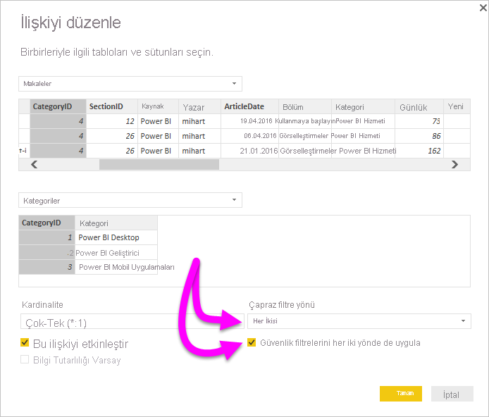

# Power BI Desktop'ta DirectQuery için çift yönlü çapraz filtrelemeyi etkinleştirme

Rapor oluşturucuları ve veri modelleyicileri verilerin uygun görünümünü oluşturmak için tabloları filtrelerken, rapora filtrelerin nasıl uygulanacağını saptama konusunda zorlanır. Daha önce tablonun filtre bağlamı ilişkinin bir tarafında korunuyor ama diğer tarafında korunmuyordu. Bu düzenleme çoğunlukla istenen sonuçları elde etmek için karmaşık DAX formülü kullanmayı gerektiriyordu.

Çift yönlü çapraz filtrelemeyle, rapor oluşturucuları ve veri modelleyicileri artık ilişkili tablolarla çalışırken filtreleri nasıl uygulayabilecekleri konusunda daha fazla denetime sahip olur. Çift yönlü çapraz filtreleme sayesinde filtreleri tablo ilişkisinin *her iki* tarafına da uygulayabilirler. Filtre bağlamını tablo ilişkisinin diğer tarafındaki ikinci ilişkili tabloya yayarak filtreleri uygulayabilirsiniz.

## DirectQuery için çift yönlü çapraz filtrelemeyi etkinleştirme

Çapraz filtrelemeyi **İlişkiyi düzenle** iletişim kutusunda etkinleştirebilirsiniz. İlişkide çapraz filtrelemeyi etkinleştirmek için aşağıdaki seçenekleri yapılandırmanız gerekir:

* **Çapraz filtre yönü**'nü **Her İkisi** olarak ayarlayın.
* **Güvenlik filtrelerini her iki yönde de uygula**'yı seçin.

  

> [!NOTE]
> Power BI Desktop'ta filtreleme DAX formülleri oluştururken *UserPrincipalName* kullanın. Bu alan genellikle *UserName* yerine kullanıcının oturum açma kimliğiyle aynıdır (örneğin<em>joe@contoso.com</em>). Benzer şekilde, *UserName* veya *EmployeeID* ile *UserPrincipalName* parametrelerini eşleyen bir ilişkili tablo oluşturmanız gerekebilir.

Daha fazla bilgi edinmek ve çift yönlü çapraz filtrelemenin nasıl çalıştığına ilişkin örnekleri görmek için [Power BI Desktop için çift yönlü çapraz filtreleme teknik incelemesini](https://download.microsoft.com/download/2/7/8/2782DF95-3E0D-40CD-BFC8-749A2882E109/Bidirectional%20cross-filtering%20in%20Analysis%20Services%202016%20and%20Power%20BI.docx) gözden geçirin.

