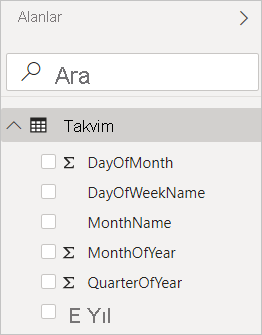
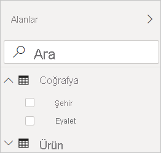
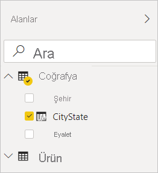

# Power BI Desktop'taki hesaplanmış sütunlar oluşturma
Hesaplanmış sütunları kullanarak modelinizdeki tablolara yeni veriler ekleyebilirsiniz. Ancak bir veri kaynağından yeni sütununuza değer sorgulamak ve yüklemek yerine sütunun değerlerini tanımlayan bir Veri Çözümleme İfadeleri (DAX) formülü oluşturursunuz. Power BI Desktop'ta hesaplanmış sütunları oluşturmak için **Rapor** görünümündeki yeni sütun özelliğini kullanabilirsiniz.

Sorgu Düzenleyicisi'ndeki **Özel Sütun Ekle** işlevini kullanıp bir sorgunun parçası olarak oluşturulan özel sütunlardan farklı olarak **Rapor** görünümü veya **Veri** görünümünde oluşturulan hesaplanmış sütunlar, modele önceden yüklemiş olduğunuz verileri temel alır. Örneğin, birbiriyle ilişkili iki farklı tabloda bulunan iki farklı sütundaki değerleri birleştirebilir, ekleme veya alt dizeleri ayıklama işlemi yapabilirsiniz.

Oluşturduğunuz hesaplanmış sütunlar, **Alanlar** listesinde diğer alanlar gibi görüntülenir ancak değerlerinin bir formülün sonucu olduğunu gösteren özel bir simge kullanılır. Sütunlara istediğiniz adı verip diğer alanlar gibi rapor görselleştirmelerine ekleyebilirsiniz.

Hesaplanmış sütunlar sonuçları hesaplamak için Power BI Desktop'takiler gibi ilişkisel verilerle çalışmak üzere tasarlanmış bir formül dili olan DAX dilini kullanır. DAX 200'den fazla işlev, işleç ve yapıdan oluşan bir kitaplığa sahiptir. Bu, neredeyse tüm veri analizi ihtiyaçlarını karşılamak için sonuçları hesaplayacak formüller oluşturma konusunda yüksek esneklik sunar. DAX hakkında daha fazla bilgi için bkz. [Power BI Desktop'ta DAX kullanımıyla ilgili temel bilgiler](desktop-quickstart-learn-dax-basics.md).

DAX formülleri Excel formülleriyle benzerdir. Hatta DAX, Excel'deki formüllerin çoğuna sahiptir. Ancak DAX işlevleri, Power BI Desktop'ta olduğu gibi etkileşimli olarak dilimlenmiş veya filtrelenmiş rapor verileriyle birlikte çalışacak şekilde tasarlanmıştır. Excel'de tablodaki her satır için farklı bir formülünüz olabilir. Power BI'da yeni sütun için bir DAX formülü oluşturduğunuzda, bu formül tablodaki her satır için sonucu hesaplayacaktır. Sütun değerleri bağlı olduğu veriler ve değerler değiştirildiğinde yeniden hesaplanır.

## Bir örneğe göz atalım
Contoso’da sevkiyat müdürü olan Jeff, farklı şehirlere gönderilen paketlerin sayısını gösteren bir rapor oluşturmak istemektedir. Jeff, şehir ve eyaletler için ayrı alanları bulunan **Geography** adlı bir tabloya sahiptir. Ancak Jeff, raporlarında şehir (City) ve eyalet (State) değerlerinin aynı satırda tek bir değer halinde gösterilmesini istemektedir. Şimdilik Jeff'in **Geography** tablosunda istediği gibi bir alan yoktur.

Ancak Jeff, hesaplanmış sütun kullanarak **City** sütunundaki şehirleri **State** sütunundaki eyaletlerle bir araya getirebilir.

Jeff **Geography** tablosuna sağ tıklar ve **Yeni Sütun**'u seçer. Bunun ardından, Jeff formül çubuğuna aşağıdaki DAX formülünü girer:

Bu formül basitçe **CityState** adlı yeni bir sütun oluşturur. **Geography** tablosundaki her satır için **City** sütunundaki değerleri alır, bir virgül koyar ve **State** sütunundaki değerlerle birleştirir.

Artık Jeff istediği alana sahiptir.

Jeff, sevkiyatların sayısıyla birlikte artık bunu rapor tuvaline ekleyebilir. Çok az çaba harcayarak Jeff’in artık neredeyse tüm görselleştirme türlerine eklenebilen bir **CityState** alanı vardır. Jeff yeni bir harita oluştururken, Power BI Desktop yeni sütundaki şehir ve eyalet değerlerinin nasıl okuması gerektiğini zaten bilir.

## Sonraki adımlar
Burada hesaplanmış sütunlara yalnızca kısa bir giriş yaptık. Daha fazla bilgi için aşağıdaki kaynaklara göz atın:

* Örnek dosyayı indirmek ve daha fazla sütun oluşturma işlemini adım adım öğrenmek için bkz. [Öğretici: Power BI Desktop'taki hesaplanmış sütunlar oluşturma](desktop-tutorial-create-calculated-columns.md)

* DAX hakkında daha fazla bilgi için bkz. [Power BI Desktop'ta DAX kullanımıyla ilgili temel bilgiler](desktop-quickstart-learn-dax-basics.md).

* Sorguların parçası olarak oluşturduğunuz sütunlar hakkında daha fazla bilgi için **Power BI Desktop'taki genel sorgu görevleri** makalesinin [Özel sütun oluşturma](desktop-common-query-tasks.md) bölümüne bakın.  

