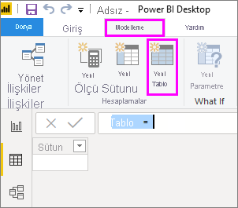
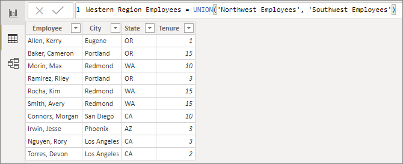
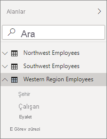

# <a name="create-calculated-tables-in-power-bi-desktop"></a>Power BI Desktop'ta hesaplanan tablo oluşturma
Tablo oluşturmak için çoğu zaman modelinize dışarıdaki veri kaynaklarından veri aktarırsınız. Ancak *hesaplanan tablolar* sayesinde modele önceden yüklediğini verileri kullanarak yeni tablolar ekleyebilirsiniz. Bir veri kaynağından yeni tablonuzun sütunlarına değer sorgulamak ve yüklemek yerine tablonun değerlerini tanımlayan bir [Veri Çözümleme İfadeleri (DAX)](/dax/index) formülü oluşturursunuz.

DAX, Power BI Desktop'takiler gibi ilişkisel verilerle çalışmak için kullanılan bir formül dilidir. DAX, sahip olduğu 200'den fazla işlev, işleç ve yapı ile her türlü veri çözümleme ihtiyacını karşılayacak sonuçları hesaplayan formüller oluşturma konusunda yüksek düzeyli esneklik sunar. Hesaplanan tablolar ara hesaplamalar için idealdir ve istediğiniz veriler anlık olarak hesaplanmak yerine modelin bir parçası veya sorgu sonucu olarak depolanır. Örneğin var olan iki tabloyu *birleştirmek* veya *çapraz şekilde bağlamak* isteyebilirsiniz.

Diğer Power BI Desktop tabloları gibi hesaplanan tablolar da diğer tablolarla ilişki kurabilir. Hesaplanan tablo sütunlarında veri türleri ve biçimlendirme özellikleri mevcuttur ve bu sütunlar bir veri kategorisine ait olabilir. Sütunlara istediğiniz adı verip diğer alanlar gibi rapor görselleştirmelerine ekleyebilirsiniz. Hesaplanan tablolar yalnızca veri çektiği tablonun yenilenmesi veya güncelleştirilmesi durumunda yeniden hesaplanır. Tablonun DirectQuery kullanan tablodaki verileri kullandığı durumlar bu kapsamın dışındadır. DirectQuery söz konusu olduğunda tablo değişiklikleri yalnızca veri kümesi yenilendiğinde gösterir. Tablonun DirectQuery kullanması gerekiyorsa en iyi seçenek tablonun da DirectQuery'de hesaplanmasını sağlamaktır.

## <a name="create-a-calculated-table"></a>Hesaplanan tablo oluşturma

Hesaplanan tablo oluşturmak için Power BI Desktop'ta Rapor Görünümü veya Veri Görünümü içindeki **Yeni Tablo** özelliğini kullanabilirsiniz.

Örneğin **Northwest Employees** ve **Southwest Employees** adına sahip iki tabloya sahip olan bir personel müdürü olduğunuzu düşünün. Bu iki tabloları **Western Region Employees** adlı tek bir tabloda birleştirmek istiyorsunuz.

**Northwest Employees**

 

**Southwest Employees**

 

Power BI Desktop'ın Rapor Görünümü veya Veri Görünümü düzeninde, **Modelleme** sekmesinin **Hesaplamalar** grubunda **Yeni Tablo**'yu seçin. Yeni hesaplanan tablonuzu anında görebileceğiniz için bu işlemi Veri Görünümü düzeninde yapmak daha kolaydır.

 

Formül çubuğuna aşağıdaki formülü yazın:

```dax
Western Region Employees = UNION('Northwest Employees', 'Southwest Employees')
```

**Western Region Employees** adlı yeni bir tablo oluşturulur ve **Alanlar** bölmesinde diğer tablolar gibi görüntülenir. Diğer tablolara ilişki oluşturabilir, ölçü ve hesaplanmış sütun ekleyebilir ve alanları, diğer tablolarda olduğu gibi raporlara ekleyebilirsiniz.

 

 

## <a name="functions-for-calculated-tables"></a>Hesaplanan tablolara ilişkin işlevler

Başka bir tabloya basit başvuru dahil olmak üzere bir tablo döndüren tüm DAX ifadeleriyle hesaplanan tablo tanımlayabilirsiniz. Örnek:

```dax
New Western Region Employees = 'Western Region Employees'
```

Bu makalede hesaplanan tablolar ile ilgili giriş düzeyinde bilgilere yer verilmiştir. Hesaplanan tabloları DAX ifadeleriyle birlikte kullanarak birçok analitik problemi çözebilirsiniz. Kullanabileceğiniz diğer yaygın DAX tablo işlevlerinden bazıları şunlardır:

* DISTINCT
* VALUES
* CROSSJOIN
* UNION
* NATURALINNERJOIN
* NATURALLEFTOUTERJOIN
* INTERSECT
* CALENDAR
* CALENDARAUTO

Bu işlevler ve tablo döndüren diğer DAX işlevleri hakkında bilgi için bkz. [DAX İşlev Başvurusu](/dax/dax-function-reference).

