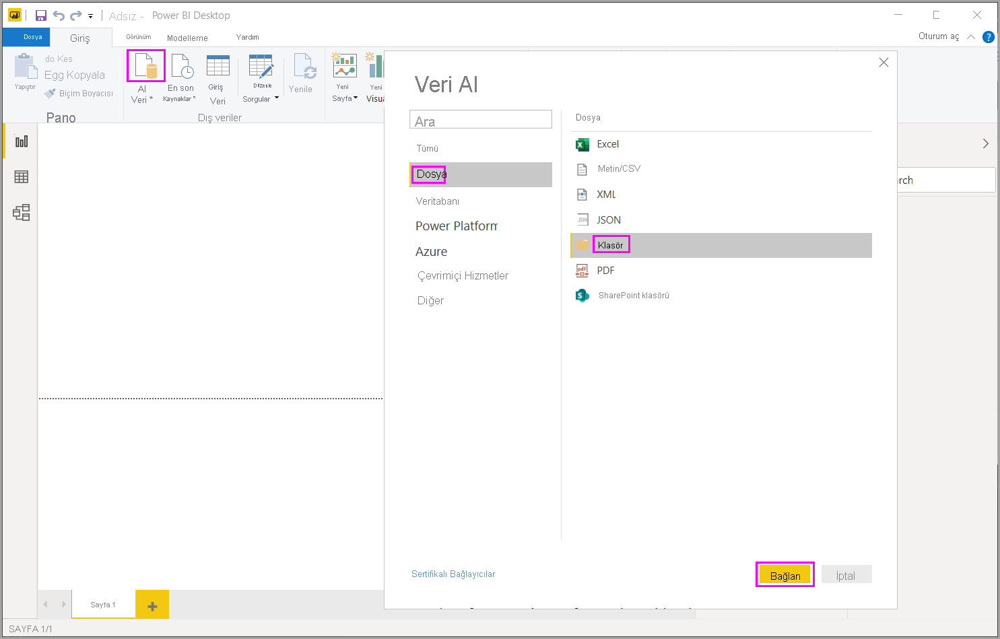
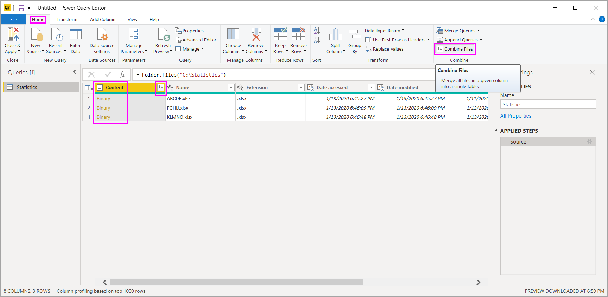

# Power BI Desktop’ta dosyaları (ikili değerleri) birleştirme

İşte verileri **Power BI Desktop**’a içeri aktarmak için güçlü bir yaklaşım: Aynı şemaya sahip birden çok dosyanız varsa bunları tek bir mantıksal tabloda birleştirin. Bu popüler teknik daha kullanışlı ve daha kapsamlı hale getirilmiştir.

Aynı klasörde bulunan dosyaları birleştirme işlemine başlamak için **Veri Al**’ı, **Dosya** > **Klasör**’ü ve sonra da **Bağlan**’ı seçin.

Klasör yolunu girin, **Tamam**’ı seçin ve sonra da **Veri Dönüştürme**’yi seçerek Power Query Düzenleyicisi’nde klasörün dosyalarını görüntüleyin.

## Dosya birleştirme davranışı

Power Query Düzenleyicisi’nde ikili dosyaları birleştirmek için **İçerik** (ilk sütun etiketi) öğesini ve sonra da **Giriş** > **Dosyaları Birleştir**’i seçin. İsterseniz doğrudan **İçerik** öğesinin yanındaki **Dosyaları Birleştir** simgesini de seçebilirsiniz.

*Dosyaları birleştir* dönüştürme işlemi aşağıdaki gibi davranır:

* Dosyaları birleştir dönüştürme işlemi, her giriş dosyasını analiz eder ve kullanılacak doğru dosya biçimini (*metin*, *Excel çalışma kitabı* veya *JSON dosyası* gibi) belirler.
* Dönüştürme işlemi, ilk dosyadan belirli bir nesneyi (ayıklanacak bir Excel çalışma kitabı gibi) seçmenize olanak sağlar.
  
  
* Bundan sonra, dosyaları birleştir dönüştürme işlemi otomatik olarak şu eylemleri gerçekleştirir:
  
  * Tek bir dosyada gerekli tüm ayıklama adımlarını gerçekleştirecek örnek bir sorgu oluşturulur.
  * Dosya/ikili değer girişini *örnek sorgu* olarak parametreleştiren bir *işlev sorgusu* oluşturulur. Örnek sorgu ve işlev sorgusu bağlantılı hale getirilir. Böylece, örnek sorguda yapılan değişiklikler işlev sorgusunda da geçerli olur.
  * *İşlev sorgusunu* giriş ikili değerleriyle özgün sorguya (örneğin *Klasör* sorgusu) uygular. Her satırda ikili girişler için işlevi uygular, ardından sonuçta elde edilen veri ayıklamasını üst düzey sütunlar olarak genişletir.

    

> [!NOTE]
> Bir Excel çalışma kitabındaki seçiminizin kapsamı, ikili dosyaları birleştirme davranışını etkiler. Örneğin, belirli bir çalışma sayfasını seçerek çalışma sayfasını birleştirebilir veya tam dosyayı birleştirmek için kökü seçebilirsiniz. Bir klasörün seçilmesi o klasörde bulunan dosyaları birleştirir. 

Dosyaları birleştir seçeneğinin davranış biçimiyle, aynı dosya türüne ve yapısına (örneğin, aynı sütunlarda bulunmaları) sahip oldukları sürece belirli bir klasördeki tüm dosyaları kolayca birleştirebilirsiniz.

Ayrıca, otomatik olarak oluşturulan örnek sorguyu değiştirerek başka dönüştürme ve ayıklama adımlarını da kolayca uygulayabilirsiniz. Bunun için ek işlev sorgusu adımlarını değiştirmeniz veya yeni adımlar oluşturmanız gerekmez. Örnek sorgu üzerindeki tüm değişiklikler, bağlantılı işlev sorgusunda otomatik olarak oluşturulur.

## Sonraki adımlar

Power BI Desktop’ı kullanarak çok çeşitli türlerdeki verilere bağlanabilirsiniz. Veri kaynakları hakkında daha fazla bilgi için aşağıdaki kaynaklara bakın:

* [Power BI Desktop nedir?](../fundamentals/desktop-what-is-desktop.md)
* [Power BI Desktop'ta veri kaynakları](../connect-data/desktop-data-sources.md)
* [Power BI Desktop'ta verileri şekillendirme ve birleştirme](../connect-data/desktop-shape-and-combine-data.md)
* [Power BI Desktop'ta CSV dosyalarına bağlanma](../connect-data/desktop-connect-csv.md)
* [Verileri doğrudan Power BI Desktop'a girme](../connect-data/desktop-enter-data-directly-into-desktop.md)
