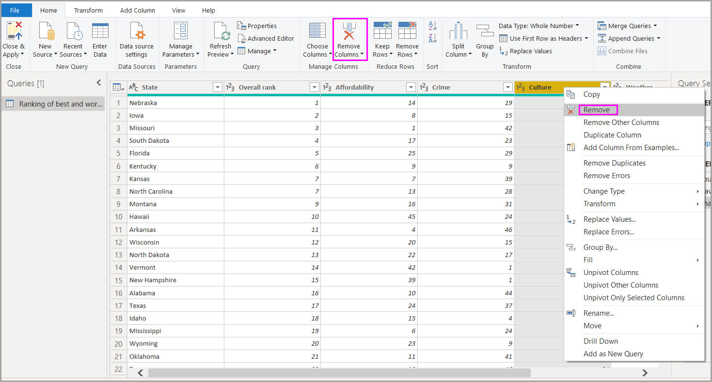
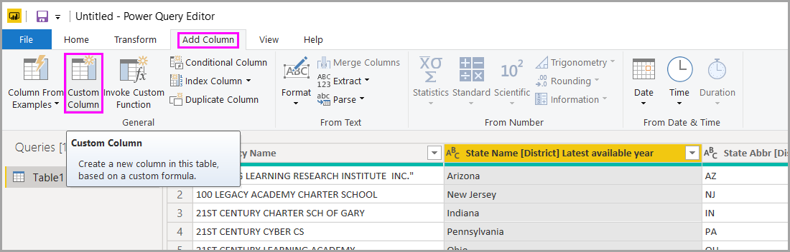
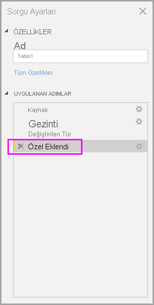

# Power BI Desktop'taki genel sorgu görevlerini gerçekleştirme

Power BI Desktop'ın Power Query Düzenleyicisi penceresinde yaygın olarak kullanılan birkaç görev vardır. Bu makalede söz konusu görevler gösterilmiş ve ek bilgilere yönelik bağlantılar sağlanmıştır.

Yaygın olarak kullanılan ve burada gösterilen sorgu görevleri şunlardır:

* Verilere bağlanma
* Verileri şekillendirme ve birleştirme
* Satırları gruplandırma
* Sütunları özetleme
* Özel sütun oluşturma
* Formülleri sorgulama

Bu görevleri tamamlamak için birkaç veri bağlantısından yararlanacağız. Bu görevlere ilişkin adımları kendi başınıza uygulamak isterseniz ilgili verileri indirebilir veya verilere bağlanabilirsiniz.

İlk veri bağlantısı, indirebileceğiniz ve yerel olarak kaydedebileceğiniz [bir Excel çalışma kitabıdır](https://download.microsoft.com/download/5/7/0/5701F78F-C3C2-450C-BCCE-AAB60C31051D/PBI_Edu_ELSi_Enrollment_v2.xlsx). Diğeri ise, diğer Power BI Desktop makalelerinde de kullanılan bir Web kaynağıdır:

<https://www.bankrate.com/retirement/best-and-worst-states-for-retirement/>

Yaygın sorgu görevleri bu veri kaynaklarından her ikisine de bağlanmak için gereken adımlarla başlar.

## Verilere bağlanma

Power BI Desktop’taki verilere bağlanmak için **Giriş**’i ve ardından **Veri Al**’ı seçin. Power BI Desktop, en sık kullanılan veri kaynaklarını içeren bir menü görüntüler. Power BI Desktop'ta bağlanılabilen veri kaynaklarının tam listesi için, menünün sonunda yer alan **Diğer** öğesini seçin. Daha fazla bilgi için bkz. [Power BI Desktop'taki veri kaynakları](../connect-data/desktop-data-sources.md).

Başlangıç olarak **Excel**’i seçin, yukarıda adı geçen Excel çalışma kitabını belirtin ve **Aç**’ı seçin. Siz tabloyu seçtikten sonra sorgu çalışma kitabını inceler ve ardından bulduğu verileri **Gezgin** iletişim kutusunda gösterir.

Verileri Power BI Desktop'a yüklemeden önce **Veri Dönüştürme**’yi seçerek verileri düzenleyebilir, ayarlayabilir ve *şekillendirebilirsiniz*. Yüklemeden önce küçültmek istediğiniz büyük veri kümeleriyle çalışırken, düzenleme özellikle yararlı olur.

Farklı türlerdeki verilere bağlanmak kolaydır. Ayrıca bir Web kaynağına da bağlanmak istiyorsunuz. **Veri Al** > **Tümü**’nü seçin ve sonra da **Diğer** > **Web** > **Bağlan**’ı seçin.

Web sayfasının URL'sini girebileceğiniz **Web'den** iletişim kutusu görüntülenir.

**Tamam**’ı seçin. Daha önce olduğu gibi Power BI Desktop Web sayfası verilerini inceler ve **Gezgin** iletişim kutusunda önizleme seçeneklerini görüntüler. Bir tablo seçtiğinizde, verilerin önizlemesi görüntülenir.

Diğer veri bağlantıları da benzer şekilde kurulur. Bir veri bağlantısını gerçekleştirmek için kimlik doğrulaması gerekiyorsa Power BI Desktop, geçerli kimlik bilgilerini girmenizi ister.

Power BI Desktop'ta verilere bağlanma işleminin adım adım gösterimi için bkz. [Power BI Desktop'ta verilere bağlanma](../connect-data/desktop-connect-to-data.md).

## Verileri şekillendirme ve birleştirme

Verileri Power Query Düzenleyicisi ile kolayca şekillendirebilir ve birleştirebilirsiniz. Bu bölümde, verileri nasıl şekillendirebileceğinize ilişkin birkaç örnek bulunur. Verileri şekillendirme ve birleştirme işlemlerinin eksiksiz bir gösterimi için bkz. [Power BI Desktop'ta verileri şekillendirme ve birleştirme](../connect-data/desktop-shape-and-combine-data.md).

Önceki bölümde iki veri kümesine bağlandınız: Excel çalışma kitabı ve Web kaynağı. Veriler Power Query Düzenleyicisi’ne yüklendikten sonra, burada gösterildiği gibi **Sorgular** bölmesindeki kullanılabilir sorgular arasından Web sayfası sorgusunu seçin:

Verileri şekillendirdiğinizde, bir veri kaynağını ihtiyaçlarınızı karşılayan bir düzene ve biçime dönüştürmüş olursunuz.

Power Querl Düzenleyicisi'ndeki şeritte ve bağlam menülerinde birçok komuta ulaşabilirsiniz. Örneğin bir sütuna sağ tıkladığınızda bağlam menüsü sütunu kaldırmanıza olanak tanır. Ayrıca sütunu seçip şeritteki **Giriş** sekmesinde **Sütunları Kaldır** düğmesini de seçebilirsiniz.

Bu sorguda verileri birçok başka yolla da şekillendirebilirsiniz. Üstten ve alttan istediğiniz sayıda satırı kaldırabilirsiniz. Ayrıca isterseniz sütun ekleyebilir, sütunları bölebilir, değerleri değiştirebilir veya başka şekillendirme görevleri gerçekleştirebilirsiniz. Bu özelliklerle Power Query Düzenleyicisi’ni istediğiniz verileri almaya yönlendirebilirsiniz.

## Satırları gruplandırma

Power Query Düzenleyicisi'nde, birçok satırda bulunan değerleri tek bir değer olacak şekilde gruplandırabilirsiniz. Bu özellik sunulan ürün sayısını, toplam satışları veya öğrenci sayısını özetlerken kullanışlı olabilir.

Bu örnekte bir eğitim kaydı veri kümesindeki satırları gruplandıracaksınız. Veriler Excel çalışma kitabından alınmıştır. Yalnızca size gereken sütunları almak, tabloyu yeniden adlandırmak ve birkaç başka dönüştürme yapmak için Power Query Düzenleyicisi’nde şekillendirilmiştir.

Şimdi her eyalette kaç Kurum olduğunu bulalım. (Kurumlar okul bölgeleri, bölgesel hizmet kuruluşları gibi diğer eğitim kurumları, vb. olabilir.) **Agency ID - NCES Assigned \[District\] Latest available year** sütununu ve sonra da şeritteki **Dönüştür** sekmesindeki veya **Giriş** sekmesindeki **Gruplandır** düğmesini seçin. (**Gruplandır** düğmesi her iki sekmede de sağlanır.)

**Gruplandır** iletişim kutusu görüntülenir. Power Query Düzenleyicisi satırları gruplandırdığında, **Gruplandır** işleminden elde edilen sonuçları yerleştirdiği yeni bir sütun oluşturur. **Gruplandır** işlemini aşağıda belirtilen yollarla ayarlayabilirsiniz:

1. Etiketsiz açılan liste, gruplandırılacak sütunu belirtir. Power Query Düzenleyicisi bu değer için varsayılan olarak seçili sütunu kullanır ama bunu tablodaki herhangi bir sütunla değiştirebilirsiniz.
2. **Yeni sütun adı**: Power Query Düzenleyicisi, gruplandırılmakta olan sütuna uyguladığı işlemi temel alarak yeni sütun için bir ad önerir. Yine de yeni sütunu dilediğiniz gibi adlandırabilirsiniz.
3. **İşlem**: Power Query Düzenleyicisi’nin uygulayacağı işlemi, örneğin **Toplam**, **Ortanca** veya **Farklı Satırların Sayımı** işlemini seçebilirsiniz. Varsayılan değer **Satırları Say** işlemidir.
4. **Gruplama ekle** ve **Toplama ekle**: Bu düğmelerin kullanılabilir olması için **Gelişmiş** seçeneğini belirtmeniz gerekir. Bu düğmeleri kullanarak tek işlemde birden çok sütunda gruplama işlemleri (**Gruplandır** eylemleri) yapabilir ve çeşitli toplamalar oluşturabilirsiniz. Bu iletişim kutusundaki seçimlerinize bağlı olarak Power Query Düzenleyicisi birden çok sütun üzerinde çalışan yeni bir sütun oluşturur.

Bir **Gruplandır** işlemine daha fazla gruplanma veya toplama eklemek için **Gruplama ekle** veya **Toplama ekle** düğmesini seçin. Gruplama veya toplamayı kaldırmak için satırın sağındaki üç nokta simgesini ( **...** ) ve sonra da **Sil**’i seçin. Devam edin ve neler olduğunu görmek için varsayılan değerleri kullanarak **Gruplandır** işlemini deneyin.

**Tamam**’ı seçtiğimizde Sorgu **Gruplandır** işlemini yapar ve sonuçları döndürür. Şuna bir bakın: Bugün Ohio, Illinois, Texas ve California eyaletlerinden her birinde binin üzerinde kurum var!

Ayrıca Power Query Düzenleyicisi’yle istediğiniz zaman son şekillendirme işlemini kaldırabilirsiniz. **Sorgu Ayarları** bölmesindeki **Uygulanan Adımlar**’ın altında, son tamamlanan adımın yanındaki **X** işaretini seçmeniz yeterli olur. Bu nedenle devam edip denemeler yapabilirsiniz. Sonuçlardan memnun kalmazsanız Power Query Düzenleyicisi verilerinizi tam istediğiniz gibi şekillendirilene kadar adımı tekrarlayın.

## Sütunları özetleme

Sütunları özetleyebilir ve sütundaki her benzersiz değer için toplanan değerler içeren bir tablo oluşturabilirsiniz. Örneğin, her ürün kategorisinde kaç farklı ürününüz olduğunu öğrenmek için hızla bunu gösteren bir tablo oluşturabilirsiniz.

Bir örneğe göz atalım. Aşağıdaki **Products_by_Categories** tablosu, yalnızca benzersiz ürünleri (adına göre) ve ait oldukları kategoriyi gösterecek biçimde şekillendirilmiştir. Her kategorideki ürün sayısını gösteren yeni bir tablo (**CategoryName** sütununu temel alan) oluşturmak için, sütunu seçin ve ardından **Dönüştür** > **Özet Sütun**’ü seçin.

Yeni sütunları oluşturmak için hangi sütunun değerlerinin kullanılacağını öğrenmenizi sağlayan **Özet Sütun** iletişim kutusu görüntülenir (1). (**CategoryName** sütun adının gösterilmesini istemiyorsanız, bu adı açılan listeden seçin.) **Gelişmiş seçenekler**’i (2) genişlettiğinizde, toplanan değerlere (3) uygulanacak işlevi seçebilirsiniz.

**Tamam**'ı seçtiğinizde Sorgu **Özet Sütun** iletişim kutusunda sağlanan dönüştürme yönergeleri doğrultusunda tabloyu görüntüler.

## Özel sütun oluşturma

Power Query Düzenleyicisi’nde tablonuzdaki birden çok sütun üzerinde çalışan özel formüller oluşturabilirsiniz. Ardından bu tür formüllerin sonuçlarını yeni bir (özel) sütuna yerleştirebilirsiniz. Power Query Düzenleyicisi sayesinde özel sütunları kolayca oluşturabilirsiniz.

Power Query Düzenleyicisi’nde Excel çalışma kitabı verileriyle, şeritteki **Sütun Ekle** sekmesine gidin ve **Özel Sütun**’u seçin.

Aşağıdaki iletişim kutusu görüntülenir. Bu örnekte, English Language Learners (ELL) kategorisindeki toplam öğrenci yüzdesini hesaplayan, *Percent ELL* adında özel bir sütun oluşturun.

Aynı Power Query Düzenleyicisi’ndeki diğer uygulanan adımlarda olduğu gibi, yeni özel sütun aradığınız verileri sağlamazsa adımı silebilirsiniz. **Sorgu Ayarları** bölmesindeki **Uygulanan Adımlar**’ın altında, **Özel Eklendi** adımının yanındaki **X** işaretini seçmeniz yeterli olur.

## Formülleri sorgulama

Power Query Düzenleyicisi’nin oluşturduğu adımları düzenleyebilirsiniz. Ayrıca verilerinize bağlanmanıza ve bunları daha hassas şekillendirmenize olanak tanıyan özel formüller de oluşturabilirsiniz. Power Query Düzenleyicisi söz konusu veriler üzerinde her işlem gerçekleştirdiğinde, eylemle ilişkilendirilen formül de formül çubuğunda görüntülenir. Formül çubuğunu görüntülemek için şeridin **Görünüm** sekmesine gidin ve **Formül Çubuğu**’nu seçin.

Power Query Düzenleyicisi, her sorgu için uygulanan tüm adımları, görüntüleyebileceğiniz veya değiştirebileceğiniz bir metin olarak saklar. **Gelişmiş Düzenleyici**’yi kullanarak herhangi bir sorgunun metnini görüntüleyebilir veya değiştirebilirsiniz. **Görünüm**’ü ve ardından **Gelişmiş Düzenleyici**’yi seçmeniz yeterlidir.

Görüntülenen **USA\_StudentEnrollment** sorgusuyla ilişkili sorgu adımlarını içeren **Gelişmiş Düzenleyici**'nin görünümü aşağıda verilmiştir. Bu adımlar, sıklıkla *M* olarak da adlandırılan Power Query Formül Dili ile oluşturulmuştur. Daha fazla bilgi için bkz. [Power Query formülleri hakkında bilgi edinin](https://support.office.com/article/learn-about-power-query-formulas-6bc50988-022b-4799-a709-f8aafdee2b2f). Yalnızca dil belirtimini görüntülemek için bkz. [Power Query M dili belirtimi](/powerquery-m/power-query-m-language-specification).

Power BI Desktop, kapsamlı bir formül kategorisi kümesi sunar. Daha fazla bilgi ve tüm Power Query Düzenleyicisi formüllerine ilişkin eksiksiz bir başvuru için bkz. [Power Query M işlevi başvurusu](/powerquery-m/power-query-m-function-reference) sayfasını ziyaret edin.

## Sonraki adımlar

Power BI Desktop ile her şeyi yapabilirsiniz. Özellikler hakkında daha fazla bilgi edinmek için aşağıdaki kaynaklara bakın:

* [Power BI Desktop nedir?](../fundamentals/desktop-what-is-desktop.md)
* [Power BI Desktop ile sorgulara genel bakış](desktop-query-overview.md)
* [Power BI Desktop'ta veri kaynakları](../connect-data/desktop-data-sources.md)
* [Power BI Desktop'ta verilere bağlanma](../connect-data/desktop-connect-to-data.md)
* [Power BI Desktop'ta verileri şekillendirme ve birleştirme](../connect-data/desktop-shape-and-combine-data.md)
