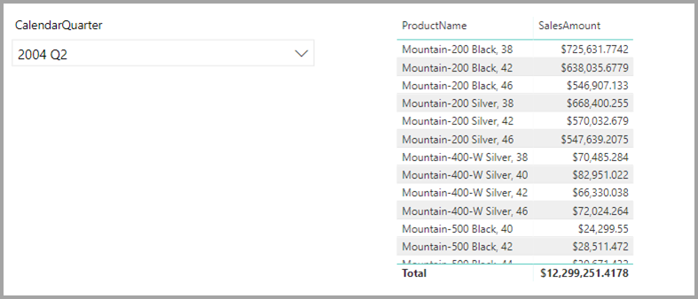
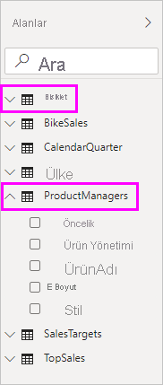
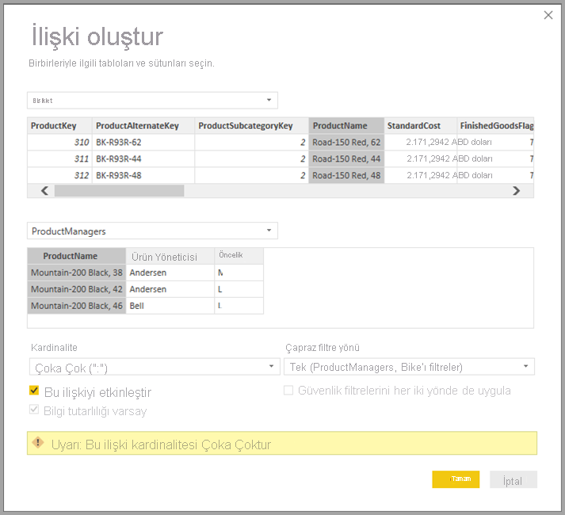
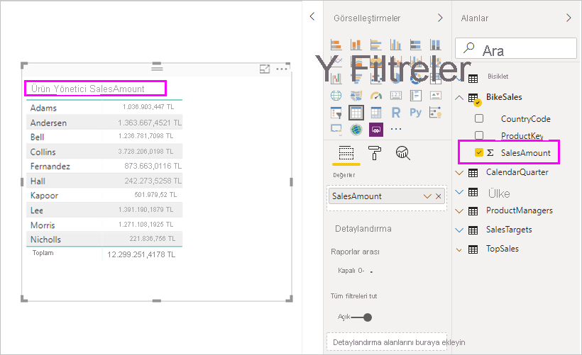
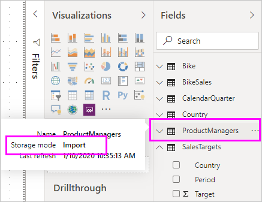
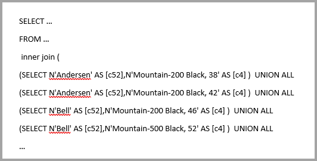

# Power BI Desktop’ta bileşik modeller kullanma

Daha önce Power BI Desktop'ta raporda bir DirectQuery kullandığınızda, bu rapor için ister DirectQuery ister içeri aktarma olsun başka hiçbir veri bağlantısına izin verilmiyordu. Bileşik modellerle bu kısıtlama kaldırılmıştır. Bir rapor birden çok DirectQuery veya içeri aktarma veri bağlantısından ya da sizin seçtiğiniz herhangi bir bileşimde veri bağlantıları içerebilir.

Power BI Desktop'taki bileşik modeller özelliği birbiriyle ilgili üç özellikten oluştur:

* **Bileşik modeller**: Bir raporda farklı kaynak gruplarından iki veya daha fazla veri bağlantısı bulunmasını sağlar. Örnek olarak bir veya daha fazla DirectQuery bağlantısı ve bir içeri aktarma bağlantısı, iki veya daha fazla DirectQuery bağlantısı veya bunların birleşimi verilebilir. Bileşik modeller bu makalede ayrıntılı bir şekilde açıklanmaktadır.

* **Çoka çok ilişkiler**: Bileşik modeller sayesinde tablolar arasında *çoka-çok ilişkiler* kurabilirsiniz. Bu yaklaşım tablolardaki benzersiz değer gereksinimlerini ortadan kaldırır. Ayrıca yalnızca ilişki kurmak için yeni tablo eklenmesi gibi eski geçici çözümleri de devre dışı bırakır. Daha fazla bilgi için bkz. [Power BI Desktop’ta çoka-çok ilişkileri uygulama](desktop-many-to-many-relationships.md).

* **Depolama modu**: Artık arka uç veri kaynaklarını hangi görsellerin sorgulayacağını belirtebilirsiniz. Sorgu gerektirmeye görseller DirectQuery tabanlı olsa dahi içeri aktarılmaz. Bu özellik, performansı artırmanıza ve arka uç yükünü azaltmanıza yardımcı olur. Daha önce, dilimleyiciler gibi basit görseller bile arka uç kaynaklara sorgu başlatabiliyordu. Daha fazla bilgi için bkz. [Power BI Desktop’ta depolama modunu yönetme](desktop-storage-mode.md).

## Bileşik modelleri kullanma

Bileşik modeller sayesinde Power BI Desktop'ı veya Power BI hizmetini kullanırken farklı türlerdeki veri kaynaklarına bağlanabilirsiniz. Bu veri bağlantılarını birkaç farklı şekilde kurabilirsiniz:

* Veri almak için en sık kullanılan yöntemden faydalanarak verileri Power BI'a aktarma.
* DirectQuery'yi kullanarak özgün kaynak deposundaki verilere bağlanma. DirectQuery hakkında daha fazla bilgi edinmek için bkz. [Power BI'da DirectQuery'yi kullanma](../connect-data/desktop-directquery-about.md).

DirectQuery'yi kullandığınızda bileşik modeller aşağıdaki eylemlerden birini veya ikisini birden gerçekleştiren bir Power BI modeli, örneğin tek bir *.pbix* Power BI Desktop dosyası oluşturmayı mümkün kılar:

* Bir veya birden çok DirectQuery kaynağından verileri birleştirir.
* DirectQuery kaynaklarından verileri birleştirir ve verileri içeri aktarır.

Örneğin bileşik modelleri kullanarak şu veri türlerini birleştiren bir model oluşturabilirsiniz:

* Kurumsal veri ambarından alınan satış verileri.
* Departman SQL Server veritabanından alınan satış hedefi verileri.
* Bir elektronik tablosundan içeri aktarılan veriler.

Birden çok DirectQuery kaynağından alınan verileri birleştiren veya DirectQuery'yi içeri aktarılan verilerle birleştiren modeller, bileşik model olarak adlandırılır.

Her zaman yaptığınız gibi, tablolar farklı kaynaklardan gelse bile tablolar arasında ilişkiler oluşturabilirsiniz. Kaynaklar arası tüm ilişkiler, gerçek kardinalitelerine bakılmaksızın çoka çok kardinalitesi ile oluşturulur. Bunları bire çok, çoğa bir veya bire bir olacak şekilde değiştirebilirsiniz. Hangi kardinaliteyi ayarlarsanız ayarlayın kaynaklar arası ilişkilerin davranışı farklıdır. `many` tarafından `one` tarafına değerleri almak için Veri Çözümleme İfadeleri (DAX) işlevlerini kullanamazsınız. Aynı kaynak içinde çoka-çok ilişkilere göre bir performans etkisi de görebilirsiniz.

> [!NOTE]
> Bileşik modeller bağlamında, asıl temel veri kaynağından bağımsız olarak tüm içeri aktarılan tablolar aslında tek bir kaynaktır.

## Bileşik model örneği

Bileşik modele örnek olarak DirectQuery kullanılarak SQL Server'da bulunan bir kurumsal veri ambarına bağlanmış olan bir raporu düşünebilirsiniz. Bu örnekte veri ambarında aşağıdaki görüntüde gösterildiği gibi **Sales by Country**, **Quarter** ve **Bike (Product)** verileri bulunur:

Bu noktada, bu kaynaktan alanları kullanarak basit görseller oluşturabilirsiniz. Aşağıdaki resimde seçili üç aylık dönemde *ProductName* alanına göre toplam satış miktarı gösterilir.

Peki bir her bir ürüne atanmış olan ürün yöneticilerini ve pazarlama önceliğini içeren bir Office Excel elektronik tablonuz varsa ne yapabilirsiniz? **Sales Amount** değerini **Product Manager** ölçütüne göre görüntülemek istiyorsanız bu yerel verileri kurumsal veri ambarına eklemek mümkün olmayabilir. Veya en iyi ihtimalle aylar sürebilir.

DirectQuery kullanmak yerine satış verilerini veri ambarından içeri aktarmak mümkün olabilir. Ardından satış verilerini elektronik tablodan içeri aktardığınız verilerle birleştirebilirsiniz. Ancak ilk etapta DirectQuery'nin kullanılmasını gerektirdiğinden bu yaklaşım makul değildir. Nedenler şunlar olabilir:

* Bağlı kaynakta uygulanan güvenlik kurallarının birleşimi.
* En son verileri görüntüleme gereksinimi.
* Verilerin ölçeğinin büyük olması.

Bu noktada bileşik modeller devreye girer. Bileşik modeller size DirectQuery kullanarak veri ambarına bağlanma ve ardından ek kaynaklar için **Veri al** işlevini kullanma imkanı sunar. Bu örnekte ilk olarak kurumsal veri ambarıyla DirectQuery bağlantısı kurduk. Ardından **Veri al** işlevini kullanarak **Excel**'i seçip yerel verilerimizi içeren elektronik tabloyu gösterdik. Son olarak *Product Names*, atanan **Sales Manager** ve **Priority** değerlerini içeren elektronik tabloyu içeri aktardık.  

**Alanlar** listesinde iki tablo görebilirsiniz: SQL Server'dan alınan **Bike** tablosu ve yeni bir **ProductManagers** tablosu. Yeni tablo, Excel'den içeri aktarılan verileri içerir.

Benzer biçimde, Power BI Desktop'ta **İlişki** görünümüne baktığımızda artık **ProductManagers** adlı ek tabloyu görürüz.

Şimdi bu tabloları modeldeki diğer tablolarla ilişkilendirmemiz gerekiyor. Her zamanki gibi SQL Server'dan alınan **Bike** tablosu ile içeri aktarılan **ProductManagers** tablosu arasında bir ilişki oluşturacağız. Başka bir deyişle bu ilişkiyi **Bike[ProductName]** ile **ProductManagers[ProductName]** arasında kurmuş olacağız. Önceden belirtildiği gibi, kaynak boyunca devam eden ilişkiler varsayılan olarak çoka-çok kardinalitesine sahiptir.

Oluşturduğumuz ilişki, Power BI Desktop'taki **İlişki** görünümünde gösterilir.

Artık **Alanlar** listesindeki alanlardan birini kullanarak görsel oluşturabiliriz. Bu yaklaşım, birden fazla veri kaynağından alınan verileri sorunsuz bir şekilde birleştirir. Örneğin her bir *Product Manager* için toplam *SalesAmount* miktarı aşağıdaki görüntüde gösterilmiştir:

Aşağıdaki örnekte *Product* veya **Customer** gibi bir başka bir yerden içeri aktarılan ek verilerle genişletilmiş bir **boyut** tablosu gösterilir. Tablolar, farklı kaynaklara bağlanmak için DirectQuery'yi de kullanabilir. Örneğimize devam edecek olursak **Country** ve **Period** başına **SalesTargets** değerlerinin ayrı bir departman veritabanında depolandığını düşünelim. Aşağıdaki resimde de gösterildiği şekilde, her zaman yapabileceğiniz gibi bu verilere bağlanmak için **Veri al**’ı kullanabilirsiniz:

Daha önce yaptığımıza benzer şekilde, yeni tabloyla modeldeki diğer tablolar arasında ilişkiler oluşturabilir ve tablo verilerini birleştiren görseller oluşturabiliriz. Şimdi yeni ilişkiler kurduğumuz **İlişkiler** görünümüne yeniden bakalım:

Aşağıdaki görüntüde, yeni veriler ve oluşturduğumuz ilişkiler kullanılmıştır. Sol alttaki görselde *Sales Amount* ile *Target* karşılaştırması gösterilmiştir ve fark hesaplaması, farkı göstermektedir. **Sales Amount** ve **Target** verileri iki farklı SQL Server veritabanından alınmaktadır.

## Depolama modunu ayarlama

Bileşik modeldeki her tablo, tablonun DirectQuery'ye veya içeri aktarmaya dayanıp dayanmadığını gösteren bir depolama moduna sahiptir. Depolama modu, **Özellik** bölmesinde görüntülenebilir ve değiştirilebilir. Depolama modunu görüntülemek için **Alanlar** listesindeki bir tabloya sağ tıklayın ve **Özellikler**'i seçin. Aşağıdaki görüntüde **SalesTargets** tablosunun depolama modu gösterilmiştir.

Depolama modu her tablonun araç ipucunda da görüntülenebilir.

DirectQuery'den bazı dosyalar ve bazı içeri aktarma tabloları içeren herhangi bir Power BI Desktop dosyası ( *.pbix* dosyası) için, durum çubuğunda **Karma** olarak adlandırılan depolama modu görüntülenir. Durum çubuğunda bu terime tıklayabilir ve tüm tabloları kolayca içeri aktarmaya geçirebilirsiniz.

Depolama modu hakkında daha fazla bilgi için bkz. [Power BI Desktop’ta depolama modunu yönetme](desktop-storage-mode.md).  

> [!NOTE]
> Power BI Desktop'ta ve Power BI hizmetinde *Karma* depolama modu kullanabilirsiniz.

## Hesaplanan tablolar

DirectQuery kullanan bir modele hesaplanan tablolar ekleyebilirsiniz. Hesaplanan tabloyu tanımlayan Veri Çözümleme İfadeleri (DAX), içeri aktarılan tablolara veya DirectQuery tablolarına veya ikisinin birleşimine başvurabilir.

Hesaplanan tablolar her zaman içeri aktarılır ve tabloları yenilediğinizde verileri yenilenir. Hesaplanan tablo bir DirectQuery tablosuna başvuruyorsa, DirectQuery tablosuna başvuran görsellerde her zaman bağlı kaynaktaki en son değerler gösterilir. Alternatif olarak hesaplanan tabloya başvuran görseller, hesaplanan tablo son yenilendiğinde alınan değerleri gösterir.

## Güvenlik üzerindeki etkileri

Bileşik modellerin güvenlik üzerinde bazı etkileri vardır. Bir veri kaynağına gönderilen sorgu başka bir kaynaktan alınmış olan veri değerlerini içerebilir. Önceki örnekte **Product Manager** ölçütüne göre **(Sales Amount)** miktarını gösteren görsel, Sales ilişkisel veritabanına bir SQL sorgusu göndermektedir. SQL sorgusu Product Manager adlarını ve bunlarla ilişkili Products değerlerini içerebilir.

Sonuç olarak elektronik tabloda depolanan bilgiler şimdi ilişkisel veritabanına gönderilen sorguya eklenir. Bu bilgiler gizliyse, bunun güvenlik üzerindeki etkileri dikkate alınmalıdır. Özellikle aşağıdaki noktaları dikkate almanız gerekir:

* Özgün kaynaktaki verilere erişim izni olmayan ancak izlemeleri veya denetim günlüklerini görüntüleyebilen veritabanı yöneticileri bu bilgileri görüntüleyebilir. Bu örnekte yöneticinin Excel dosyası için gerekli izinlere sahip olması gerekmektedir.

* Kaynaklarla ilgili şifreleme ayarlarının dikkate alınması gerekir. Bir kaynaktan şifreli bağlantıyla aldığınız bilgileri yanlışlıkla başka bir kaynağa şifrelenmemiş bağlantı üzerinden gönderilen bir sorguya dahil etmekten kaçınmak istersiniz.

Tüm güvenlik etkilerinin dikkate alınmasını sağlamak için, bileşik model oluşturduğunuzda Power BI Desktop'ta uyarı iletisi görüntülenir.  

Ayrıca yazar *Model A* içinde bulunan *Tablo1* tablosunu Bileşik Modele (*Model C* diyelim) eklerse *Model C* kullanılarak oluşturulmuş olan bir raporu görüntüleyen kullanıcı, *Model A* içinde bulunan ve RLS ile korunmayan **tüm tabloları** sorgulayabilir.

Benzer nedenlerle, güvenilmeyen bir kaynaktan gönderilen Power BI Desktop dosyalarını açarken de dikkatli olmanız gerekir. Dosyada bileşik modeller varsa bir kişinin bir kaynaktan dosyayı açan kullanıcının kimlik bilgilerini kullanarak aldığı bilgiler, sorgunun bir parçası olarak başka bir veri kaynağına gönderilecektir. Power BI Desktop dosyasının yazarının kötü niyetli olması durumunda bu bilgiler görüntülenebilir. Birden fazla kaynak içeren bir Power BI Desktop dosyasını ilk kez açtığınızda Power BI Desktop'ta bir uyarı görüntülenir. Bu uyarı, yerel SQL sorgularını içeren bir dosyayı açtığınızda görüntülenen uyarılara benzer.  

## Performans üzerindeki etkileri  

DirectQuery kullanılırken, öncelikle arka uç kaynağının kullanıcılara iyi bir deneyim sağlamaya yetecek kaynakları olduğundan emin olmak için performans konusunu dikkate almanız gerekir. İyi deneyim, görsellerin en fazla beş saniyede yenilenmesi anlamına gelir. Diğer performans önerileri için bkz. [Power BI’da DirectQuery’yi kullanma hakkında](../connect-data/desktop-directquery-about.md).

Bileşik modellerin kullanılması da performansı etkileyen etmenlerden biridir. Tek bir görsel, birden fazla kaynağa sorgu gönderir ve genellikle bir sorgunun sonuçları ikinci bir kaynağa iletilir. Bu durum sonucunda aşağıdaki yürütme biçimleri söz konusu olabilir:

* **Çok fazla sayıda hazır değer içeren bir SQL sorgusu**: Örneğin, bir dizi seçili **Product Managers** için toplam **Sales Amount** değerini isteyen bir görselin önce söz konusu ürün yöneticileri tarafından yönetilen **Products** değerlerini bulması gerekebilir. Bu işlemin görsel `WHERE` yan tümcesinde tüm ürün kimliklerini içeren bir SQL sorgusu göndermeden önce gerçekleştirilmesi gerekir.

* **Daha düşük bir ayrıntı düzeyinde, daha sonra yerel olarak toplanmış verilerle sorgulayan bir SQL sorgusu**: **Product Manager** filtre ölçütüne uyan **Products** sayısının çok fazla artmasıyla, belirli bir noktada bunların tümünü `WHERE` yan tümcesine eklemek verimsiz veya imkansız hale gelebilir. Bunun yerine, ilişkisel kaynağı daha düşük bir **Products** düzeyinde sorgulayabilir ve ardından sonuçları yerel olarak toplayabilirsiniz. **Products** değerinin kardinalitesi 1 milyon sınırını aşarsa, sorgu başarısız olur.

* **Değere göre grup başına bir sorgu olmak üzere birden çok SQL sorgusu**: Toplamada başka bir kaynaktan bir sütuna göre gruplandırılmış **DistinctCount** kullanıldığında, dış kaynak gruplandırmayı tanımlayan birçok hazır değerin verimli bir şekilde geçirilmesini desteklemiyorsa, değere göre grup başına bir SQL sorgusu göndermek gerekebilir.

   Elektronik tablodan içeri aktarılmış **Product Managers**'a göre SQL Server tablosundan ayrı **CustomerAccountNumber** sayımını isteyen bir görselin, SQL Server'a gönderilen sorgudaki **Product Managers** tablosundan ayrıntıları geçirmesi gerekebilir. Diğer kaynaklar, örneğin Redshift üzerinde bu uygulanabilir bir yöntem değildir. Bunun yerine **Sales Manager** başına bir SQL sorgusu olabilir (belirli bir uygulama sınırına kadar; bu sınırdan sonra sorgu başarısız olacaktır).

Bu durumlardan her birinin performans üzerinde kendi etkileri vardır ve tam ayrıntılar her veri kaynağında değişiklik gösterir. İki kaynağı birleştiren ilişkide kullanılan sütunların kardinalitesi düşük kalmasına rağmen (birkaç bin) performans üzerinde önemli bir etkisi olmaz. Kardinalite arttıkça, sonuçta elde edilecek performans üzerindeki etkiyi daha fazla dikkate almanız gerekir.

Bunlara ek olarak, çoka-çok ilişkilerinin kullanılması ayrıntılı değerleri yerel olarak toplamak yerine her toplam veya alt toplam düzeyi için temel kaynağa ayrı sorguların gönderilmesi gerektiği anlamına gelir. Toplamları olan basit bir tablo görseli bir yerine iki SQL sorgusu gönderir.

## Sınırlamalar ve önemli noktalar

Bileşik modellerin bu sürümünde birkaç sınırlama vardır:

Şu anda yalnızca SQL, Oracle ve Teradata veri kaynaklarına bağlanan [bileşik modellerde](../admin/service-premium-incremental-refresh.md) artımlı yenileme desteklenir.

Aşağıdaki Live Connect çok boyutlu kaynakları bileşik modellerle kullanılamaz:

* SAP HANA
* SAP Business Warehouse
* SQL Server Analysis Services
* Power BI veri kümeleri
* Azure Analysis Services

Söz konusu çok boyutlu kaynaklara DirectQuery kullanarak bağlandığınızda, başka bir DirectQuery kaynağına bağlanamaz veya içeri aktarılan verilerle birleştiremezsiniz.

DirectQuery'nin mevcut sınırlamaları bileşik modelleri kullanırken de geçerlidir. Bu sınırlamaların birçoğu şimdi tablonun depolama moduna bağlı olarak tablo başına uygulanır. Örneğin, içeri aktarılan tablodaki hesaplanan sütun başka tablolara başvurabilir ama DirectQuery tablosundaki hesaplanan sütun yine aynı tablodaki sütunlara başvurabilir. Model içindeki tablolardan herhangi biri DirectQuery ise, diğer sınırlamalar modelin tamamına uygulanır. Örneğin, modelin içindeki tablolardan herhangi birinin depolama modu DirectQuery olduğunda, modelde QuickInsights ve Soru ve Yanıt özellikleri kullanılamaz.

## Sonraki adımlar

Bileşik modeller ve DirectQuery hakkında daha fazla bilgi için aşağıdaki makalelere bakın:

* [Power BI Desktop’ta çok-çok ilişkiler](desktop-many-to-many-relationships.md)
* [Power BI Desktop’ta depolama Modu](desktop-storage-mode.md)
* [Power BI'da DirectQuery'yi kullanma](../connect-data/desktop-directquery-about.md)
* [Power BI'da DirectQuery tarafından desteklenen veri kaynakları](../connect-data/power-bi-data-sources.md)
* [Power BI veri kümeleri ve Azure Analysis Services için DirectQuery kullanma (önizleme)](../connect-data/desktop-directquery-datasets-azure-analysis-services.md)
