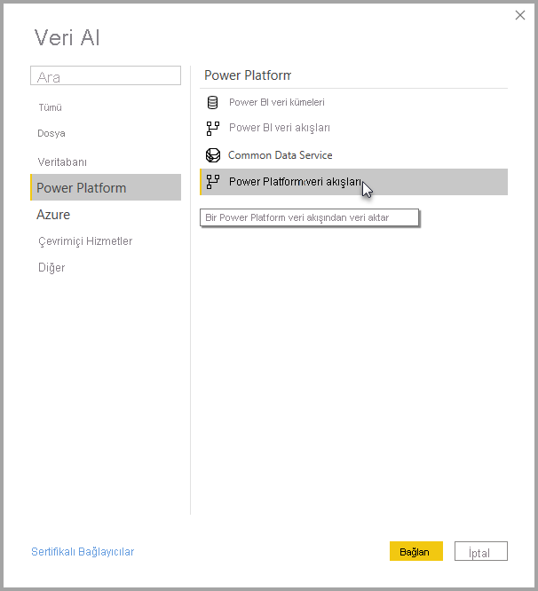

# Power BI Desktop'ta Power Platform veri akışlarıyla oluşturulan verilere bağlanma
Tıpkı Power BI Desktop'taki diğer veri kaynaklarında olduğu gibi **Power BI Desktop**'ta **Power Platform veri akışları** tarafından oluşturulan verilere bağlanabilirsiniz.

**Power Platform veri akışları** bağlayıcısı, Power BI hizmetinde veri akışları tarafından oluşturulan varlıklara bağlanmanızı sağlar. 

## Önemli noktalar ve sınırlamalar

**Power Platform veri akışları bağlayıcısını** kullanmak için **Power BI Desktop** uygulamasının güncel sürümünü çalıştırıyor olmanız gerekir. En son sürüme sahip olduğunuzdan emin olmak için [Power BI Desktop](../fundamentals/desktop-get-the-desktop.md) uygulamasını yeniden indirip bilgisayarınıza yükleyebilirsiniz.  

> [!NOTE]
> Power Platform veri akışları bağlayıcısının önceki sürümünde bir .MEZ dosyası indirip bir klasöre yerleştirmeniz gerekiyordu. Geçerli **Power BI Desktop** sürümleri ise Power Platform veri akışlarını bağlayıcısını içerdiği için dosya artık gerekli değildir ve bağlayıcının dahil edilen sürümüyle çakışmalara neden olmaz. .MEZ dosyasını klasöre el ile yerleştirdiyseniz, çakışmaları önlemek için indirilen o .MEZ dosyasını **Belgeler > Power BI Desktop > Özel bağlayıcılar** klasöründen silmeniz *zorunludur*. 

## Masaüstü performansı
**Power BI Desktop**, yüklü olduğu bilgisayarda yerel olarak çalışır. Veri akışlarının veri alımı performansı çeşitli faktörler tarafından belirlenir. Bu faktörler veri boyutu, bilgisayarınızın CPU ve RAM boyutu, ağ bant genişliği, veri merkezi ile mesafe ve diğer faktörlerdir.

Veri akışları için veri alım performansını artırabilirsiniz. Örneğin, alınan veri boyutu **Power BI Desktop**’ın bilgisayarınızda yönetmesi için çok büyükse, veri akışlarının içindeki bağlantılı ve hesaplanan varlıkları kullanarak verileri toplayabilir (veri akışları içinde) ve yalnızca önceden hazırlanmış, toplu verileri alabilirsiniz. 

Bu şekilde, büyük verilerin işlenmesi çalışan **Power BI Desktop** örneğinizde yerel olarak gerçekleştirilmek yerine veri akışlarında çevrimiçi olarak gerçekleştirilir. Bu yaklaşım, Power BI Desktop'ın daha küçük miktarlarda veri almasına olanak tanır ve veri akışlarıyla hızlı duyarlı ve hızlı bir deneyim sağlar.

## Diğer konular

Çoğu veri akışı, Power BI hizmet kiracısında yer alır. Ancak **Power BI Desktop** kullanıcıları, veri akışının sahibi olmadığı veya veri akışının CDM klasörüne yönelik açıkça yetkilendirilmediği sürece, Azure Data Lake Storage 2. Nesil hesabında depolanan veri akışlarına erişemez. Aşağıdaki durumu dikkate alın:

1.  Ayşe yeni bir çalışma alanı oluşturuyor ve veri akışları, kuruluşun veri gölünde depolanacak şekilde bu çalışma alanını yapılandırıyor.
2.  Ayşe’nin oluşturduğu çalışma alanının da üyesi olan Berk, Ayşe’nin oluşturduğu veri akışından veri almak için Power BI Desktop ve veri akışı bağlayıcısını kullanmak ister.
3.  Berk, veri gölünde veri akışının CDM klasörüne yetkili bir kullanıcı olarak eklenmediği için oluşan bir hata alır.

Bu sorunu çözmek için Berk’e, CDM Klasörü ve dosyaları için okuyucu izinleri verilmelidir. [Veri akışı yapılandırma ve kullanma](dataflows/dataflows-configure-consume.md) sayfasında CDM Klasörü için nasıl erişim izni verileceği hakkında daha fazla bilgi edinebilirsiniz.

## Sonraki adımlar
Veri akışları ile pek çok ilgi çekici işlem yapabilirsiniz. Daha fazla bilgi için aşağıdaki kaynaklara göz atın:

* [Veri akışlarına giriş ve self servis veri hazırlığı](dataflows/dataflows-introduction-self-service.md)
* [Veri akışı oluşturma](dataflows/dataflows-create.md)
* [Veri akışı yapılandırma ve kullanma](dataflows/dataflows-configure-consume.md)
* [Veri akışı depolama alanını Azure Data Lake 2. Nesil kullanacak şekilde yapılandırma](dataflows/dataflows-azure-data-lake-storage-integration.md)
* [Veri akışlarının Premium özellikleri](dataflows/dataflows-premium-features.md)
* [Veri akışları ve yapay zeka](dataflows/dataflows-machine-learning-integration.md)

Ayrıca **Power BI Desktop** hakkında yararlı bulabileceğiniz makaleler vardır:

* [Power BI Desktop'ta Veri Kaynakları](../connect-data/desktop-data-sources.md)
* [Power BI Desktop'ta Verileri Şekillendirme ve Birleştirme](../connect-data/desktop-shape-and-combine-data.md)
* [Verileri doğrudan Power BI Desktop'a girme](../connect-data/desktop-enter-data-directly-into-desktop.md)