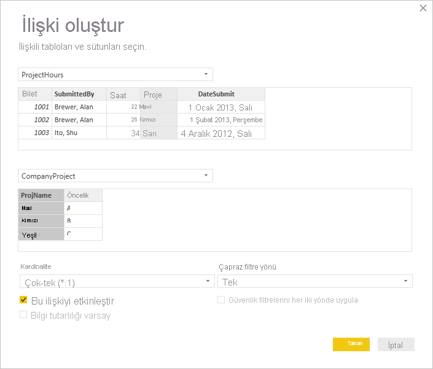
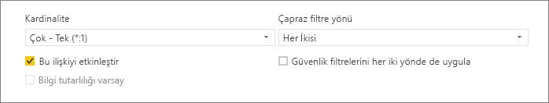
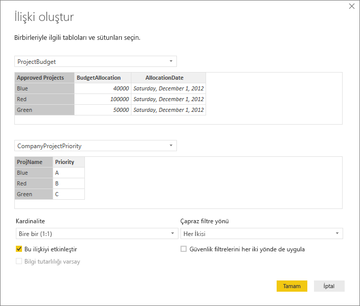
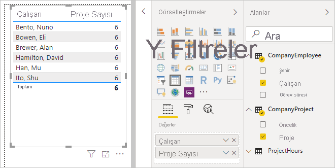
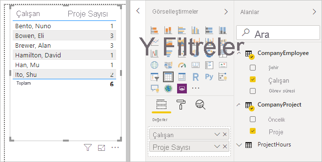
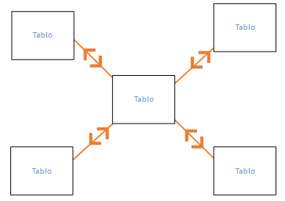
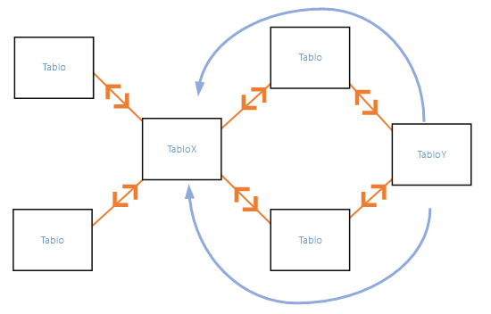
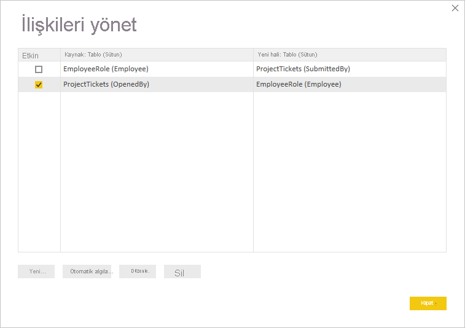
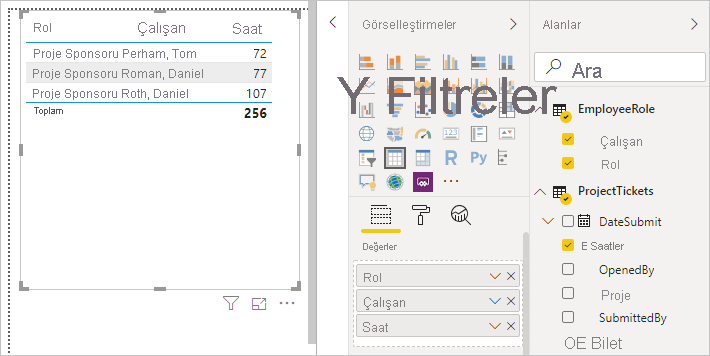
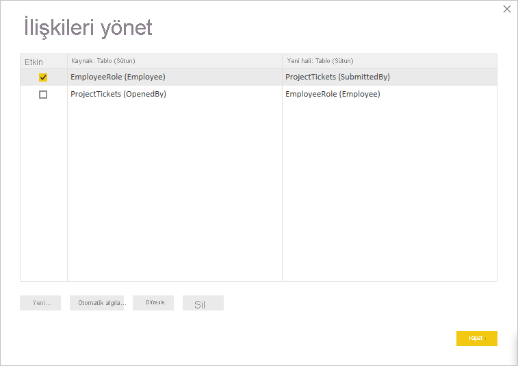

# Power BI Desktop'ta ilişki oluşturma ve ilişkileri yönetme
Birden çok tabloyu içeri aktardığınızda, analiz yaparken büyük olasılıkla tüm bu tablolardaki verileri kullanırsınız. Sonuçların düzgün şekilde hesaplanması ve raporlarınızda doğru bilgilerin gösterilmesi için bu tablolar arasında ilişki oluşturulması gerekir. Power BI Desktop, bu ilişkilerin oluşturulmasını kolaylaştırır. Aslında çoğu durumda bir şey yapmanız gerekmez ve otomatik algılama özelliği sizin yerinize bunları yapar. Öte yandan bazen ilişkileri kendiniz oluşturmanız veya bir ilişkide bazı değişiklikler yapmanız gerekebilir. Her iki durumda da, Power BI Desktop'taki ilişkileri ve bunların nasıl oluşturulup düzenlendiğini anlamanız önemlidir.

## Yükleme sırasında otomatik algılama
Aynı anda iki veya daha fazla tablo sorgularsanız veriler yüklendiğinde Power BI Desktop, sizin yerinize bu ilişkileri bulup oluşturmayı dener. İlişki seçenekleri **Kardinalite**, **Çapraz filtre yönü** ve **Bu ilişkiyi etkinleştir** otomatik olarak ayarlanır. Power BI Desktop olası bir ilişki olup olmadığını belirlemek için, sorguladığınız tablolardaki sütun adlarına bakar. Böyle bir olasılık söz konusuysa bu ilişkiler otomatik olarak oluşturulur. Power BI Desktop bir eşleşme olduğundan tam olarak emin değilse ilişkiyi oluşturmaz. Öte yandan ilişkileri el ile oluşturmak veya düzenlemek için **İlişkileri yönet** iletişim kutusunu kullanmaya devam edebilirsiniz.

## Otomatik algılama özelliğiyle ilişki oluşturma
**Giriş** sekmesinde **İlişkileri Yönet** \> **Otomatik Algıla**'yı seçin.

## Elle ilişki oluşturma
1. **Giriş** sekmesinde **İlişkileri Yönet** \> **Yeni**'yi seçin.

2. **İlişki oluştur** iletişim kutusundaki ilk tablo açılan listesinden bir tablo seçin. İlişkide kullanmak istediğiniz sütunu seçin.

3. İkinci tablo açılan listesinde, ilişkide istediğiniz diğer tabloyu seçin. Kullanmak istediğiniz diğer sütunu ve ardından **Tamam**’ı seçin.

   

Varsayılan olarak, Power BI Desktop yeni ilişkiniz için **Kardinalite** (yön), **Çapraz filtre yönü** ve **Bu ilişkiyi etkinleştir** seçeneklerini otomatik olarak yapılandırır. Bununla birlikte gerekirse bu ayarları değiştirebilirsiniz. Daha fazla bilgi için bkz. [Ek seçenekleri anlama](#understanding-additional-options).

İlişki için seçilen tablolardan hiçbirinin benzersiz değerleri yoksa aşağıdaki hatayı görürsünüz: *Sütunlardan birinin benzersiz değerleri olmalıdır*. İlişkideki tablolardan en az biri, tüm ilişkisel veritabanı teknolojilerinde ortak bir gereksinim olarak farklı ve benzersiz bir anahtar değerleri listesi *içermelidir*. 

Bu hatayla karşılaşırsanız, sorunu düzeltmenin birkaç yolu vardır:

* Benzersiz değerler içeren bir sütun oluşturmak için **Yinelenenleri Kaldır** seçeneğini kullanın. Bu yaklaşımın bir dezavantajı, yinelenen satırlar kaldırıldığında bilgileri kaybedebilirsiniz; genellikle bir anahtar (satır) iyi bir nedenle yinelenir.
* Modele, daha sonra ilişkideki her iki özgün sütuna bağlanacak farklı anahtar değerlerinin listesinden oluşan bir ara tablo ekleyin.

Daha fazla bilgi için [bu blog gönderisine](https://blogs.technet.microsoft.com/cansql/2016/12/19/relationships-in-power-bi-fixing-one-of-the-columns-must-have-unique-values-error-message/) bakın.

## Bir ilişkiyi düzenleme
1. **Giriş** sekmesinde **İlişkileri Yönet**’i seçin.

2. **İlişkileri yönet** iletişim kutusunda ilişkiyi seçin ve ardından **Düzenle**'yi seçin.

## Ek seçenekleri yapılandırma
İlişki oluşturduğunuzda veya düzenlediğinizde, ek seçenekleri yapılandırabilirsiniz. Varsayılan olarak, Power BI Desktop en iyi tahminini temel alarak ek seçenekleri otomatik olarak yapılandırır ve en iyi tahmin, sütunlardaki verileri temel alan her ilişki için farklı olabilir.

### Kardinalite
**Kardinalite** seçeneğinin ayarı aşağıdakilerden biri olabilir:

**Çok-bir (\*:1)** : Çoğa bir ilişki en yaygın, varsayılan ilişki türüdür. Bir tablodaki sütunda bir değerin birden çok örneği olabileceği ve genellikle arama tablosu olarak bilinen diğer ilişkili tabloda bir değerin yalnızca bir örneği olduğu anlamına gelir.

**Tek-tek (1:1)** : Tek-tek ilişkide bir tablodaki sütunda belirli bir değerin yalnızca bir örneği vardır ve diğer ilişkili tabloda belirli bir değerin yalnızca bir örneği vardır.

**Tek-çok (1:*)** : Tek-çok ilişkide bir tablodaki sütunda belirli bir değerin yalnızca bir örneği vardır ve diğer ilişkili tabloda bir değerin birden fazla örneği olabilir.

**Çok-çok (\*:\*)** : Bileşik modeller sayesinde tablolar arasında çok-çok ilişki oluşturabilirsiniz; böylece tablolardaki benzersiz değerler için gereksinimler kaldırılır. Ayrıca yalnızca ilişki kurmak için yeni tablo eklenmesi gibi eski geçici çözümleri de devre dışı bırakır. Daha fazla bilgi için bkz. [Çok-çok kardinalitesine sahip ilişkiler](https://docs.microsoft.com/power-bi/desktop-many-to-many-relationships). 

Kardinalitenin ne zaman değiştirileceği hakkında daha fazla bilgi için bkz. [Ek seçenekleri anlama](#understanding-additional-options).

### Çapraz filtre yönü
**Çapraz filtre yönü** seçeneğinin ayarları aşağıdakilerden biri olabilir:

**Her İkisi**: Filtreleme amacıyla her iki tablonun da tek bir tabloymuş gibi kabul edildiği anlamına gelir. **Her İkisi** ayarı bir dizi arama tablosu içeren tek bir tabloda kullanıldığında oldukça kullanışlıdır. Departmanı için bir arama tablosuna sahip satış değerleri tablosu buna bir örnektir. Bu yapılandırmaya genellikle Yıldız şeması yapılandırması (birkaç arama tablosuna sahip merkezi bir tablo) denir. Ancak, arama tablolarına sahip (bazıları ortak olmak üzere) iki veya daha fazla tablonuz varsa **Her İkisi** ayarını kullanmanız gerekebilir. Önceki örneği devam ettirirsek, bu durumda her bir departman için hedef bütçenin kaydedildiği bir bütçe satış tablonuz da olur. Ayrıca, departman tablosu hem satış hem de bütçe tablosuna bağlıdır. Bu tür bir yapılandırma için **Her İkisi** ayarını kullanmaktan kaçının.

**Tek**: En yaygın kullanılan varsayılan yöndür ve bağlı tablolardaki filtreleme seçimlerinin, değerlerin toplandığı tablolarda çalıştığı anlamına gelir. Excel 2013 veya önceki sürümlerinden bir Power Pivot veri modeli aktarırsanız tüm ilişkilerin tek bir yönü olur. 

Çapraz filtre yönünün ne zaman değiştirileceği hakkında daha fazla bilgi için bkz. [Ek seçenekleri anlama](#understanding-additional-options).

### Bu ilişkiyi etkinleştir
Bu seçenek işaretlendiğinde, ilişki varsayılan etkin ilişki olur. İki tablo arasında birden çok ilişkinin olduğu durumlarda, etkin ilişki sayesinde, Power BI Desktop'ın otomatik olarak her iki tabloyu da içeren görselleştirmeler oluşturması için bir yol sağlanır.

Belirli bir ilişkinin ne zaman etkin duruma getirileceği hakkında daha fazla bilgi için bkz. [Ek seçenekleri anlama](#understanding-additional-options).

## İlişkileri anlama
İki tabloyu bir ilişki ile birbirine bağladıktan sonra, her iki tablodaki verilerle tek bir tablodaymış gibi çalışabilirsiniz. Böylece ilişki ayrıntılarını düşünmenize veya bu tabloları içeri aktarmadan önce sıkıştırmanıza gerek kalmaz. Birçok durumda Power BI Desktop ilişkileri sizin için otomatik olarak oluşturabilir. Bununla birlikte Power BI Desktop iki tablo arasında bir ilişki olması gerektiğinden tam olarak emin değilse, ilişki otomatik olarak oluşturulmaz. Böyle bir durumda bunu sizin yapmanız gerekir. 

Power BI Desktop'ta ilişkilerin nasıl çalıştığını daha iyi anlamanız için hızlı bir öğretici uygulayalım.

>[!TIP]
>Bu eğitimi kendiniz tamamlayabilirsiniz: 
>
> 1. Aşağıdaki **ProjectHours** tablosunu bir Excel çalışma sayfasına kopyalayın (başlığı hariç), hücrelerin tümünü seçin ve ardından **Ekle** \> **Tablo**'yu seçin. 
> 2. **Tablo Oluştur** iletişim kutusunda **Tamam**'ı seçin. 
> 3. Herhangi bir tablo hücresini seçin, **Tablo Tasarımı** \> **Tablo Adı**'nı seçin ve sonra da *ProjectHours* girin. 
> 4. Aynı işlemleri **CompanyProject** tablosu için de tekrarlayın. 
> 5. Power BI Desktop'ta **Veri Al**'ı kullanarak verileri içeri aktarın. İki tabloyu veri kaynağı olarak seçin ve sonra da **Yükle**'yi seçin.

**ProjectHours** adlı birinci tablo, bir kişinin belirli bir projede çalıştığı sürenin saat cinsinden kaydedildiği bir iş kartı kaydıdır. 

**ProjectHours**

| **Ticket** | **SubmittedBy** | **Hours** | **Project** | **DateSubmit** |
| ---:|:--- | ---:|:--- | ---:|
| 1001 |Brewer, Alan |22 |Mavi |1/1/2013 |
| 1002 |Brewer, Alan |26 |Red |2/1/2013 |
| 1003 |Ito, Shu |34 |Yellow |12/4/2012 |
| 1004 |Brewer, Alan |13 |Turuncu |1/2/2012 |
| 1005 |Bowen, Eli |29 |Purple |1/10/2013 |
| 1006 |Bento, Nuno |35 |Yeşil |2/1/2013 |
| 1007 |Hamilton, David |10 |Yellow |1/10/2013 |
| 1008 |Han, Mu |28 |Orange |1/2/2012 |
| 1009 |Ito, Shu |22 |Purple |2/1/2013 |
| 1010 |Bowen, Eli |28 |Yeşil |10/1/2013 |
| 1011 |Bowen, Eli |9 |Mavi |10/15/2013 |

**CompanyProject** adlı bu ikinci tablo atanmış bir önceliğe sahip projelerin listesidir: A, B veya C. 

**CompanyProject**

| **ProjName** | **Priority** |
| --- | --- |
| Mavi |A |
| Red |B |
| Yeşil |C |
| Yellow |C |
| Purple |B |
| Turuncu |C |

Her tabloda bir proje sütunu olduğuna dikkat edin. Her biri farklı adlandırılmış olsa da değerler aynı gibi görünür. Bu önemli bir noktadır ve buna birazdan geri döneceğiz.

Bir modele aktarılmış iki tablomuz olduğuna göre, bir rapor oluşturabiliriz. Elde etmek istediğimiz ilk veri, proje önceliğine göre kaydedilen saat sayısı olduğu için **Alanlar** bölmesinde **Priority** ve **Hours**'u seçiyoruz.

Tablomuza rapor tuvalinde bakarsak her proje için saat sayısının 256 olduğunu ve bunun toplam değer olduğunu görürüz. Bu sayısının doğru olmadığı açıktır. Neden mi? Bunun nedeni, bir değer toplamını, aralarında hiçbir ilişki olmaksızın başka bir tablodaki (**CompanyProject** tablosundaki **Priority**) değerlerle bölünmüş bir tablodan (**Project** tablosundaki **Hours**) hesaplayamayacağımızdır.

O halde bu iki tablo arasında bir ilişki oluşturalım.

Proje adı olan ve değerleri birbirine benzeyen her iki tabloda da gördüğümüz sütunları hatırladınız mı? Tablolarımız arasında bir ilişki oluşturmak için bu iki sütunu kullanacağız.

Neden bu sütunları kullandığımızı biliyor musunuz? **ProjectHours** tablosundaki **Project** sütununa bakarsak Blue, Red, Yellow, Orange gibi değerler görürüz. Aslında aynı değere sahip birkaç satır görüyoruz. **Project** sütunu için kullanılabilecek çok sayıda renk değeri vardır.

**CompanyProject** tablosundaki **ProjName** sütununa bakarsak proje adı için her renk değerinin tek bir kez kullanıldığını görürüz. Bu tablodaki her bir renk değeri benzersizdir ve bu durum, bu iki tablo arasında bir ilişki oluşturabilmemiz açısından önemlidir. Bu durumda ilişkimiz çok - tek türünde bir ilişkidir. Çok - tek türündeki ilişkilerde, tablolardan birinde en az bir sütunda benzersiz değerler olmalıdır. Bazı ilişkiler için bazı ek seçenekler vardır; bunları daha sonra gözden geçireceğiz. Şimdilik iki tablomuzun her birindeki proje sütunları arasında bir ilişki oluşturalım.

### Yeni ilişki oluşturmak için
1. **Giriş** sekmesinden **İlişkileri Yönet**’i seçin.
2. **İlişkileri yönet** menüsünde **Yeni**’yi seçerek **İlişki oluştur** iletişim kutusunu açın. Buradan, ilişkimiz için istediğimiz tabloları, sütunları ve ek ayarları seçebiliriz.
3. İlk açılan listede birinci tablo olarak **ProjectHours** tablosunu, sonra da **Project** sütununu seçin. Bu taraf, ilişkimizin *çok* olarak adlandırılan tarafıdır.
4. İkinci açılan listede ikinci tablo olarak **CompanyProject** tablosu önceden seçilmiştir. **ProjName** sütununu seçin. Bu taraf, ilişkimizin *bir* olarak adlandırılan tarafıdır. 
5. İlişki seçenekleri için varsayılan değerleri kabul edin ve **Tamam**’ı seçin.

   

6. **İlişkileri yönet** iletişim kutusunda **Kapat**'ı seçin.

Doğrusunu söylemek gerekirse, bu ilişkiyi daha zor olan yolu kullanarak oluşturdunuz. **İlişkileri yönet** iletişim kutusunda **Otomatik Algıla**'yı seçmeniz de yeterli olurdu. Aslında, iki sütunun da adı aynı olsaydı verileri yüklediğinizde otomatik algılama özelliği sizin için ilişkiyi otomatik olarak oluşturabilirdi. Peki buradaki zorluk nedir?

Şimdi rapor tuvalimizde tabloya bir kez daha bakalım.

Bu çok daha iyi görünüyor, değil mi?

Saatleri **Priority**'ye göre topladığımızda, Power BI Desktop **CompanyProject** arama tablosunda benzersiz renk değerlerinin tüm örneklerini arar, **ProjectHours** tablosunda bu değerlerin her birinin tüm örneklerini arar ve her benzersiz değer için bir genel toplam hesaplar.

Bu, kolay bir işlem. Aslında, otomatik algılama özelliğiyle bu kadarını bile yapmanız gerekmeyebilir.

## Ek seçenekleri anlama
İlişki oluşturulduğunda (otomatik algılama özelliği tarafından veya el ile) Power BI Desktop, tablolarınızdaki verileri temel alarak ek seçenekleri otomatik olarak yapılandırır. Bu ek ilişki seçenekleri **İlişki oluştur** ve **İlişkiyi düzenle** iletişim kutularının alt kısmında yer alır.

 

Power BI normalde bu seçenekleri otomatik olarak ayarlar ve bunları sizin ayarlamanız gerekmez. Öte yandan bu seçenekleri kendiniz yapılandırmak isteyebileceğiniz birkaç durum vardır.

## Otomatik ilişki güncelleştirmeleri

Power BI’ın raporlarınızda ve modellerinizde ilişkileri nasıl ele aldığını ve otomatik olarak ayarladığını yönetebilirsiniz. Power BI’ın ilişki seçeneklerini nasıl işleyeceğini belirtmek için Power BI Desktop’tan **Dosya** > **Seçenekler ve ayarlar** > **Seçenekler**'i seçin ve sonra da sol bölmeden **Veri Yükleme**’yi seçin. **İlişkiler** seçenekleri görüntülenir.

   

Seçilip etkinleştirilebilecek üç seçenek vardır: 

- **İlk yüklemedeki veri kaynaklarından ilişki içeri aktar**: Bu seçenek, varsayılan olarak seçilidir. Seçildiğinde Power BI, veri ambarınızdaki yabancı anahtar/birincil anahtar ilişkileri gibi veri kaynağınızda tanımlı ilişkileri denetler. Bu tür ilişkiler varsa, verileri ilk kez yüklediğinizde Power BI veri modeline yansıtılırlar. Bu seçenek, bu ilişkileri kendiniz bulmanızı veya tanımlamanızı gerektirmeden modelinizle hızla çalışmaya başlamanızı sağlar.

- **Veri yenilerken ilişkileri güncelleştir veya sil**: Bu seçenek varsayılan olarak seçili değildir. Seçerseniz, Power BI veri kümeniz yenilendiğinde veri kaynağı ilişkilerindeki değişiklikleri denetler. Bu ilişkilerin değişmesi veya kaldırılması durumunda Power BI, bu değişiklikleri eşleşecek şekilde güncelleme veya silme işlemi yaparak kendi veri modelinde yansıtır.

   > [!WARNING]
   > Tanımlı ilişkilere dayanan satır düzeyi güvenlik kullanıyorsanız, bu seçeneği belirtmenizi önermeyiz. RLS ayarlarınızın dayandığı bir ilişkiyi kaldırırsanız modeliniz daha az güvenli hale gelebilir. 

- **Veriler yüklendikten sonra yeni ilişkileri otomatik olarak algıla**: Bu seçenek [Yükleme sırasında otomatik algılama](#autodetect-during-load) altında açıklanmıştır. 

## Veriler güncelleştirildiğinde farklı bir kardinalite gerekir
Normalde, Power BI Desktop ilişki için en iyi kardinaliteyi otomatik olarak belirleyebilir. Verilerin daha sonra değişeceğini bildiğiniz için otomatik ayarı geçersiz kılmanız gerekirse bunu **Kardinalite** denetimini kullanarak değiştirebilirsiniz. Farklı bir kardinalite seçmemiz gereken bir örneğe bakalım.

Aşağıdaki **CompanyProjectPriority** tablosu, tüm şirket projelerinin ve proje önceliklerinin yer aldığı listedir. **ProjectBudget** tablosunda bütçesi onaylanmış projeler yer alır.

**CompanyProjectPriority**

| **ProjName** | **Priority** |
| --- | --- |
| Mavi |A |
| Red |B |
| Yeşil |C |
| Yellow |C |
| Purple |B |
| Turuncu |C |

**ProjectBudget**

| **Approved Projects** | **BudgetAllocation** | **AllocationDate** |
|:--- | ---:| ---:|
| Mavi |40,000 |12/1/2012 |
| Red |100,000 |12/1/2012 |
| Green |50.000 |12/1/2012 |

**ProjectBudget** tablosundaki **Approved Projects** sütunuyla **CompanyProjectPriority** tablosundaki **ProjectName** sütunu arasında ilişki oluşturursanız, Power BI **Kardinalite**'yi otomatik olarak **Tek-tek (1:1)** değerine ve **Çapraz filtre yönü**'nü **Her İkisi** değerine ayarlar. 

 

Power BI'ın bu ayarları yapmasının nedeni Power BI Desktop için iki tablonun en iyi bileşiminin şöyle olmasıdır:

| **ProjName** | **Priority** | **BudgetAllocation** | **AllocationDate** |
|:--- | --- | ---:| ---:|
| Blue |A |40,000 |12/1/2012 |
| Red |B |100.000 |12/1/2012 |
| Yeşil |C |50,000 |12/1/2012 |
| Yellow |C |  |  |
| Purple |B |  |  |
| Turuncu |C |  |  |

Birleştirilen tablonun **ProjName** sütununda yinelenen değer olmaması nedeniyle, iki tablomuz arasında bire bir türünde bir ilişki bulunur. **ProjName** sütunu, her değer yalnızca bir kez kullanıldığı için benzersizdir. Bu nedenle, bu iki tablodaki satırlar herhangi bir çoğaltma olmadan doğrudan birleştirilebilir.

Ancak, sonraki yenilemede verilerin değişeceğini bildiğinizi varsayalım. **ProjectBudget** tablosunun yenilenmiş bir sürümünde artık Blue ve Red projeleri için ek satırlar bulunur:

**ProjectBudget**

| **Approved Projects** | **BudgetAllocation** | **AllocationDate** |
| --- | ---:| ---:|
| Mavi |40,000 |12/1/2012 |
| Red |100,000 |12/1/2012 |
| Green |50.000 |12/1/2012 |
| Mavi |80,000 |6/1/2013 |
| Red |90,000 |6/1/2013 |

 Bu ek satırlar artık iki tablonun en iyi birleşiminin şu şekilde olduğu anlamına gelir: 

| **ProjName** | **Priority** | **BudgetAllocation** | **AllocationDate** |
| --- | --- | ---:| ---:|
| Blue |A |40,000 |12/1/2012 |
| Red |B |100.000 |12/1/2012 |
| Yeşil |C |50,000 |12/1/2012 |
| Yellow |C |  |  |
| Purple |B |  |  |
| Turuncu |C |  |  |
| Mavi |A |80000 |6/1/2013 |
| Red |B |90000 |6/1/2013 |

Bu yeni birleşik tabloda **ProjName** sütununda yineleyen değerler vardır. Tablo yenilendikten sonra bu iki özgün tabloda tek - tek türünde ilişki olmaz. Bu durumda, gelecekteki bu güncelleştirmelerin **ProjName** sütununda yinelemelere neden olacağını bildiğimiz için, **Kardinalite**'yi *çok* tarafı **ProjectBudget** içinde ve *bir* tarafı **CompanyProjectPriority** içinde olacak şekilde **Çoka bir (\*:1)** olarak ayarlamak isteriz.

## Karmaşık bir tablolar ve ilişkiler kümesi için Çapraz filtre yönü ayarlama
Çoğu ilişki için çapraz filtre yönü **Her İkisi** olarak ayarlanır. Öte yandan bu seçeneği varsayılandan farklı ayarlamanızı gerektirebilecek bazı az rastlanan durumlar da mevcuttur. Örneğin Power Pivot'un önceki bir sürümünden, her ilişkinin tek bir yöne ayarlandığı bir modeli içeri aktarıyor olabilirsiniz. 

**Her İkisi** ayarı, bağlı tabloların tüm özelliklerinin Power BI Desktop tarafından tek bir tablo gibi değerlendirilmesini sağlar. Ancak, bir ilişkinin çapraz filtre yönünün Power BI Desktop tarafından **Her İkisi** olarak ayarlanamadığı ve raporlama amacıyla kullanılabilecek anlaşılır bir varsayılanlar kümesinin tutulduğu bazı durumlar bulunur. Bir ilişkinin çapraz filtre yönü **Her İkisi** olarak ayarlanmamışsa bunun nedeni, söz konusu ayarın belirsizlik yaratacak olmasıdır. Varsayılan çapraz filtre ayarı sizin için uygun değilse belirli bir tablo veya **Her İkisi** olarak ayarlamayı deneyin.

Tek yönlü çapraz filtreleme birçok durumda işe yarar. Excel 2013 veya önceki sürümlerinden bir Power Pivot modeli aktardıysanız tüm ilişkiler tek yön şeklinde ayarlanır. Tek yön, bağlı tablolardaki filtreleme seçimlerinin, toplama işleminin gerçekleştiği tablolarda çalıştığı anlamına gelir. Bazı durumlarda çapraz filtreleme biraz zor anlaşılabilir, bu nedenle bir örneğe bakalım.

Tek yönlü çapraz filtreleme ile, proje saatlerini özetleyen bir rapor oluşturursanız **CompanyProject** tablosuna ve onun **Priority** sütununa göre veya **CompanyEmployee** tablosuna ve onun **City** sütununa göre özetlemeyi (veya filtrelemeyi) seçebilirsiniz. Ancak, proje başına çalışan sayısını hesaplamak isterseniz (daha az karşılaşılan bir soru) işe yaramaz. Tüm değerlerin aynı olduğu bir sütun elde edersiniz. Aşağıdaki örnekte her iki ilişkinin de çapraz filtreleme yönü, **ProjectHours** tablosuna doğru tek yönlü olarak ayarlanmıştır. **Değerler** kutusunda **Project** alanı **Count** olarak ayarlanmıştır:

 

Filtre belirtimi akışı, **CompanyProject**'ten **ProjectHours**'a doğru gerçekleşir (aşağıdaki resimde gösterildiği gibi) ama **CompanyEmployee**'ye doğru gerçekleşmez. 

 

Ancak, çapraz filtreleme yönünü **Her İkisi** olarak ayarlarsanız çalışır. **Her İkisi** ayarı, filtre belirtiminin **CompanyEmployee**'ye doğru akıtılmasını sağlar.

 

Çapraz filtreleme yönü **Her İkisi** olarak ayarlandığında raporumuz artık doğru görünür:

 

Her iki yönde çapraz filtreleme, yukarıdaki desene benzer bir tablo ilişkileri deseni için düzgün çalışır. Bu şema genellikle yıldız şeması olarak adlandırılır ve şu şekildedir:

 

Çapraz filtreleme yönü, veritabanlarında sıklıkla bulunan daha genel bir desenle düzgün çalışmaz. Aşağıdaki diyagram buna örnek verilebilir:

 

Bunun gibi döngülere sahip bir tablo deseniniz varsa çapraz filtreleme, belirsiz bir ilişki kümesi oluşturabilir. Örneğin, TableX'teki bir alanı toplar ve TableY'deki bir alana göre filtrelemeyi seçerseniz filtrenin hangi yönde ilerleyeceği (en üstteki tablodan veya en alttaki tablodan) net olmaz. Bu tür desenlere ilişkin sık kullanılan bir örnek olarak, TableX'in, gerçek verilere sahip bir satış tablosu ve TableY'nin de bütçe verileri olduğunu düşünün. Ortadaki tablolar, her iki tablonun da kullandığı bölüm veya bölge gibi arama tablolarıdır. 

Power BI Desktop, etkin/etkin olmayan ilişkilerde olduğu gibi, raporlarda belirsizlik oluşmasına neden olacaksa bir ilişkinin **Her İkisi** olarak ayarlanmasına izin vermez. Bu durumu işlemenizin birkaç farklı yolu vardır. Bunlardan en yaygın ikisi şunlardır:

* Belirsizliği azaltmak için ilişkileri silin veya etkin değil olarak işaretleyin. Bu şekilde bir ilişkinin çapraz filtreleme yönünü **Her İkisi** olarak ayarlayabilirsiniz.
* Döngüleri ortadan kaldırmak için bir tabloyu iki kez (ikinci seferde farklı bir ad ile) getirin. Bunu yaptığınızda ilişkilerin deseni bir yıldız şeması haline gelir. Yıldız şeması ile tüm ilişkiler **Her İkisi** olarak ayarlanabilir.

## Yanlış etkin ilişki
Power BI Desktop otomatik olarak ilişki oluşturduğunda, bazen iki tablo arasında birden çok ilişki ile karşılaşır. Bu durum gerçekleştiğinde ilişkilerin yalnızca biri etkin olarak ayarlanır. Etkin ilişki, varsayılan ilişki işlevi görür. Böylece, iki farklı tablodan alan seçtiğinizde Power BI Desktop sizin için otomatik olarak bir görselleştirme oluşturabilir. Ancak, bazı durumlarda otomatik olarak seçilen ilişki yanlış olabilir. Bir ilişkiyi etkin veya etkin değil olarak ayarlamak için **İlişkileri yönet** iletişim kutusunu kullanın veya **İlişkiyi düzenle** iletişim kutusunda etkin ilişkiyi ayarlayın. 

Varsayılan bir ilişki olduğundan emin olmak için, Power BI Desktop belirli bir zamanda iki tablo arasında tek bir etkin ilişki olmasına izin verir. Bu nedenle öncelikle, geçerli ilişkiyi etkin değil olarak ayarlamanız ve ardından etkin olmasını istediğiniz ilişkiyi belirlemeniz gerekir.

Bir örneğe göz atalım. Birinci tablo **ProjectTickets**, ikinci tablo ise **EmployeeRole** olarak adlandırılmıştır.

**ProjectTickets**

| **Ticket** | **OpenedBy** | **SubmittedBy** | **Hours** | **Project** | **DateSubmit** |
| ---:|:--- |:--- | ---:|:--- | ---:|
| 1001 |Perham, Tom |Brewer, Alan |22 |Mavi |1/1/2013 |
| 1002 |Roman, Daniel |Brewer, Alan |26 |Red |2/1/2013 |
| 1003 |Roth, Daniel |Ito, Shu |34 |Yellow |12/4/2012 |
| 1004 |Perham, Tom |Brewer, Alan |13 |Turuncu |1/2/2012 |
| 1005 |Roman, Daniel |Bowen, Eli |29 |Purple |1/10/2013 |
| 1006 |Roth, Daniel |Bento, Nuno |35 |Yeşil |2/1/2013 |
| 1007 |Roth, Daniel |Hamilton, David |10 |Yellow |1/10/2013 |
| 1008 |Perham, Tom |Han, Mu |28 |Orange |1/2/2012 |
| 1009 |Roman, Daniel |Ito, Shu |22 |Purple |2/1/2013 |
| 1010 |Roth, Daniel |Bowen, Eli |28 |Yeşil |10/1/2013 |
| 1011 |Perham, Tom |Bowen, Eli |9 |Mavi |10/15/2013 |

**EmployeeRole**

| **Employee** | **Role** |
| --- | --- |
| Bento, Nuno |Project Manager |
| Bowen, Eli |Project Lead |
| Brewer, Alan |Project Manager |
| Hamilton, David |Project Lead |
| Han, Mu |Project Lead |
| Ito, Shu |Project Lead |
| Perham, Tom |Project Sponsor |
| Roman, Daniel |Project Sponsor |
| Roth, Daniel |Project Sponsor |

Burada aslında iki ilişki vardır:
- **EmployeeRole** tablosundaki **Employee** ile **ProjectTickets** tablosundaki **SubmittedBy** arasında.
- **ProjectTickets** tablosundaki **OpenedBy** ile **EmployeeRole** tablosundaki **Employee** arasında.

 

Her iki ilişkiyi de modele (öncelikle **OpenedBy**) eklersek **İlişkileri yönet** iletişim kutusu **OpenedBy**'ın etkin olduğunu gösterir:

 

Şimdi, rapor tuvalindeki bir tablo görselleştirmesinde **EmployeeRole** tablosundaki **Role** ve **Employee** alanlarının ve **ProjectTickets** tablosundaki **Hours** alanının kullanıldığı bir rapor oluşturursak yalnızca proje sponsorlarını görürüz. Bunun nedeni, yalnızca proje sponsorlarının proje bileti açmış olmasıdır.

 

Etkin ilişkiyi değiştirebilir ve **OpenedBy** tablosu yerine **SubmittedBy** tablosunu alabiliriz. **İlişkileri yönet** iletişim kutusunda **ProjectTickets(OpenedBy)** ile **EmployeeRole(Employee)** ilişkisinin seçimini kaldırın ve ardından **EmployeeRole(Employee)** ile **Project Tickets(SubmittedBy)** ilişkisini işaretleyin.

## İlişki görünümünde ilişkilerinizin tümünü görüntüleme
Bazen modelinizin birden çok tablosu olur ve bunlar arasında karmaşık ilişkiler bulunur. Power BI Desktop'taki **İlişki** görünümü modelinizdeki tüm ilişkileri, bunların yönünü ve kardinalitesini kolay anlaşılır ve özelleştirilebilir bir diyagramda gösterir. 

Daha fazla bilgi edinmek için bkz. [Power BI Desktop'ta İlişki görünümüyle çalışma](desktop-relationship-view.md).

