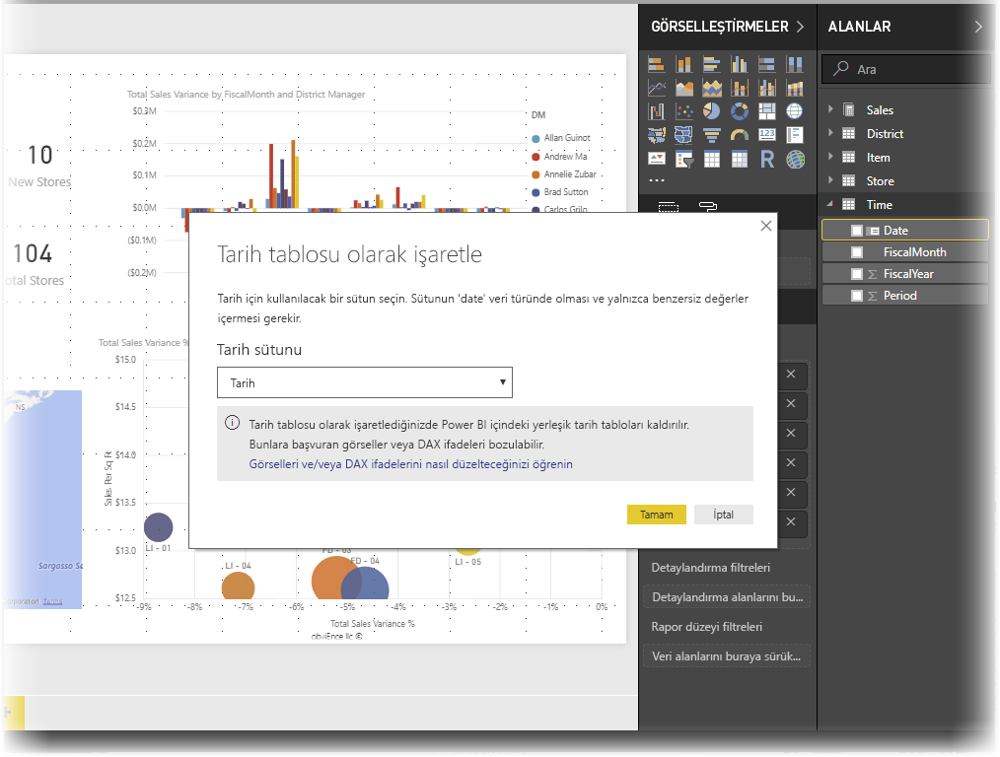
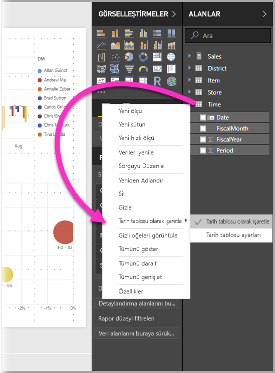
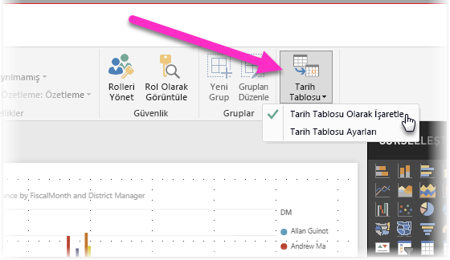
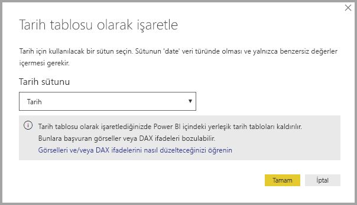
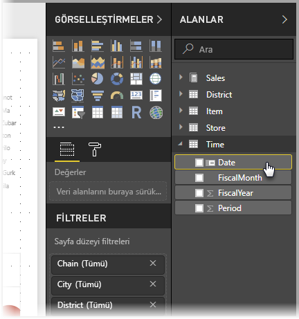
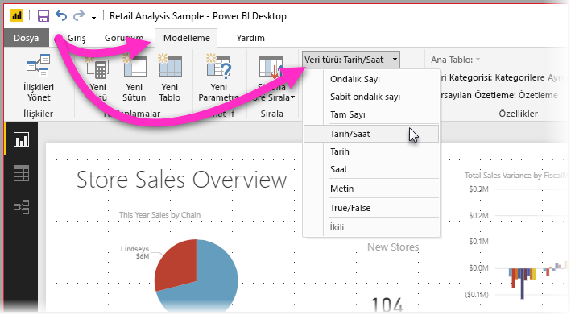

# Power BI Desktop'ta tarih tabloları ayarlama ve kullanma

Arka planda çalışan **Power BI Desktop**, tarihleri temsil eden otomatik olarak tanımlar ve sonra sizin adınıza modeliniz için tarih hiyerarşileri ve başka destekleyici meta veriler oluşturur. Bu yerleşik hiyerarşileri daha sonra görseller, tablolar, hızlı ölçümler ve dilimleyiciler gibi rapor özellikleri oluştururken kullanabilirsiniz. Bunun için Power BI Desktop, sizin adınıza daha sonra raporlarınız ve DAX ifadeleriniz için kullanabileceğiniz gizli tablolar oluşturur.

Bu otomatik davranış hakkında daha fazla bilgi için [Power BI Desktop'ta otomatik tarih/saat](desktop-auto-date-time.md) makalesini okuyun.

Çoğu veri analisti kendi tarih tablolarını oluşturmayı tercih eder ve bunda bir sakınca yoktur. **Power BI Desktop**’ta modelinizin **tarih tablosu** olarak kullanmasını istediğiniz tabloyu belirtebilir ve ardından bu tablonun tarih verilerini kullanan tarihle ilgili görseller, tablolar, hızlı ölçümler, vb. oluşturabilirsiniz. Kendi tarih tablonuzu belirtiyorsanız modelinizde oluşturulan tarih hiyerarşileri sizin denetiminizdedir ve bunları modelinizin veri tablosunu kullanan **hızlı ölçümlerde** ve diğer işlemlerde kullanırsınız. 

## Kendi tarih tablonuzu ayarlama

**Tarih tablosu** ayarlamak için **Alanlar** bölmesinde tarih tablosu olarak kullanmak istediğiniz tabloyu seçin, sonra tabloya sağ tıklayıp aşağıdaki resimde gösterildiği gibi açılan menüden **Tarih tablosu olarak işaretle > Tarih tablosu olarak işaretle**’yi seçin.

Ayrıca, tabloyu seçip burada gösterildiği gibi **Modelleme** şeridinden **Tarih Tablosu Olarak İşaretle**’yi de seçebilirsiniz.

Kendi **tarih tablonuzu** belirttiğinizde, Power BI Desktop tarafından bu sütun ve sütundaki veriler üzerinde verilere ilişkin aşağıdaki doğrulamalar gerçekleştirilir:

* benzersiz değerler içeriyor
* null değer içermiyor
* ardışık tarih değerleri (baştan sona) içeriyor
* **Tarih/Zaman** veri türündeyse her değerde aynı zaman damgasına sahip

Kendi tarih tablonuzu oluşturmanız için ikisi de makul olan iki olası senaryo vardır:

* İlk senaryo, kurallı veya temel bir tarih tablosu ve hiyerarşisi kullandığınız durumdur. Bu, verilerinizde daha önce tarih tablosu için açıklanan doğrulama ölçütlerini karşılayan bir tablodur. 

* İkinci senaryo, örneğin tarih tablonuz olarak kullanmak istediğiniz bir *dim date* alanına sahip olan bir Analysis Services tablosu kullandığınız durumlardır. 

Bir tarih tablosu belirttiğinizde, bu tablodaki hangi sütunun tarih sütunu olduğunu seçebilirsiniz. Hangi sütunun kullanılacağını **Alanlar** bölmesinde tabloyu seçip tabloya sağ tıkladıktan sonra **Tarih tablosu olarak işaretle > Tarih tablosu ayarları**’nı seçerek belirtebilirsiniz. Aşağıdaki pencere görünür ve buradaki açılan kutudan tarih olarak kullanılacak sütunu seçebilirsiniz.

Kendi tarih tablonuzu belirttiğinizde, **Power BI Desktop**’ın normalde modelinizde yerleşik olarak sunacağı hiyerarşilerin sizin adınıza otomatik olarak oluşturulmadığına dikkat edin. Daha sonra tarih tablonuzun seçimini kaldırırsanız (ve artık el ile ayarlanmış bir tablonuz olmazsa) Power BI Desktop tablodaki tarih sütunları için sizin adınıza otomatik olarak oluşturulan yerleşik veri tablolarını yeniden oluşturur.

Unutulmaması gereken bir başka nokta, bir tabloyu tarih tablosu olarak işaretlediğinizde Power BI Desktop’ın oluşturduğu yerleşik (otomatik olarak oluşturulan) tarih tablosu kaldırılacağı ve daha önce bu yerleşik tabloları temel alarak oluşturduğunuz görsellerin veya DAX ifadelerinin artık düzgün çalışmayacağıdır. 

## Tarih tablonuzu uygun veri türü olarak işaretleme

Kendi **tarih tablonuzu** belirttiğinizde, veri türünün düzgün ayarlandığından emin olmanız gerekir. **Veri türü**’nü **Tarih/Saat** veya **Tarih** olarak ayarlamanız gerekir. Bunun için aşağıdaki adımları uygulayın:

1. **Alanlar** bölmesinden **tarih tablonuzu** seçin, gerekirse genişletin ve sonra tarih olarak kullanılacak sütunu seçin.
   
     

2. **modelleme** sekmesinde, **Veri türü:** seçeneğini belirleyin ve kullanılabilir veri türlerini göstermek için açılan oka tıklayın.

    

3. Sütununuz için veri türünü belirtin. 

## Sonraki adımlar

Aşağıdaki makaleler de ilginizi çekebilir:

* [Power BI Desktop’ta otomatik tarih/saat](desktop-auto-date-time.md)
* [Power BI Desktop'taki veri türleri](../connect-data/desktop-data-types.md)
