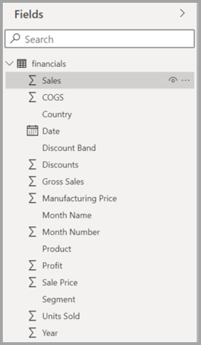
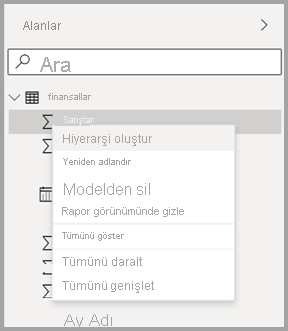
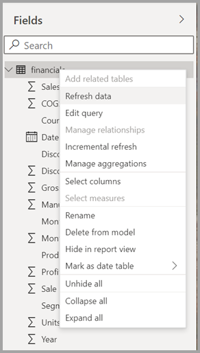

# Power BI Desktop’ta Alan listesini kullanma (önizleme)

Kasım 2020 güncelleştirmesinden itibaren, Power BI Desktop’taki Model görünümü, Veri görünümü ve Rapor görünümü genelindeki **Alan** listelerini birleştiriyoruz. Bu görünümlerin birleştirilmesi işlevsellik bakımından ve görünümler genelindeki kullanıcı arabiriminde tutarlılık oluşturup müşteri geri bildirimlerini çözümleyecek.

Görünümler genelinde fark edeceğiniz değişiklikler arasında şunlar yer alır:

* İkonografi
* Arama işlevi
* Bağlam menüsü öğeleri
* Benzer sürükle bırak davranışı
* Araç İpuçları
* Erişilebilirlik geliştirmeleri

Amaç, Power BI Desktop’ın kullanılabilirliğini artırmaktır. Değişikliklerin, genel veri iş akışınızda en düşük düzeyde etkisi olması gerekir.

## Yeni Alan listesini etkinleştirme (önizleme)

Birleştirilmiş Alan listesi **Model** görünümüyle başlayacak ve daha sonra diğer görünümler için de etkinleştirilecek. Birleşik Alan görünümünü etkinleştirmek için Power BI Desktop’ta **Dosya > Seçenekler ve ayarlar > Seçenekler**’e gidip soldaki bölmede **Önizleme özellikleri**’ni seçin. Önizleme özellikleri bölümünde, **Yeni alan listesi**’nin yanındaki onay kutusunu seçin.

Seçimin etkili olabilmesi için Power BI Desktop’ı yeniden başlatmanız istenir.

## Alan listesindeki değişiklikler

Aşağıdaki tablolarda alan listesi güncelleştirmeleri gösterilir: 

|**Özgün alan listesi (Model görünümü)**  | **Yeni alan listesi (Model görünümü)**  |
|:---------:|:---------:|
|**Özgün** |**Yeni** |
|**Simgeler ve kullanıcı arabirimi**       ||
|     |    |
|**Bağlam menüsü - Alan**       ||
|     |    |
|**Bağlam menüsü - Tablo**       ||
|     |    |
|**Araç İpuçları**       ||
|     |    |

Ayrıca, yeni Alan listesi simgeleri de vardır. Aşağıdaki tabloda, özgün simgeler ve yeni karşılıklarının gösterilmesinin yanı sıra, her birine ilişkin kısa bir açıklama sağlanır. 

|Özgün simge  |Yeni simge  |Description  |
|:---------:|:---------:|:---------|
|     |           |Alanlar listesinde klasör         |
|     |         |Sayısal alan: Sayısal alanlar, örneğin toplamı veya ortalaması alınabilecek toplamlardır. Toplamlar, verilerle birlikte içeri aktarılır ve raporunuzun temel aldığı veri modelinde tanımlanır. Daha fazla bilgi için bkz. [Power BI raporlarındaki toplamlar](../create-reports/service-aggregates.md).         |
|     |         |Sayısal olmayan veri türündeki hesaplanmış sütun: Veri Çözümleme İfadeleri (DAX) formülüyle oluşturduğunuz ve sütunun değerlerini tanımlayan yeni, sayısal olmayan sütun. [Hesaplanmış sütunlar](desktop-calculated-columns.md) hakkındaki diğer bilgileri okuyun.        |
|     |          |Sayısal hesaplanmış sütun: Veri Çözümleme İfadeleri (DAX) formülüyle oluşturduğunuz ve sütunun değerlerini tanımlayan yeni sütun. [Hesaplanmış sütunlar](desktop-calculated-columns.md) hakkındaki diğer bilgileri okuyun.         |
|     |          |Ölçü: Her ölçünün kendi sabit kodlanmış formülü vardır. Rapor görüntüleyicileri hesaplama türünü değiştiremez. Örneğin, tür toplam olarak ayarlanmışsa bu şekilde olarak kalır. Değerler bir sütunda depolanmaz. Yalnızca görseldeki konumlarına bağlı olarak bunlar anında hesaplanır. Daha fazla bilgi için bkz. [Ölçüleri anlama](desktop-measures.md).         |
|     |         |Ölçü grubu.         |
|     |         |KPI: Ölçülebilen bir hedefe doğru ilerleme durumunu gösteren görsel bir ipucu. [Ana Performans Göstergesi (KPI)](../visuals/power-bi-visualization-kpi.md) görselleri hakkındaki diğer bilgileri okuyun.         |
|     |           |Alanların hiyerarşisi: Hiyerarşiyi oluşturan alanları görmek için oku seçin. Daha fazla bilgi için YouTube'da [Hiyerarşileri oluşturma ve bunlarla çalışma](https://www.youtube.com/watch?v=q8WDUAiTGeU) hakkındaki bu Power BI videosunu izleyin.         |
|     |         |Coğrafi veriler: Bu konum alanları kullanılarak harita görselleştirmeleri oluşturulabilir.         |
|     |          |Kimlik alanı: Bu simgeye sahip alanlar, yinelenen değerlere sahip olsalar bile tüm değerleri gösterecek şekilde ayarlanmış benzersiz alanlardır. Örneğin, verilerinizde adları "Can Kaya" olan iki farklı kişinin kaydı olabilir ve bunların her biri benzersiz olarak kabul edilir. Bunlar toplanmaz.         |
|     |          |Parametre: Raporlarınızın ve veri modellerinizin bazı bölümlerini (sorgu filtresi, veri kaynağı başvurusu, ölçü tanımı vb.) bir veya birden çok parametre değerine bağımlı yapmak için parametreler ayarlayın. Daha fazla bilgi için [sorgu parametreleri](https://powerbi.microsoft.com/blog/deep-dive-into-query-parameters-and-power-bi-templates/) hakkındaki bu Power BI blog gönderisine bakın.         |
|     |         |Yerleşik tarih tablosu içeren bir takvim tarihi alanı.         |
|     |          |Hesaplanmış tablo: Zaten modele yüklenmiş olan verilerin temel alındığı, Veri Çözümleme İfadeleri (DAX) formülüyle oluşturulan bir tablo. Bunlar ara hesaplamalar için en iyi seçenektir ve modelin parçası olarak depolamanız yararlı olabilir.         |
|     |         |Uyarı: Hata içeren bir hesaplanmış alan. Örneğin, DAX ifadesinin söz dizimi yanlış olabilir.         |
|     |         |Grup: Bu sütundaki değerler için, gruplar ve bölmeler özelliği kullanılarak başka bir sütundaki gruplandırma değerleri temel alınır. [Gruplandırma ve bölmeyi nasıl kullanacağınızı](../create-reports/desktop-grouping-and-binning.md) okuyabilirsiniz.         |
| özgün simge yok    |          |Değişiklik algılama ölçüsü: Otomatik sayfa yenileme için bir sayfayı yapılandırdığınızda, sayfanın geri kalanındaki görsellerin güncelleştirilip güncelleştirilmemesi gerektiğini belirlemek üzere sorgulanan bir [değişiklik algılama ölçüsü](../create-reports/desktop-grouping-and-binning.md) yapılandırabilirsiniz.         |

## Sonraki adımlar

Aşağıdaki makaleler de ilginizi çekebilir:

* [Power BI Desktop'taki hesaplanmış sütunlar oluşturma](desktop-calculated-columns.md)
* [Power BI Desktop'ta gruplandırmayı ve gruplamayı kullanma](../create-reports/desktop-grouping-and-binning.md)
* [Power BI Desktop raporlarında kılavuz çizgilerini ve kılavuza yaslama işlevini kullanma](../create-reports/desktop-gridlines-snap-to-grid.md)

