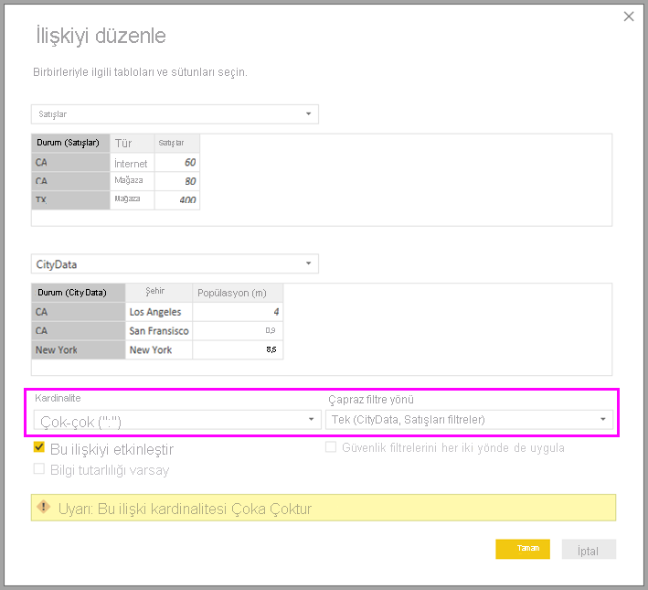
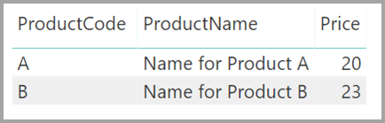
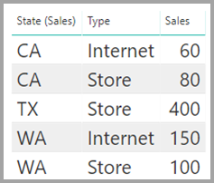

# Power BI Desktop’ta çoka çok ilişkilerini uygulama

Power BI Desktop'daki *çoka çok kardinalitesine sahip ilişkiler* ile *çoka çok* kardinalitesini kullanan tabloları birleştirebilirsiniz. Kolayca ve sezgisel bir şekilde iki veya daha fazla veri kaynağı içeren veri modelleri oluşturabilirsiniz. *Çoka çok kardinalitesine sahip ilişkiler*, Power BI Desktop'taki daha kapsamlı *bileşik modeller* özelliğinin bir parçasıdır.

Power BI Desktop'taki *çoka çok kardinalitesine sahip ilişkiler*, birbiriyle ilişkili üç özellikten birinden oluşur:

* **Bileşik modeller**: *Bileşik modeller*, raporda DirectQuery bağlantıları ve içeri aktarma da dahil olmak üzere herhangi bir birleşimde iki veya daha fazla veri bağlantısına izin verir. Daha fazla bilgi için bkz. [Power BI Desktop’ta bileşik modelleri kullanma](desktop-composite-models.md).

* **Çoka çok kardinalitesine sahip ilişkiler**: Bileşik modeller sayesinde tablolar arasında *çoka çok kardinalitesine sahip ilişkiler* kurabilirsiniz. Bu yaklaşım tablolardaki benzersiz değer gereksinimlerini ortadan kaldırır. Ayrıca yalnızca ilişki kurmak için yeni tablo eklenmesi gibi eski geçici çözümleri de devre dışı bırakır. Bu özellik bu makalede ayrıntılı olarak açıklanmaktadır.

* **Depolama modu**: Artık arka uç veri kaynaklarını sorgulaması gereken görselleri belirtebilirsiniz. Sorgu gerektirmeye görseller DirectQuery tabanlı olsa dahi içeri aktarılmaz. Bu özellik, performansı artırmanıza ve arka uç yükünü azaltmanıza yardımcı olur. Daha önce, sorguları başlatan dilimleyiciler gibi basit görseller bile arka uç kaynaklara gönderiliyordu. Daha fazla bilgi için bkz. [Power BI Desktop’ta depolama modu](desktop-storage-mode.md).

## Çoka çok kardinalitesine sahip ilişkiler neye çözüm getirir?

*Çoka çok kardinalitesine sahip ilişkiler* kullanıma sunulmadan önce iki tablo arasındaki ilişki Power BI’da tanımlanıyordu. İlişkideki tablo sütunlarından en az birinde benzersiz değerlerin bulunması şarttı. Ancak genellikle benzersiz değer içeren sütun bulunmuyordu.

Örneğin, iki tabloda da Ülke etiketine sahip bir sütun bulunabiliyordu. Ancak Ülke değerleri iki tabloda da benzersiz olmuyordu. Bu tabloları birleştirmek için geçici bir çözüme ihtiyaç duyuluyordu. Geçici çözümlerden biri, ihtiyaç duyulan benzersiz değerleri içeren tablolar eklemekti. *Çoka çok kardinalitesine sahip ilişkiler* sayesinde bu tür tabloları *çoka çok* kardinalitesine sahip bir ilişki kullanarak doğrudan birleştirebilirsiniz.

## Çoka çok kardinalitesine sahip ilişkileri kullanma

Power BI'da iki tablo arasındaki ilişkiyi tanımlarken, ilişkinin kardinalitesini tanımlamanız gerekir. Örneğin ProductSales ve Product arasında ProductSales[ProductCode] ve Product[ProductCode] sütunları kullanılarak kurulan ilişkinin kardinalitesi *Çok-1* olacaktır. Her ürün için birden fazla satış olduğundan ve Product tablosundaki (ProductCode) sütunu benzersiz olduğundan ilişkiyi bu şekilde tanımlıyoruz. Bir ilişkinin kardinalitesini *Çok-1*, *1-Çok* veya *1-1* olarak tanımladığınızda Power BI doğrulama gerçekleştirerek seçtiğiniz kardinalitenin gerçek verilerle eşleşmesini sağlar.

Örneğin, şu görüntüde yer alan basit modele göz atalım:

Şimdi **Product** tablosunda aşağıdaki gibi yalnızca iki satır görüntülendiğini düşünelim:

Aynı zamanda Sales tablosunda C ürünü için bir satırın da bulunduğu yalnızca dört satır olduğunu düşünelim. Bilgi tutarlılığı hatası nedeniyle C ürününün satırı **Product** tablosunda mevcut değildir.

**ProductName** ve **Price** (**Product** tablosundan) ile her ürün için toplam **Qty** değeri (ProductSales tablosundan) şu şekilde gösterilecektir:

Yukarıdaki görüntüde gördüğünüz gibi C ürünüyle ilişkilendirilmiş boş bir **ProductName** satırı vardır. Bu boş satır aşağıdakileri gösterir:

* **Product** tablosunda karşılık gelen satırları bulunmayan **ProductSales** tablosu satırları. Bu örnekte C ürünü için gördüğümüz gibi bir bilgi tutarlılığı sorunu vardır.

* **ProductSales** tablosunda, yabancı anahtar sütunu null olan herhangi bir satır.

Bu nedenlerden dolayı, her iki durumda da boş satır **ProductName** ve **Price** değerlerinin bilinmediği satışları gösterir.

Bazen tablolar iki sütunla birleştirilebilir ama sütunlardan hiçbiri benzersiz değildir. Örneğin, şu iki tabloyu inceleyin:

* **Sales** tablosu **State** temelinde satış verilerini gösterir ve her satır o eyaletin satış türüne ilişkin satış tutarını gösterir. Eyaletler CA, WA ve TX olarak belirlenmiştir.

    

* **CityData** tablosu, şehirlerin nüfus ve eyalet (CA, WA ve New York gibi) verilerini gösterir.

    

**State** sütunu iki tabloda da bulunmaktadır. Hem eyalete göre toplam satış miktarını hem de her bir eyaletin toplam nüfusunu rapora dahil etmek isteyebilirsiniz. Ancak burada bir sorun vardır: **State** sütunu iki tabloda da benzersiz değildir.

## Eski geçici çözüm

Power BI Desktop'ın Temmuz 2018 sürümünden önce bu tablolar arasında doğrudan ilişki oluşturmak mümkün değildi. Yaygın bir geçici çözüm olarak şunlar yapılırdı:

* Yalnızca benzersiz State kimliklerini içeren üçüncü bir tablo oluşturulurdu. Tablo şunlardan biri veya hepsi olabilirdi:
  * Hesaplanan tablo (Veri Çözümleme İfadeleri [DAX] kullanılarak tanımlanmış).
  * Tabloların birinden çekilen benzersiz kimlikleri görüntüleyebilecek ve Sorgu Düzenleyicisinde tanımlanan bir sorguyu temel alan bir tablo.
  * Birleştirilmiş tam küme.

* Ardından iki özgün tablo, yaygın *Çok-1* ilişkileri kullanılarak yeni tabloyla ilişkilendirilirdi.

Geçici çözüm tablosunu görünür durumda tutabilirdiniz. Ya da geçici çözüm tablosunu gizleyerek **Alanlar** listesinde görünmemesini sağlayabilirdiniz. Tabloyu gizlediğinizde *Çok-1* ilişkileri genellikle iki yönde de filtreleme yapacak şekilde ayarlanırdı ve iki tablodaki State alanını da kullanmanız mümkün olurdu. Sonraki çapraz filtreleme işlemleri diğer tabloya da yayılırdı. Bu yaklaşım aşağıdaki görüntüde gösterilmiştir:

**State** (**CityData** tablosundan) ile toplam **Population** ve toplam **Sales** değerlerini gösteren bir görsel aşağıdaki gibi olacaktır:

> [!NOTE]
> Bu geçici çözümde **CityData** tablosundan eyalet değerinin kullanılmasıyla, yalnızca söz konusu tablodaki eyaletlerin listelendiğine (ve dolayısıyla TX eyaletinin hariç tutulduğuna) dikkat edin. Aynı zamanda, *Çok-1* ilişkilerinden farklı olarak, toplam satırı tüm **Sales** değerlerini (TX eyaletininkiler de dahil) içerirken ayrıntılar bu tür eşleşmeyen satırları kapsayan boş satırı içermez. Benzer biçimde, **State** için null değeri olan bir **Sales** değerini kapsayacak boş bir satır yoktur.

Bu görsele City verilerini de eklediğinizi varsayalım. City başına nüfus değeri biliniyor olsa da City için gösterilen **Sales** değeri yalnızca ilgili **State** için gösterilen **Sales** değerini tekrarlar. Bu senaryo, burada gösterildiği gibi sütun gruplama belirli bir toplama ölçüsü ile ilgili olmadığında ortaya çıkar:

Yeni Sales tablosunu buradaki tüm State girişlerinin toplamı olarak tanımladığınızı ve bunu **Alanlar** listesinde görünür hale getirdiğinizi düşünün. Aynı görselde **State** (yeni tabloda), **Population** toplamı ve **Sales** toplamı görüntülenir:

Gördüğünüz gibi **Sales** verileri bilinen ancak *Population* verileri bilinmeyen TX ve **Population** verileri bilinen ancak **Sales** verileri bilinmeyen New York dahil edilecektir. Bu geçici çözüm çok uygun bir çözüm değildir ve birçok sorun barındırmaktadır. Çoka çok kardinalitesine sahip ilişkilerle, aşağıdaki bölümde açıklandığı gibi bu sorunlara çözüm getirilmiştir.

## Geçici çözüm yerine çoka çok kardinalitesine sahip ilişkileri kullanma

Power BI Desktop'ın Temmuz 2018 sürümünden başlayarak yukarıda bahsedilenler gibi tabloları benzer geçici çözümler aramadan doğrudan birbirine bağlayabilirsiniz. Artık ilişki kardinalitesini *çoka çok* olarak ayarlamak mümkündür. Bu ayar, iki tabloda da benzersiz değerler olmadığını belirtir. Bu tür ilişkilerde de diğer tabloya filtre uygulayan tabloyu denetleyebilirsiniz. Ya da her tablonun diğerini filtrelediği çift yönlü filtreleme uygulayabilirsiniz.

Power BI Desktop'ta, hiçbir tablonun ilişki sütunları için benzersiz değerler içermediği saptandığında kardinalite varsayılan olarak *çoka çok* olarak ayarlanır. Bu gibi durumlarda ilişki oluşturma isteğini onaylamanızı ve değişikliğin istenmeyen bir veri sorunu olmadığını kabul etmenizi isteyen bir uyarı iletisi görüntülenir.

Örneğin CityData ile Sales arasında filtrelerin CityData alanından Sales alanına akış gerçekleştireceği bir ilişki oluşturduğunuzda Power BI Desktop'ta **İlişkiyi düzenle** penceresi görüntülenir:

Sonuçta elde edilen **İlişki** görünümü, iki tablo arasında doğrudan çok-çok ilişkisini gösterecektir. Tabloların **Alanlar** listesindeki görünümü ve görseller oluşturulduktan sonraki davranışları, geçici çözümün uygulandığı örneğe benzer olacaktır. Geçici çözümde, benzersiz State verilerini görüntüleyen ek tablo görünür hale getirilmez. Daha önce de açıklandığı gibi **State**, **Population** ve **Sales** verilerini gösteren bir görsel görüntülenir:

*Çoka çok kardinalite ilişkileri* ile daha tipik olan *Çoka bir* ilişkileri arasındaki en Önemli farklar şunlardır:

* Gösterilen değerlerde diğer tablodaki eşleşmeyen satırları gösteren boş satır bulunmaz. Ayrıca değerler, diğer tablodaki ilişki için kullanılan sütunun null olduğu satırları dikkate almaz.
* Birden fazla satır arasında ilişki bulunabileceğinden `RELATED()` işlevini kullanamazsınız.
* Tabloda `ALL()` işlevinin kullanılması çok-çok ilişkisiyle ilgili diğer tablolara uygulanan filtreleri kaldırmaz. Önceki örnekte, burada gösterildiği gibi tanımlanmış bir ölçü, ilişkili CityData tablosundaki sütunlarda bulunan filtreleri kaldırmaz:

    

    **State**, **Sales** ve **Sales total** değerlerini gösteren bir görselde şu grafik yer alacaktır:

    

Yukarıda anlatılan farklılıkları göz önünde bulundurarak *genel toplamın yüzdesi* gibi `ALL(<Table>)` kullanan hesaplamaların istenen sonuçları döndürdüğünden emin olun.

## Sınırlamalar ve önemli noktalar

*Çoka çok kardinaliteye sahip ilişkiler* ile bileşik modellerin bu sürümünde birkaç sınırlama vardır.

Aşağıdaki Live Connect (çok boyutlu) kaynaklar bileşik modellerle kullanılamaz:

* SAP HANA
* SAP Business Warehouse
* SQL Server Analysis Services
* Power BI veri kümeleri
* Azure Analysis Services

Söz konusu çok boyutlu kaynaklara DirectQuery kullanarak bağlandığınızda, başka bir DirectQuery kaynağına bağlanamaz veya içeri aktarılan verilerle birleştiremezsiniz.

*Çoka çok kardinalitesine sahip ilişkileri* kullanırken DirectQuery’yi kullanmakla ilgili mevcut sınırlamalar yine geçerlidir. Sınırlamaların birçoğu şimdi tablonun depolama moduna bağlı olarak tablo başına uygulanır. Örneğin, içeri aktarılan tablodaki hesaplanan sütun başka tablolara başvurabilir ama DirectQuery tablosundaki hesaplanan sütun yine aynı tablodaki sütunlara başvurabilir. Model içindeki tablolardan herhangi biri DirectQuery ise, diğer sınırlamalar modelin tamamına uygulanır. Örneğin, modelin içindeki tablolardan herhangi birinin depolama modu DirectQuery olduğunda, modelde QuickInsights ve Soru ve Yanıt özellikleri kullanılamaz.

## Sonraki adımlar

Bileşik modeller ve DirectQuery hakkında daha fazla bilgi için aşağıdaki makalelere bakın:
* [Power BI Desktop’ta bileşik modeller kullanma](desktop-composite-models.md)
* [Power BI Desktop’ta depolama Modu](desktop-storage-mode.md)
* [Power BI'da DirectQuery'yi kullanma](../connect-data/desktop-directquery-about.md)
* [Power BI veri kaynakları](../connect-data/power-bi-data-sources.md)
