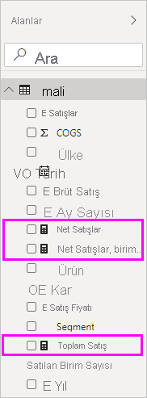
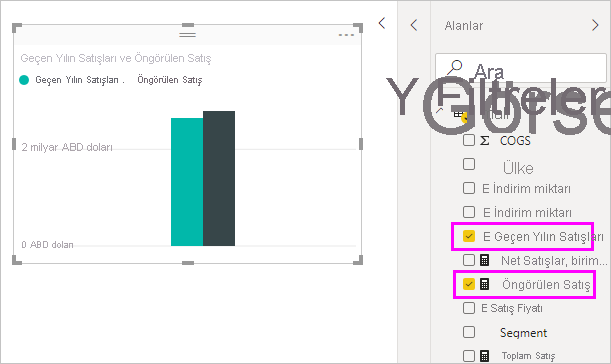
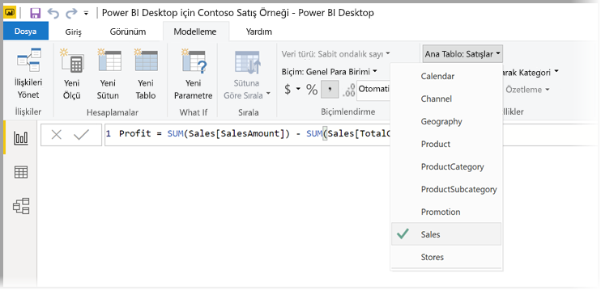

# <a name="create-measures-for-data-analysis-in-power-bi-desktop"></a>Power BI Desktop'ta veri analizi için ölçü oluşturma

Power BI Desktop, birkaç tıklamayla verilerinizle ilgili içgörüler oluşturmanıza yardımcı olur. Ancak bazen bu veriler en önemli soruların yanıtlarına ulaşmak için ihtiyacınız olan her şeyi sunmaz. Ölçüler bu noktada size yardımcı olabilir.

Ölçüler en sık kullanılan veri çözümlemelerinde kullanılır. Toplama, ortalama, en küçük, en büyük ve sayma gibi basit özetlemeler **Alanlar** kutusu aracılığıyla ayarlanabilir. Ölçülerin hesaplanan sonuçları raporunuzdaki etkileşime göre sürekli değişerek, güncel verileri hızlı ve dinamik bir şekilde keşfetmenizi sağlar. Şimdi bu yöntemlere daha yakından bakalım. Daha fazla bilgi için bkz. [Hesaplanan ölçümler oluşturma](/learn/modules/model-data-power-bi/4b-create-calculated-measures).

## <a name="understanding-measures"></a>Ölçüleri anlama

Power BI Desktop'ta ölçüler, *Rapor Görünümü* veya *Veri Görünümü*'nde oluşturulur ve görüntülenir. Kendi oluşturduğunuz ölçüler, **Alanlar** listesinde yanında hesap makinesi simgesiyle görüntülenir. Ölçülere istediğiniz adı verip bunları tıpkı diğer alanlar gibi yeni veya mevcut görselleştirmelere ekleyebilirsiniz.



> [!NOTE]
> İletişim kutularından seçebileceğiniz kullanıma hazır ölçüler olan *hızlı ölçüler* de ilginizi çekebilir. Hızlı ölçüleri kullanarak hızlıca ölçü oluşturabilir, ayrıca bunları oluşturan Veri Çözümleme İfadeleri (DAX) formüllerini inceleyerek DAX söz dizimini öğrenebilirsiniz. Daha fazla bilgi için bkz. [Hızlı ölçüler](desktop-quick-measures.md).
> 
> 

## <a name="data-analysis-expressions"></a>Veri Çözümleme İfadeleri

Ölçüler, bir ifade formülünün sonucunu hesaplar. Kendi ölçülerinizi oluştururken [Veri Çözümleme İfadeleri](/dax/) (DAX) formül dilini kullanırsınız. DAX 200'den fazla işlev, işleç ve yapıdan oluşan bir kitaplığa sahiptir. Bu kitaplık veri çözümleme ihtiyacı için sonuçları hesaplayacak ölçüler oluşturma konusunda yüksek esneklik sunar.

DAX formülleri Excel formülleriyle oldukça benzerdir. DAX ile `DATE`, `SUM` ve `LEFT` gibi Excel işlevlerini bile kullanabilirsiniz. Ancak DAX işlevleri, Power BI Desktop'takiler gibi ilişkisel verilerle çalışacak şekilde tasarlanmıştır.

## <a name="lets-look-at-an-example"></a>Bir örneğe göz atalım

Jan, Contoso'da satış yöneticisi olarak çalışmaktadır. Jan’dan bir sonraki mali yıl için bayi satış tahminlerini sunması istenmektedir. Jan, tahmin için önceki yılın satış rakamlarını temel alarak sonraki altı ayda yapılması planlanan promosyonlar nedeniyle yıllık yüzde altı artış uygulamak istemektedir.

Jan, tahminleri rapor haline getirmek için önceki yılın satış verilerini Power BI Desktop'a aktarır. Jan, **Reseller Sales** tablosundaki **SalesAmount** alanını bulur. İçeri aktardığı veriler yalnızca önceki yılın satış rakamlarını içerdiği için Jan, **SalesAmount** alanının adını *Last Years Sales* olarak değiştirir. Jan ardından **Last Years Sales** alanını rapor tuvaline sürükler. Alan için, önceki yılın bayi satışlarının toplamı olarak tek bir değerin gösterildiği bir grafik görselleştirmesi oluşturulur.

Jan, hesaplama belirtilmemiş olmasına rağmen otomatik bir hesaplama yapıldığını fark eder. Power BI Desktop, **Last Years Sales** alanındaki tüm değerleri toplayarak bir ölçü oluşturmuştur.

Ancak Jan'ın yüzde 6'lık artışa ulaşmak için, önceki yılın satışlarının 1,06 ile çarpılmış hali olan gelecek yılın satış tahminlerini hesaplamak üzere bir ölçü oluşturması gerekmektedir. Jan, bu hesaplama için bir ölçü oluşturacak. Jan, *Yeni Ölçü* özelliğini kullanarak yeni bir ölçü oluşturup şu DAX formülünü girer:

```dax
    Projected Sales = SUM('Sales'[Last Years Sales])*1.06
```

Ardından, Jan yeni oluşturduğu Projected Sales ölçüsünü grafiğe sürükler.



Jan hızlı ve kolay bir şekilde tahmini satışları hesaplamış oldu. Jan diğer alanları raporuna ekleyip belirli bayileri filtreleyerek tahminleriyle ilgili daha fazla çözümleme gerçekleştirebilir.

## <a name="data-categories-for-measures"></a>Ölçüler için veri kategorileri

Ölçüler için de veri kategorileri belirleyebilirsiniz.

Diğer seçeneklere ek olarak veri kategorileri, ölçüler kullanarak dinamik URL'ler oluşturmanızı ve veri kategorisini Web URL'si olarak işaretlemenizi sağlar.

Ölçüleri Web URL'leri olarak görüntüleyen tablolar oluşturabilir, seçiminize göre oluşturulan URL'leri tıklayarak hedefe gidebilirsiniz. Bu yaklaşım özellikle [URL filtresi parametreleri](../collaborate-share/service-url-filters.md) ile diğer Power BI raporlarına bağlantı vermek istediğinizde kullanışlıdır.

## <a name="organizing-your-measures"></a>Ölçülerinizi düzenleme

Ölçülerin, alan listesinde nerede bulunduklarını tanımlayan bir *Giriş* tablosu vardır. Modelinizdeki tablolardan bir konum seçerek bunların konumunu değiştirebilirsiniz.



Ayrıca tablodaki alanları *Görüntü Klasörleri*'nde de düzenleyebilirsiniz. Power BI Desktop'ın sol kenarından **Model**'i seçin. **Özellikler** bölmesinde, kullanılabilir alanlar listesinden taşımak istediğiniz alanı seçin. Klasör oluşturmak için **Klasörü görüntüle** alanına yeni klasörün adını girin. Seçilen alan, oluşturulan klasöre taşınır.


Ters eğik çizgi karakterini kullanarak alt klasörler oluşturabilirsiniz. Örneğin *Finans\Para Birimleri* girişi bir *Finans* klasörü ve bunun içinde bir *Para Birimleri* klasörü oluşturur.

Klasör adlarını noktalı virgülle ayırarak bir alanın birden çok klasörde görünmesini sağlayabilirsiniz. Örneğin *Ürünler\Adlar;Departmanlar* girişi alanın *Ürünler* klasörü içinde hem *Departmanlar* klasöründe hem de *Adlar* klasöründe görünmesiyle sonuçlanır.

Yalnızca ölçüleri içeren özel bir tablo oluşturabilirsiniz. Bu tablo her zaman **Alanlar** bölmesinde en üstte görünür. Bunu yapmak için tek sütunlu bir tablo oluşturun. Bu tabloyu oluşturmak için **Veri Girin** öğesini kullanabilirsiniz. Sonra ölçülerinizi bu tabloya taşıyın. Son olarak, oluşturduğunuz sütunu (tabloyu değil) gizleyin. Değişikliklerinizi görmek üzere alanlar listesini kapatmak ve yeniden açmak için **Alanlar** bölmesinin en üstündeki oku seçin.


## <a name="learn-more"></a>Daha fazla bilgi

Burada ölçülere yalnızca kısa bir giriş yaptık. Kendi ölçülerinizi oluşturmayı öğrenmek için yardım alabileceğiniz birçok farklı kaynak vardır. Daha fazla bilgi için bkz. [Öğretici: Power BI Desktop'ta kendi ölçülerinizi oluşturma](desktop-tutorial-create-measures.md). Örnek dosyayı indirebilir ve daha fazla ölçü oluşturmayla ilgili adım adım dersleri takip edebilirsiniz.  

DAX hakkında daha ayrıntılı bilgi edinmek için bkz. [Power BI Desktop'ta DAX kullanımıyla ilgili temel bilgiler](desktop-quickstart-learn-dax-basics.md). [Veri Çözümleme İfadeleri Başvurusu](/dax/)'nda işlevler, söz dizimi, işleçler ve adlandırma stilleri hakkında ayrıntılı makaleler yer almaktadır. DAX, birkaç yıldır Excel'deki Power Pivot özelliğinde ve SQL Server Analysis Services uygulamasında kullanılmaktadır. Bu nedenle başka birçok faydalı kaynak da mevcuttur. BI topluluğunun önde gelen üyelerinin DAX bilgilerini paylaştığı [DAX Resource Center Wiki](https://social.technet.microsoft.com/wiki/contents/articles/1088.dax-resource-center.aspx) sayfasını ziyaret etmeyi unutmayın.
