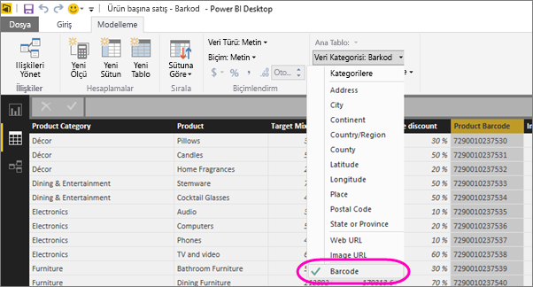

# Mobil uygulamada kullanmak için Power BI Desktop'taki barkodları etiketleme

Power BI Desktop'ta bir sütundaki [verileri kategorilere ayırarak](desktop-data-categorization.md) Power BI Desktop uygulamasının rapordaki görselde bulunan değerleri nasıl işlemesi gerektiğini belirleyebilirsiniz. Sütun kategorisini **Barkod** olarak da belirleyebilirsiniz. Siz veya iş arkadaşlarınız iPhone'da [Power BI uygulamasıyla bir ürün üzerindeki barkodu taradığınızda](../consumer/mobile/mobile-apps-scan-barcode-iphone.md) ilgili barkodu içeren raporu görebilirsiniz. İlgili raporu mobil uygulamada açtığınızda, Power BI raporda taradığınız barkodla ilgili verileri otomatik olarak filtreler.

1. Power BI Desktop'ta Veri Görünümüne geçin.
2. Barkod verilerini içeren sütunu seçin. [Desteklenen barkod biçimleri](#supported-barcode-formats) listesi için aşağıya bakın.
3. **Modelleme** sekmesinde, **Veri Kategorisi** > **Barkod**'u seçin.
   
    
4. Rapor Görünümünde barkoda göre filtrelenmesini istediğiniz görsellere bu alanı ekleyin.
5. Raporu kaydedin ve Power BI hizmetinde yayımlayın.

Artık [iPhone için Power BI uygulamasında](../consumer/mobile/mobile-iphone-app-get-started.md) tarayıcıyı açıp bir barkod taradığınızda rapor listesinde bu raporu görürsünüz. Raporu açtığınızda, görselleri, taradığınız ürün barkoduna göre filtrelenmiş şekilde görüntülenir.

## Desteklenen barkod biçimleri
Power BI raporunda etiketlemeniz durumunda Power BI'ın tanıyacağı barkodlar şunlardır: 

* UPCECode 
* Code39Code  
* A39Mod43Code 
* EAN13Code 
* EAN8Code  
* 93Code  
* 128Code 
* PDF417Code 
* Interleaved2of5Code 
* ITF14Code 

## Sonraki adımlar
* [iPhone'unuzdaki Power BI uygulamasından barkod tarama](../consumer/mobile/mobile-apps-scan-barcode-iphone.md)
* [iPhone'da barkod taramayla ilgili sorunlar](../consumer/mobile/mobile-apps-scan-barcode-iphone.md#issues-with-scanning-a-barcode)
* [Power BI Desktop'ta verileri kategorilere ayırma](desktop-data-categorization.md)  
* Sorular? [Power BI Topluluğu'na sorun](https://community.powerbi.com/)
