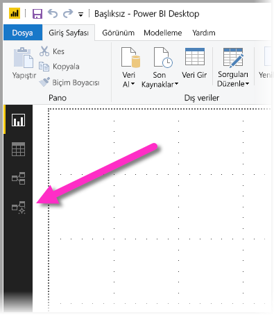
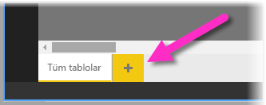
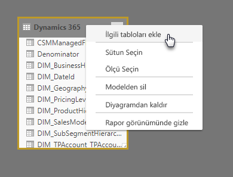
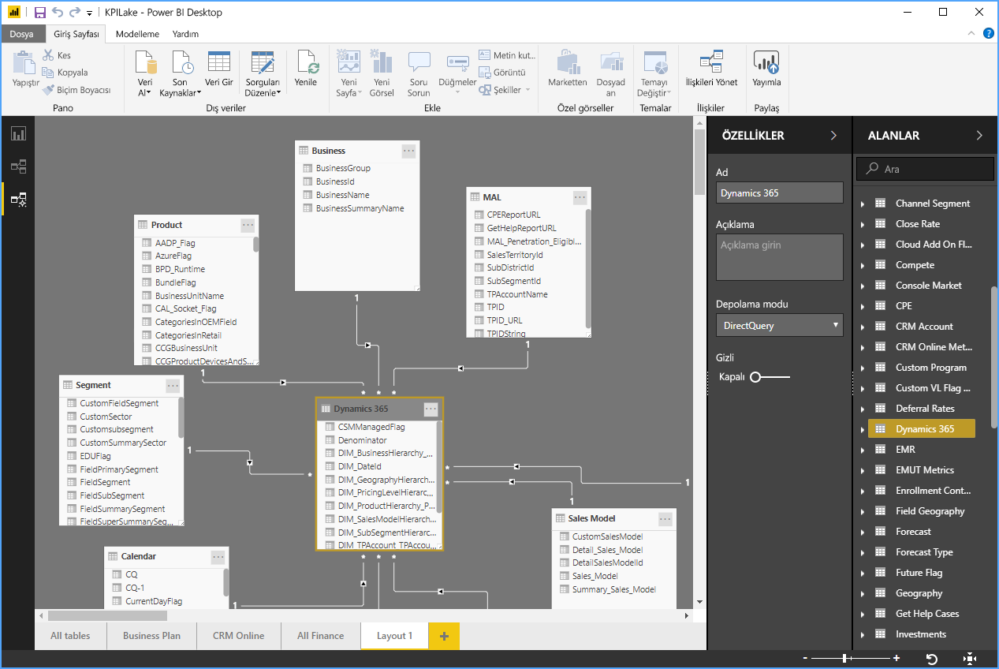
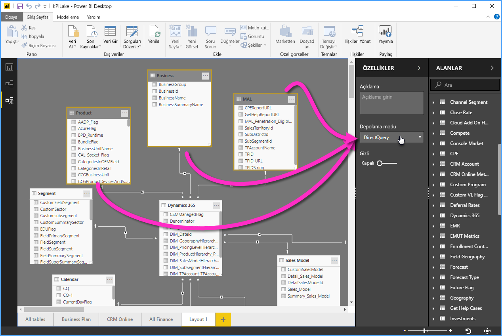

# Power BI Desktop'ta Modelleme görünümüyle çalışma

**Power BI Desktop**'taki **Modelleme görünümü** ile, birçok tablo içeren karmaşık veri kümelerini görüntüleyebilir ve bunlarla çalışabilirsiniz.

## Modelleme görünümünü kullanma

Modelleme görünümüne erişmek için, aşağıdaki resimde gösterildiği gibi **Power BI Desktop**'ın sol tarafında bulunan Modelleme görünümü simgesini seçin.

## Ayrı diyagramlar oluşturma

Modelleme görünümüyle, modelinizin diyagramlarını oluşturabilir ve bu diyagramların modelinizdeki tabloların yalnızca bir alt kümesini içermesini sağlayabilirsiniz. Bu olanak, üzerinde çalışmak istediğiniz tabloların daha net bir görünümünü sağlamaya yardımcı olabilir ve karmaşık veri kümeleriyle çalışmayı kolaylaştırabilir. Tabloların yalnızca bir alt kümesiyle yeni bir diyagram oluşturmak için, Power BI Desktop penceresinin alt kısmında yer alan **Tüm tablolar** sekmesinin yanındaki **+** işaretine tıklayın.

Bundan sonra tabloyu **Alanlar** listesinden diyagram yüzeyine sürükleyebilirsiniz. Tabloya sağ tıklayın ve görüntülenen menüden **İlgili tabloları ekle**'yi seçin.

Bunu yaptığınızda, özgün tabloyla ilgili tablolar yeni diyagramda görüntülenir. Aşağıdaki resimde, **İlgili tabloları ekle** menü seçeneği belirtildikten sonra ilgili tabloların nasıl görüntülendiği gösterilir.

## Ortak özellikleri ayarlama

Modelleme görünümünde **CTRL** tuşunu basılı tutup birden çok tabloya tıklayarak aynı anda birden çok nesne seçebilirsiniz. Birden çok tablo seçtiğinizde, bunlar Modelleme görünümünde vurgulu gösterilir. Birden çok tablo vurgulanmış durumdayken, **Özellikler** bölmesinde uygulanan değişiklikler tüm seçili tablolara uygulanır.

Örneğin, diyagramınızdaki birden çok tablonun [depolama modunu](desktop-storage-mode.md) değiştirmek için **CTRL** tuşunu basılı tutarak tabloları seçebilir ve sonra da **Özellikler** bölmesinde depolama modu ayarını değiştirebilirsiniz.

## Sonraki adımlar

Aşağıdaki makalelerde, veri modelleriyle ilgili daha fazla açıklama ve DirectQuery'nin ayrıntılı açıklaması bulunabilir.

* [Power BI Desktop'ta Toplamalar (Önizleme)](desktop-aggregations.md)
* [Power BI Desktop’taki bileşik modeller](desktop-composite-models.md)
* [Power BI Desktop’ta depolama Modu (Önizleme)](desktop-storage-mode.md)
* [Power BI Desktop’ta çok-çok ilişkiler](desktop-many-to-many-relationships.md)

DirectQuery makaleleri:

* [Power BI'da DirectQuery kullanma](../connect-data/desktop-directquery-about.md)
* [Power BI'da DirectQuery tarafından desteklenen veri kaynakları](../connect-data/power-bi-data-sources.md)
