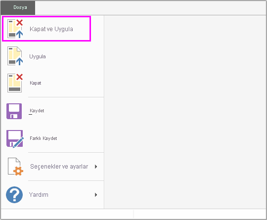

# Power BI Desktop'ta sorgulara genel bakış
Power BI Desktop ile veri dünyasına bağlanabilir, ilgi çekici ve temel nitelikte raporlar oluşturabilir ve çalışmanızı başkalarıyla paylaşabilirsiniz. Bu kişiler de çalışmanızı temel alıp kendi iş zekası çalışmalarını geliştirir.

Power BI Desktop'ta üç görünüm vardır:

* **Rapor** görünümü: İstediğiniz gibi görünen, birden çok sayfa içeren ve başka kullanıcılarla paylaşabileceğiniz ilgi çekici görselleştirmeler elde etmek için oluşturduğunuz sorguları kullanabilirsiniz
* **Veri** görünümü: Raporunuzdaki verileri, veri modeli biçiminde görebilir; ölçüler ekleyebilir, yeni sütunlar oluşturabilir ve ilişkileri yönetebilirsiniz
* **İlişkiler** görünümü: Veri modelinizde oluşturulan ilişkilerin grafik gösterimini elde edebilir ve bunları, gereken şekilde yönetebilir veya değiştirebilirsiniz.

Bu görünümlere, Power BI Desktop'ın sol tarafındaki üç simgeden birini seçerek erişebilirsiniz. Aşağıdaki resimde **Rapor** görünümü seçilmiştir ve bu seçim, simgenin yan tarafındaki sarı şerit ile belirtilmiştir.  

 
Power BI Desktop ayrıca Power Query Düzenleyicisi ile gelir. Power Query Düzenleyicisi'ni kullanarak bir veya daha çok veri kaynağına bağlanabilir, verileri ihtiyaçlarınızı karşılayacak biçimde şekillendirip dönüştürebilir ve ilgili modeli Power BI Desktop'a yükleyebilirsiniz.

Bu belgede, Power Query Düzenleyicisi'nde verilerle çalışmaya yönelik bir genel bakış sağlanmıştır ama öğrenecek daha birçok şey vardır. Bu belgenin sonunda desteklenen veri türleri hakkındaki ayrıntılı kılavuzların bağlantılarını bulacaksınız. Ayrıca verilere bağlanma, verileri şekillendirme, ilişki oluşturma ve çalışmaya başlama konusunda da kılavuzlar bulabilirsiniz.

Ama öncelikle Power Query Düzenleyicisi'ni tanıyalım.

## Power Query Düzenleyicisi
Power Query Düzenleyicisi'ne ulaşmak için Power BI Desktop'ın **Giriş** sekmesinde **Sorguları Düzenle**'yi seçin.  

Hiçbir veri bağlantısı olmadığında Power Query Düzenleyicisi veri almaya hazır, boş bir bölme olarak görünür.  

Bir sorgu yüklendikten sonra Power Query Düzenleyicisi daha ilgi çekici hale gelir. Aşağıdaki Web veri kaynağına bağlanırsak, Power Query Düzenleyicisi verilerle ilgili bilgileri yükler ve verileri şekillendirmeye başlayabilirsiniz:

[*https://www.bankrate.com/retirement/best-and-worst-states-for-retirement/*](https://www.bankrate.com/retirement/best-and-worst-states-for-retirement/)

Veri bağlantısı oluşturulduktan sonra Power Query Düzenleyicisi aşağıdaki gibi görünür:

1. Sorgudaki verilerle etkileşim kurabilmeniz için şeritteki birçok düğmenin etkinleştirildiğini görürsünüz.
2. Sol bölmede sorgular listelenir; bu sorguları seçebilir, görüntüleyebilir ve şekillendirebilirsiniz.
3. Ortadaki bölmede, seçilen sorgudaki veriler görüntülenir ve bu veriler şekillendirilebilir.
4. Sorgunun özelliklerinin ve uygulanan adımların listelendiği **Sorgu Ayarları** bölmesi görünür.  
   
   

Bu dört alanın (şerit, Sorgular bölmesi, Veri görünümü ve Sorgu Ayarları bölmesi) her birini ele alacağız.

## Sorgu şeridi
Power Query Düzenleyicisi'nde şerit dört sekmeden oluşur: **Giriş**, **Dönüşüm**, **Sütun Ekle** ve **Görünüm**.

**Giriş** sekmesi yaygın sorgu görevlerini içerir.

Verilere bağlanmak ve sorgu oluşturma işlemine başlamak için **Yeni Kaynak** öğesini seçin. En yaygın veri kaynaklarının listelendiği bir menü belirir.  

Mevcut veri kaynakları hakkında daha fazla bilgi için bkz. **Veri Kaynakları**. Örnekler ve adımlar da dahil olmak üzere verilere bağlanma hakkında bilgi edinmek için bkz. **Verilere Bağlanma**.

**Dönüşüm** sekmesi yaygın veri dönüştürme görevlerine erişim sağlar, örneğin:

* Sütunları ekleme veya kaldırma
* Veri türlerini değiştirme 
* Sütunları bölme 
* Diğer veri temelli görevler

Örnekler de dahil olmak üzere veri dönüştürme hakkında daha fazla bilgi edinmek için bkz. [Öğretici: Power BI Desktop'ta verileri şekillendirme ve birleştirme](https://docs.microsoft.com/power-bi/desktop-shape-and-combine-data).

**Sütun Ekle** sekmesinde; sütun ekleme, sütun verilerini biçimlendirme ve özel sütunlar ekleme ile ilişkili ek görevler bulunur. Aşağıdaki görüntüde **Sütun Ekle** sekmesi gösterilmektedir.  

Şeritteki **Görünüm** sekmesi, belirli bölmelerin veya pencerelerin görüntülenip görüntülenmeyeceğini belirlemek için kullanılır. Gelişmiş Düzenleyici'yi görüntülemek için de kullanılır. Aşağıdaki görüntüde **Görünüm** sekmesi gösterilmektedir.  

Şeritte sunulan görevlerin birçoğunu, orta bölmede bir sütuna veya diğer verilere sağ tıklayarak da kullanabileceğinizi unutmayın.

## Son bölme (Sorgular bölmesi)
Sol bölmede veya **Sorgular** bölmesinde etkin sorguların sayısı ve sorgunun adı görüntülenir. Sol bölmede bir sorguyu seçtiğinizde bu sorgunun verileri orta bölmede görüntülenir ve orta bölmede verileri ihtiyaçlarınıza göre şekillendirip dönüştürebilirsiniz. Aşağıdaki resimde sorgu içeren sol bölme gösterilmiştir.  

## Orta bölme (Veri bölmesi)
Orta bölmede veya **Veri** bölmesinde seçilen sorgudan veriler görüntülenir. **Sorgu** görünümündeki çalışmanın büyük kısmı bu bölmede gerçekleşir.

Aşağıdaki resimde daha önce kurulan Web veri bağlantısı gösterilmiştir. **Product** sütunu seçilidir ve kullanılabilir menü öğelerini görüntülemek için sütunun başlığına sağ tıklanmıştır. Sağ tıklandığında görüntülenen menü öğelerinin birçoğunun, şerit sekmelerindeki düğmelerle aynı olduğu görülmektedir.  

Sağ tıklandığında görüntülenen menü öğelerinden birini (veya şeritteki bir düğmeyi) seçtiğinizde, sorgu ilgili adımı verilere uygular. Ayrıca adımı sorgunun bir parçası olarak kaydeder. Sonraki bölümde açıklandığı üzere, adımlar sıralı şekilde **Sorgu Ayarları**'nda kaydedilir.  

## Sağ bölme (Sorgu Ayarları bölmesi)
Sağ bölme veya **Sorgu Ayarları** bölmesi, sorgu ile ilişkili tüm adımların görüntülendiği yerdir. Örneğin, aşağıdaki görüntüde; **Sorgu Ayarları** bölmesinin **Uygulanan Adımlar** bölümünde, **Overall score** sütununun türünü değiştirdiğimiz gösterilmektedir.

Sorguda uygulanan ek şekillendirme adımları, **Uygulanan Adımlar** bölümünde kaydedilir.

Temel verilerin *değişmediğini* bilmeniz önemlidir. Bunun yerine Power Query Düzenleyicisi verilerin görünümünü ayarlar ve şekillendirir. Ayrıca temel verilerle kurulan ve Power Query Düzenleyicisi’nin söz konusu verilerin şekillendirilmiş ve değiştirilmiş görünümü temelinde gerçekleşen tüm etkileşimin görünümünü de şekillendirir ve ayarlar.

**Sorgu Ayarları** bölmesinde adımları istediğiniz şekilde yeniden adlandırabilir, silebilir veya yeniden sıralayabilirsiniz. Bunun için **Uygulanan Adımlar** bölümünde adıma sağ tıklayın ve görünen menüde seçim yapın. Tüm sorgu adımları, **Uygulanan Adımlar** bölmesinde görünen sırada gerçekleştirilir.

## Gelişmiş Düzenleyici
**Gelişmiş Düzenleyici** Power Query Düzenleyicisi'nin her adımda oluşturduğu kodu görmenizi sağlar. Ayrıca kendi şekillendirme kodunuzu oluşturmanıza da olanak tanır. Gelişmiş düzenleyiciyi başlatmak için şeritte **Görünüm**'ü ve ardından **Gelişmiş Düzenleyici**'yi seçin. Var olan sorgu kodunu gösteren bir pencere görünür.  

**Gelişmiş Düzenleyici** penceresinde kodu doğrudan düzenleyebilirsiniz. Pencereyi kapatmak için **Bitti** veya **İptal** düğmesini seçin.  

## Çalışmanızı kaydetme
Sorgunuz istediğiniz yere geldiğinde Power Query Düzenleyicisi'nin **Dosya** menüsünde **Kapat ve Uygula**'yı seçin. Bu eylemle değişiklikler uygulanır ve düzenleyici kapatılır.  

Power BI Desktop, ilerleme kaydedildiğinde durumu görüntülemek için bir iletişim kutusu sunar.  

Hazır olduğunuzda Power BI Desktop çalışmanızı *.pbix* dosyası biçiminde kaydedebilir.

Çalışmanızı kaydetmek için, aşağıdaki resimde gösterildiği gibi **Dosya** \> **Kaydet**'i (veya **Dosya** \> **Farklı Kaydet**) seçin.  

## Sonraki adımlar
Power BI Desktop ile yapabileceğiniz çok şey var. Özellikler hakkında daha fazla bilgi edinmek için aşağıdaki kaynaklara bakın:

* [Power BI Desktop nedir?](../fundamentals/desktop-what-is-desktop.md)
* [Power BI Desktop'ta veri kaynakları](../connect-data/desktop-data-sources.md)
* [Power BI Desktop'ta verilere bağlanma](../connect-data/desktop-connect-to-data.md)
* [Öğretici: Power BI Desktop'ta verileri şekillendirme ve birleştirme](../connect-data/desktop-shape-and-combine-data.md)
* [Power BI Desktop'taki genel sorgu görevlerini gerçekleştirme](desktop-common-query-tasks.md)   
