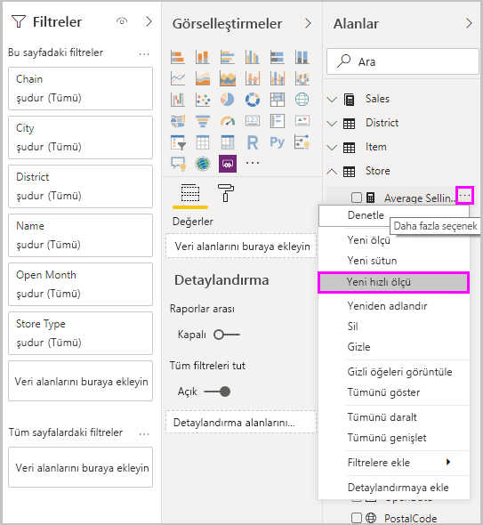
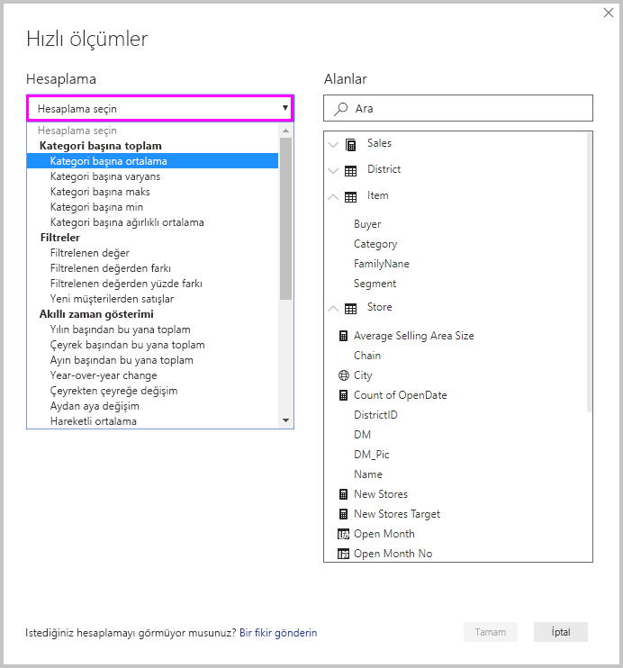
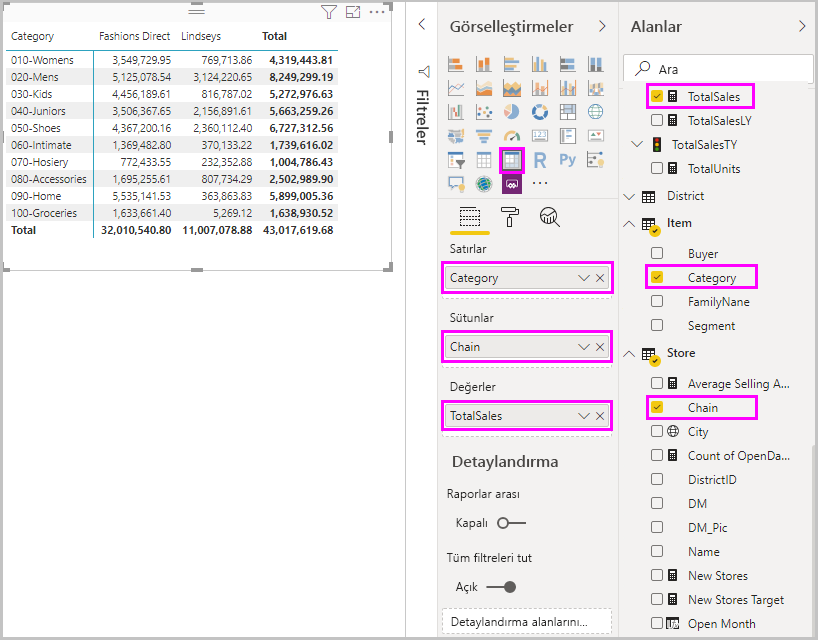
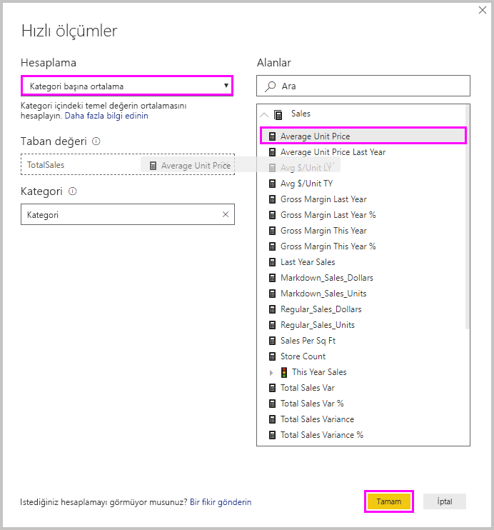
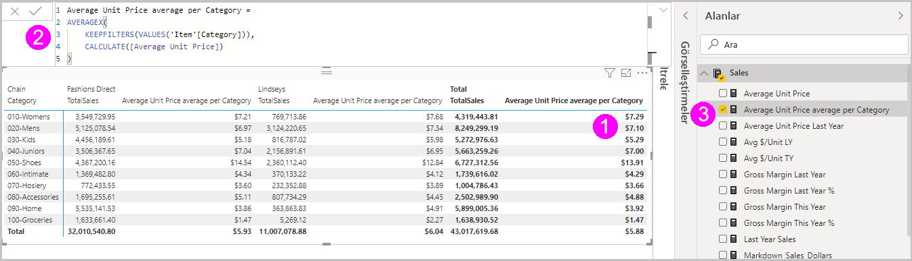
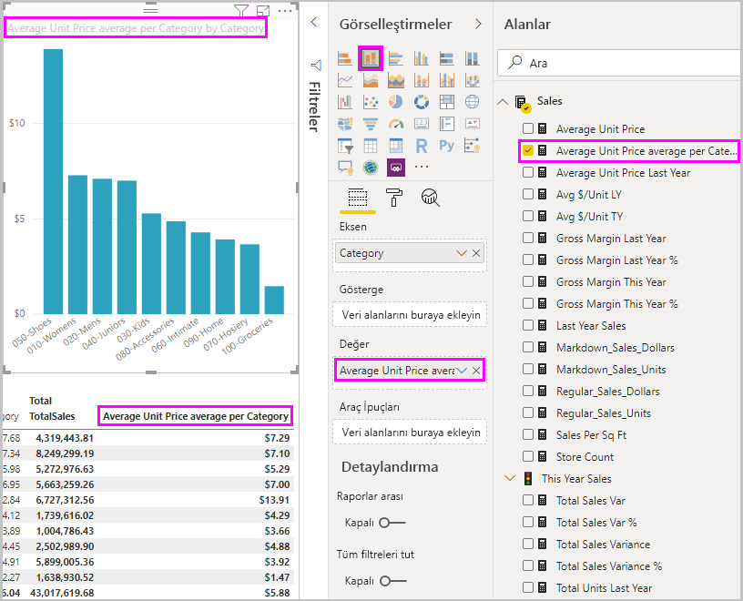
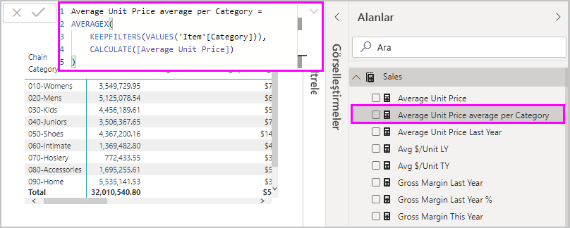
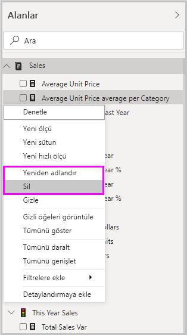

# Yaygın hesaplamalar için hızlı ölçüler özelliğini kullanma
Yaygın ve güçlü hesaplamaları hızla ve kolayca yapabilmek için *hızlı ölçüleri* kullanabilirsiniz. Hızlı ölçü arka planda bir dizi Veri Çözümleme İfadeleri (DAX) komutu çalıştırır, sonra da raporunuzda kullanabilmeniz için sonuçları size sunar. DAX formülü yazmanız gerekmez; iletişim kutusunda sağladığınız giriş temelinde bu sizin yerinize yazılır. Kullanılabilen çok sayıda hesaplama kategorisi ve her hesaplamayı gereksinimlerinize uyacak şekilde değiştirmenin çeşitli yöntemleri vardır. Belki de en iyisi hızlı ölçü tarafından yürütülen DAX’ı görebilmeniz ve kendi DAX bilginizi hemen kullanmaya başlayabilmeniz veya genişletebilmenizdir.

## Hızlı ölçü oluşturma

Power BI Desktop'ta hızlı ölçü oluşturmak için sağ tıklayın veya **Alanlar** bölmesindeki öğelerden birinin yanında yer alan **...** üç noktayı seçin ve ardından görüntülenen menüde **Yeni hızlı ölçü**'yü seçin. 

Ayrıca mevcut görsel için **Değerler** kutusunda yer alan herhangi bir değerin yanındaki aşağı oka sağ tıklayabilir veya bu oku seçebilir ve ardından menüde **Yeni hızlı ölçü**'yü seçebilirsiniz. 

**Yeni hızlı ölçü**'yü seçtiğinizde **Hızlı ölçüler** penceresi görüntülenir; istediğiniz hesaplamayı ve bu hesaplamanın çalıştırılacağı alanları seçmeniz sağlanır. 

Uzun bir kullanılabilir hızlı ölçüle listesi görmek için **Hesaplama seçin** alanını seçin. 

Hesaplamalarıyla birlikte beş hızlı ölçü hesaplama türü şunlardır:

* **Kategori başına toplam**
  * Kategori başına ortalama
  * Kategori başına varyans
  * Kategori başına maks
  * Kategori başına min
  * Kategori başına ağırlıklı ortalama
* **Filtreler**
  * Filtrelenen değer
  * Filtrelenen değerden farkı
  * Filtrelenen değerden yüzde farkı
  * Yeni müşterilerden satışlar
* **Akıllı zaman gösterimi**
  * Yılın başından bu yana toplam
  * Çeyrek başından bu yana toplam
  * Ayın başından bu yana toplam
  * Yıldan yıla değişim
  * Çeyrekten çeyreğe değişim
  * Aydan aya değişim
  * Hareketli ortalama
* **Toplamlar**
  * Değişen toplam
  * Kategori toplamı (filtreler uygulandı)
  * Kategori toplamı (filtreler uygulanmadı)
* **Matematiksel işlemler**
  * Toplama
  * Çıkarma
  * Çarpma
  * Bölme
  * Yüzde farkı
  * Bağıntı katsayısı
* **Metin**
  * Yıldız derecelendirmesi
  * Birleştirilmiş değer listesi

Görmek istediğiniz yeni hızlı ölçüler ve temel DAX formülleri konusundaki fikirlerinizi ve dikkate alınmasını istediğiniz diğer hızlı ölçü fikirlerini göndermek için bu makalenin sonuna bakın.

> [!NOTE]
> SQL Server Analysis Services (SSAS) canlı bağlantıları söz konusu olduğunda bazı hızlı ölçüler kullanılabilir. Power BI Desktop yalnızca bağlandığınız SSAS sürümü için desteklenen hızlı ölçümleri görüntüler. SSAS canlı veri kaynağına bağlandığınızda belirli hızlı ölçüleri listede görmemenizin nedeni, bağlandığınız SSAS sürümünün söz konusu hızlı ölçüleri uygulamak için kullanılan DAX komutlarını desteklememesidir.

Hızlı ölçünüz için istediğiniz hesaplamaları ve alanları seçtikten sonra **Tamam**'ı seçin. **Alanlar** bölmesinde yeni hızlı ölçü görüntülenir ve temel DAX formülü de formül çubuğunda yer alır. 

## Hızlı ölçü örneği
Şimdi de hızlı ölçüyü iş başında görelim.

Aşağıdaki matris görselinde, çeşitli ürünlerin satış tablosu gösterilir. Bu, her kategori için toplam satışları içeren temel bir tablodur.

Matris görseli seçili durumdayken **Değerler** kutusunda yer alan **TotalSales** öğesinin yanındaki aşağı açılan oku seçin ve sonra da **Yeni hızlı ölçü**'yü seçin. 

**Hızlı ölçüler** penceresindeki **Hesaplama**'nın altında **Kategori başına ortalama**'yı seçin. 

**Average Unit Price** öğesini **Alanlar** bölmesinden **Taban değer** alanına sürükleyin. **Kategori** alanındaki **Kategori**'yi olduğu gibi bırakın ve **Tamam**'ı seçin. 

**Tamam**'ı seçtiğinizde bazı ilginç şeyler olur.

1. Matris görselinde hesaplanan **Average Unit Price average per Category** (Kategoriye Göre Ortalama Birim Fiyatı) değerlerini gösteren yeni bir sütun vardır.
   
2. Yeni hızlı ölçünün DAX formülü formül çubuğunda gösterilir. DAX formülü hakkında daha fazla bilgi edinmek için [sonraki bölüme](#learn-dax-by-using-quick-measures) bakın.
   
3. Yeni hızlı ölçü **Alanlar** bölmesinde seçili olarak gösterilir ve vurgulanır. 

Yeni hızlı ölçü yalnızca kendisi için oluşturduğunuz görselde değil rapordaki tüm görsellerde kullanılabilir. Aşağıdaki resimde yeni hızlı ölçü alanı kullanılarak oluşturulan hızlı bir sütun grafik görseli gösterilir.

## Hızlı ölçüleri kullanarak DAX hakkında bilgi edinme
Hızlı ölçülerin ölçüyü gerçekleştiren DAX formülünü göstermesi bunların büyük bir avantajıdır. **Alanlar** bölmesinde hızlı ölçüyü seçtiğinizde, Power BI'ın ölçüyü gerçekleştirmek için oluşturduğu DAX formülünün yer aldığı **Formül çubuğu** görüntülenir.

Formül çubuğunda yalnızca ölçünün arkasındaki formül gösterilmekle kalmaz, belki de daha önemlisi hızlı ölçülere temel oluşturan DAX formüllerinin nasıl oluşturulduğu da gösterilir.

Yıldan yıla hesaplaması yapmanız gerektiğini ancak DAX formülünü nasıl yapılandırmanız gerektiğini bilmediğinizi (veya nereden başlayacağınız konusunda bir fikriniz olmadığını) düşünün. Ne yapacağınızı düşünmek yerine **Yıldan yıla değişim** hesaplamasını kullanarak bir hızlı ölçü oluşturup bunun görselinizde nasıl göründüğüne ve DAX formülünün nasıl çalıştığına bakabilirsiniz. Ardından doğrudan DAX formülünde değişiklik yapabilir veya ihtiyaçlarınızla beklentilerinizi karşılayan benzer bir ölçü oluşturabilirsiniz. Bu özellik, nasıl yapılır sorularınıza sadece birkaç tıklamayla hemen yanıt veren hızlı bir öğretmene sahip olmak gibidir. 

Hoşunuza gitmezse, istediğiniz zaman hızlı ölçümleri modelinizden silebilirsiniz. Bu işlem sağ tıklayıp ölçünün yanındaki **...** simgesini seçmek ve **Sil** seçeneğini belirtmek kadar kolaydır. Ayrıca menüde **Yeniden Adlandır**'ı seçerek hızlı ölçüyü dilediğiniz gibi yeniden adlandırabilirsiniz. 

## Sınırlamalar ve önemli noktalar
Dikkat etmeniz gereken bazı sınırlamalar ve önemli noktalar vardır.

- **Alanlar** bölmesine eklenmiş olan hızlı ölçüleri rapordaki herhangi bir görselde kullanabilirsiniz.
- Dilediğiniz zaman **Alanlar** listesinde hızlı ölçüyü seçip formül çubuğunda yer alan formüle bakarak, hızlı ölçüyle ilişkilendirilmiş DAX formülünü görebilirsiniz.
- Hızlı ölçülerin kullanılabilmesi için modeli değiştirebiliyor olmanız gerekir. Bazı Canlı bağlantılarla çalışırken bu durum söz konusu değildir. Daha önce açıklandığı gibi SSAS tablosal canlı bağlantılar desteklenir.
- DirectQuery modunda çalışırken, akıllı zaman gösterimi hızlı ölçümleri oluşturamazsınız. Bu hızlı ölçülerde kullanılan DAX işlevleri, veri kaynağınıza gönderilen T-SQL deyimlerine çevrildiğinde performansı etkiler.

> [!IMPORTANT]
> Hızlı ölçülere yönelik DAX deyimlerinde bağımsız değişken ayırıcıları olarak yalnızca virgül kullanılır. Power BI Desktop sürümünüz, ondalık ayırıcı olarak virgülü kullanan bir dildeyse hızlı ölçüler düzgün çalışmaz.

### Akıllı zaman gösterimi ve hızlı ölçüler
Akıllı zaman gösterimi hızlı ölçüleriyle kendi özel tarih tablolarınızı kullanabilirsiniz. Dış tablosal model kullanıyorsanız, [Akıllı zaman gösterimiyle kullanmak için Tarih Tablosu Olarak İşaretle seçeneğini belirtme](https://docs.microsoft.com/sql/analysis-services/tabular-models/specify-mark-as-date-table-for-use-with-time-intelligence-ssas-tabular) başlığı altında açıklandığı gibi, modelin ne zaman oluşturulduğundan ve ilgili tablodaki birincil tarih sütununun tarih tablosu olarak işaretlendiğinden emin olun. Kendi tarih tablonuzu içeri aktarıyorsanız, [Power BI Desktop'ta tarih tablolarını ayarlama ve kullanma](desktop-date-tables.md) başlığı altında açıklandığı gibi bunu bir tarih tablosu olarak işaretlediğinizden emin olun.

### Ek bilgi ve örnekler
Hızlı ölçü ile ilgili henüz sunulmamış bir fikriniz mi var? Harika! [Power BI Fikirleri](https://go.microsoft.com/fwlink/?linkid=842906) sayfasını gözden geçirin, hızlı ölçülerle ilgili olarak Power BI Desktop'ta görmek istediğiniz fikirlerinizi ve DAX formüllerini gönderin. Gelecekteki sürümlerden birinde bunları hızlı ölçüler listesine eklemeyi göz önünde bulunduracağız.

