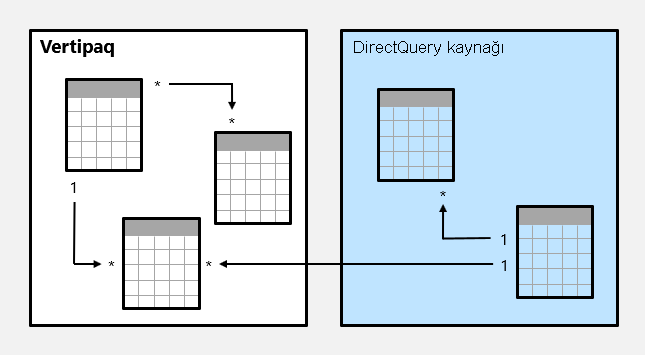
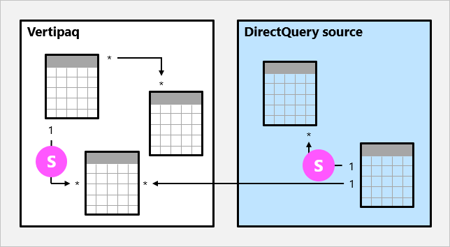
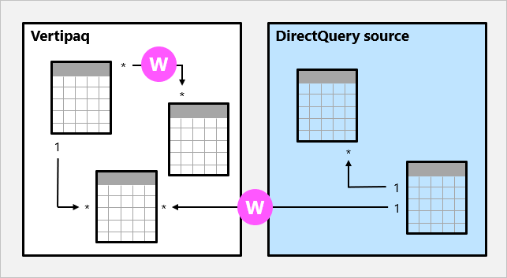

# Power BI Desktop’ta model ilişkileri

Bu makale, Power BI Desktop'ta içeri aktarılan veri modelleyicilerine yöneliktir. Kullanımı kolay, doğru ve en uygun modeller sunmak için temel bilgiler veren, önemli bir model tasarımı konu başlığıdır.

Tablo rolleri ve ilişkileri dahil olmak üzere en uygun model tasarımı hakkında ayrıntılı bilgi için [Yıldız şemasını ve Power BI açısından önemini anlama](../guidance/star-schema.md) makalesini inceleyin.

## İlişkinin amacı

Basitçe ifade etmek gerekirse Power BI ilişkileri, model tablolarının sütunlarına uygulanmış olan filtrelerin diğer model tablolarına da yayılmasını sağlar. Filtreler, izlenecek bir ilişki yolu olduğu sürece yayılmaya devam eder ve bu sayede birden fazla tabloya yayılabilir.

İlişki yolları belirlenimcidir ve bu nedenle filtreler her zaman aynı şekilde yayılır, rastgele değişime uğramaz. Ancak ilişkiler devre dışı bırakılabilir veya belirli DAX işlevlerini kullanan model hesaplamaları tarafından değiştirilen filtre bağlamına sahip olabilir. Daha fazla bilgi için bu makalenin ilerleyen bölümlerinde yer alan [İlgili DAX işlevleri](#relevant-dax-functions) konu başlığına bakın.

> [!IMPORTANT]
> Model ilişkilerinin, veri bütünlüğünü zorlamadığını anlamak önemlidir. Daha fazla bilgi için bu makalenin ilerleyen bölümlerindeki [İlişki değerlendirmesi](#relationship-evaluation) konu başlığına bakın. Bu konu başlığında verilerinizde veri bütünlüğü sorunları olduğunda model ilişkilerinin nasıl davrandığı açıklanmaktadır.

Şimdi ilişkilerin filtreleri nasıl yaydığını animasyonlu bir örnekte görelim.

Bu örnekte model dört tablodan oluşmaktadır: **Kategori**, **Ürün**, **Yıl** ve **Satış**. **Kategori** tablosu **Ürün** tablosuyla, **Ürün** tablosu da **Satış** tablosuyla ilişkilendirilmiştir. **Yıl** tablosu da **Satış** tablosuyla ilişkilendirilmiştir. Tüm ilişkiler bir-çok türündedir (bu türle ilgili ayrıntılar bu makalenin ilerleyen bölümlerinde açıklanmaktadır).

Büyük olasılıkla Power BI kart görseli gibi bir kaynak tarafından oluşturulan bir sorgu, tek bir kategoriye (**Kat-A**) ve tek bir yıla **CY2018** ait olan toplam satış miktarıyla ilgili bilgileri istemektedir. Bu nedenle **Kategori** ve **Yıl** tablolarına filtre uygulanmıştır. **Kategori** tablosundaki filtre **Ürün** tablosuna yayılarak **Kat-A** kategorisine atanmış olan iki ürünü yalıtmaktadır. Ardından **Ürün** tablosu filtreleri **Satış** tablosuna yayılarak bu ürünler için yalnızca iki satış satırını yalıtmaktadır. Bu iki satış satırı, **Kat-A** kategorisine atanmış olan ürünlerin satışlarını temsil etmektedir. Toplam miktar 14 birimdir. Ayrıca **Yıl** tablosunun filtresi, **Satış** tablosunu da filtreleyerek **Kat-A** kategorisine atanmış ve **CY2018** yılında sipariş edilmiş olan ürünlere ait tek bir satış satırı sunmaktadır. Sorgu tarafından döndürülen miktar değeri 11 birimdir. Bir tabloya birden fazla filtre uygulandığında (bu örnekteki **Satış** tablosu gibi) her zaman AND işlemi gerçekleştirilir ve tüm koşulların doğru olması gerekir.

### Bağlantısı olmayan tablolar

Bir model tablosunun başka bir model tablosuna bağlı olmaması sık görülen bir durum değildir. Geçerli bir model tasarımında bu tür tablolar, _bağlantısı olmayan tablo_ olarak açıklanabilir. Bağlantısı olmayan tablo, diğer model tablolarına filtre yayma amacıyla kullanılmaz. Bunun yerine "kullanıcı girişini" kabul etmek (muhtemelen bir dilimleyici görseliyle) ve model hesaplamalarının giriş değerini anlamlı bir şekilde kullanmasını sağlamak için kullanılır. Örneğin döviz kuru değerlerinden oluşan bir aralığa sahip olan, bağlantısı olmayan bir tablo düşünün. Tek kur değerine göre filtrelemek için bir filtre uygulandığı sürece ilgili değer bir ölçüm ifadesi tarafından satış değerine dönüştürme amacıyla kullanılabilir.

Power BI Desktop durum parametresi, bağlantısı olmayan tablo oluşturan bir özelliktir. Daha fazla bilgi için [Power BI Desktop'ta değişkenleri görselleştirmek için durum parametresi oluşturma ve kullanma](desktop-what-if.md) makalesine bakın.

## İlişki özellikleri

Model ilişkisi, bir tablo içindeki sütunlardan biriyle farklı bir tablonun sütunlarından biri arasında ilişki oluşturur. (Bu gereksinimin geçerli olmadığı özel bir durum vardır ve bu yalnızca DirectQuery modellerindeki çoklu sütun ilişkileri için geçerlidir. Daha fazla bilgi için [COMBINEVALUES](/dax/combinevalues-function-dax) DAX işlevi makalesine bakın.)

> [!NOTE]
> Bir sütun ile _aynı tablodaki_ farklı bir sütun arasında ilişki kurmak mümkün değildir. Bu durum bazen tablonun kendine başvuru yaptığı ilişkisel veritabanı yabancı anahtar kısıtlaması tanımlama özelliğiyle karıştırılır. İlişkisel veritabanı kavramı üst-alt ilişkilerini depolamak için kullanılabilir (her çalışan kaydının bir "bağlı olduğu kişi" ile ilişkilendirildiği durumlar gibi). Bu ilişki türüne dayanan bir model hiyerarşisi oluşturma girişimi, model ilişkisi oluşturarak çözülemez. Çözüm için [Üst ve Alt işlevler](/dax/parent-and-child-functions-dax) makalesini inceleyin.

### Kardinalite

Her model ilişkisiyle birlikte bir kardinalite türü tanımlanması gerekir. "Kaynak" ve "hedef" ilişkili sütunların veri özelliklerini temsil eden dört farklı kardinalite türü seçeneği vardır. "Bir" taraf, sütunun benzersiz değerler içerdiğini, "iki" taraf ise sütunda yinelenen değerler bulunabileceği anlamına gelir.

> [!NOTE]
> Bir veri yenileme işleminin "bir" taraflı sütuna yinelenen değer yükleme girişiminde bulunması durumunda veri yenileme işleminin tamamı başarısız olur.

Dört seçenek ve kısaltılmış ifadeleri aşağıdaki madde işaretli listede açıklanmıştır:

- Bir-çok (1:\*)
- Çok-bir (\*:1)
- Bir-bir (1:1)
- Çok-çok (\*:\*)

Power BI Desktop'ta ilişki oluşturduğunuzda tasarımcı kardinalite türünü otomatik olarak algılayacak ve ayarlayacaktır. Tasarımcı modeli sorgulayarak benzersiz değerlerin bulunduğu sütunları öğrenir. İçeri Aktarma modelleri için iç depolama istatistiklerini kullanır, DirectQuery modelleri için de veri kaynağına profil oluşturma sorgusu gönderir. Ancak yanıldığı durumlar da olabilir. Bunun nedeni tablolara henüz veri yüklenmemiş olması veya yinelenen değer içermesini beklediğiniz sütunların o an için benzersiz değerler içeriyor olmasıdır. Her iki durumda da "bir" tarafındaki sütunlarda benzersiz değerler bulunduğu (veya tabloya henüz veri satırları yüklenmediği) sürece kardinalite türünü güncelleştirebilirsiniz.

**Bir-çok** ve **Çok-çok** kardinalite seçenekleri temelde aynıdır ve aynı zamanda en yaygın kullanılan kardinalite türleridir.

Bir-çok veya Çok-çok ilişki yapılandırırken sütunlara arasında ilişki kurduğunuz sıralamayla eşleşeni seçmeniz gerekir. **Ürün** tablosu ile **Satış** tablosu arasında ilişki kurmak için her birinde bulunan **Ürün Kimliği** sütununu nasıl yapılandıracağınızı düşünün. **Ürün** tablosundaki **Ürün Kimliği** sütunu benzersiz değerler içerdiğinden _Bir-çok_ kardinalite türü kullanılır. Tablolar arasındaki ilişkiyi ters yönde kuracak olursanız (**Satış** tablosundan **Ürün** tablosuna), kardinalite türü _Çok-bir olur_.

**Bir-bir** ilişkisi her zaman iki sütunda da benzersiz değerler olduğu anlamına gelir. Bu kardinalite türü yaygın kullanılmaz ve genellikle gereksiz verilerin depolanması nedeniyle uygun olmayan bir tasarım ortaya çıkarır. Bu kardinalite türünü kullanma hakkında daha fazla bilgi için bkz. [Birebir ilişki kılavuzu](../guidance/relationships-one-to-one.md).

**Çok-çok** ilişkisi, iki sütunda da yinelenen değer olabileceği anlamına gelir. Bu kardinalite türü oldukça seyrek kullanılır. Bu tür özellikle karmaşık model gereksinimlerini tasarlarken yararlı olur. Bu kardinalite türünü kullanma yönergeleri için bkz. [Çoka çok ilişkiler kılavuzu](../guidance/relationships-many-to-many.md).

> [!NOTE]
> Bir-çok kardinalite türü şu an için Power BI Rapor Sunucusu için geliştirilen modellerde kullanılamaz.

> [!TIP]
> Power BI Desktop model görünümünde, ilişki çizgisinin iki ucundaki göstergeleri (1 veya \*) inceleyerek bir ilişkinin kardinalite türünü anlayabilirsiniz. Aralarında ilişki bulunan sütunları belirlemek için ilişki çizgisini seçmeniz veya imleci üzerine getirmeniz gerekir. Bu durumda sütunlar vurgulanacaktır.

### Çapraz filtre yönü

Her model ilişkisiyle birlikte bir çapraz filtre yönü tanımlanması gerekir. Yapacağınız seçim, filtrelerin yayılma yönünü belirler. Çapraz filtre seçenekleri, kardinalite türüne göre değişir.

| Kardinalite türü | Çapraz filtre seçenekleri |
| --- | --- |
| Bir-çok (veya Çok-bir) | Tek Her ikisi |
| Bir-bir | Her ikisi |
| Çok-çok | Tek (Tablo1 - Tablo2) Tek (Tablo2 - Tablo1) Her ikisi |

_Tek_ çapraz filtre yönü "tek yön", _Her İkisi_ ise "iki yön birden" anlamına gelir. İki yönde filtre uygulanan bir ilişki genellikle _iki yönlü_ olarak tanımlanır.

Bir-çok ilişkilerde çapraz filtre yönü her zaman "bir" tarafındandır ve isteğe bağlı olarak "çok" tarafına da eklenebilir (iki yönlü). Bir-bir ilişkilerde çapraz filtre yönü her zaman iki tablodan birden olur. Son olarak Çok-çok ilişkilerde çapraz filtre yönü tabloların birinden veya ikisinden birden olabilir. Kardinalite türü "bir" tarafı içerdiğinde filtreler her zaman o taraftan yayılacaktır.

Çapraz filtre yönü **Her İkisi** olarak ayarlandığı sürece ek özellik kullanılabilir. Satır düzeyi güvenlik (RLS) kuralları zorunlu tutulduğunda çift yönlü filtreleme uygulayabilir. RLS hakkında daha fazla bilgi için [Power BI Desktop ile satır düzeyi güvenlik (RLS)](../create-reports/desktop-rls.md) makalesine bakın.

Çapraz filtrenin yönünün değiştirilmesi (filtrenin yayılmasını devre dışı bırakma dahil) işlemi bir model hesaplamasıyla da yapılabilir. Bunun için [CROSSFILTER](/dax/crossfilter-function) DAX işlevi kullanılır.

İki yönlü ilişkiler, performansı olumsuz etkileyebilir. Ayrıca iki yönlü ilişki yapılandırma girişimi sonucunda belirsiz filtre yayma yolları elde edilebilir. Bu durumda Power BI Desktop, ilişki değişikliğini gerçekleştiremeyebilir ve sizi bir hata iletisiyle uyarır. Ancak Power BI Desktop bazen tablolar arasında belirsiz ilişki yolları tanımlamanıza izin verebilir. Belirsizlik algılama ve yol çözümlemesini etkileyen öncelik kuralları, bu makalenin ilerleyen bölümlerindeki [Öncelik kuralları](#precedence-rules) konu başlığında açıklanmaktadır.

İki yönlü filtrelemeyi yalnızca ihtiyaç duyulması halinde kullanmanız önerilir. Daha fazla bilgi için bkz. [Çift yönlü ilişki kılavuzu](../guidance/relationships-bidirectional-filtering.md).

> [!TIP]
> Power BI Desktop model görünümünde, ilişki çizgisi üzerindeki ok uçlarına bakarak ilişkinin çapraz filtre yönünü belirleyebilirsiniz. Tek bir ok ucu, ok ucunun yönünde tek yönlü bir filtre olduğunu gösterirken çift ok ucu, iki yönlü bir ilişki olduğunu gösterir.

### Bu ilişkiyi etkinleştir

İki model tablosu arasında yalnızca bir etkin filtre yayma yolu olabilir. Ek ilişki yolu ekleyebilirsiniz ancak bu ilişkilerin _devre dışı_ olarak yapılandırılması gerekir. Etkin olmayan ilişkiler yalnızca model hesaplama sırasında etkin hale getirilebilir. Bunun için [USERELATIONSHIP](/dax/userelationship-function-dax) DAX işlevi kullanılır.

Daha fazla bilgi için bkz. [Etkin ve etkin olmayan ilişki karşılaştırması kılavuzu](../guidance/relationships-active-inactive.md).

> [!TIP]
> Power BI Desktop model görünümünde bir ilişkinin etkin mi yoksa devre dışı mı olduğunu anlayabilirsiniz. Etkin ilişkiler düz çizgiyle gösterilirken devre dışı olan ilişkiler kesik çizgiyle gösterilir.

### Bilgi tutarlılığı varsay

_Bilgi tutarlılığı varsay_ özelliği yalnızca aynı veri kaynağını temel alan iki DirectQuery depolama modu tablosu arasındaki Bir-çok ve Bir-bir ilişkileri için kullanılabilir. Bu özellik etkinleştirildiğinde, veri kaynağına gönderilen yerel sorgular iki tabloyu OUTER JOIN yerine INNER JOIN kullanarak birleştirir. Bu özelliğin etkinleştirilmesi genellikle sorgu performansını iyileştirse de bu durum veri kaynağına göre değişir.

İki tablo arasında veritabanı yabancı anahtar kısıtlaması mevcut olduğunda bu özelliği mutlaka etkinleştirin. Yabancı anahtar kısıtlaması olmasa da veri bütünlüğünün mevcut olduğundan emin olduğunuz sürece bu özelliği etkinleştirebilirsiniz.

> [!IMPORTANT]
> Veri bütünlüğünün tehlikeye girmesi durumunda iç birleşim, tablolar arasındaki eşleşmeyen satırları ortadan kaldıracaktır. Örneğin **Ürün Kimliği** sütun değerine sahip olan bir **Satış** tablosunun ilgili **Ürün** tablosunda mevcut olmadığı bir model düşünün. **Ürün** tablosundan **Satış** tablosuna doğru olan yayılan filtre, bilinmeyen ürünlerle ilgili satış satırlarını ortadan kaldıracaktır. Bunun sonucunda bildirilen satış sonuçları normalden düşük olacaktır.
>
> Daha fazla bilgi için [Power BI Desktop'ta Bilgi tutarlılığı varsayma ayarları](../connect-data/desktop-assume-referential-integrity.md) makalesine bakın.

## İlgili DAX işlevleri

Model ilişkileriyle ilgili olan birçok DAX işlevi vardır. Bu işlevler aşağıdaki madde işaretli listede kısaca açıklanmıştır:

- [RELATED](/dax/related-function-dax): "Bir" tarafındaki değeri alır.
- [RELATEDTABLE](/dax/relatedtable-function-dax): "Çok" tarafından bir satır tablosu alır.
- [USERELATIONSHIP](/dax/userelationship-function-dax): Belirli bir devre dışı model ilişkisinin kullanılmasını zorunlu kılar.
- [CROSSFILTER](/dax/crossfilter-function): İlişkinin çapraz filtre yönünü (bir veya iki yönlü) değiştirir veya filtrenin yayılmasını devre dışı bırakır (yok).
- [COMBINEVALUES](/dax/combinevalues-function-dax): İki veya daha fazla metin dizesini tek bir metin dizesinde birleştirir. Bu işlevin amacı, DirectQuery modellerindeki çok sütunlu ilişkileri desteklemektir.
- [TREATAS](/dax/treatas-function): Bir tablo ifadesinin sonucunu, ilişkili olmayan bir tablodaki sütunlara filtre olarak uygular.
- [Üst ve Alt işlevler](/dax/parent-and-child-functions-dax): Bir üst-alt hiyerarşisini doğal hale getirme amacıyla hesaplanmış sütunlar oluşturmak için kullanılabilecek ilgili işlevlerden oluşan kümedir. Daha sonra bu sütunlar, sabit düzey hiyerarşi oluşturmak için kullanılabilir.

## İlişki değerlendirmesi

Model ilişkileri, değerlendirme açısından _güçlü_ veya _zayıf_ olarak sınıflandırılır. Yapılandırılabilir ilişki özelliği değildir. Aslında aralarında ilişki bulunan iki tablonun kardinalite türünden ve veri kaynağından oluşur. Veri bütünlüğünün tehlikeye girmesi durumunda performans açısından belirli etkileri veya sonuçları olabileceğinden değerlendirme türünü anlamak önemlidir. Bu konu başlığında bu etkiler ve bütünlük açısından sonuçlar açıklanmaktadır.

Öncelikle ilişki değerlendirmelerini anlamak için modelleme konusunda bazı teorik bilgilerin dikkate alınması gerekir.

İçeri aktarma veya DirectQuery model kaynakları, tüm verilerini Vertipaq önbelleğinden veya kaynak veritabanından alır. Her iki örnekte de Power BI, ilişkinin "bir" tarafının mevcut olduğunu tespit edebilir.

Ancak bir Bileşik model, farklı depolama modları (İçeri aktarma, DirectQuery veya İkili) veya DirectQuery kaynakları kullanan tablolardan oluşabilir. İçeri aktarılan verilerin Vertipaq önbelleği dahil olmak üzere her kaynak bir _veri adası_ olarak kabul edilir. Bu şekilde model ilişkileri de _ada içi_ veya _adalar arası_ olarak sınıflandırılabilir. Ada içi ilişkide iki tablo bir veri adasına bağlanırken adalar arası ilişkide farklı veri adalarından alınan tablolar arasında ilişki kurulur. İçeri aktarma veya DirectQuery modellerindeki ilişkiler her zaman ada içi olur.

Şimdi bir Bileşik model örneğine göz atalım.

Bu örnekteki Bileşik model, iki adadan oluşmaktadır: Vertipaq veri adası ve DirectQuery kaynağı veri adası. Vertipaq veri adasında üç tablo, DirectQuery kaynağı veri adasında ise iki tablo vardır. Vertipaq veri adasındaki bir tablo ile DirectQuery kaynağı veri adasındaki bir tablo arasında ilişki kuran bir adalar arası ilişki mevcuttur.

### Güçlü ilişkiler

Sorgu altyapısının ilişkinin "bir" tarafını belirleyebildiği model ilişkileri, _güçlü_ ilişki olarak kabul edilir. Bu durum, "bir" taraftaki sütunun benzersiz değerler içerdiğini onaylar. Bir-çok türündeki ada içi ilişkiler, güçlü ilişkilerdir.

Aşağıdaki örnekte iki güçlü ilişki vardır ve ikisi de **S** harfiyle gösterilmiştir. İlişkiler, Vertipaq adası içinde yer alan Bir-çok ilişkisi ile DirectQuery kaynağında yer alan Bir-çok ilişkisini kapsamaktadır.

Tüm verilerin Vertipaq önbelleğinde depolandığı İçeri aktarma modellerinde, veriler yenilendiğinde her bir güçlü ilişki için bir veri yapısı oluşturulur. Veri yapıları, tüm sütunlar arası değerlerin dizinlenmiş eşleşmelerini içerir ve sorgu zamanında tabloların daha hızlı birleştirilmesini sağlamak için kullanılır.

Güçlü ilişkiler, sorgu zamanında _tablonun genişletilmesini_ sağlar. Tablo genişletme işleminin sonucunda temel tablonun yerel sütunları alınıp ilişkili tablolarla genişletilerek bir sanal tablo oluşturulur. İçeri aktarma tablolarında bu işlem sorgu altyapısında, DirectQuery tablolarında ise kaynak veritabanına gönderilen yerel sorguda gerçekleştirilir (**Bilgi tutarlılığı varsay** özelliğinin etkinleştirilmemiş olması koşuluyla). Ardından sorgu altyapısı genişletilen tabloya göre işlem yapar ve bu tablonun sütunlarında filtre uygulama ve gruplama işlemlerini gerçekleştirir.

> [!NOTE]
> Hesaplama için kullanılmayanlar da dahil olmak üzere devre dışı ilişkiler de genişletilir. İki yönlü ilişkilerin tablo genişletme işlemi üzerinde bir etkisi yoktur.

Bire çok ilişkilerde tablo genişletme işlemi, LEFT OUTER JOIN semantiği kullanılarak "çok" tarafından "bir" tarafına doğru gerçekleştirilir. "Çok" tarafından "bir" tarafına eşleşen bir değer yoksa "bir" tarafındaki tabloya boş bir sanal satır eklenir.

Tablo genişletme işlemi Bir-bir ada içi ilişkiler için de gerçekleşir ancak bu durumda FULL OUTER JOIN semantiği kullanılır. Bu işlem, gerekli olduğunda bir tarafa boş sanal satırların eklenmesini sağlar.

Boş sanal satırlar, _Bilinmeyen Üyeler_ olarak adlandırılır. Bilinmeyen üyeler, "çok" tarafındaki değere "bir" tarafında karşılık gelen bir değerin bulunmadığı bilgi tutarlılığı ihlallerini temsil eder. İdeal bir ortamda boş satır bulunmaması gerekir ve bu satırlar kaynak verilerin temizlenmesi veya onarılmasıyla ortadan kaldırılabilir.

Tablo genişletme işleminin nasıl çalıştığını animasyonlu bir örnekle inceleyelim.

Bu örnekte model üç tablodan oluşmaktadır: **Kategori**, **Ürün** ve **Satış**. **Kategori** tablosu ile **Ürün** tablosu arasında Bir-çok ilişkisi, **Ürün** tablosu ile de **Satış** tablosu arasında Bir-çok ilişkisi vardır. **Kategori** tablosunda iki satır, **Ürün** tablosunda üç satır, **Satış** tablosunda ise beş satır vardır. Tüm ilişkilerin iki tarafında da eşleşen değerler vardır ve bu nedenle bilgi tutarlılığı ihlali mevcut değildir. Sorgu zamanında oluşturulan bir genişletilmiş tablo gösterilmektedir. Bu tablo, üç ayrı tablodan alınan tüm sütunları içermektedir. Bu tablo, üç tabloda yer alan verilerin normalleştirilmişlikten çıkarılmış bir perspektifini sunmaktadır. **Satış** tablosuna yeni bir satır eklenmiştir ve bu satırda **Ürün** tablosunda karşılığı bulunmayan üretim tanımlayıcısı değeri (9) mevcuttur. Bu bir bilgi tutarlılığı ihlalidir. Genişletilmiş tablodaki yeni satır (Boş), **Kategori** ve **Ürün** tablosundaki sütunların değerlerini içermektedir.

### Zayıf ilişkiler

"Bir" taraf garantisi bulunmayan model ilişkileri, _zayıf_ ilişki olarak kabul edilir. Bu durumun iki farklı nedeni olabilir:

- İlişki Çok-çok kardinalite türünü kullanmaktadır (sütunların biri veya her ikisi benzersiz değer içeriyor olsa da)
- Adalar arası ilişki vardır (Bileşik modellerde yalnızca bu ilişki türü kullanılabilir)

Aşağıdaki örnekte iki zayıf ilişki vardır ve ikisi de **W** harfiyle gösterilmiştir. İki ilişki, Vertipaq adası içinde yer alan Çok-çok ilişkisi ile Bir-çok adalar arası ilişkiyi kapsamaktadır.

İçeri aktarma modellerinde zayıf ilişkiler için veri yapısı oluşturulmaz. Bu da tablo birleşimlerinin sorgu zamanında çözümlenmesi gerektiği anlamına gelir.

Zayıf tablolar için tablo genişletme işlemi gerçekleştirilmez. Tablo birleşimleri, INNER JOIN semantiği kullanılarak elde edilir ve bu nedenle bilgi tutarlılığı ihlallerini telafi etmek için boş sanal satırlar eklenmez.

Zayıf ilişkilerle ilgili ek kısıtlamalar da mevcuttur:

- RELATED DAX işlevi, "bir" taraftaki sütun değerlerini alma amacıyla kullanılamaz
- RLS'nin zorunlu kılınması, bazı topoloji kısıtlamalarını da beraberinde getirir

> [!NOTE]
> Power BI Desktop model görünümünde bir modelin güçlü mü yoksa zayıf mı olduğunu tespit etmek her zaman mümkün olmayabilir. Çok-çok ilişkileri ve adalar arası Bir-çok ilişkileri her zaman zayıf olacaktır. İlişkinin adalar arası ilişki olup olmadığını belirlemek için tablo depolama modlarını ve veri kaynaklarını incelemeniz gerekir.

### Öncellik kuralları

İki yönlü ilişkiler, model tabloları arasında birden fazla (ve belirsiz) filtre yayma yolu oluşturabilir. Aşağıdaki listede Power BI'ın belirsizlik algılama ve yol çözümleme amacıyla kullandığı öncelik kuralları verilmiştir:

1. Zayıf ilişkiler dahil olmak üzere Çok-bir ve Bir-bir ilişkileri
2. Çok-çok ilişkileri
3. Ters yöndeki iki yönlü ilişkiler ("Çok" tarafından)

### Performans tercihi

Aşağıdaki listede en hızlıdan en yavaşa doğru olmak üzere filtre yayma performansları listelenmiştir:

1. Bir-çok ada içi ilişkiler
2. Çok-çok kardinalite ilişkileri
3. Ara tablo ile elde edilen ve en az bir iki yönlü ilişki içeren çok-çok model ilişkileri
4. Adalar arası ilişkiler

## Sonraki adımlar

Bu makale hakkında daha fazla bilgi için aşağıdaki kaynaklara bakın:

- [Yıldız şemasını ve Power BI açısından önemini anlama](../guidance/star-schema.md)
- [Birebir ilişki kılavuzu](../guidance/relationships-one-to-one.md)
- [Çoka çok ilişkiler kılavuzu](../guidance/relationships-many-to-many.md)
- [Etkin ve etkin olmayan ilişki karşılaştırması kılavuzu](../guidance/relationships-active-inactive.md)
- [Çift yönlü ilişki kılavuzu](../guidance/relationships-bidirectional-filtering.md)
- [İlişki sorunlarını giderme kılavuzu](../guidance/relationships-troubleshoot.md)
- Video: [Power BI İlişkilerinde Yapılması ve Yapılmaması Gerekenler](https://www.youtube.com/watch?v=78d6mwR8GtA)
- Sorularınız mı var? [Power BI Topluluğu'na sorun](https://community.powerbi.com/)
- Önerileriniz mi var? [Power BI'ı geliştirmek için fikirlerinizi paylaşın](https://ideas.powerbi.com/)
