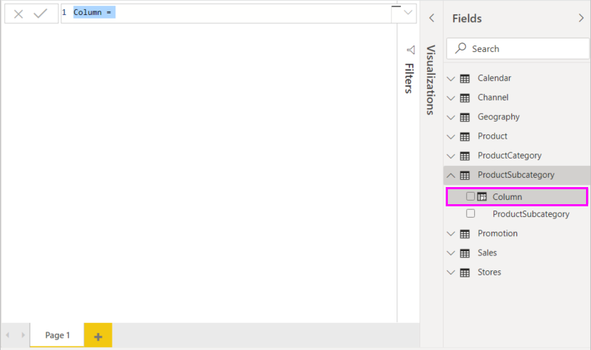

# Öğretici: Power BI Desktop'ta, hesaplanmış sütun oluşturma

Bazen çözümlediğiniz veriler, istediğiniz sonuçlar için ihtiyaç duyduğunuz bir alanı içermeyebilir. *Hesaplanmış sütunlar* bunun için vardır. Hesaplanmış sütunlar bir sütunun değerlerini tanımlamak, birkaç farklı sütundan metin değerlerini bir araya getirmek veya diğer değerlerden bir sayısal değer hesaplamak gibi her türlü işlem için Veri Çözümleme İfadeleri (DAX) formüllerini kullanır. Örneğin, verilerinizde **City** ve **State** alanları var ancak "Miami, FL" gibi her iki alanı da içeren tek bir **Location** alanınızın olmasını istiyorsunuz. Bu tam olarak hesaplanmış sütunların işidir.

Hesaplanmış sütunlar, DAX formüllerini temel almaları açısından [ölçülere](desktop-tutorial-create-measures.md) benzer ancak kullanımları birbirinden farklıdır. Ölçüler genellikle diğer alanlara göre sonuçları hesaplamak için bir görselleştirmenin **Değerler** alanında kullanılır. Hesaplanmış sütunlar ise görselleştirmelerin satır, eksen, açıklama ve grup alanlarındaki yeni **Alanlar** olarak kullanılır.

Bu öğretici, bazı hesaplanmış sütunları anlayıp oluşturmanız ve Power BI Desktop'taki rapor görselleştirmelerinde kullanmanız konusunda size yol gösterecektir.

## Önkoşullar

- Bu öğretici, Power BI Desktop’ı daha gelişmiş modeller oluşturmak için kullanmaya alışmış Power BI kullanıcılarına yöneliktir. Verileri içeri aktarmak, birden fazla ilgili tablo ile çalışmak ve Rapor tuvaline alanlar eklemek için Veri Alma ve Power Query Düzenleyicisi’ni nasıl kullanacağınızı zaten biliyor olmanız gerekir. Power BI Desktop'a yeni başladıysanız [Power BI Desktop ile çalışmaya başlama](../fundamentals/desktop-getting-started.md) makalesine mutlaka göz atın.
  
- Bu öğreticide, [Power BI Desktop’ta kendi ölçülerinizi oluşturma](https://download.microsoft.com/download/4/6/A/46AB5E74-50F6-4761-8EDB-5AE077FD603C/Contoso%20Sales%20Sample%20for%20Power%20BI%20Desktop.zip) öğreticisi için kullanılan örneğin aynısı, yani [Power BI Desktop için Contoso Satış Örneği](desktop-tutorial-create-measures.md) kullanılır. Contoso, Inc adlı kurgusal şirketin bu satış verileri bir veritabanından içeri aktarıldığı için veri kaynağına bağlanamazsınız veya verileri Power Query Düzenleyicisi'nde görüntüleyemezsiniz. Dosyayı indirip bilgisayarınıza ayıklayın ve sonra Power BI Desktop’ta açın.

## İlgili tablolardan değerlerle hesaplanmış bir sütun oluşturma

Satış Raporunuzda ürün kategorilerini ve alt kategorilerini "Cell phones – Accessories", "Cell phones – Smartphones & PDAs" gibi tek değerler halinde görüntülemek istiyorsunuz. **Alanlar** listesinde size bu verileri sağlayan bir alan yoktur ancak her biri kendi tablosunda bulunan bir **ProductCategory** alanı ve bir **ProductSubcategory** alanı mevcuttur. Bu iki sütundaki değerleri birleştiren bir hesaplanmış sütun oluşturabilirsiniz. DAX formülleri, var olan farklı tabloların birbiri arasındaki ilişkiler dahil olmak üzere elinizdeki modelin tam gücünden yararlanabilir.

 

1. **ProductSubcategory** tablosunda yeni bir sütun oluşturmak için **Alanlar** bölmesinde **ProductSubcategory** öğesinin yanındaki **...** simgesine tıklayıp açılan menüden **Yeni sütun**'u seçin.

   

   **Yeni sütun**'u seçtiğinizde Rapor tuvalinin üst kısmında **Formül çubuğu** görüntülenir. Burada sütununuzu yeniden adlandırabilir ve bir DAX formülü girebilirsiniz.

   

2. Varsayılan olarak, yeni bir hesaplanmış sütunun adı **Sütun** olur. Sütunu yeniden adlandırmazsanız ek olarak oluşturulacak sütunlar **Sütun 2**, **Sütun 3** ve benzeri şekilde adlandırılır. Sütununuzun daha iyi ayırt edilebilir olmasını istiyorsunuz. Bu nedenle, **Sütun** adı formül çubuğunda zaten vurgulandığı için **ProductFullCategory** yazarak yeniden adlandırın ve sonra bir eşittir ( **=** ) işareti girin.

3. Yeni sütununuzdaki değerlerin **ProductCategory** alanındaki adla başlamasını istiyorsunuz. Bu sütun farklı ancak ilişkili bir tabloda olduğundan, sütuna [RELATED](/dax/related-function-dax) işlevini kullanarak ulaşabilirsiniz.

   Eşittir işaretinden sonra **r** yazın. Bir açılır öneri listesinde, R harfiyle başlayan tüm DAX işlevleri gösterilir. Bir işlev seçildiğinde, etkisinin açıklaması gösterilir. Siz yazdıkça, öneri listesi ihtiyaç duyduğunuz işleve yaklaşacak şekilde ölçeklendirilir. **RELATED** öğesini seçin ve sonra **Enter** tuşuna basın.

   

   RELATED işlevine geçirebileceğiniz ilgili sütunları ve beklenen parametrelere ilişkin açıklama ve ayrıntıları içeren başka bir öneri listesiyle birlikte bir açma ayracı görünür.

   

4. **ProductCategory** tablosundan **ProductCategory** sütununu istiyorsunuz. **ProductCategory[ProductCategory]** öğesini seçin, **Enter** tuşuna basın ve sonra bir kapatma ayracı girin.

    > [!TIP]
    > Bazı durumlarda sizin yerinize Power BI Desktop tarafından eklenmesine rağmen, söz dizimi hataları en yaygın olarak eksik veya yanlış yerleştirilmiş bir kapatma ayracından kaynaklanır.

5. Yeni değerlerde **ProductCategories** ve **ProductSubcategories** öğelerini tire ve boşluklarla birbirinden ayırmak istiyorsunuz. Bu nedenle, ilk ifadenin kapatma ayracından sonra bir boşluk, ve işareti ( **&** ), çift tırnak ( **"** ), boşluk, tire ( **-** ), başka bir boşluk, başka bir çift tırnak ve başka bir ve işareti girin. Formülünüzün şöyle görünmesi gerekir:

    `ProductFullCategory = RELATED(ProductCategory[ProductCategory]) & " - " &`

    > [!TIP]
    > Daha fazla yer gerekirse, formül düzenleyicisini genişletmek için formül çubuğunun sağındaki aşağı köşeli çift ayracı seçin. Düzenleyicide bir satır aşağı inmek için **Alt + Enter** tuşlarına, içeriği yana kaydırmak için **Tab** tuşuna basın.

6. Formülü tamamlamak için bir açma ayracı ( **[** ) girin ve sonra **[ProductSubcategory]** sütununu seçin. 

    

    Bu tabloda hesaplanmış bir sütun oluşturduğunuz için ikinci ifadede **ProductSubcategory** tablosunu çağırmak için başka RELATED işlevi kullanmanız gerekmedi. Tablo adı ön ekiyle (tam ad) veya tablo adı ön eki olmadan (nitelemesiz ad) **[ProductCategory]** girebilirsiniz.

7. **Enter** tuşuna basarak veya formül çubuğundaki onay işaretini seçerek formülü tamamlayın. Formül doğrulanır ve **Alanlar** bölmesindeki **ProductSubcategory** tablosunda **ProductFullCategory** sütun adı görünür.

   

    >[!NOTE]
    >Power BI Desktop’ta hesaplanmış sütunlar, formül içerdiklerini belirtmek üzere **Alanlar** bölmesinde özel bir simge alırlar. Power BI hizmetinde (Power BI sitenizde) bir formülü değiştirme olanağı yoktur. Bu nedenle, hesaplanmış sütunlar simge içermez.

## Yeni sütununuzu bir raporda kullanma

Artık yeni **ProductFullCategory** sütununuzu **ProductFullCategory** ölçütüne göre **SalesAmount** değerine bakmak için kullanabilirsiniz.

1. Tüm **ProductFullCategory** adlarını gösteren bir tablo oluşturmak için **ProductFullCategory** sütununu seçin veya **ProductSubcategory** tablosundan Rapor tuvaline sürükleyin.

   

2. **SalesAmount** alanını seçin veya **Sales** tablosundan her bir **ProductFullCategory** için **SalesAmount** değerini gösteren tabloya sürükleyin.

   

## IF işlevi kullanan hesaplanmış sütun oluşturma

Contoso Satış Örneği, hem etkin hem de etkin olmayan mağazaların satış verilerini içerir. Bir **Active StoreName** alanı oluşturarak raporunuzda etkin mağaza satışlarının etkin olmayan mağaza satışlarından net bir şekilde ayrılmasını istiyorsunuz. Yeni **Active StoreName** hesaplanmış sütununda her bir etkin mağaza, mağazanın tam adı ile görünürken etkin olmayan mağazaların satışları **Inactive** adlı tek bir satırın altında gruplandırılır.

Neyse ki, **Stores** tablosunda etkin mağazalar için "On" ve etkin olmayan mağazalar için "Off" değerlerine sahip **Status** adlı bir sütun bulunur ve bu sütun kullanılarak yeni **Active StoreName** sütunumuza ait değerleri oluşturabiliriz. DAX formülünüz her bir mağazanın [Status](/dax/if-function-dax) değerini test etmek ve sonuca bağlı olarak belirli bir değer döndürmek üzere mantıksal **IF** işlevini kullanır. Mağazanın **Status** değeri “On” ise formül, mağazanın adını döndürür. "Off" ise formül "Inactive" durumunda bir **Active StoreName** atar.

1. **Stores** tablosunda yeni bir hesaplanmış sütun oluşturun ve formül çubuğunda **Active StoreName** olarak adlandırın.

2. **=** işaretinden sonra **IF** yazmaya başlayın. Öneri listesi, ne ekleyebileceğinizi gösterir. **IF**'i seçin.

    

3. **IF** için birinci bağımsız değişken, bir mağazanın **Status** değerinin "On" olup olmadığına yönelik mantıksal bir testtir. **Stores** tablosundaki sütunları listeleyen bir açma ayracı **[** ekleyin ve **[Status]** öğesini seçin.

    

4. **[Status]** öğesinden hemen sonra **="On"** yazın ve sonra bir virgül ( **,** ) girerek bağımsız değişkeni sonlandırın. Araç ipucu, sonuç TRUE olduğunda döndürülecek bir değer eklemenizi önerir.

    

5. Mağazanın durumu “On” ise, mağaza adını göstermek istersiniz. Bir açma köşeli ayracı **[** yazın ve **[StoreName]** sütununu seçin, ardından bir virgül daha girin. Araç ipucu bu durumda sonuç FALSE ise döndürülecek bir değer eklemeniz gerektiğini belirtir.

    

6. Değerin "Inactive" olmasını istediğiniz için **"Inactive"** yazın ve sonra **Enter** tuşuna basarak veya formül çubuğundaki onay işaretini seçerek formülü tamamlayın. Formül doğrulanır ve yeni sütunun adı, **Alanlar** listesindeki **Stores** tablosunda görünür.

    

7. Yeni **Active StoreName** sütununuzu diğer herhangi bir alan gibi kullanabilirsiniz. **Active StoreName** ölçütüne göre **SalesAmounts** değerini görüntülemek için **Active StoreName** alanını seçin veya Rapor tuvaline sürükleyin ve sonra **SalesAmount** alanını seçin ya da tabloya sürükleyin. Bu tabloda etkin mağazalar ada göre tek tek görüntülenir ancak etkin olmayan mağazalar sonda **Inactive** olarak bir arada gruplandırılır.

    

## Öğrendikleriniz

Hesaplanmış sütunlar verilerinizi zenginleştirerek daha kolay içgörüler sağlayabilir. **Alanlar** bölmesi ve formül çubuğunda hesaplanmış sütunlar oluşturmayı, öneri listelerini ve araç ipuçlarını kullanarak formül oluşturmayı, uygun bağımsız değişkenlerle RELATED ve IF gibi DAX işlevleri çağırmayı ve hesaplanmış sütunlarınızı rapor görselleştirmelerinde kullanmayı öğrendiniz.

## Sonraki adımlar

DAX formüllerine ilişkin derinlemesine bilgi edinmek ve daha gelişmiş formüllerle hesaplamış sütunlar oluşturmak istiyorsanız bkz. [Power BI Desktop'ta DAX kullanımıyla ilgili temel bilgiler](desktop-quickstart-learn-dax-basics.md). Bu makale söz dizimi ve işlevler gibi DAX temel kavramlarını ele alır ve bağlama ilişkin daha kapsamlı bilgi sunar.

Sık kullanılanlar listenize [Veri Çözümleme İfadeleri (DAX) Başvurusu](/dax/)'nu eklediğinizden emin olun. Burada DAX söz dizimi, işleçleri ve 200'ü aşkın DAX işleviyle ilgili ayrıntılı bilgi bulabilirsiniz.
