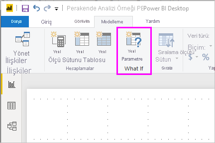
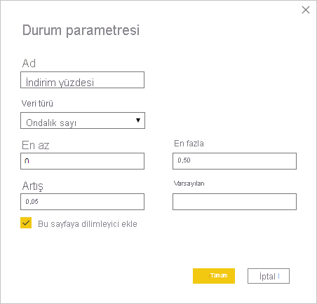
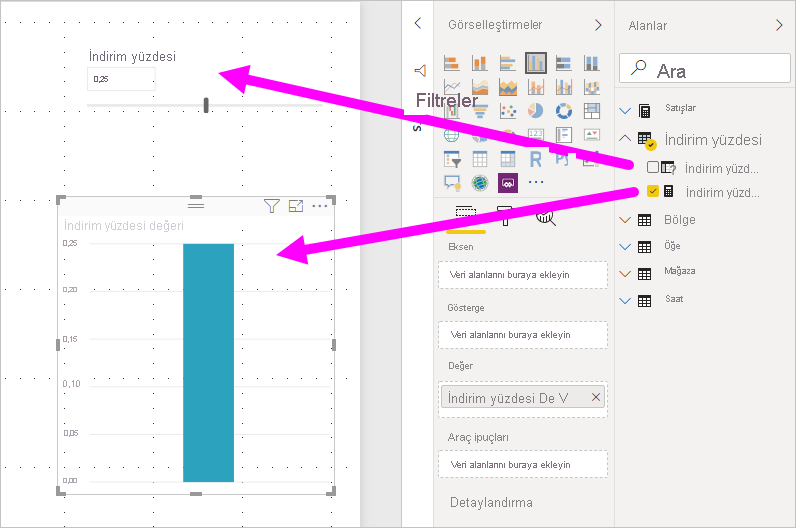
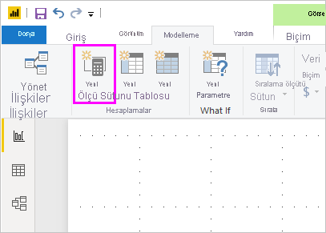
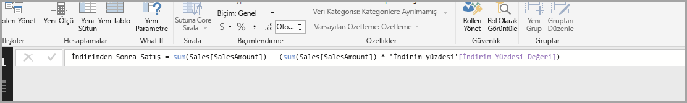
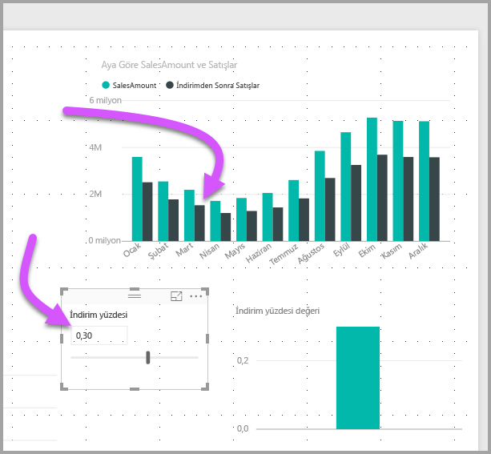

# Power BI Desktop'ta değişkenleri görselleştirmek için durum parametresi oluşturma ve kullanma

*Power BI Desktop*'ın Ağustos 2018 sürümünden itibaren, raporlarınız için *durum* değişkenleri oluşturabilir, değişkeni bir dilimleyici olarak kullanabilir ve raporlarınızda farklı anahtar değerlerini görselleştirip ölçebilirsiniz.

Power BI Desktop'ın *Modelleme* sekmesinde **durum** parametresini oluşturun. Bunu seçtiğinizde, parametreyi yapılandırabileceğiniz bir iletişim kutusu görüntülenir.

## Durum parametresi oluşturma

Durum parametresi oluşturmak için Power BI Desktop'taki **Modelleme** sekmesinde **Yeni Parametre**'yi seçin. Aşağıdaki resimde *Discount percentage* adlı bir parametre oluşturup veri türünü **Ondalık sayı** olarak ayarladık. **En düşük değer** sıfırdır. **En büyük değer** 0,50'dir (yüzde 50). **Artış** olarak ise 0,05 (yüzde beş) değerini belirledik. Bu, bir raporda etkileşime geçildiğinde parametrenin ne ölçüde artış göstereceğini belirtir.

> [!NOTE]
> Ondalık sayılarda değerin önüne sıfır koymayı (yalnızca ,50 yerine 0,50 kullanın) unutmayın. Aksi takdirde sayı doğrulanmaz ve **Tamam** düğmesi seçilemez.
> 
> 

Size kolaylık sağlamak için, **Bu sayfaya dilimleyici ekle** onay kutusu otomatik olarak, geçerli rapor sayfanıza durum parametrenizi içeren bir dilimleyici ekler.

Durum parametresi oluşturulduğunda, parametre oluşturmaya ek olarak bir de ölçü oluşturulur. Bu ölçüyü durum parametresinin geçerli değerini görselleştirmek için kullanabilirsiniz.

Durum parametresi oluşturduğunuzda, hem parametrenin hem de ölçünün modelinizin bir parçası haline geldiğini göz önünde bulundurmanızda yarar vardır. Başka bir deyişle, bunlar raporun tamamında ve diğer rapor sayfalarında kullanılabilir. Ayrıca bunlar modelin parçası olduğundan, rapor sayfasından dilimleyiciyi silebilirsiniz. Dilimleyiciyi geri almak isterseniz, **Alanlar** listesinde durum parametresini tutmanız, tuvale sürüklemeniz ve sonra da görseli dilimleyici olarak değiştirmeniz yeterlidir.

## Durum parametresini kullanma

Şimdi de durum parametresinin kullanımına yönelik bir örnek üzerinden gidelim. Önceki bölümde durum parametresini oluşturduk. Şimdi değerleri dilimleyiciyle ayarlanan yeni bir ölçü oluşturarak bu parametreyi kullanıma alacağız.

Yeni ölçü, indirim oranının uygulandığı toplam satış tutarı olacak. Raporunuzu kullanan kişilerin durum parametrenize ilişkin değişkeni görselleştirmesine olanak sağlayan daha karmaşık ve ilgi çekici ölçüler oluşturabilirsiniz. Örneğin, satış görevlilerinin, belirli satış hedeflerini veya yüzdelerini yakalamaları halinde alacakları tazminatı ya da daha yüksek indirimlerin satışların artmasına yönelik etkisini görmesini sağlayan bir rapor oluşturabilirsiniz.

Ölçü formülünü formül çubuğuna girin ve formülü *Sales after Discount* olarak adlandırın.

Ardından, eksende **OrderDate** bulunan ve hem **SalesAmount**'un hem de yeni oluşturulan **Sales after Discount** ölçüsünün değer olarak yer aldığı bir sütun görseli oluştururuz.

Ardından, kaydırıcıyı hareket ettirdikçe **Sales after Discount** sütununun, indirim uygulanmış satış tutarını yansıttığını görürüz.

İşte bu kadar kolay. Durum parametrelerini her tür durumda kullanabilirsiniz. Bu parametreler rapor tüketicilerinin raporlarınızda oluşturduğunuz farklı senaryolarla etkileşime geçmesine olanak tanır.
